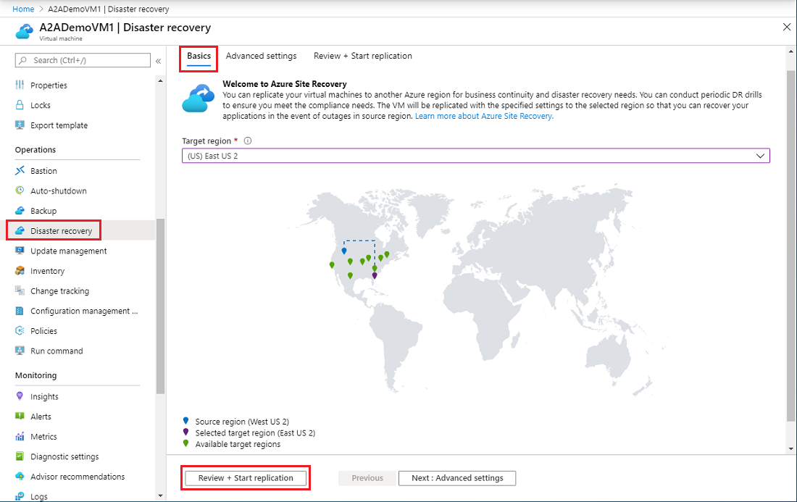
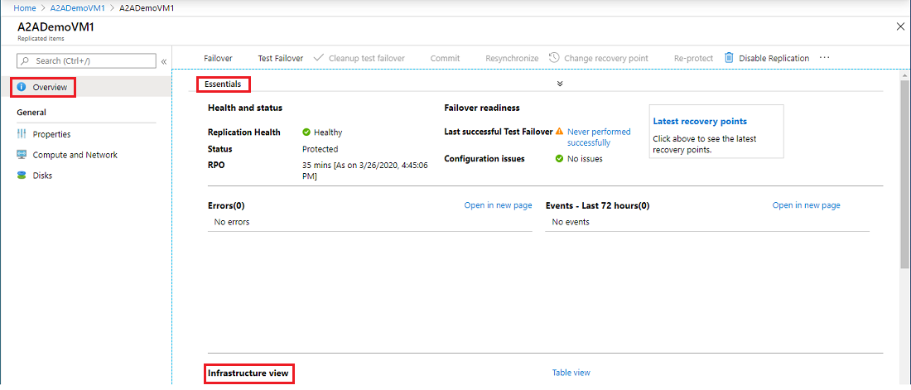

# Set up disaster recovery to a secondary Azure region for an Azure VM        

The [Azure Site Recovery](site-recovery-overview.md) service contributes to your business continuity and disaster recovery (BCDR) strategy by keeping your business apps up and running, during planned and unplanned outages. Site Recovery manages and orchestrates disaster recovery of on-premises machines and Azure virtual machines (VMs), including replication, failover, and recovery.

This quickstart describes how to set up disaster recovery for an Azure VM by replicating it to a different Azure region.

If you don't have an Azure subscription, create a [free account](https://azure.microsoft.com/free/?WT.mc_id=A261C142F) before you begin.

> [!NOTE]
> This article is as a quick walkthrough for new users. It uses the simplest path, with default options and minimum customization.  For a fuller walkthrough review [our tutorial](azure-to-azure-tutorial-enable-replication.md).

## Log in to Azure

Log in to the Azure portal at https://portal.azure.com.

## Enable replication for the Azure VM

1. On the Azure portal menu, select **Virtual machines**, or search for and select *Virtual machines* on any page. Select the VM you want to replicate.
2. In **Operations**, select **Disaster recovery**.
3. In **Configure disaster recovery** > **Target region** select the target region to which you'll replicate.
4. For this Quickstart, accept the other default settings.
5. Select **Review + Start replication**. Then select **Start replication** to start a job to enable replication for the VM.

    

## Verify settings

After the replication job has finished, you can check the replication status, modify replication settings, and test the deployment.

1. On the Azure portal menu, select **Virtual machines**, or search for and select *Virtual machines* on any page. Select the VM you want to verify.
2. In **Operations**, select **Disaster recovery**.

   You can verify replication health, the recovery points that have been created, and source, target regions on the map.

   

## Clean up resources

The VM in the primary region stops replicating when you disable replication for it:

- The source replication settings are cleaned up automatically. The Site Recovery extension installed on the VM as part of the replication isn't removed, and must be removed manually. 
- Site Recovery billing for the VM stops.

Stop replication as follows

1. On the Azure portal menu, select **Virtual machines**, or search for and select *Virtual machines* on any page. Select the VM you want to modify.
2. In **Disaster recovery**, select **Disable Replication**.

   

## Next steps

In this quickstart, you replicated a single VM to a secondary region. Now, try replicating a multiple Azure VMs using a recovery plan.

> [!div class="nextstepaction"]
> [Configure disaster recovery for Azure VMs](azure-to-azure-tutorial-enable-replication.md)
