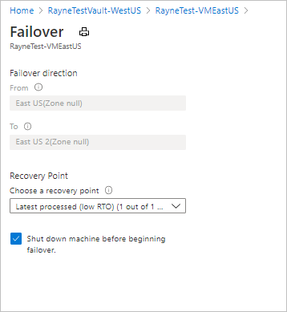
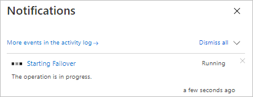
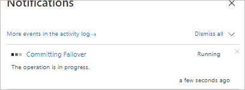
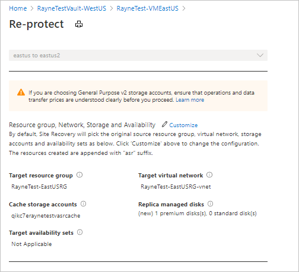
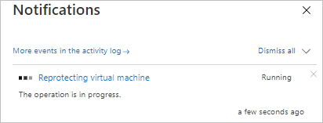

# Tutorial: Fail over Azure VMs to a secondary region

Learn how to fail over Azure VMs that are enabled for disaster recovery with [Azure Site Recovery](site-recovery-overview.md), to a secondary Azure region. After failover, you reprotect VMs in the target region so that they replicate back to the primary region. In this article, you learn how to:

> [!div class="checklist"]
> * Check prerequisites
> * Verify VM settings
> * Run a failover to the secondary region
> * Start replicating the VM back to the primary region.

> [!NOTE]
> This tutorial shows you how to fail over VMs with minimal steps. If you want to run a failover with full settings, learn about Azure VM [networking](azure-to-azure-about-networking.md), [automation](azure-to-azure-powershell.md), and [troubleshooting](azure-to-azure-troubleshoot-errors.md).

## Prerequisites

Before you start this tutorial, you should have:

1. Set up replication for one or more Azure VMs. If you haven't, [complete the first tutorial](azure-to-azure-tutorial-enable-replication.md) in this series to do that.
2. We recommend you [run a disaster recovery drill](azure-to-azure-tutorial-dr-drill.md) for replicated VMs. Running a drill before you run a full failover helps ensure everything works as expected, without impacting your production environment. 

## Verify the VM settings

1. In the vault > **Replicated items**, select the VM.

    

2. On the VM **Overview** page, check that the VM is protected and healthy, before you run a failover.
    

3. Before you fail over, check that:
    - The VM is running a supported [Windows](azure-to-azure-support-matrix.md#windows) or [Linux](azure-to-azure-support-matrix.md#replicated-machines---linux-file-systemguest-storage) operating system.
    - The VM complies with [compute](azure-to-azure-support-matrix.md#replicated-machines---compute-settings), [storage](azure-to-azure-support-matrix.md#replicated-machines---storage), and [networking](azure-to-azure-support-matrix.md#replicated-machines---networking) requirements.

## Run a failover

1. On the VM **Overview** page, select **Failover**.

    

3. In **Failover**, choose a recovery point. The Azure VM in the target region is created using data from this recovery point.
  
   - **Latest processed**: Uses the latest recovery point processed by Site Recovery. The time stamp is shown. No time is spent processing data, so it provides a low recovery time objective (RTO).
   -  **Latest**: Processes all the data sent to Site Recovery, to create a recovery point for each VM before failing over to it. Provides the lowest recovery point objective (RPO), because all data is replicated to Site Recovery when the failover is triggered.
   - **Latest app-consistent**: This option fails over VMs to the latest app-consistent recovery point. The time stamp is shown.
   - **Custom**: Fail over to particular recovery point. Custom is only available when you fail over a single VM, and don't use a recovery plan.

    > [!NOTE]
    > If you added a disk to a VM after you enabled replication, replication points shows disks available for recovery. For example, a replication point created before you added a second disk will show as "1 of 2 disks".

4. Select **Shut down machine before beginning failover** if you want Site Recovery to try to shut down the source VMs before starting failover. Shutdown helps to ensure no data loss. Failover continues even if shutdown fails. 

        

3. To start the failover, select **OK**.
4. Monitor the failover in notifications.

    
         

5. After the failover, the Azure VM created in the target region appears in **Virtual Machines**. Make sure that the VM is running, and sized appropriately. If you want to use a different recovery point for the VM, select **Change recovery point**, on the **Essentials** page.
6. When you're satisfied with the failed over VM, select **Commit** on the overview page, to finish the failover.

     

7. In **Commit**, select **OK** to confirm. Commit deletes all the available recovery points for the VM in Site Recovery, and you won't be able to change the recovery point.

8. Monitor the commit progress in notifications.

    
        

## Reprotect the VM

After failover, you reprotect the VM in the secondary region, so that it replicates back to the primary region. 

1. Make sure that VM **Status** is *Failover committed* before you start.
2. Check that you can access the primary region is available, and that you have permissions to create VMs in it.
3. On the VM **Overview** page, select **Re-Protect**.

   

4. In **Re-protect**, verify the replication direction (secondary to primary region), and review the target settings for the primary region. Resources marked as new are created by Site Recovery as part of the reprotect operation.

     

6. Select **OK** to start the reprotect process. The process sends initial data to the target location, and then replicates delta information for the VMs to the target.
7. Monitor reprotect progress in the notifications. 

    
    
    

## Next steps

In this tutorial, you failed over from the primary region to the secondary, and started replicating VMs back to the primary region. Now you can fail back from the secondary region to the primary.

> [!div class="nextstepaction"]
> [Fail back to the primary region](azure-to-azure-tutorial-failback.md)
