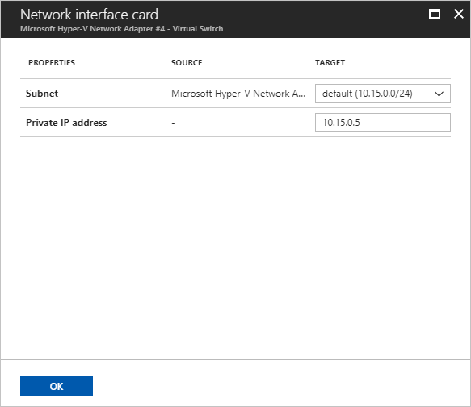

# Manage virtual machine network interfaces for on-premises to Azure scenarios

A virtual machine (VM) in Azure must have at least one network interface attached to it. It can have as many network interfaces attached to it as the VM size supports.

By default, the first network interface attached to an Azure virtual machine is defined as the primary network interface. All other network interfaces in the virtual machine are secondary network interfaces. Also by default, all outbound traffic from the virtual machine is sent out the IP address that's assigned to the primary IP configuration of the primary network interface.

In an on-premises environment, virtual machines or servers can have multiple network interfaces for different networks within the environment. Different networks are typically used for performing specific operations such as upgrades, maintenance, and internet access. When you're migrating or failing over to Azure from an on-premises environment, keep in mind that network interfaces in the same virtual machine must all be connected to the same virtual network.

By default, Azure Site Recovery creates as many network interfaces on an Azure virtual machine as are connected to the on-premises server. You can avoid creating redundant network interfaces during migration or failover by editing the network interface settings under the settings for the replicated virtual machine.

## Select the target network

For VMware and physical machines, and for Hyper-V (without System Center Virtual Machine Manager) virtual machines, you can specify the target virtual network for individual virtual machines. For Hyper-V virtual machines managed with Virtual Machine Manager, use [network mapping](site-recovery-network-mapping.md) to map VM networks on a source Virtual Machine Manager server and target Azure networks.

1. Under **Replicated items** in a Recovery Services vault, select any replicated item to access the settings for that replicated item.

2. Select the **Compute and Network** tab to access the network settings for the replicated item.

3. Under **Network properties**, choose a virtual network from the list of available network interfaces.

	

Modifying the target network affects all network interfaces for that specific virtual machine.

For Virtual Machine Manager clouds, modifying network mapping affects all virtual machines and their network interfaces.

## Select the target interface type

Under the **Network interfaces** section of the **Compute and Network** pane, you can view and edit network interface settings. You can also specify the target network interface type.

- A **Primary** network interface is required for failover.
- All other selected network interfaces, if any, are **Secondary** network interfaces.
- Select **Do not use** to exclude a network interface from creation at failover.

By default, when you're enabling replication, Site Recovery selects all detected network interfaces on the on-premises server. It marks one as **Primary** and all others as **Secondary**. Any subsequent interfaces added on the on-premises server are marked **Do not use** by default. When you're adding more network interfaces, ensure that the correct Azure virtual machine target size is selected to accommodate all required network interfaces.

## Modify network interface settings

You can modify the subnet and IP address for a replicated item's network interfaces. If an IP address is not specified, Site Recovery will assign the next available IP address from the subnet to the network interface at failover.

1. Select any available network interface to open the network interface settings.

2. Choose the desired subnet from the list of available subnets.

3. Enter the desired IP address (as required).

	

4. Select **OK** to finish editing and return to the **Compute and Network** pane.

5. Repeat steps 1-4 for other network interfaces.

6. Select **Save** to save all changes.

## Next steps
  [Learn more](../virtual-network/virtual-network-network-interface-vm.md) about network interfaces for Azure virtual machines.
