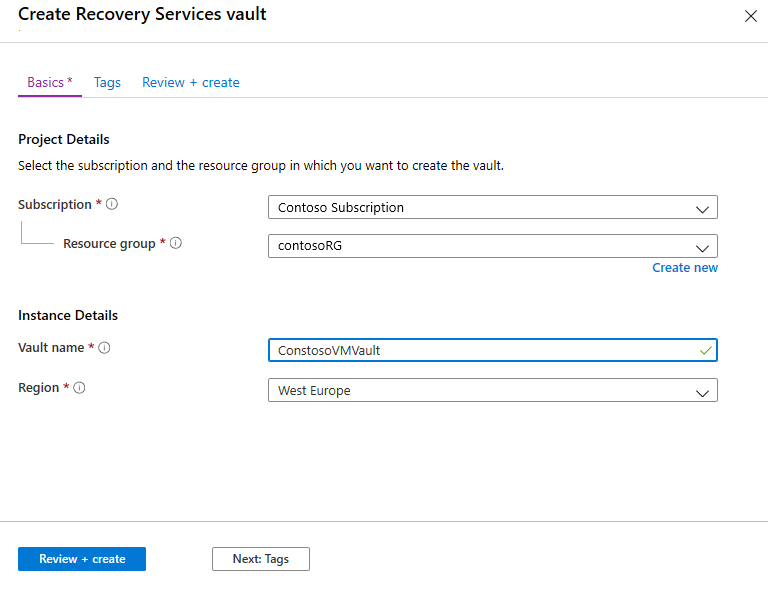

# Prepare Azure resources for replication of on-premises machines

 [Azure Site Recovery](site-recovery-overview.md) contributes to your business continuity and disaster recovery (BCDR) strategy by keeping your business apps up and running during planned and unplanned outages. Site Recovery manages and orchestrates disaster recovery of on-premises machines and Azure virtual machines (VMs), including replication, failover, and recovery.

This tutorial shows you how to prepare Azure components when you want to replicate on-premises VMs (Hyper-V or VMware) or Windows/Linux physical servers to Azure. In this tutorial, you learn how to:

> [!div class="checklist"]
> * Verify that your account has replication permissions.
> * Create an Azure storage account.
> * Set an Azure network. When Azure VMs are created after failover, they're joined to this Azure network.

If you don't have an Azure subscription, create a [free account](https://azure.microsoft.com/pricing/free-trial/) before you begin.

## Sign in to Azure

Sign in to the [Azure portal](http://portal.azure.com).

## Verify account permissions

If you just created your free Azure account, you're the administrator of your subscription. If you're not the subscription administrator, work with the administrator to assign the permissions you need. To enable replication for a new virtual machine, you must have permission to:

- Create a VM in the selected resource group.
- Create a VM in the selected virtual network.
- Write to the selected storage account.

The Virtual Machine Contributor built-in role has these permissions. You also need permission to
manage Site Recovery operations. The Site Recovery Contributor role has all the permissions
required to manage Site Recovery operations in a Recovery Services vault.

## Create a storage account

Images of replicated machines are held in Azure storage. Azure VMs are created from the storage
when you fail over from on-premises to Azure.

1. On the [Azure portal](https://portal.azure.com) menu, select **New** > **Storage** > **Storage account**.
2. On **Create storage account**, enter a name for the account. For these tutorials, use the name **contosovmsacct1910171607**. The name must be unique within Azure and be between 3 and 24
   characters, with numbers and lowercase letters only.
3. In **Deployment model**, select **Resource Manager**.
4. In **Account kind**, select **General purpose**. In **Performance**, select **Standard**. Don't select blob storage.
5. In **Replication**, select the default **Read-access geo-redundant storage** for storage redundancy.
6. In **Subscription**, select the subscription in which you want to create the new storage account.
7. In **Resource group**, enter a new resource group. An Azure resource group is a logical container into which Azure resources are deployed and managed. For these tutorials, use the name **ContosoRG**.
8. In **Location**, select the geographic location for your storage account. The storage account must be in the same region as the Recovery Services vault. For these tutorials, use the **West Europe** region.

   

9. Select **Create** to create the storage account.

## Create a vault

1. In the Azure portal, select **Create a resource** > **Monitoring + Management** > **Backup and Site Recovery**.
2. In **Name**, enter a friendly name to identify the vault. For this tutorial, use **ContosoVMVault**.
3. In **Resource group**, select the existing resource group named **contosoRG**.
4. In **Location**, enter the Azure region **West Europe** that is used in this set of tutorials.
5. To quickly access the vault from the dashboard, select **Pin to dashboard** > **Create**.

   

   The new vault appears on **Dashboard** > **All resources**, and on the main **Recovery Services vaults** page.

## Set up an Azure network

When Azure VMs are created from storage after failover, they're joined to this network.

1. In the [Azure portal](https://portal.azure.com), select **Create a resource** > **Networking** > **Virtual network**.
2. Leave **Resource Manager** selected as the deployment model. Resource Manager is the preferred
   deployment model. Then take these steps:

   a. In **Name**, enter a network name. The name must be unique within the Azure resource group. Use the name **ContosoASRnet**.

   b. In **Resource group**, use the existing resource group **contosoRG**.

   c. In **Address range**, enter the network address range **10.0.0.0/24**.

   d. For this tutorial, you don't need a subnet.

   e. In **Subscription**, select the subscription in which to create the network.

   f. In **Location**, select **West Europe**. The network must be in the same region as the Recovery
     Services vault.

3. Select **Create**.

   

   The virtual network takes a few seconds to create. After it's created, you see it in the Azure
   portal dashboard.

## Next steps

> [!div class="nextstepaction"]
> [Prepare the on-premises VMware infrastructure for disaster recovery to Azure](tutorial-prepare-on-premises-vmware.md)
