# Install a Linux master target server for failback
After you fail over your virtual machines to Azure, you can fail back the virtual machines to the on-premises site. To fail back, you need to reprotect the virtual machine from Azure to the on-premises site. For this process, you need an on-premises master target server to receive the traffic. 

If your protected virtual machine is a Windows virtual machine, then you need a Windows master target. For a Linux virtual machine, you need a Linux master target. Read the following steps to learn how to create and install a Linux master target.

> [!IMPORTANT]
> Master target server on LVM is not supported.

## Overview
This article provides instructions for how to install a Linux master target.

Post comments or questions at the end of this article or on the [Microsoft Q&A question page for Azure Recovery Services](/answers/topics/azure-site-recovery.html).

## Prerequisites

* To choose the host on which to deploy the master target, determine if the failback is going to be to an existing on-premises virtual machine or to a new virtual machine. 
	* For an existing virtual machine, the host of the master target should have access to the data stores of the virtual machine.
	* If the on-premises virtual machine does not exist (in case of Alternate Location Recovery), the failback virtual machine is created on the same host as the master target. You can choose any ESXi host to install the master target.
* The master target should be on a network that can communicate with the process server and the configuration server.
* The version of the master target must be equal to or earlier than the versions of the process server and the configuration server. For example, if the version of the configuration server is 9.4, the version of the master target can be 9.4 or 9.3 but not 9.5.
* The master target can only be a VMware virtual machine and not a physical server.

> [!NOTE]
> Make sure you do not turn on Storage vMotion on any management components such as a master target. If the master target moves after a successful reprotect, the virtual machine disks (VMDKs) cannot be detached. In this case, failback fails.

## Sizing guidelines for creating master target server

Create the master target in accordance with the following sizing guidelines:
- **RAM**: 6 GB or more
- **OS disk size**: 100 GB or more (to install OS)
- **Additional disk size for retention drive**: 1 TB
- **CPU cores**: 4 cores or more
- **Kernel**: 4.16.*

## Deploy the master target server

### Install Ubuntu 16.04.2 Minimal

>[!IMPORTANT]
>Ubuntu 16.04 (Xenial Xerus) has reached its end of life and is no longer supported by Canonical or the Ubuntu community. This means that no security updates or bug fixes will be provided for this version of Ubuntu. Continuing to use Ubuntu 16.04 may expose your system to potential security vulnerabilities or software compatibility issues. We strongly recommend upgrading to a supported version of Ubuntu, such as Ubuntu 18.04 or Ubuntu 20.04.

Take the following the steps to install the Ubuntu 16.04.2 64-bit
operating system.

1.   Go to the [download link](http://old-releases.ubuntu.com/releases/16.04.2/ubuntu-16.04.2-server-amd64.iso), choose the closest mirror and download an Ubuntu 16.04.2 minimal 64-bit ISO.
Keep an Ubuntu 16.04.2 minimal 64-bit ISO in the DVD drive and start the system.

>[!NOTE]
> From, version [9.42](https://support.microsoft.com/en-us/topic/update-rollup-55-for-azure-site-recovery-kb5003408-b19c8190-5f88-43ea-85b1-d9e0cc5ca7e8), Ubuntu 20.04 operating system is supported for Linux master target server.If you wish to use the latest OS, proceed setting up the machine with Ubuntu 20.04 iso image.

1.  Select **English** as your preferred language, and then select **Enter**.
    
    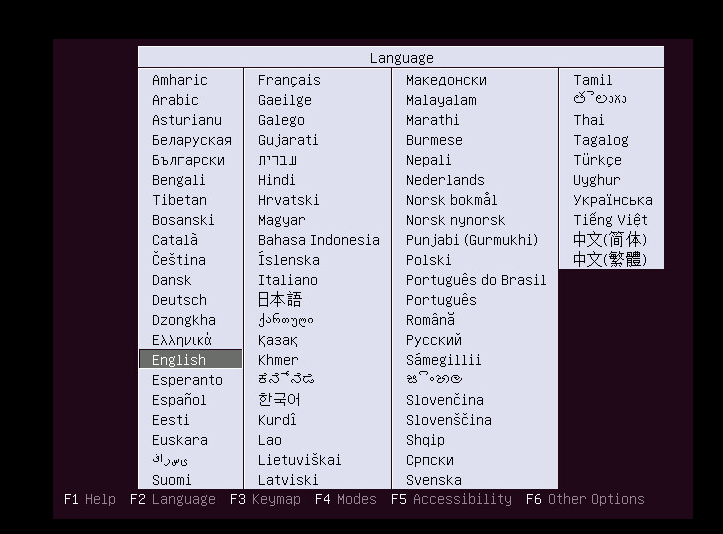
1. Select **Install Ubuntu Server**, and then select **Enter**.

    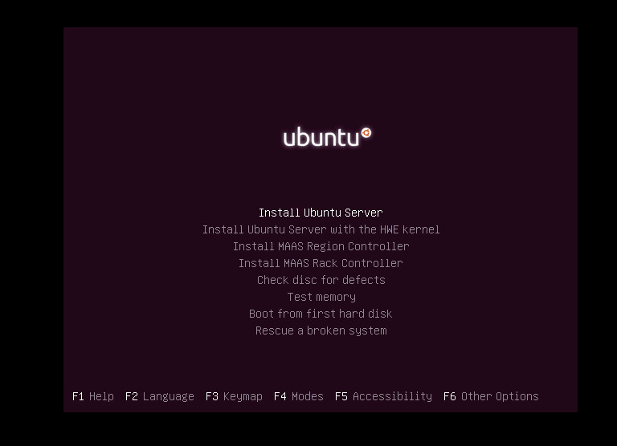

1.  Select **English** as your preferred language, and then select **Enter**.

    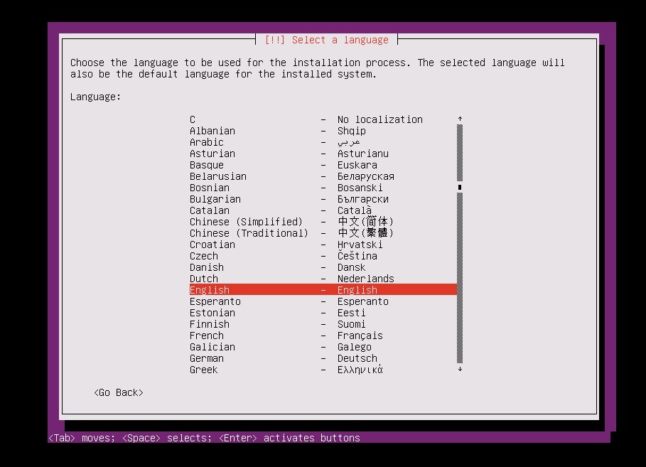

1. Select the appropriate option from the **Time Zone** options list, and then select **Enter**.

    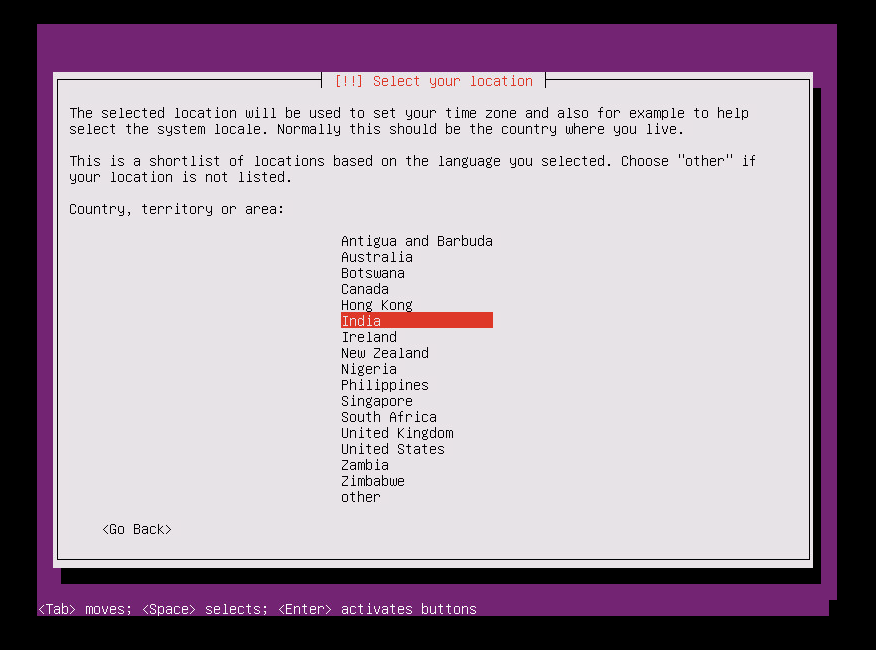

1. Select **No** (the default option), and then select **Enter**.

     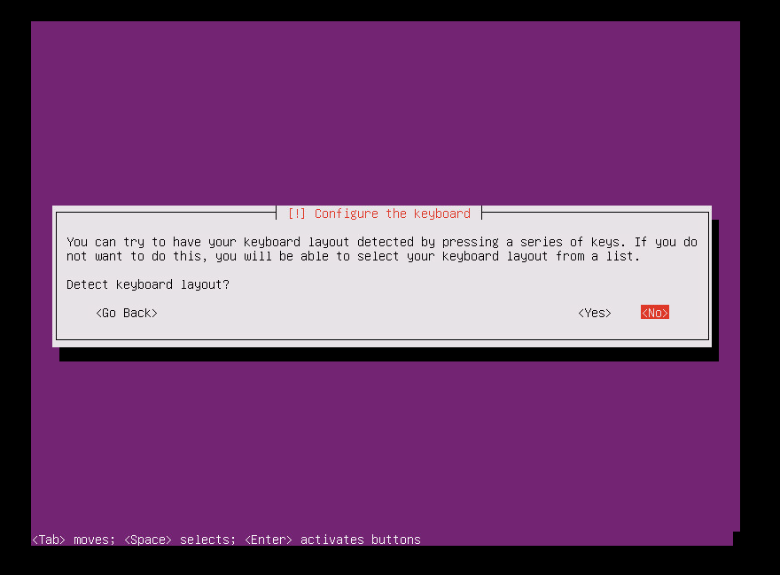
1. Select **English (US)** as the country/region of origin for the keyboard, and then select **Enter**.

1. Select **English (US)** as the keyboard layout, and then select **Enter**.

1. Enter the hostname for your server in the **Hostname** box, and then select **Continue**.

1. To create a user account, enter the user name, and then select **Continue**.

      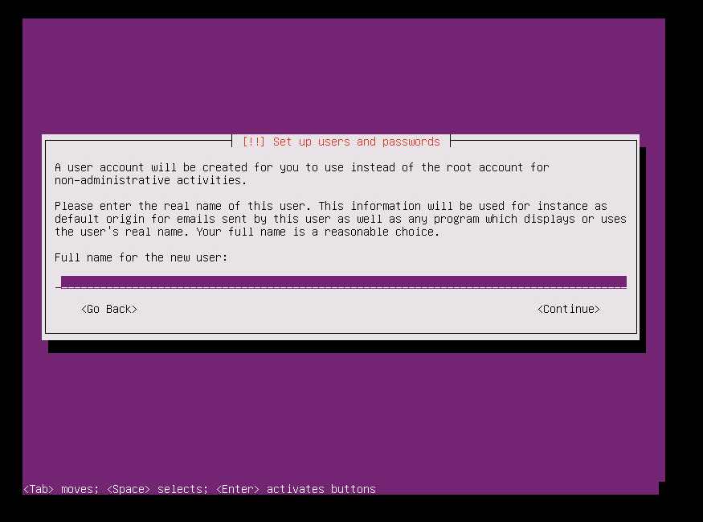

1. Enter the password for the new user account, and then select **Continue**.

1.  Confirm the password for the new user, and then select **Continue**.

    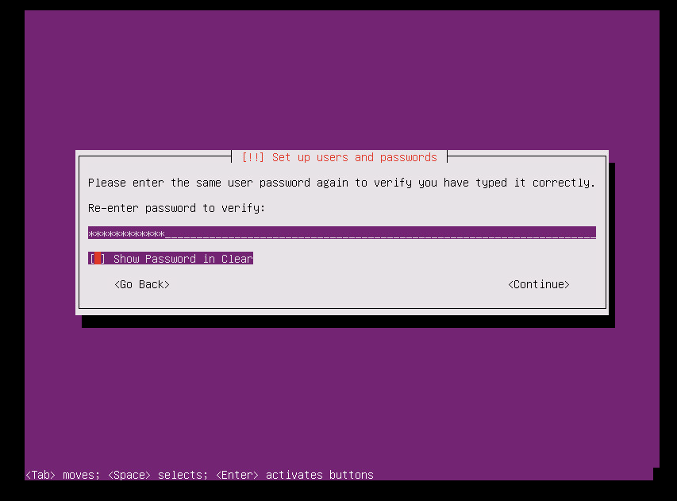

1.  In the next selection for encrypting your home directory, select **No** (the default option), and then select **Enter**.

1. If the time zone that's displayed is correct, select **Yes** (the default option), and then select **Enter**. To reconfigure your time zone, select **No**.

1. From the partitioning method options, select **Guided - use entire disk**, and then select **Enter**.

     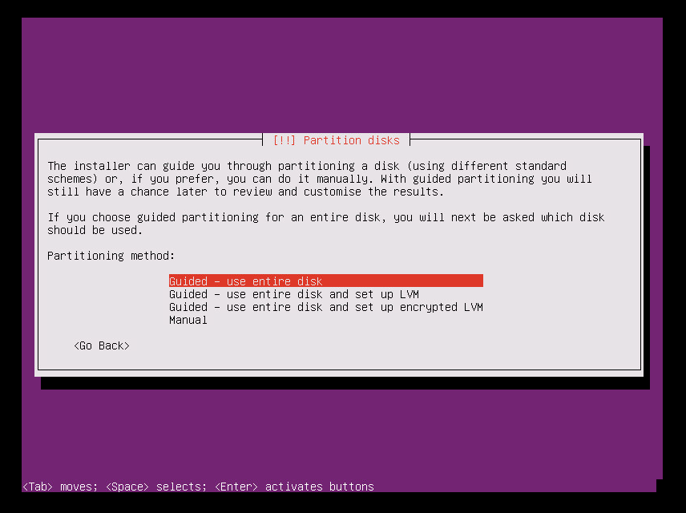

1.  Select the appropriate disk from the **Select disk to partition** options, and then select **Enter**.

    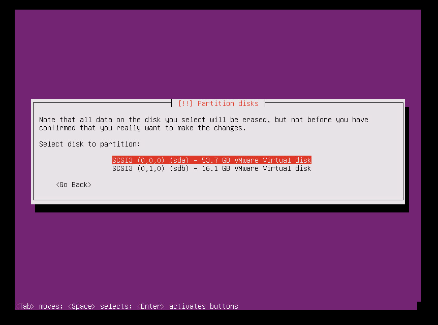

1.  Select **Yes** to write the changes to disk, and then select **Enter**.

    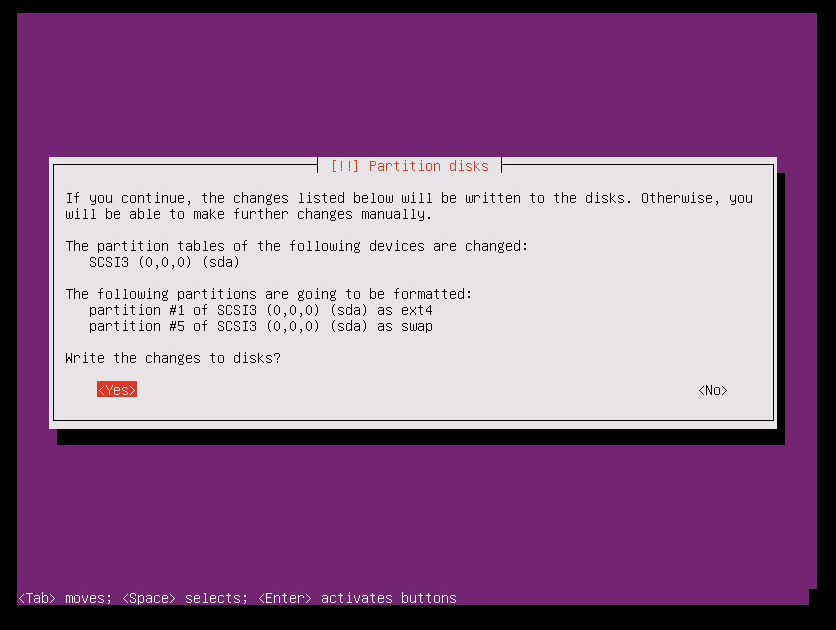

1.  In the configure proxy selection, select the default option, select **Continue**, and then select **Enter**.
     
     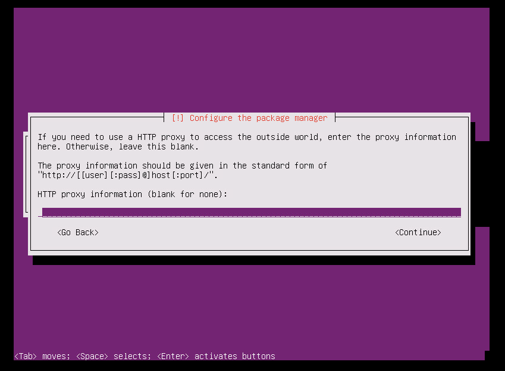

1.  Select **No automatic updates** option in the selection for managing upgrades on your system, and then select **Enter**.

     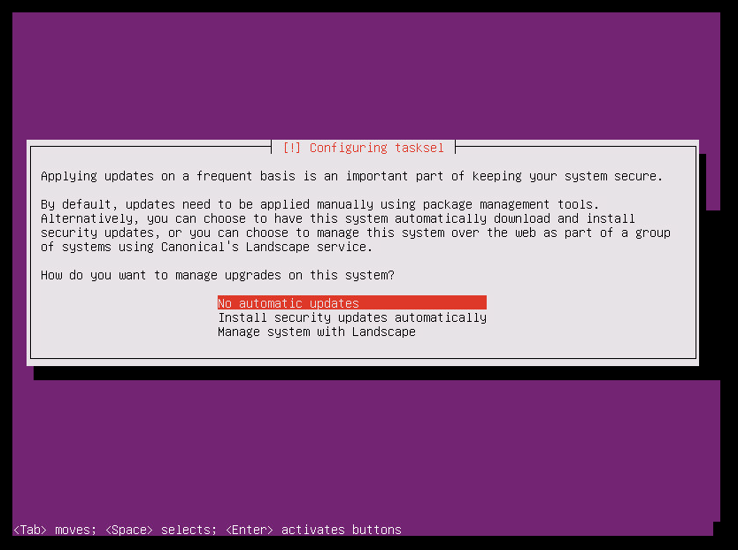

    > [!WARNING]
    > Because the Azure Site Recovery master target server requires a very specific version of the Ubuntu, you need to ensure that the kernel upgrades are disabled for the virtual machine. If they are enabled, then any regular upgrades cause the master target server to malfunction. Make sure you select the **No automatic updates** option.

1.  Select default options. If you want openSSH for SSH connect, select the **OpenSSH server** option, and then select **Continue**.

    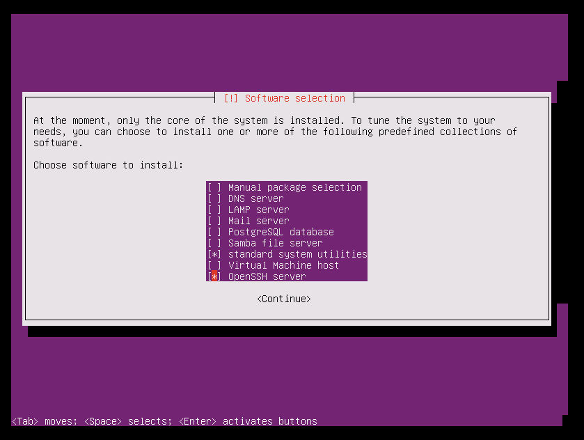

1. In the selection for installing the GRUB boot loader, Select **Yes**, and then select **Enter**.
     
    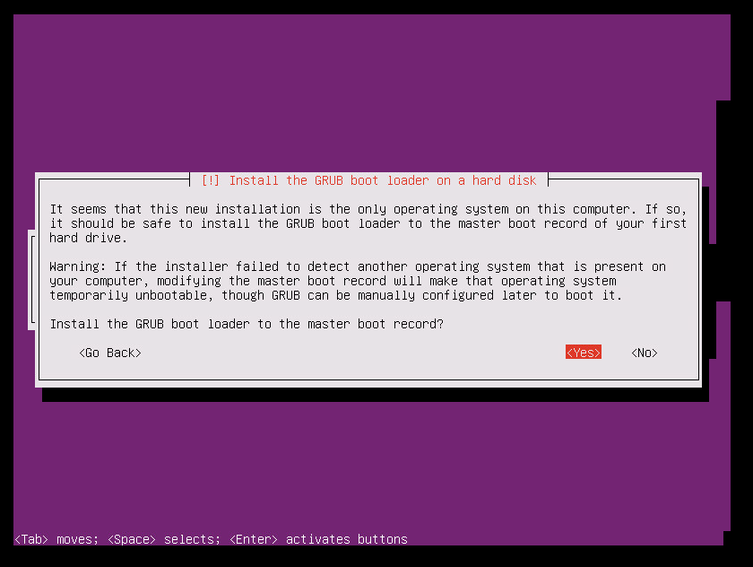


1. Select the appropriate device for the boot loader installation (preferably **/dev/sda**), and then select **Enter**.
     
    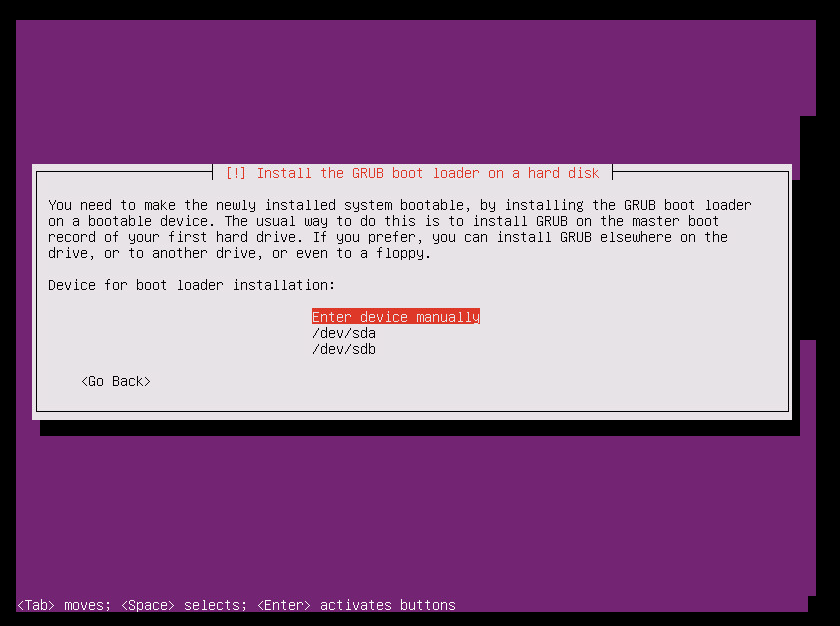

1. Select **Continue**, and then select **Enter** to finish the installation.

    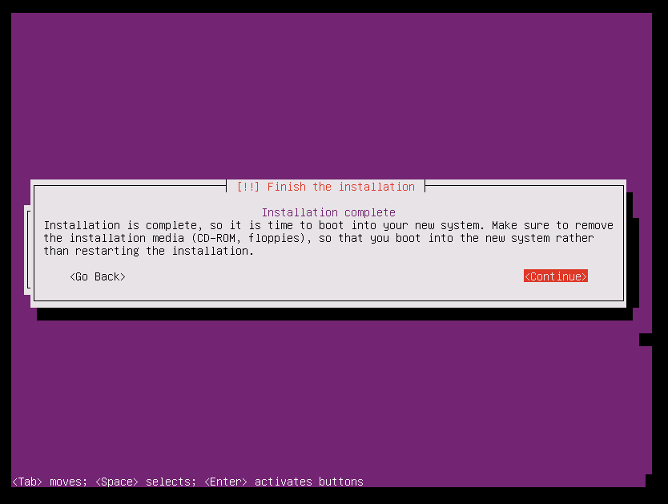

1. After the installation has finished, sign in to the VM with the new user credentials. (Refer to **Step 10** for more information.)

1. Use the steps that are described in the following screenshot to set the ROOT user password. Then sign in as ROOT user.

    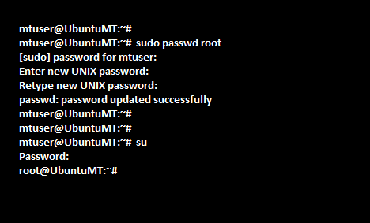


### Configure the machine as a master target server

To get the ID for each SCSI hard disk in a Linux virtual machine, the **disk.EnableUUID = TRUE** parameter needs to be enabled. To enable this parameter, take the following steps:

1. Shut down your virtual machine.

2. Right-click the entry for the virtual machine in the left pane, and then select **Edit Settings**.

3. Select the **Options** tab.

4. In the left pane, select **Advanced** > **General**, and then select the **Configuration Parameters** button on the lower-right part of the screen.

    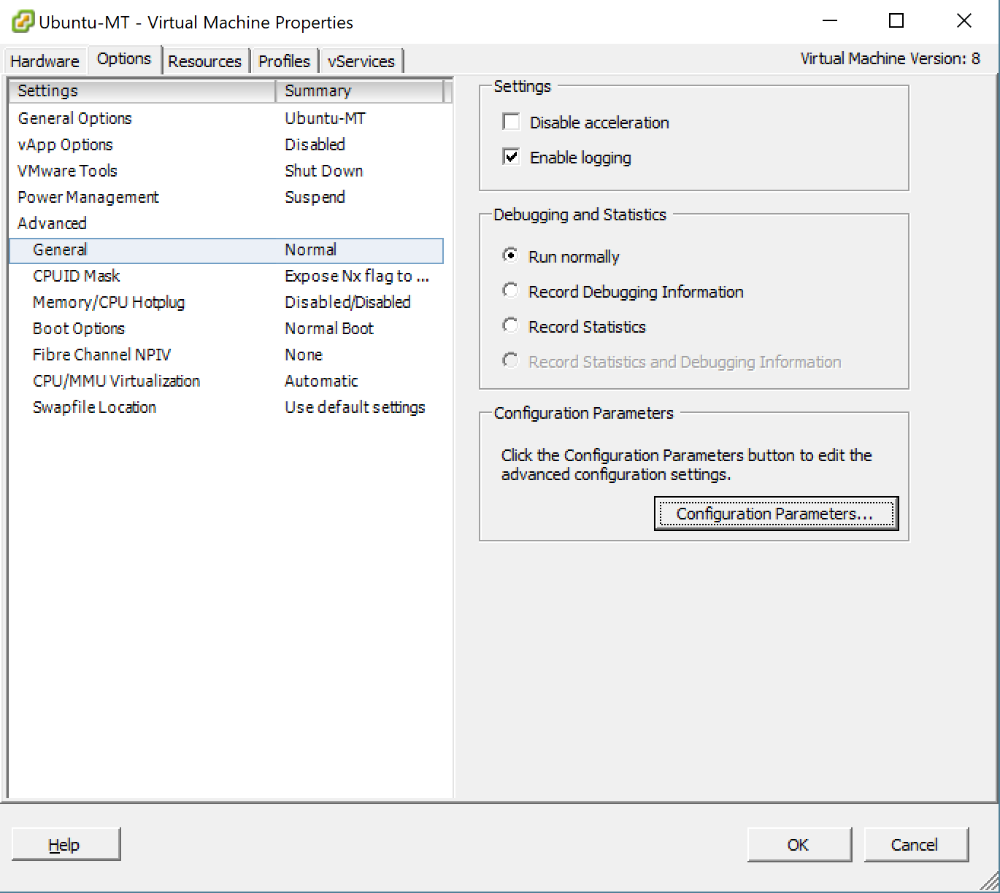 

    The **Configuration Parameters** option is not available when the machine is running. To make this tab active, shut down the virtual machine.

5. See whether a row with **disk.EnableUUID** already exists.

   - If the value exists and is set to **False**, change the value to **True**. (The values are not case-sensitive.)

   - If the value exists and is set to **True**, select **Cancel**.

   - If the value does not exist, select **Add Row**.

   - In the name column, add **disk.EnableUUID**, and then set the value to **TRUE**.

     

#### Disable kernel upgrades

Azure Site Recovery master target server requires a specific version of the Ubuntu, ensure that the kernel upgrades are disabled for the virtual machine. If kernel upgrades are enabled,it can cause the master target server to malfunction.

#### Download and install additional packages

> [!NOTE]
> Make sure that you have Internet connectivity to download and install additional packages. If you don't have Internet connectivity, you need to manually find these Deb packages and install them.

 ```bash
    sudo apt-get install -y multipath-tools lsscsi python-pyasn1 lvm2 kpartx
 ```
 
>[!NOTE]
> From, version [9.42](https://support.microsoft.com/en-us/topic/update-rollup-55-for-azure-site-recovery-kb5003408-b19c8190-5f88-43ea-85b1-d9e0cc5ca7e8), Ubuntu 20.04 operating system is supported for Linux master target server.
> If you wish to use the latest OS, upgrade the operating system to Ubuntu 20.04 before proceeding. To upgrade the operating system later, you can follow the instructions listed [here](#upgrade-os-of-master-target-server-from-ubuntu-1604-to-ubuntu-2004).

### Get the installer for setup

If your master target has Internet connectivity, you can use the following steps to download the installer. Otherwise, you can copy the installer from the process server and then install it.

#### Download the master target installation packages

[Download](https://aka.ms/latestlinuxmobsvc) the latest Linux master target installation bits for Ubuntu 20.04.

[Download](https://aka.ms/oldlinuxmobsvc) the older Linux master target installation bits for Ubuntu 16.04.

> [!NOTE]
> It is recommended that you use the latest Ubuntu operating system version for setting up the master target server.

To download it using Linux, type:

```bash
   sudo wget https://aka.ms/latestlinuxmobsvc -O latestlinuxmobsvc.tar.gz
```

> [!WARNING]
> Make sure that you download and unzip the installer in your home directory. If you unzip to **/usr/Local**, then the installation  fails.


#### Access the installer from the process server

1. On the process server, go to **C:\Program Files (x86)\Microsoft Azure Site Recovery\home\svsystems\pushinstallsvc\repository**.

2. Copy the required installer file from the process server, and save it as **latestlinuxmobsvc.tar.gz** in your home directory.


### Apply custom configuration changes

To apply custom configuration changes, use the following steps as a ROOT user:

1. Run the following command to untar the binary.

    ```bash
       sudo tar -xvf latestlinuxmobsvc.tar.gz
    ```
    

2. Run the following command to give permission.

    ```bash
       sudo chmod 755 ./ApplyCustomChanges.sh
    ```

3. Run the following command to run the script.
	
    ```bash
       sudo ./ApplyCustomChanges.sh
    ```

> [!NOTE]
> Run the script only once on the server. Then shut down the server. Restart the server after you add a disk, as described in the next section.

### Add a retention disk to the Linux master target virtual machine

Use the following steps to create a retention disk:

1. Attach a new 1-TB disk to the Linux master target virtual machine, and then start the machine.

2. Use the **multipath -ll** command to learn the multipath ID of the retention disk: **multipath -ll**

    

3. Format the drive, and then create a file system on the new drive: **mkfs.ext4 /dev/mapper/\<Retention disk's multipath id>**.
	
    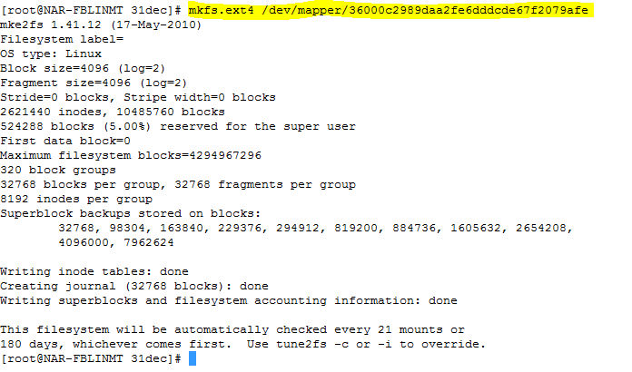

4. After you create the file system, mount the retention disk.

    ```bash
    sudo mkdir /mnt/retention
    sudo mount /dev/mapper/<Retention disk's multipath id> /mnt/retention
    ```

5. Create the **fstab** entry to mount the retention drive every time the system starts.
	
	```bash
	   sudo vi /etc/fstab
	```
	
	Select **Insert** to begin editing the file. Create a new line, and then insert the following text. Edit the disk multipath ID based on the highlighted multipath ID from the previous command.

	**/dev/mapper/\<Retention disks multipath id> /mnt/retention ext4 rw 0 0**

	Select **Esc**, and then type **:wq** (write and quit) to close the editor window.

### Install the master target

> [!IMPORTANT]
> The version of the master target server must be equal to or earlier than the versions of the process server and the configuration server. If this condition is not met, reprotect succeeds, but replication fails.


> [!NOTE]
> Before you install the master target server, check that the **/etc/hosts** file on the virtual machine contains entries that map the local hostname to the IP addresses that are associated with all network adapters.

1. Run the following command to install the master target.

    ```bash
    sudo ./install -q -d /usr/local/ASR -r MT -v VmWare
    ```

2. Copy the passphrase from **C:\ProgramData\Microsoft Azure Site Recovery\private\connection.passphrase** on the configuration server. Then save it as **passphrase.txt** in the same local directory by running the following command:

	```bash
	   sudo echo <passphrase> >passphrase.txt
	```

    Example: 

    ```bash
       sudo echo itUx70I47uxDuUVY >passphrase.txt`
    ```

3. Note down the configuration server's IP address. Run the following command to register the server with the configuration server.

    ```bash
	sudo /usr/local/ASR/Vx/bin/UnifiedAgentConfigurator.sh -i <ConfigurationServer IP Address> -P passphrase.txt
    ```

	Example: 
	
    ```bash
	sudo /usr/local/ASR/Vx/bin/UnifiedAgentConfigurator.sh -i 104.40.75.37 -P passphrase.txt
    ```

Wait until the script finishes. If the master target registers successfully, the master target is listed on the **Site Recovery Infrastructure** page of the portal.


#### Install the master target by using interactive installation

1. Run the following command to install the master target. For the agent role, choose **master target**.

    ```bash
	sudo ./install
    ```

2. Choose the default location for installation, and then select **Enter** to continue.

	

After the installation has finished, register the configuration server by using the command line.

1. Note the IP address of the configuration server. You need it in the next step.

2. Run the following command to register the server with the configuration server.

    ```bash
	sudo /usr/local/ASR/Vx/bin/UnifiedAgentConfigurator.sh
    ```

     Wait until the script finishes. If the master target is registered successfully, the master target is listed on the **Site Recovery Infrastructure** page of the portal.


### Install VMware tools / open-vm-tools on the master target server

You need to install VMware tools or open-vm-tools on the master target so that it can discover the data stores. If the tools are not installed, the reprotect screen isn't listed in the data stores. After installation of the VMware tools, you need to restart.

### Upgrade the master target server

Running the installer will automatically detect that the agent is installed on the master target. To complete the upgrade, complete the following steps:
1. Copy tar.gz from configuration server to linux master target
2. Run this command to validate the version you are running: cat /usr/local/.vx_version
3. Extract tar: tar -xvf latestlinuxmobsvc.tar.gz
4. Give permissions to execute changes: chmod 755 ./install
5. Run the upgrade script: sudo ./install
6. The installer should detect the agent is installed on the master target. To upgrade, select **Y**.
7. Validate the agent is running the new version: cat /usr/local/.vx_version

After the setup has been completed, check the version of the master target installed by using the following command:

```bash
   sudo cat /usr/local/.vx_version
```

You will see that the **Version** field gives the version number of the master target.

## Upgrade OS of master target server from Ubuntu 16.04 to Ubuntu 20.04

From 9.42 version, ASR supports Linux master target server on Ubuntu 20.04. To upgrade the OS of existing master target server,

1. Ensure the Linux scale-out master target server is not used for re-protect operation of any protected VM.
2. Uninstall master target server installer from the machine
3. Now, upgrade the operating system from Ubuntu 16.04 to 20.04
4. After successful upgrade OS, reboot the machine.
5. Now [download the latest installer](#download-the-master-target-installation-packages) and follow the instructions given [above](#install-the-master-target) to complete installation of master target server.


## Common issues

* Make sure you do not turn on Storage vMotion on any management components such as a master target. If the master target moves after a successful reprotect, the virtual machine disks (VMDKs) cannot be detached. In this case, failback fails.

* The master target should not have any snapshots on the virtual machine. If there are snapshots, failback fails.

* Due to some custom NIC configurations, the network interface is disabled during startup, and the master target agent cannot initialize. Make sure that the following properties are correctly set. Check these properties in the Ethernet card file's /etc/network/interfaces.
	* auto eth0
	* iface eth0 inet dhcp <br>

    Restart the networking service using the following command: <br>

```bash
   sudo systemctl restart networking
```

## Next steps
After the installation and registration of the master target has finished, you can see the master target appear on the **master target** section in **Site Recovery Infrastructure**, under the configuration server overview.

You can now proceed with [reprotection](vmware-azure-reprotect.md), followed by failback.
