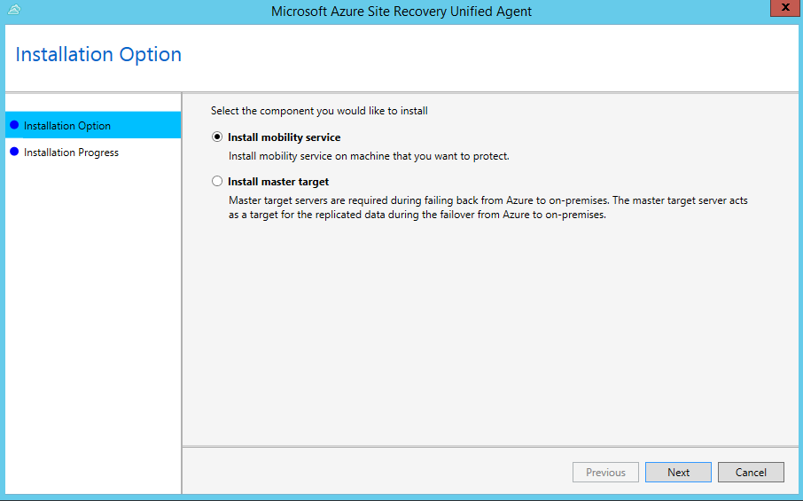
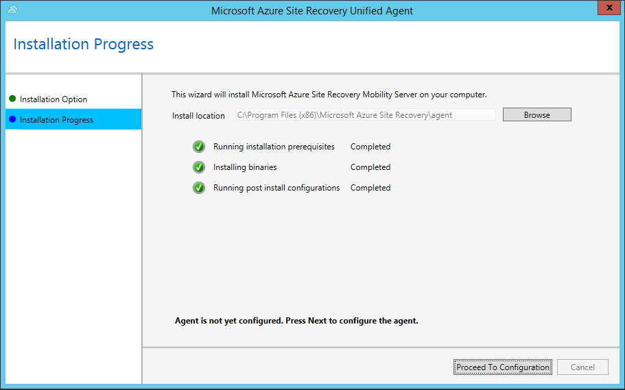
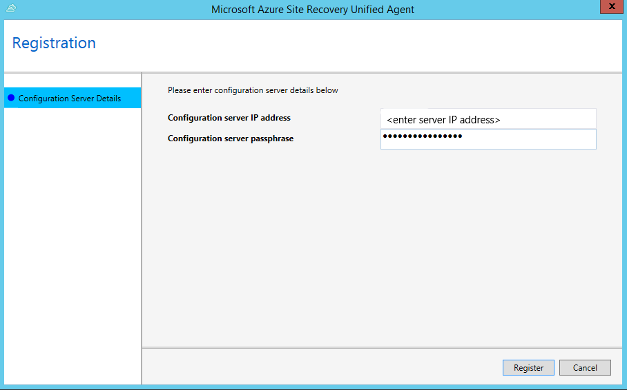
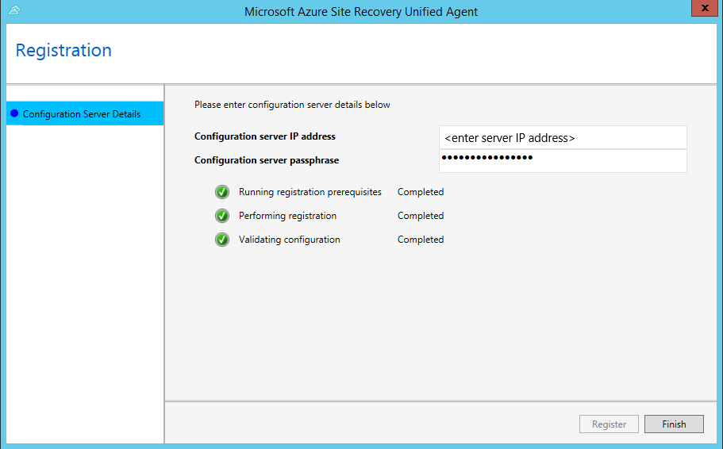

ms.author: ramamill

# Install the Mobility service manually on VMware VMs and physical servers

When you set up disaster recovery for VMware VMs and physical servers using [Azure Site Recovery](site-recovery-overview.md), you install the [Site Recovery Mobility service](vmware-physical-mobility-service-overview.md) on each on-premises VMware VM and physical server.  The Mobility service captures data writes on the machine, and forwards them to the Site Recovery process server.

This article describes how to install the Mobility service manually on each machine you want to protect.

## Create a passphrase

Before you install, create a passphrase that will be used during installation.

1. Sign into the configuration server.
2. Open a command prompt as an administrator.
3. Change the directory to the bin folder, and then create a passphrase file.

    ```
    cd %ProgramData%\ASR\home\svsystems\bin
    genpassphrase.exe -v > MobSvc.passphrase
    ```
3. Store the passphrase file in a secure location. 


## Install the service from the UI

>[!IMPORTANT]
> If you're replicating Azure IaaS VM from one Azure region to another, don't use this method. Use the command-line-based installation method insteadl.

1. Locate the installer version you need for the machine operating system. Installers are located in the %ProgramData%\ASR\home\svsystems\pushinstallsvc\repository folder. [Check](vmware-physical-mobility-service-overview.md#installer-files) which installer you need.
2. Copy the installation file to the machine, and run it.
3. In **Installation Option**, select **Install mobility service**.
4. Select the installation location > **Install**.

    

5. Monitor the installation in **Installation Progress**. After the installation is finished, select **Proceed to Configuration** to register the service with the configuration server.

    

6.  in **Configuration Server Details**, specify the IP address and passphrase you configured.  

    

7. Select **Register** to finish the registration.

    

## Install the service from the command prompt

### On a Windows machine

1. Copy the installer to a local folder (for example, C:\Temp) on the server that you want to protect. 

  ```
  cd C:\Temp
  ren Microsoft-ASR_UA*Windows*release.exe MobilityServiceInstaller.exe
  MobilityServiceInstaller.exe /q /x:C:\Temp\Extracted
  cd C:\Temp\Extracted.
  ```
2. Install as follows:

  ```
  UnifiedAgent.exe /Role "MS" /InstallLocation "C:\Program Files (x86)\Microsoft Azure Site Recovery" /Platform "VmWare" /Silent
  ```

3. Register the agent with the configuration server.

  ```
  cd C:\Program Files (x86)\Microsoft Azure Site Recovery\agent
  UnifiedAgentConfigurator.exe  /CSEndPoint <CSIP> /PassphraseFilePath <PassphraseFilePath>
  ```

#### Installation settings
**Setting** | **Details**
--- | ---
Usage | UnifiedAgent.exe /Role <MS|MT> /InstallLocation <Install Location> /Platform “VmWare” /Silent
Setup logs | Under %ProgramData%\ASRSetupLogs\ASRUnifiedAgentInstaller.log.
/Role | Mandatory installation parameter. Specifies whether the Mobility service (MS) or master target (MT) should be installed.
/InstallLocation| Optional parameter. Specifies the Mobility service installation location (any folder).
/Platform | Mandatory. Specifies the platform on which Mobility Service is installed. **VMware** for Mware VMs/physical servers; **Azure** for Azure VMs. 
/Silent| Optional. Specifies whether to run the installer in silent mode.

#### Registration settings
**Setting** | **Details**
--- | ---
Usage | UnifiedAgentConfigurator.exe  /CSEndPoint <CSIP> /PassphraseFilePath <PassphraseFilePath>
Agent configuration logs | Under %ProgramData%\ASRSetupLogs\ASRUnifiedAgentConfigurator.log.
/CSEndPoint | Mandatory parameter. Specifies the IP address of the configuration server. Use any valid IP address.
/PassphraseFilePath |  Mandatory. Location of the passphrase. Use any valid UNC or local file path.


### On a Linux machine

1. Copy the installer to a local folder (for example, /tmp) on the server that you want to protect. In a terminal, run the following commands:
  ```
  cd /tmp ;

  tar -xvzf Microsoft-ASR_UA*release.tar.gz
  ```
2. Install as follows:

  ```
  sudo ./install -d <Install Location> -r MS -v VmWare -q
  ```
3. After installation is finished, Mobility Service must be registered to the configuration server. Run the following command to register Mobility Service with the configuration server:

  ```
  /usr/local/ASR/Vx/bin/UnifiedAgentConfigurator.sh -i <CSIP> -P /var/passphrase.txt
  ```


#### Installation settings
**Setting** | **Details**
--- | ---
Usage | ./install -d <Install Location> -r <MS|MT> -v VmWare -q
-r | Mandatory installation parameter. Specifies whether the Mobility service (MS) or master target (MT) should be installed.
-d | Optional parameter. Specifies the Mobility service installation location: /usr/local/ASR.
-v | Mandatory. Specifies the platform on which Mobility Service is installed. **VMware** for Mware VMs/physical servers; **Azure** for Azure VMs. 
-q | Optional. Specifies whether to run the installer in silent mode.

#### Registration settings
**Setting** | **Details**
--- | ---
Usage | cd /usr/local/ASR/Vx/bin<br/><br/> UnifiedAgentConfigurator.sh -i <CSIP> -P <PassphraseFilePath>
-i | Mandatory parameter. Specifies the IP address of the configuration server. Use any valid IP address.
-P |  Mandatory. Full file path of the file in which the passphrase is saved. Use any valid folder

## Next steps
- [Set up disaster recovery for VMware VMs](vmware-azure-tutorial.md)
- [Set up disaster recovery for physical servers](physical-azure-disaster-recovery.md)
