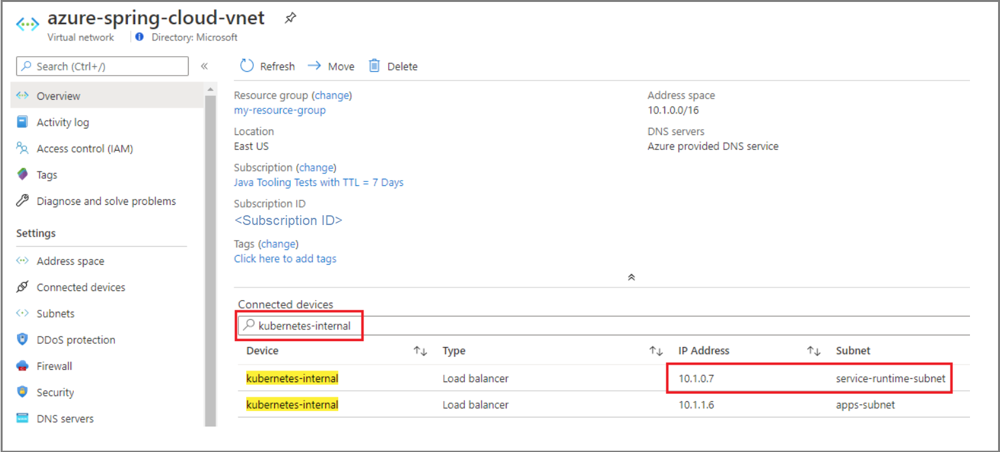
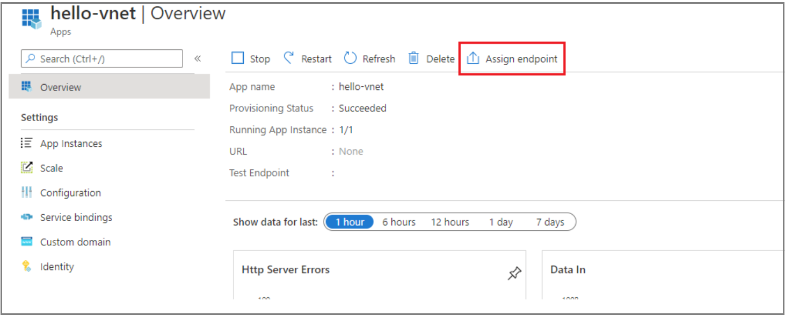
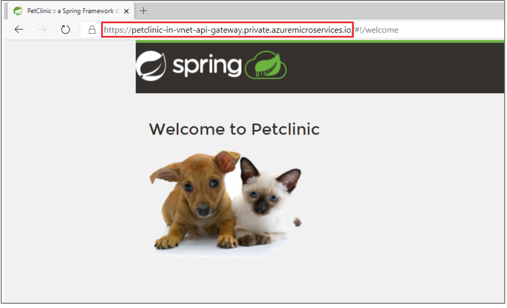

# Access your application in a private network

This document explains how to access an endpoint for your application in a private network.

When **Assign Endpoint** on applications in an Azure Spring Cloud service instance is deployed in your virtual network, the endpoint is a private fully qualified domain name (FQDN). The domain is only accessible in the private network. Apps and services use the application endpoint. They include the *Test Endpoint* described in [View apps and deployments](./how-to-staging-environment.md#view-apps-and-deployments). *Log streaming*, described in [Stream Azure Spring Cloud app logs in real-time](./how-to-log-streaming.md), also works only within the private network.

## Find the IP for your application

#### [Portal](#tab/azure-portal)

1. Select the virtual network resource you created as explained in [Deploy Azure Spring Cloud in your Azure virtual network (VNet injection)](./how-to-deploy-in-azure-virtual-network.md).

2. In the **Connected devices** search box, enter *kubernetes-internal*.

3. In the filtered result, find the **Device** connected to the service runtime **Subnet** of the service instance, and copy its **IP Address**. In this sample, the IP Address is *10.1.0.7*.

    [  ](media/spring-cloud-access-app-vnet/create-dns-record.png)

#### [CLI](#tab/azure-CLI)

Find the IP Address for your Spring Cloud services. Customize the value of your spring cloud name based on your real environment.

   ```azurecli
   SPRING_CLOUD_NAME='spring-cloud-name'
   SERVICE_RUNTIME_RG=`az spring-cloud show \
       --resource-group $RESOURCE_GROUP \
       --name $SPRING_CLOUD_NAME \
       --query "properties.networkProfile.serviceRuntimeNetworkResourceGroup" \
       --output tsv`
   IP_ADDRESS=`az network lb frontend-ip list \
       --lb-name kubernetes-internal \
       --resource-group $SERVICE_RUNTIME_RG \
       --query "[0].privateIpAddress" \
       --output tsv`
   ```

---

## Add a DNS for the IP

If you have your own DNS solution for your virtual network, like Active Directory Domain Controller, Infoblox, or another, you need to point the domain `*.private.azuremicroservices.io` to the [IP address](#find-the-ip-for-your-application). Otherwise, you can follow the following instructions to create an **Azure Private DNS Zone** in your subscription to translate/resolve the private fully qualified domain name (FQDN) to its IP address.

> [!NOTE]
> If you are using Azure China, please replace `private.azuremicroservices.io` with `private.microservices.azure.cn` in this documentation. Learn more about [Check Endpoints in Azure](/azure/china/resources-developer-guide#check-endpoints-in-azure).

## Create a private DNS zone

The following procedure creates a private DNS zone for an application in the private network.

#### [Portal](#tab/azure-portal)

1. Open the Azure portal. From the top search box, search for **Private DNS zones**, and select **Private DNS zones** from the results.

2. On the **Private DNS zones** page, select **Add**.

3. Fill out the form on the **Create Private DNS zone** page. Enter *private.azuremicroservices.io* as the **Name** of the zone.

4. Select **Review + Create**.

5. Select **Create**.

#### [CLI](#tab/azure-CLI)

1. Define variables for your subscription, resource group, and Azure Spring Cloud instance. Customize the values based on your real environment.

   ```azurecli
   SUBSCRIPTION='subscription-id'
   RESOURCE_GROUP='my-resource-group'
   VIRTUAL_NETWORK_NAME='azure-spring-cloud-vnet'
   ```

1. Sign in to the Azure CLI and choose your active subscription.

   ```azurecli
   az login
   az account set --subscription ${SUBSCRIPTION}
   ```

1. Create the private DNS zone. 

   ```azurecli
   az network private-dns zone create \
       --resource-group $RESOURCE_GROUP \
       --name private.azuremicroservices.io
   ```

---

It may take a few minutes to create the zone.

## Link the virtual network

To link the private DNS zone to the virtual network, you need to create a virtual network link.

#### [Portal](#tab/azure-portal)

1. Select the private DNS zone resource created above: *private.azuremicroservices.io*

2. On the left pane, select **Virtual network links**, then select **Add**.

4. Enter *azure-spring-cloud-dns-link* for the **Link name**.

5. For **Virtual network**, select the virtual network you created as explained in [Deploy Azure Spring Cloud in your Azure virtual network (VNet injection)](./how-to-deploy-in-azure-virtual-network.md).

    

6. Select **OK**.

#### [CLI](#tab/azure-CLI)

Link the private DNS zone you created to the virtual network holding your Azure Spring Cloud service.

   ```azurecli
   az network private-dns link vnet create \
       --resource-group $RESOURCE_GROUP \
       --name azure-spring-cloud-dns-link \
       --zone-name private.azuremicroservices.io \
       --virtual-network $VIRTUAL_NETWORK_NAME \
       --registration-enabled false
   ```
---

## Create DNS record

To use the private DNS zone to translate/resolve DNS, you must create an "A" type record in the zone.

#### [Portal](#tab/azure-portal)

1. Select the private DNS zone resource created above: *private.azuremicroservices.io*.

1. Select **Record set**.

1. In **Add record set**, enter or select this information:

    |Setting     |Value                                                                      |
    |------------|---------------------------------------------------------------------------|
    |Name        |Enter *\**                                                                 |
    |Type        |Select **A**                                                               |
    |TTL         |Enter *1*                                                                  |
    |TTL unit    |Select **Hours**                                                           |
    |IP address  |Enter the IP address copied in step 3. In the sample, the IP is *10.1.0.7*.    |

1. Select **OK**.

    

#### [CLI](#tab/azure-CLI)

Use the [IP address](#find-the-ip-for-your-application) to create the A record in your DNS zone. 

   ```azurecli
   az network private-dns record-set a add-record \
     --resource-group $RESOURCE_GROUP \
     --zone-name private.azuremicroservices.io \
     --record-set-name '*' \
     --ipv4-address $IP_ADDRESS
   ```

---

## Assign private FQDN for your application

After following the procedure in [Build and deploy microservice applications](./how-to-deploy-in-azure-virtual-network.md), you can assign a private FQDN for your application.

#### [Portal](#tab/azure-portal)

1. Select the Azure Spring Cloud service instance deployed in your virtual network, and open the **Apps** tab in the menu on the left.

2. Select the application to show the **Overview** page.

3. Select **Assign Endpoint** to assign a private FQDN to your application. Assigning an FQDN can take a few minutes.

    

4. The assigned private FQDN (labeled **URL**) is now available. It can only be accessed within the private network, but not on the Internet.

#### [CLI](#tab/azure-CLI)

Update your app to assign an endpoint to it. Customize the value of your app name based on your real environment.

```azurecli
SPRING_CLOUD_APP='your spring cloud app'
az spring-cloud app update \
    --name $SPRING_CLOUD_APP \
    --resource-group $RESOURCE_GROUP \
    --service $SPRING_CLOUD_NAME \
    --assign-endpoint true
```

---

## Access application private FQDN

After the assignment, you can access the application's private FQDN in the private network. For example, you can create a jumpbox machine in the same virtual network, or a peered virtual network. Then, on that jumpbox or virtual machine, the private FQDN is accessible.



## Next steps

- [Expose applications to Internet - using Application Gateway](./expose-apps-gateway.md)

## See also

- [Troubleshooting Azure Spring Cloud in VNET](./troubleshooting-vnet.md)
- [Customer Responsibilities for Running Azure Spring Cloud in VNET](./vnet-customer-responsibilities.md)
