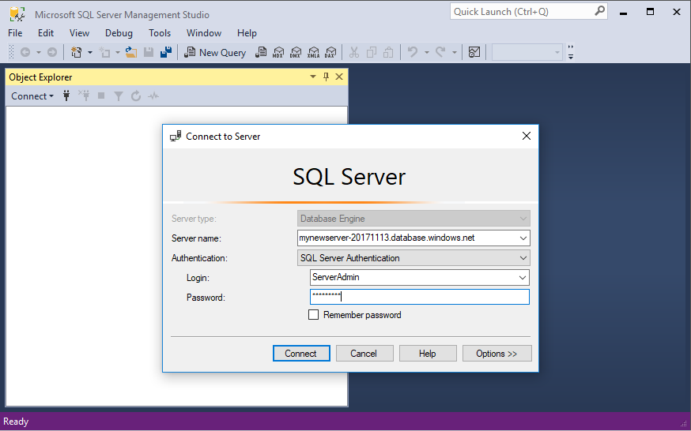
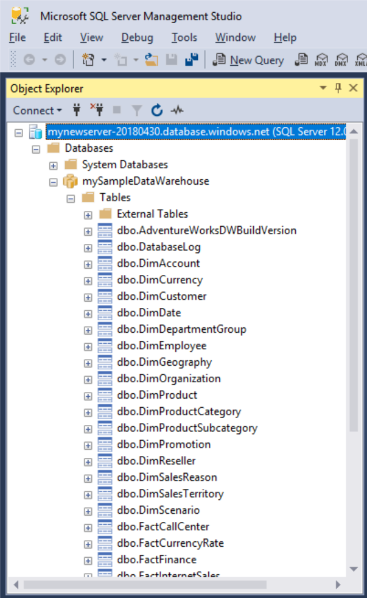
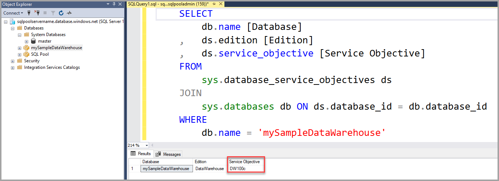

---
# Quickstart: Scale compute in Azure SQL Data Warehouse using T-SQL

Scale compute in Azure SQL Data Warehouse using T-SQL and SQL Server Management Studio (SSMS). [Scale out compute](sql-data-warehouse-manage-compute-overview.md) for better performance, or scale back compute to save costs. 

If you don't have an Azure subscription, create a [free](https://azure.microsoft.com/free/) account before you begin.

## Before you begin

Download and install the newest version of [SQL Server Management Studio](/sql/ssms/download-sql-server-management-studio-ssms.md) (SSMS).

This assumes you have completed [Quickstart: create and Connect - portal](create-data-warehouse-portal.md). After completing the Create and Connect quickstart you know how to connect to :
 created a data warehouse named **mySampleDataWarehouse**, created a firewall rule that allows our client to access the server, installed.
 
## Create a data warehouse

Use [Quickstart: create and Connect - portal](create-data-warehouse-portal.md) to create a data warehouse named **mySampleDataWarehouse**. Finish the quickstart to ensure you have a firewall rule and can connect to your data warehouse from within SQL Server Management Studio.

## Connect to the server as server admin

This section uses [SQL Server Management Studio](/sql/ssms/download-sql-server-management-studio-ssms.md) (SSMS) to establish a connection to your Azure SQL server.

1. Open SQL Server Management Studio.

2. In the **Connect to Server** dialog box, enter the following information:

   | Setting       | Suggested value | Description | 
   | ------------ | ------------------ | ------------------------------------------------- | 
   | Server type | Database engine | This value is required |
   | Server name | The fully qualified server name | Here's an example: **mynewserver-20171113.database.windows.net**. |
   | Authentication | SQL Server Authentication | SQL Authentication is the only authentication type that is configured in this tutorial. |
   | Login | The server admin account | This is the account that you specified when you created the server. |
   | Password | The password for your server admin account | This is the password that you specified when you created the server. |

    

4. Click **Connect**. The Object Explorer window opens in SSMS. 

5. In Object Explorer, expand **Databases**. Then expand **mySampleDatabase** to view the objects in your new database.

     

## View service objective
The service objective setting contains the number of data warehouse units for the data warehouse. 

To view the current data warehouse units for your data warehouse:

1. Under the connection to **mynewserver-20171113.database.windows.net**, expand **System Databases**.
2. Right-click **master** and select **New Query**. A new query window opens.
3. Run the following query to select from the sys.database_service_objectives dynamic management view. 

    ```sql
    SELECT
	    db.name [Database]
    ,	ds.edition [Edition]
    ,	ds.service_objective [Service Objective]
    FROM
 	    sys.database_service_objectives ds
    JOIN
	    sys.databases db ON ds.database_id = db.database_id
    WHERE 
        db.name = 'mySampleDataWarehouse'
    ```

4. The following results show **mySampleDataWarehouse** has a service objective of DW400. 

    


## Scale compute
In SQL Data Warehouse, you can increase or decrease compute resources by adjusting data warehouse units. The [Create and Connect - portal](create-data-warehouse-portal.md) created **mySampleDataWarehouse** and initialized it with 400 DWUs. The following steps adjust the DWUs for **mySampleDataWarehouse**.

To change data warehouse units:

1. Right-click **master** and select **New Query**.
2. Use the [ALTER DATABASE](/sql/t-sql/statements/alter-database-azure-sql-database) T-SQL statement to modify the service objective. Run the following query to change the service objective to DW300. 

```Sql
ALTER DATABASE mySampleDataWarehouse
MODIFY (SERVICE_OBJECTIVE = 'DW300')
;
```

## Check data warehouse state

When a data warehouse is paused, you can't connect to it with T-SQL. To see the current state of the data warehouse, you can use a PowerShell cmdlet. For an example, see [Check data warehouse state - Powershell](quickstart-scale-compute-powershell.md#check-data-warehouse-state). 

## Check operation status

To return information about various management operations on your SQL Data Warehouse, run the following query on the [sys.dm_operation_status](/sql/relational-databases/system-dynamic-management-views/sys-dm-operation-status-azure-sql-database) DMV. For example, it returns the operation and the  state of the operation, which will either be IN_PROGRESS or COMPLETED.

```sql
SELECT *
FROM
	sys.dm_operation_status
WHERE
	resource_type_desc = 'Database'
AND 
	major_resource_id = 'MySQLDW'
```


## Next steps
You have now learned how to scale compute for your data warehouse. To learn more about Azure SQL Data Warehouse, continue to the tutorial for loading data.

> [!div class="nextstepaction"]
>[Load data into a SQL data warehouse](load-data-from-azure-blob-storage-using-polybase.md)
