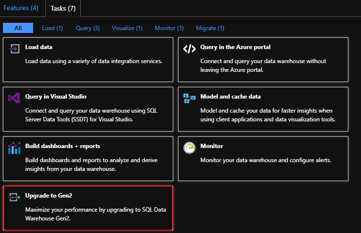
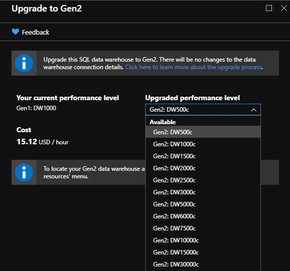

---
title: Upgrade to the latest generation of Azure SQL Data Warehouse | Microsoft Docs
description: Upgrade Azure SQL Data Warehouse to latest generation of Azure hardware and storage architecture.
services: sql-data-warehouse
author: kevinvngo
manager: craigg-msft
ms.service: sql-data-warehouse
ms.topic: conceptual
ms.component: manage
ms.date: 04/17/2018
ms.author: kevin
ms.reviewer: igorstan
---

# Optimize performance by upgrading SQL Data Warehouse
Upgrade Azure SQL Data Warehouse to latest generation of Azure hardware and storage architecture.

## Why upgrade?
You can now seamlessly upgrade to SQL Data Warehouse Gen2 in the Azure portal. If you have a Gen1 data warehouse, upgrading is recommended. By upgrading, you can use the latest generation of Azure hardware and enhanced storage architecture. You can take advantage of faster performance, higher scalability, and unlimited columnar storage. 

## Applies to
This upgrade applies to Gen1 data warehouses.

## Sign in to the Azure portal

Sign in to the [Azure portal](https://portal.azure.com/).

## Before you begin
> [!NOTE]
> If your existing Gen1 data warehouse is not in a region where Gen2 is available, you can [geo-restore to Gen2](https://docs.microsoft.com/en-us/azure/sql-data-warehouse/sql-data-warehouse-restore-database-powershell#restore-from-an-azure-geographical-region) through PowerShell to a supported region.
> 
>

1. If the Gen1 data warehouse to be upgraded is paused, [resume the data warehouse](pause-and-resume-compute-portal.md).
2. Be prepared for a few minutes of downtime. 


## Start the upgrade

1. Go to your Gen1 data warehouse in the Azure portal and click on **Upgrade to Gen2**:
    

2. By default, **select the suggested performance level** for the data warehouse based on your current performance level on Gen1 by using the mapping below:
    
| Gen1 | Gen2 |
| :----------------------: | :-------------------: |
|      DW100 – DW1000      |        DW1000c        |
|          DW1200          |        DW1500c        |
|          DW1500          |        DW1500c        |
|          DW2000          |        DW2000c        |
|          DW3000          |        DW3000c        |
|          DW6000          |        DW6000c        |


3. Ensure your workload has completed running and quiesced before upgrading. You will experience downtime for a few minutes before your data warehouse is back online as a Gen2 data warehouse. **Click Upgrade**. The price of the Gen2 performance tier is currently half-off during the preview period:
    
    

4. **Monitor your upgrade** by checking the status in the Azure portal:

   
   
   The first step of the upgrade process goes through the scale operation ("Upgrading - Offline") where all sessions will be killed, and connections will be dropped. 
   
   The second step of the upgrade process is data migration ("Upgrading - Online"). Data migration is an online trickle background process, which slowly moves columnar data from the old storage architecture to the new storage architecture leveraging a local SSD cache. During this time, your data warehouse will be online for querying and loading. All your data will be available to query regardless of whether it has been migrated or not. The data migration happens at a varying rate depending on your data size, your performance level, and the number of your columnstore segments. 

5. **Optional Recommendation:** 
To expedite the data migration background process, it is recommended to immediately force data movement by running [Alter Index rebuild](https://docs.microsoft.com/azure/sql-data-warehouse/sql-data-warehouse-tables-index) on all columnstore tables at a larger SLO and resource class. This operation is offline compared to the trickle background process; however, data migration will be much quicker where you can then take full advantage of the new enhanced storage architecture once complete with high-quality rowgroups. 

This following query generates the required Alter Index Rebuild commands to expedite the data migration process:

```sql
SELECT 'ALTER INDEX [' + idx.NAME + '] ON [' 
       + Schema_name(tbl.schema_id) + '].[' 
       + Object_name(idx.object_id) + '] REBUILD ' + ( CASE 
                                                         WHEN ( 
                                                     (SELECT Count(*) 
                                                      FROM   sys.partitions 
                                                             part2 
                                                      WHERE  part2.index_id 
                                                             = idx.index_id 
                                                             AND 
                                                     idx.object_id = 
                                                     part2.object_id) 
                                                     > 1 ) THEN 
              ' PARTITION = ' 
              + Cast(part.partition_number AS NVARCHAR(256)) 
              ELSE '' 
                                                       END ) + '; SELECT ''[' + 
              idx.NAME + '] ON [' + Schema_name(tbl.schema_id) + '].[' + 
              Object_name(idx.object_id) + '] ' + ( 
              CASE 
                WHEN ( (SELECT Count(*) 
                        FROM   sys.partitions 
                               part2 
                        WHERE 
                     part2.index_id = 
                     idx.index_id 
                     AND idx.object_id 
                         = part2.object_id) > 1 ) THEN 
              ' PARTITION = ' 
              + Cast(part.partition_number AS NVARCHAR(256)) 
              + ' completed'';' 
              ELSE ' completed'';' 
                                                    END ) 
FROM   sys.indexes idx 
       INNER JOIN sys.tables tbl 
               ON idx.object_id = tbl.object_id 
       LEFT OUTER JOIN sys.partitions part 
                    ON idx.index_id = part.index_id 
                       AND idx.object_id = part.object_id 
WHERE  idx.type_desc = 'CLUSTERED COLUMNSTORE'; 
```


## Next steps
Your upgraded data warehouse is online. To take advantage of the enhanced architecture, see [Resource classes for Workload Management](resource-classes-for-workload-management.md).
 
