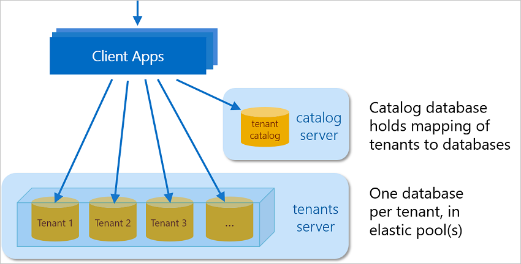

# Introduction to a multi-tenant SaaS app that uses the database per tenant pattern with SQL Database

The *Wingtip SaaS* application is a sample multi-tenant app. The app uses the database-per-tenant, SaaS application pattern, to service multiple tenants. The app showcases features of Azure SQL Database that enable SaaS scenarios, using several SaaS design and management patterns. To quickly get up and running, the Wingtip SaaS app deploys in less than five minutes!

Application source code and management scripts are available in the [WingtipTicketsSaaS-DbPerTenant](https://github.com/Microsoft/WingtipTicketsSaaS-DbPerTenant) GitHub repo. Before you start, check out the [general guidance](saas-tenancy-wingtip-app-guidance-tips.md) for steps to download and unblock the Wingtip Tickets management scripts.

## Application architecture

The Wingtip SaaS app uses the database-per-tenant model, and uses SQL elastic pools to maximize efficiency. For provisioning and mapping tenants to their data, a catalog database is used. The core Wingtip SaaS application, uses a pool with three sample tenants, plus the catalog database. Completing many of the Wingtip SaaS tutorials result in add-ons to the initial deployment, by introducing analytic databases, cross-database schema management, etc.

While going through the tutorials and working with the app, it is important to focus on the SaaS patterns as they relate to the data tier. In other words, focus on the data tier, and don't over analyze the app itself. Understanding the implementation of these SaaS patterns is key to implementing these patterns in your applications, while considering any necessary modifications for your specific business requirements.

## SQL Database Wingtip SaaS tutorials

After deploying the app, explore the following tutorials that build upon the initial deployment. These tutorials explore common SaaS patterns that take advantage of built-in features of SQL Database, SQL Data Warehouse, and other Azure services. Tutorials include PowerShell scripts, with detailed explanations that greatly simplify understanding, and implementing the same SaaS management patterns in your applications.

| Tutorial | Description |
|:--|:--|
| [Guidance and tips for Azure SQL Database multi-tenant SaaS app example](saas-tenancy-wingtip-app-guidance-tips.md) | **START HERE!** Download and run PowerShell scripts to prepare parts of the application. |
|[Deploy and explore the Wingtip SaaS application](saas-dbpertenant-get-started-deploy.md)|  Deploy and explore the Wingtip SaaS application to your Azure subscription. |
|[Provision and catalog tenants](saas-dbpertenant-provision-and-catalog.md)| Learn how the application connects to tenants using a catalog database, and how the catalog maps tenants to their data. |
|[Monitor and manage performance](saas-dbpertenant-performance-monitoring.md)| Learn how to use monitoring features of SQL Database, and how to set alerts when performance thresholds are exceeded. |
|[Monitor with Log Analytics (OMS)](saas-dbpertenant-log-analytics.md) | Learn about using [Log Analytics](../log-analytics/log-analytics-overview.md) to monitor large amounts of resources, across multiple pools. |
|[Restore a single tenant](saas-dbpertenant-restore-single-tenant.md)| Learn how to restore a tenant database to a prior point in time. Steps to restore to a parallel database, leaving the existing tenant database online, are also included. |
|[Manage tenant database schema](saas-tenancy-schema-management.md)| Learn how to update schema, and update reference data, across all tenant databases. |
|[Run cross-tenant distributed queries](saas-tenancy-cross-tenant-reporting.md) | Create an ad-hoc analytics database and run real-time distributed queries across all tenants.  |
|[Run analytics on extracted tenant data](saas-tenancy-tenant-analytics.md) | Extract tenant data into an analytics database or data warehouse for offline analytics queries. |

## Next steps

- [General guidance and tips when deploying and using the Wingtip Tickets SaaS app example](saas-tenancy-wingtip-app-guidance-tips.md)

- [Deploy the Wingtip SaaS application](saas-dbpertenant-get-started-deploy.md)
