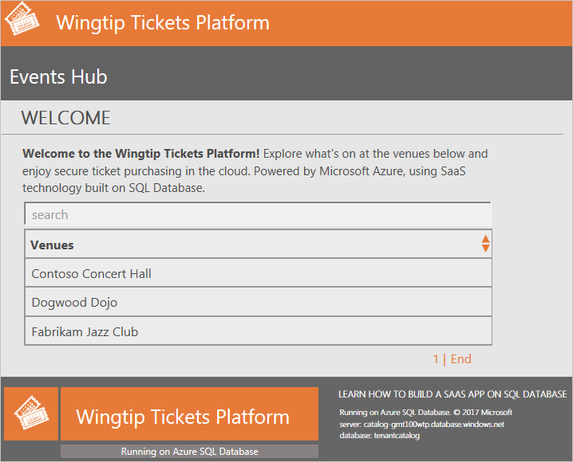
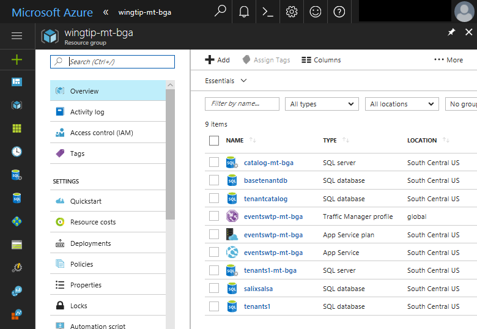
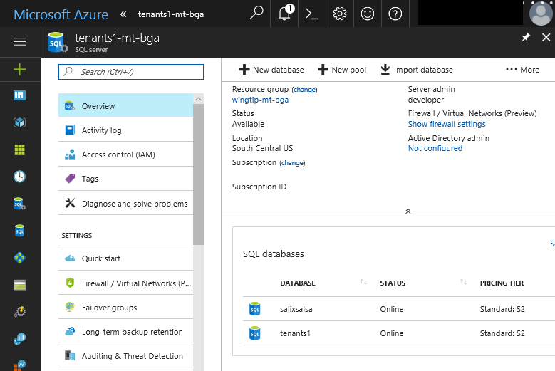

# Deploy and explore a sharded multi-tenant application that uses Azure SQL Database

In this tutorial, you deploy and explore a sample  multi-tenant SaaS application that is named Wingtip Tickets. The Wingtip Tickets app is designed to showcase features of Azure SQL Database that simplify the implementation of SaaS scenarios.

This implementation of the Wingtip Tickets app uses a sharded multi-tenant database pattern. The sharding is by tenant identifier. Tenant data is distributed to a particular database according to the tenant identifier values. 

This database pattern allows you to store one or more tenants in each shard or database. You can optimize for lowest cost by having each database be shared by multiple tenants. Or you can optimize for isolation by having each database store only one tenant. Your optimization choice can be made independently for each specific tenant. Your choice can be made when the tenant is first stored, or you can change your mind later. The application is designed to work well either way.

#### App deploys quickly

The app runs in the Azure cloud and uses Azure SQL Database. The deployment section that follows provides the blue **Deploy to Azure** button. When the button is pressed, the app is fully deployed to your Azure subscription within five minutes. You have full access to work with the individual application components.

The application is deployed with data for three sample tenants. The tenants are stored together in one multi-tenant database.

Anyone can download the C# and PowerShell source code for Wingtip Tickets from [its GitHub repository][link-github-wingtip-multitenantdb-55g].

#### Learn in this tutorial

> [!div class="checklist"]
> - How to deploy the Wingtip Tickets SaaS application.
> - Where to get the application source code, and management scripts.
> - About the servers and databases that make up the app.
> - How tenants are mapped to their data with the *catalog*.
> - How to provision a new tenant.
> - How to monitor tenant activity in the app.

A series of related tutorials is available that build upon this initial deployment. The tutorials explore a range of SaaS design and management patterns. When you work through the tutorials, you are encouraged to step through the provided scripts to see how the different SaaS patterns are implemented.

## Prerequisites

To complete this tutorial, make sure the following prerequisites are completed:

- The latest Azure PowerShell is installed. For details, see [Getting started with Azure PowerShell][link-azure-get-started-powershell-41q].

## Deploy the Wingtip Tickets app

#### Plan the names

In the steps of this section, you provide a *user* value that is used to ensure resource names are globally unique, and a name for the *resource group* which contains all the resources created by a deployment of the app. For a person named *Ann Finley*, we suggest:
- *User:* **af1**  *(Her initials, plus a digit. Use a different value (e.g. af2) if you deploy the app a second time.)*
- *Resource group:* **wingtip-dpt-af1** *(wingtip-dpt indicates this is the database-per-tenant app. Appending the user name af1 correlates the resource group name with the names of the resources it contains.)*

Choose your names now, and write them down. 

#### Steps

1. Click the following blue **Deploy to Azure** button.
    - It opens the Azure portal with the Wingtip Tickets SaaS deployment template.

    [![Button for Deploy to Azure.][image-deploy-to-azure-blue-48d]][link-aka-ms-deploywtp-mtapp-52k]

1. Enter the required parameter values for the deployment.

    > [!IMPORTANT]
    > For this demonstration, do not use any pre-existing resource groups, servers, or pools. Instead, choose **Create a new resource group**. Delete this resource group when you are finished with the application to stop related billing.
    > Do not use this application, or any resources it creates, for production. Some aspects of authentication, and the server firewall settings, are intentionally insecure in the app to facilitate the demonstration.

    - For **Resource group** - Select **Create new**, and then provide a **Name** for the resource group (case sensitive).
        - Select a **Location** from the drop-down list.
    - For **User** - We recommend that you choose a short **User** value.

1. **Deploy the application**.

    - Click to agree to the terms and conditions.
    - Click **Purchase**.

1. Monitor deployment status by clicking **Notifications**, which is the bell icon to the right of the search box. Deploying the Wingtip app takes approximately five minutes.

   

## Download and unblock the management scripts

While the application is deploying, download the application source code and management scripts.

> [!NOTE]
> Executable contents (scripts, DLLs) may be blocked by Windows when zip files are downloaded from an external source and extracted. When extracting the scripts from a zip file, use the following steps to unblock the .zip file before extracting. By unblocking the .zip file, you ensure the scripts are allowed to run.

1. Browse to [the WingtipTicketsSaaS-MultiTenantDb GitHub repo](https://github.com/Microsoft/WingtipTicketsSaaS-MultiTenantDb).
2. Click **Clone or download**.
3. Click **Download ZIP** and save the file.
4. Right-click the **WingtipTicketsSaaS-MultiTenantDb-master.zip** file and select **Properties**.
5. On the **General** tab, select **Unblock**, and click **Apply**.
6. Click **OK**.
7. Extract the files.

The scripts are located in the *..\\WingtipTicketsSaaS-MultiTenantDb-master\\Learning Modules\\* folder.

## Update the configuration file for this deployment

Before running any scripts, set the *resource group* and *user* values in **UserConfig.psm1**. Set these variables to the same values you set during deployment.

1. Open ...\\Learning Modules\\*UserConfig.psm1* in the *PowerShell ISE*.
2. Update *ResourceGroupName* and *Name* with the specific values for your deployment (on lines 10 and 11 only).
3. Save the changes.

The values set in this file are used by all the scripts, so it is important they are accurate. If you redeploy the app, you must choose different values for User and Resource Group. Then update the UserConfig.psm1 file again with the new values.

## Run the application

In the Wingtip app, the tenants are venues. A venue can be concert hall, a sports club, or any other location that hosts events. The venues register in Wingtip as customers, and a tenant identifier is generated for each venue. Each venue lists its upcoming events in Wingtip, so the public can buy tickets to the events.

Each venue gets a personalized web app to list their events and sell tickets. Each web app is independent and isolated from other tenants. Internally in Azure SQL Database, each the data for each tenant is stored in a sharded multi-tenant database, by default. All data is tagged with the tenant identifier.

A central **Events Hub** webpage provides a list of links to the tenants in your particular deployment. Use the following steps to experience the **Events Hub** webpage and an individual web app:

1. Open the **Events Hub** in your web browser:
    - http://events.wingtip-mt.&lt;user&gt;.trafficmanager.net &nbsp; *(Replace &lt;user&gt; with your deployment's user value.)*

    

2. Click **Fabrikam Jazz Club** in the **Events Hub**.

   

#### Azure Traffic Manager

To control the distribution of incoming requests, the Wingtip app uses [Azure Traffic Manager](../traffic-manager/traffic-manager-overview.md). The events page for each tenant includes the tenant name in its URL. Each URL also includes your specific User value. Each URL obeys the shown format by using the following steps:

- http://events.wingtip-mt.&lt;user&gt;.trafficmanager.net/*fabrikamjazzclub*

1. The events app parses the tenant name from the URL. The tenant name is *fabrikamjazzclub* in the preceding example URL.
2. The app then hashes the tenant name to create a key to access a catalog using [shard map management](sql-database-elastic-scale-shard-map-management.md).
3. The app finds the key in the catalog, and obtains the corresponding location of the tenant's database.
4. The app uses the location info to find and access the one database that contains all the data for the tenant.

#### Events Hub

1. The **Events Hub** lists all the tenants that are registered in the catalog, and their venues.
2. The **Events Hub** uses extended metadata in the catalog to retrieve the tenant's name associated with each mapping to construct the URLs.

In a production environment, you typically create a CNAME DNS record to [point a company internet domain](../traffic-manager/traffic-manager-point-internet-domain.md) to the traffic manager profile.

## Start generating load on the tenant databases

Now that the app is deployed, let's put it to work! The *Demo-LoadGenerator* PowerShell script starts a workload running for each tenant. The real-world load on many SaaS apps is typically sporadic and unpredictable. To simulate this type of load, the generator produces a load distributed across all tenants. The load includes randomized bursts on each tenant occurring at randomized intervals. It takes several minutes for the load pattern to emerge, so it's best to let the generator run for at least three or four minutes before monitoring the load.

1. In the *PowerShell ISE*, open the ...\\Learning Modules\\Utilities\\*Demo-LoadGenerator.ps1* script.
2. Press **F5** to run the script and start the load generator (leave the default parameter values for now).

The *Demo-LoadGenerator.ps1* script opens another PowerShell session where the load generator runs. The load generator runs in this session as a foreground task that invokes background load-generation jobs, one for each tenant.

After the foreground task starts, it remains in a job-invoking state. The task starts additional background jobs for any new tenants that are subsequently provisioned.

Closing the PowerShell session stops all jobs.

You might want to restart the load generator session to use different parameter values. If so, close the PowerShell generation session, and then rerun the *Demo-LoadGenerator.ps1*.

## Provision a new tenant into the sharded database

The initial deployment includes three sample tenants in the *Tenants1* database. Let's create another tenant and observe its effects on the deployed application. In this step, you press one key to create a new tenant:

1. Open ...\\Learning Modules\\Provision and Catalog\\*Demo-ProvisionTenants.ps1* in the *PowerShell ISE*.
2. Press **F5** (not **F8**) to run the script (leave the default values for now).

   > [!NOTE]
   > You must run the PowerShell scripts only by pressing the **F5** key, not by pressing **F8** to run a selected part of the script. The problem with **F8** is that the *$PSScriptRoot* variable is not evaluated. This variable is needed by many scripts to navigate folders, invoke other scripts, or import modules.

The new Red Maple Racing tenant is added to the *Tenants1* database and registered in the catalog. The new tenant's ticket-selling **Events** site opens in your browser:

Refresh the **Events Hub**, and the new tenant now appears in the list.

## Provision a new tenant in its own database

The sharded multi-tenant model allows you to choose whether to provision a new tenant into a database that contains other tenants, or into a database of its own. A tenant isolated in its own database enjoys the following benefits:
- The performance of the tenant's database can be managed without the need to compromise with the needs of other tenants.
- If necessary, the database can be restored to an earlier point in time, because no other tenants would be affected.

You might choose to put free-trial customers, or economy customers, into multi-tenant databases. You could put each premium tenant into its own dedicated database. If you create lots of databases that contain only one tenant, you can manage them all collectively in an elastic pool to optimize resource costs.

Next, we provision another tenant, this time in its own database:

1. In ...\\Learning Modules\\Provision and Catalog\\*Demo-ProvisionTenants.ps1*, modify *$TenantName* to **Salix Salsa**,  *$VenueType* to **dance** and *$Scenario* to **2**.

2. Press **F5** to run the script again.
    - This **F5** press provisions the new tenant in a separate database. The database and the tenant are registered in the catalog. Then the browser opens to the Events page of the tenant.

   

   - Scroll to the bottom of the page. There in the banner you see the database name in which the tenant data is stored.

3. Refresh the **Events Hub** and the two new tenants now appears in the list.

## Explore the servers and tenant databases

Now we look at some of the resources that were deployed:

1. In the [Azure portal](http://portal.azure.com), browse to the list of resource groups. Open the resource group you created when you deployed the application.

   

2. Click **catalog-mt&lt;user&gt;** server. The catalog server contains two databases named *tenantcatalog* and *basetenantdb*. The *basetenantdb* database is an empty template database. It is copied to create a new tenant database, whether used for many tenants or just one tenant.

   

3. Go back to the resource group and select the *tenants1-mt* server that holds the tenant databases.
    - The tenants1 database is a multi-tenant database in which the original three tenants, plus the first tenant you added, are stored. It is configured as a 50 DTU Standard database.
    - The **salixsalsa** database holds the Salix Salsa dance venue as its only tenant. It is configured as a Standard edition database with 50 DTUs by default.

   

## Monitor the performance of the database

If the load generator has been running for several minutes, enough telemetry is available to look at the database monitoring capabilities built into the Azure portal.

1. Browse to the **tenants1-mt&lt;user&gt;** server, and click **tenants1** to view resource utilization for the database that has four tenants in it. Each tenant is subject to a sporadic heavy load from the load generator:

   

   The DTU utilization chart nicely illustrates how a multi-tenant database can support an unpredictable workload across many tenants. In this case, the load generator is applying a sporadic load of roughly 30 DTUs to each tenant. This load equates to 60% utilization of a 50 DTU database. Peaks that exceed 60% are the result of load being applied to more than one tenant at the same time.

2. Browse to the **tenants1-mt&lt;user&gt;** server, and click the **salixsalsa** database. You can see the resource utilization on this database that contains only one tenant.

   

The load generator is applying a similar load to each tenant, regardless of which database each tenant is in. With only one tenant in the **salixsalsa** database, you can see that the database could sustain a much higher load than the database with several tenants. 

#### Resource allocations vary by workload

Sometimes a multi-tenant database requires more resources for good performance than does a single-tenant database, but not always. The optimal allocation of resources depends on the particular workload characteristics for the tenants in your system.

The workloads generated by the load generator script are for illustration purposes only.

## Additional resources

- To learn about multi-tenant SaaS applications, see [Design patterns for multi-tenant SaaS applications](saas-tenancy-app-design-patterns.md).

- To learn about elastic pools, see:
    - [Elastic pools help you manage and scale multiple Azure SQL databases](sql-database-elastic-pool.md)
    - [Scaling out with Azure SQL Database](sql-database-elastic-scale-introduction.md)

## Next steps

In this tutorial you learned:

> [!div class="checklist"]
> - How to deploy the Wingtip Tickets SaaS Multi-tenant Database application.
> - About the servers, and databases that make up the app.
> - Tenants are mapped to their data with the *catalog*.
> - How to provision new tenants, into a multi-tenant database and single-tenant database.
> - How to view pool utilization to monitor tenant activity.
> - How to delete sample resources to stop related billing.

Now try the [Provision and catalog tutorial](sql-database-saas-tutorial-provision-and-catalog.md).

<!--  Link references.

A [series of related tutorials] is available that build upon this initial deployment.
[link-wtp-overivew-jumpto-saas-tutorials-97j]: saas-multitenantdb-wingtip-app-overview.md#sql-database-wingtip-saas-tutorials

-->

[link-aka-ms-deploywtp-mtapp-52k]: http://aka.ms/deploywtp-mtapp

[link-azure-get-started-powershell-41q]: https://docs.microsoft.com/powershell/azure/get-started-azureps

[link-github-wingtip-multitenantdb-55g]: https://github.com/Microsoft/WingtipTicketsSaaS-MultiTenantDB/

<!--  Image references.

[image-deploy-to-azure-blue-48d]: http://aka.ms/deploywtp-mtapp "Button for Deploy to Azure."
-->

[image-deploy-to-azure-blue-48d]: media/saas-multitenantdb-get-started-deploy/deploy.png "Button for deploying to Azure."

