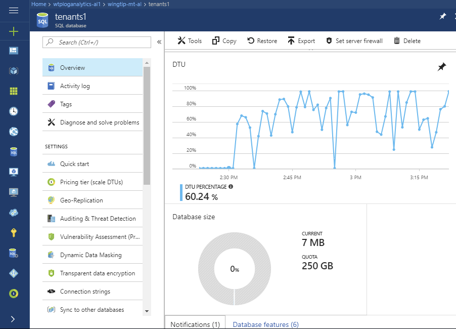
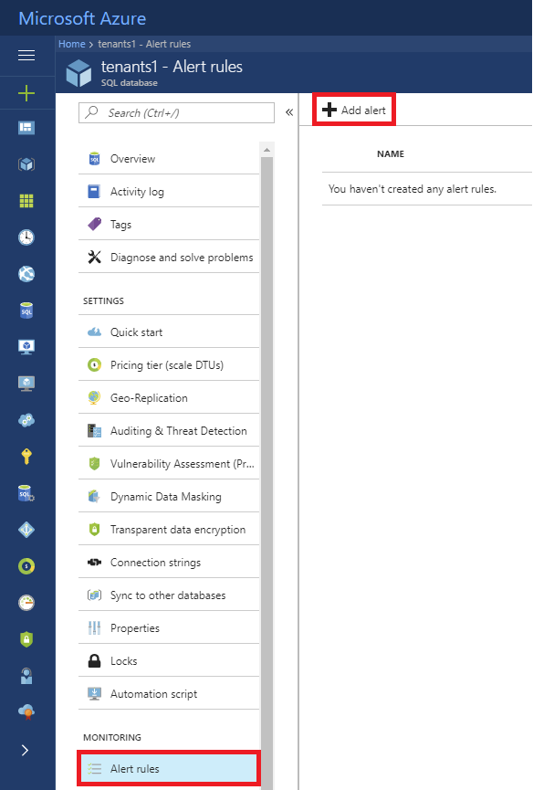
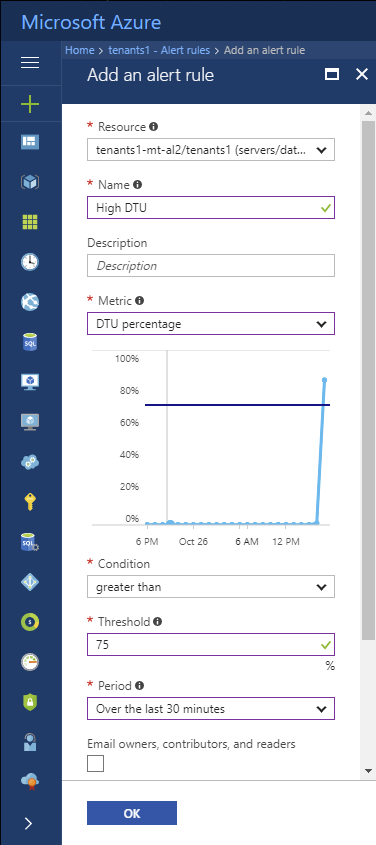

# Monitor and manage performance of sharded multi-tenant Azure SQL database in a multi-tenant SaaS app

In this tutorial, several key performance management scenarios used in SaaS applications are explored. Using a load generator to simulate activity across sharded multi-tenant databases, the built-in monitoring and alerting features of SQL Database are demonstrated.

The Wingtip Tickets SaaS Multi-tenant Database app uses a sharded multi-tenant data model, where venue (tenant) data is distributed by tenant ID across potentially multiple databases. Like many SaaS applications, the anticipated tenant workload pattern is unpredictable and sporadic. In other words, ticket sales may occur at any time. To take advantage of this typical database usage pattern, databases can be scaled up and down to optimize the cost of a solution. With this type of pattern, it's important to monitor database resource usage to ensure that loads are reasonably balanced across potentially multiple databases. You also need to ensure that individual databases have adequate resources and are not hitting their [DTU](sql-database-what-is-a-dtu.md) limits. This tutorial explores ways to monitor and manage databases, and how to take corrective action in response to variations in workload.

In this tutorial you learn how to:

> [!div class="checklist"]

> * Simulate usage on a sharded multi-tenant database by running a provided load generator
> * Monitor the database as it responds to the increase in load
> * Scale up the database in response to the increased database load
> * Provision a tenant into a single-tenant database

To complete this tutorial, make sure the following prerequisites are completed:

* The Wingtip Tickets SaaS Multi-tenant Database app is deployed. To deploy in less than five minutes, see [Deploy and explore the Wingtip Tickets SaaS Multi-tenant Database application](saas-multitenantdb-get-started-deploy.md)
* Azure PowerShell is installed. For details, see [Getting started with Azure PowerShell](https://docs.microsoft.com/powershell/azure/get-started-azureps)

## Introduction to SaaS performance management patterns

Managing database performance consists of compiling and analyzing performance data, and then reacting to this data by adjusting parameters to maintain an acceptable response time for your application. 

### Performance management strategies

* To avoid having to manually monitor performance, it’s most effective to **set alerts that trigger when databases stray out of normal ranges**.
* To respond to short-term fluctuations in the performance level of a database, the **DTU level can be scaled up or down**. If this fluctuation occurs on a regular or predictable basis, **scaling the database can be scheduled to occur automatically**. For example, scale down when you know your workload is light, maybe overnight, or during weekends.
* To respond to longer-term fluctuations, or changes in the tenants, **individual tenants can be moved into other database**.
* To respond to short-term increases in *individual* tenant load, **individual tenants can be taken out of a database and assigned an individual performance level**. Once the load is reduced, the tenant can then be returned to the multi-tenant database. When this is known in advance, tenants can be moved pre-emptively to ensure the database always has the resources it needs, and to avoid impact on other tenants in the multi-tenant database. If this requirement is predictable, such as a venue experiencing a rush of ticket sales for a popular event, then this management behavior can be integrated into the application.

The [Azure portal](https://portal.azure.com) provides built-in monitoring and alerting on most resources. For SQL Database, monitoring and alerting is available on databases. This built-in monitoring and alerting is resource-specific, so it's convenient to use for small numbers of resources, but is not convenient when working with many resources.

For high-volume scenarios, where you're working with many resources, [Log Analytics (OMS)](https://azure.microsoft.com/services/log-analytics/) can be used. This is a separate Azure service that provides analytics over emitted diagnostic logs and telemetry gathered in a log analytics workspace. Log Analytics can collect telemetry from many services and be used to query and set alerts.

## Get the Wingtip Tickets SaaS Multi-tenant Database application source code and scripts

The Wingtip Tickets SaaS Multi-tenant Database scripts and application source code are available in the [WingtipTicketsSaaS-MultitenantDB](https://github.com/microsoft/WingtipTicketsSaaS-MultiTenantDB) GitHub repo. Check out the [general guidance](saas-tenancy-wingtip-app-guidance-tips.md) for steps to download and unblock the Wingtip Tickets SaaS scripts.

## Provision additional tenants

For a good understanding of how performance monitoring and management works at scale, this tutorial requires you to have multiple tenants in a sharded multi-tenant database.

If you have already provisioned a batch of tenants in a prior tutorial, skip to the [Simulate usage on all tenant databases](#simulate-usage-on-all-tenant-databases) section.

1. In the **PowerShell ISE**, open …\\Learning Modules\\Performance Monitoring and Management\\*Demo-PerformanceMonitoringAndManagement.ps1*. Keep this script open as you'll run several scenarios during this tutorial.
1. Set **$DemoScenario** = **1**, _Provision a batch of tenants_
1. Press **F5** to run the script.

The script deploys 17 tenants into the multi-tenant database in a few minutes. 

The *New-TenantBatch* script creates new tenants with unique tenant keys within the sharded multi-tenant database and initializes them with the tenant name and venue type. This is consistent with the way the app provisions a new tenant. 

## Simulate usage on all tenant databases

The *Demo-PerformanceMonitoringAndManagement.ps1* script is provided that simulates a workload running against the multi-tenant database. The load is generated using one of the available load scenarios:

| Demo | Scenario |
|:--|:--|
| 2 | Generate normal intensity load (approx 30 DTU) |
| 3 | Generate load with longer bursts per tenant|
| 4 | Generate load with higher DTU bursts per tenant (approx 70 DTU)|
| 5 | Generate a high intensity (approx 90 DTU) on a single tenant plus a normal intensity load on all other tenants |

The load generator applies a *synthetic* CPU-only load to every tenant database. The generator starts a job for each tenant database, which calls a stored procedure periodically that generates the load. The load levels (in DTUs), duration, and intervals are varied across all databases, simulating unpredictable tenant activity.

1. In the **PowerShell ISE**, open …\\Learning Modules\\Performance Monitoring and Management\\*Demo-PerformanceMonitoringAndManagement.ps1*. Keep this script open as you'll run several scenarios during this tutorial.
1. Set **$DemoScenario** = **2**, _Generate normal intensity load_
1. Press **F5** to apply a load to all your tenants.

Wingtip Tickets SaaS Multi-tenant Database is a SaaS app, and the real-world load on a SaaS app is typically sporadic and unpredictable. To simulate this, the load generator produces a randomized load distributed across all tenants. Several minutes are needed for the load pattern to emerge, so run the load generator for 3-5 minutes before attempting to monitor the load in the following sections.

> [!IMPORTANT]
> The load generator is running as a series of jobs in a new PowerShell window. If you close the session, the load generator stops. The load generator remains in a *job-invoking* state where it generates load on any new tenants that are provisioned after the generator is started. Use *Ctrl-C* to stop invoking new jobs and exit the script. The load generator will continue to run, but only on existing tenants.

## Monitor resource usage using the Azure portal

To monitor the resource usage that results from the load being applied, open the portal to the multi-tenant database, **tenants1**, containing the tenants:

1. Open the [Azure portal](https://portal.azure.com) and browse to the server *tenants1-mt-&lt;USER&gt;*.
1. Scroll down and locate databases and click **tenants1**. This sharded multi-tenant database contains all the tenants created so far.

Observe the **DTU** chart.

## Set performance alerts on the database

Set an alert on the database that triggers on \>75% utilization as follows:

1. Open the *tenants1* database (on the *tenants1-mt-&lt;USER&gt;* server) in the [Azure portal](https://portal.azure.com).
1. Click **Alert Rules**, and then click **+ Add alert**:

   

1. Provide a name, such as **High DTU**,
1. Set the following values:
   * **Metric = DTU percentage**
   * **Condition = greater than**
   * **Threshold = 75**.
   * **Period = Over the last 30 minutes**
1. Add an email address to the *Additional administrator email(s)* box and click **OK**.

   

## Scale up a busy database

If the load level increases on a database to the point that it maxes out the database and reaches 100% DTU usage, then database performance is affected, potentially slowing query response times.

**Short term**, consider scaling up the database to provide additional resources, or removing tenants from the multi-tenant database (moving them out of the multi-tenant database to a stand-alone database).

**Longer term**, consider optimizing queries or index usage to improve database performance. Depending on the application's sensitivity to performance issues its best practice to scale a database up before it reaches 100% DTU usage. Use an alert to warn you in advance.

You can simulate a busy database by increasing the load produced by the generator. Causing the tenants to burst more frequently, and for longer, increasing the  load on the multi-tenant database without changing the requirements of the individual tenants. Scaling up the database is easily done in the portal or from PowerShell. This exercise uses the portal.

1. Set *$DemoScenario* = **3**, _Generate load with longer and more frequent bursts per database_ to increase the intensity of the aggregate load on the database without changing the peak load required by each tenant.
1. Press **F5** to apply a load to all your tenant databases.
1. Go to the **tenants1** database in the Azure portal.

Monitor the increased database DTU usage on the upper chart. It takes a few minutes for the new higher load to kick in, but you should quickly see the database start to hit max utilization, and as the load steadies into the new pattern, it rapidly overloads the database.

1. To scale up the database, click **Pricing tier (scale DTUs)** in the settings blade.
1. Adjust the **DTU** setting to **100**. 
1. Click **Apply** to submit the request to scale the database.

Go back to **tenants1** > **Overview** to view the monitoring charts. Monitor the effect of providing the database with more resources (although with few tenants and a randomized load it’s not always easy to see conclusively until you run for some time). While you are looking at the charts bear in mind that 100% on the upper chart now represents 100 DTUs, while on the lower chart 100% is still 50 DTUs.

Databases remain online and fully available throughout the process. Application code should always be written to retry dropped connections, and so will reconnect to the database.

## Provision a new tenant in its own database 

The sharded multi-tenant model allows you to choose whether to provision a new tenant in a multi-tenant database alongside other tenants, or to provision the tenant in a database of its own. By provisioning a tenant in its own database, it benefits from the isolation inherent in the separate database, allowing you to manage the performance of that tenant independently of others, restore that tenant independently of others, etc. For example, you might choose to put free-trial or regular customers in a multi-tenant database, and premium customers in individual databases.  If isolated single-tenant databases are created, they can still be managed collectively in an elastic pool to optimize resource costs.

If you already provisioned a new tenant in its own database, skip the next few steps.

1. In the **PowerShell ISE**, open …\\Learning Modules\\ProvisionTenants\\*Demo-ProvisionTenants.ps1*. 
1. Modify **$TenantName = "Salix Salsa"** and **$VenueType  = "dance"**
1. Set **$Scenario** = **2**, _Provision a tenant in a new single-tenant database_
1. Press **F5** to run the script.

The script will provision this tenant in a separate database, register the database and the tenant with the catalog, and then open the tenant’s Events page in the browser. Refresh the Events Hub page and you will see "Salix Salsa" has been added as a venue.

## Manage performance of a single database

If a single tenant within a multi-tenant database experiences a sustained high load, it may tend to dominate the database resources and impact other tenants in the same database. If the activity is likely to continue for some time, the tenant can be temporarily moved out of the database and into its own single-tenant database. This allows the tenant to have the extra resources it needs, and fully isolates it from the other tenants.

This exercise simulates the effect of Salix Salsa experiencing a high load when tickets go on sale for a popular event.

1. Open the …\\*Demo-PerformanceMonitoringAndManagement.ps1* script.
1. Set **$DemoScenario = 5**, _Generate a normal load plus a high load on a single tenant (approx 90 DTU)._
1. Set **$SingleTenantName = Salix Salsa**
1. Execute the script using **F5**.

Go to portal and navigate to **salixsalsa** > **Overview** to view the monitoring charts. 

## Other performance management patterns

**Tenant self-service scaling**

Because scaling is a task easily called via the management API, you can easily build the ability to scale tenant databases into your tenant-facing application, and offer it as a feature of your SaaS service. For example, let tenants self-administer scaling up and down, perhaps linked directly to their billing!

**Scaling a database up and down on a schedule to match usage patterns**

Where aggregate tenant usage follows predictable usage patterns, you can use Azure Automation to scale a database up and down on a schedule. For example, scale a database down after 6pm and up again before 6am on weekdays when you know there is a drop in resource requirements.

## Next steps

In this tutorial you learn how to:

> [!div class="checklist"]
> * Simulate usage on a sharded multi-tenant database by running a provided load generator
> * Monitor the database as it responds to the increase in load
> * Scale up the database in response to the increased database load
> * Provision a tenant into a single-tenant database

## Additional resources

<!--* [Additional tutorials that build upon the Wingtip Tickets SaaS Multi-tenant Database application deployment](saas-multitenantdb-wingtip-app-overview.md#sql-database-wingtip-saas-tutorials)-->
* [Azure automation](../automation/automation-intro.md)