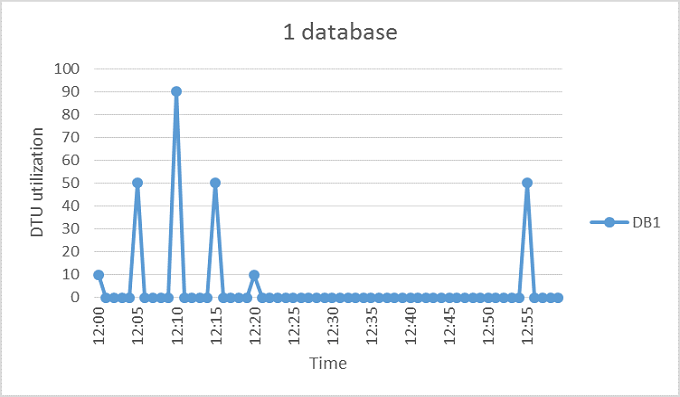
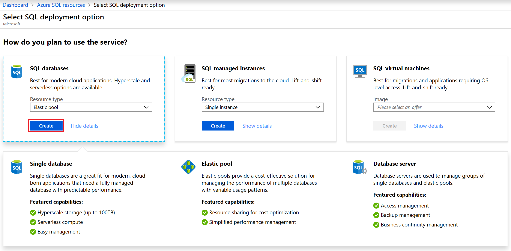
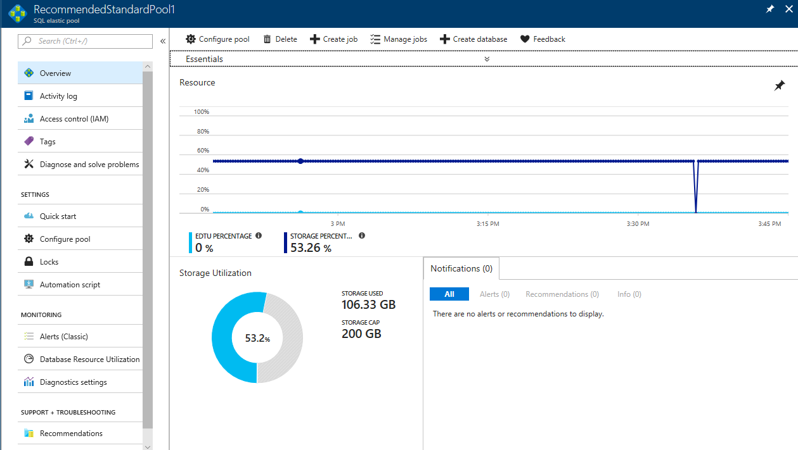
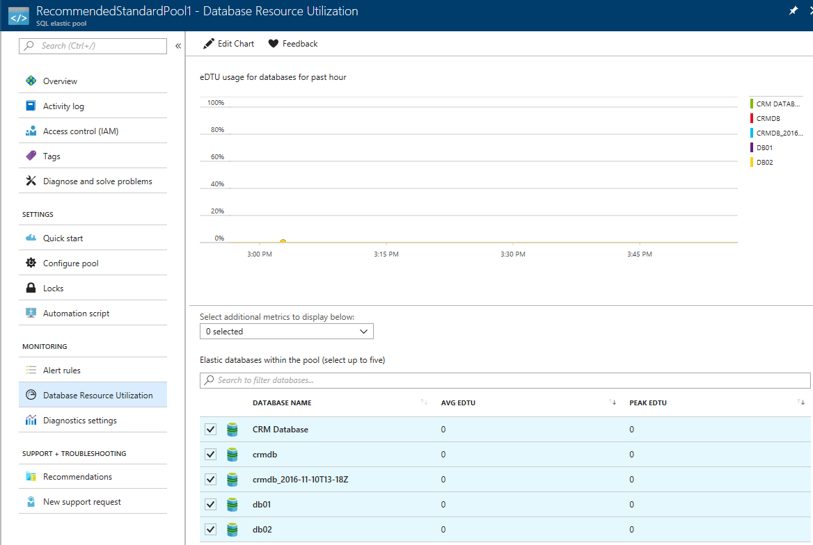

# Elastic pools help you manage and scale multiple Azure SQL databases

SQL Database elastic pools are a simple, cost-effective solution for managing and scaling multiple databases that have varying and unpredictable usage demands. The databases in an elastic pool are on a single Azure SQL Database server and share a set number of resources at a set price. Elastic pools in Azure SQL Database enable SaaS developers to optimize the price performance for a group of databases within a prescribed budget while delivering performance elasticity for each database.

## What are SQL elastic pools

SaaS developers build applications on top of large scale data-tiers consisting of multiple databases. A common application pattern is to provision a single database for each customer. But different customers often have varying and unpredictable usage patterns, and it is difficult to predict the resource requirements of each individual database user. Traditionally, you had two options:

- Over-provision resources based on peak usage and over pay, or
- Under-provision to save cost, at the expense of performance and customer satisfaction during peaks.

Elastic pools solve this problem by ensuring that databases get the performance resources they need when they need it. They provide a simple resource allocation mechanism within a predictable budget. To learn more about design patterns for SaaS applications using elastic pools, see [Design Patterns for Multi-tenant SaaS Applications with Azure SQL Database](sql-database-design-patterns-multi-tenancy-saas-applications.md).

> [!VIDEO https://channel9.msdn.com/Blogs/Azure/Elastic-databases-helps-SaaS-developers-tame-explosive-growth/player]
>

> [!IMPORTANT]
> There is no per-database charge for elastic pools. You are billed for each hour a pool exists at the highest eDTU or vCores, regardless of usage or whether the pool was active for less than an hour.

Elastic pools enable the developer to purchase resources for a pool shared by multiple databases to accommodate unpredictable periods of usage by individual databases. You can configure resources for the pool based either on the [DTU-based purchasing model](sql-database-service-tiers-dtu.md) or the [vCore-based purchasing model](sql-database-service-tiers-vcore.md). The resource requirement for a pool is determined by the aggregate utilization of its databases. The amount of resources available to the pool is controlled by the developer budget. The developer simply adds databases to the pool, sets the minimum and maximum resources for the databases (either minimum and maximum DTUs or minimum or maximum vCores depending on your choice of resourcing model), and then sets the resources of the pool based on their budget. A developer can use pools to seamlessly grow their service from a lean startup to a mature business at ever-increasing scale.

Within the pool, individual databases are given the flexibility to auto-scale within set parameters. Under heavy load, a database can consume more resources to meet demand. Databases under light loads consume less, and databases under no load consume no resources. Provisioning resources for the entire pool rather than for single databases simplifies your management tasks. Plus, you have a predictable budget for the pool. Additional resources can be added to an existing pool with no database downtime, except that the databases may need to be moved to provide the additional compute resources for the new eDTU reservation. Similarly, if extra resources are no longer needed they can be removed from an existing pool at any point in time. And you can add or subtract databases to the pool. If a database is predictably under-utilizing resources, move it out.

> [!NOTE]
> When moving databases into or out of an elastic pool, there is no downtime except for a brief period of time (on the order of seconds) at the end of the operation when database connections are dropped.

## When should you consider a SQL Database elastic pool

Pools are well suited for a large number of databases with specific utilization patterns. For a given database, this pattern is characterized by low average utilization with relatively infrequent utilization spikes.

The more databases you can add to a pool the greater your savings become. Depending on your application utilization pattern, it is possible to see savings with as few as two S3 databases.

The following sections help you understand how to assess if your specific collection of databases can benefit from being in a pool. The examples use Standard pools but the same principles also apply to Basic and Premium pools.

### Assessing database utilization patterns

The following figure shows an example of a database that spends much time idle, but also periodically spikes with activity. This is a utilization pattern that is suited for a pool:

   

For the five-minute period illustrated, DB1 peaks up to 90 DTUs, but its overall average usage is less than five DTUs. An S3 compute size is required to run this workload in a single database, but this leaves most of the resources unused during periods of low activity.

A pool allows these unused DTUs to be shared across multiple databases, and so reduces the DTUs needed and overall cost.

Building on the previous example, suppose there are additional databases with similar utilization patterns as DB1. In the next two figures below, the utilization of four databases and 20 databases are layered onto the same graph to illustrate the non-overlapping nature of their utilization over time using the DTU-based purchasing model:

   

   

The aggregate DTU utilization across all 20 databases is illustrated by the black line in the preceding figure. This shows that the aggregate DTU utilization never exceeds 100 DTUs, and indicates that the 20 databases can share 100 eDTUs over this time period. This results in a 20x reduction in DTUs and a 13x price reduction compared to placing each of the databases in S3 compute sizes for single databases.

This example is ideal for the following reasons:

- There are large differences between peak utilization and average utilization per database.
- The peak utilization for each database occurs at different points in time.
- eDTUs are shared between many databases.

The price of a pool is a function of the pool eDTUs. While the eDTU unit price for a pool is 1.5x greater than the DTU unit price for a single database, **pool eDTUs can be shared by many databases and fewer total eDTUs are needed**. These distinctions in pricing and eDTU sharing are the basis of the price savings potential that pools can provide.

The following rules of thumb related to database count and database utilization help to ensure that a pool delivers reduced cost compared to using compute sizes for single databases.

### Minimum number of databases

If the aggregate amount of resources for single databases is more than 1.5x the resources needed for the pool, then an elastic pool is more cost effective.

***DTU-based purchasing model example*** 
At least two S3 databases or at least 15 S0 databases are needed for a 100 eDTU pool to be more cost-effective than using compute sizes for single databases.

### Maximum number of concurrently peaking databases

By sharing resources, not all databases in a pool can simultaneously use resources up to the limit available for single databases. The fewer databases that concurrently peak, the lower the pool resources can be set and the more cost-effective the pool becomes. In general, not more than 2/3 (or 67%) of the databases in the pool should simultaneously peak to their resources limit.

***DTU-based purchasing model example***

To reduce costs for three S3 databases in a 200 eDTU pool, at most two of these databases can simultaneously peak in their utilization. Otherwise, if more than two of these four S3 databases simultaneously peak, the pool would have to be sized to more than 200 eDTUs. If the pool is resized to more than 200 eDTUs, more S3 databases would need to be added to the pool to keep costs lower than compute sizes for single databases.

Note this example does not consider utilization of other databases in the pool. If all databases have some utilization at any given point in time, then less than 2/3 (or 67%) of the databases can peak simultaneously.

### Resource utilization per database

A large difference between the peak and average utilization of a database indicates prolonged periods of low utilization and short periods of high utilization. This utilization pattern is ideal for sharing resources across databases. A database should be considered for a pool when its peak utilization is about 1.5 times greater than its average utilization.

**DTU-based purchasing model example**: An S3 database that peaks to 100 DTUs and on average uses 67 DTUs or less is a good candidate for sharing eDTUs in a pool. Alternatively, an S1 database that peaks to 20 DTUs and on average uses 13 DTUs or less is a good candidate for a pool.

## How do I choose the correct pool size

The best size for a pool depends on the aggregate resources needed for all databases in the pool. This involves determining the following:

- Maximum resources utilized by all databases in the pool (either maximum DTUs or maximum vCores depending on your choice of resourcing model).
- Maximum storage bytes utilized by all databases in the pool.

For available service tiers for each resource model, see the [DTU-based purchasing model](sql-database-service-tiers-dtu.md) or the [vCore-based purchasing model](sql-database-service-tiers-vcore.md).

In cases where you can't use tooling, the following step-by-step can help you estimate whether a pool is more cost-effective than single databases:

1. Estimate the eDTUs or vCores needed for the pool as follows:

   For DTU-based purchasing model:
   MAX(<*Total number of DBs* X *average DTU utilization per DB*>,   
   <*Number of concurrently peaking DBs* X *Peak DTU utilization per DB*)

   For vCore-based purchasing model:
   MAX(<*Total number of DBs* X *average vCore utilization per DB*>,   
   <*Number of concurrently peaking DBs* X *Peak vCore utilization per DB*)

2. Estimate the storage space needed for the pool by adding the number of bytes needed for all the databases in the pool. Then determine the eDTU pool size that provides this amount of storage.
3. For the DTU-based purchasing model, take the larger of the eDTU estimates from Step 1 and Step 2. For the vCore-based purchasing model, take the vCore estimate from Step 1.
4. See the [SQL Database pricing page](https://azure.microsoft.com/pricing/details/sql-database/) and find the smallest pool size that is greater than the estimate from Step 3.
5. Compare the pool price from Step 5 to the price of using the appropriate compute sizes for single databases.

## Using other SQL Database features with elastic pools

### Elastic jobs and elastic pools

With a pool, management tasks are simplified by running scripts in **[elastic jobs](elastic-jobs-overview.md)**. An elastic job eliminates most of tedium associated with large numbers of databases.

For more information about other database tools for working with multiple databases, see [Scaling out with Azure SQL Database](sql-database-elastic-scale-introduction.md).

### Business continuity options for databases in an elastic pool

Pooled databases generally support the same [business continuity features](sql-database-business-continuity.md) that are available to single databases.

- **Point-in-time restore**

  Point-in-time restore uses automatic database backups to recover a database in a pool to a specific point in time. See [Point-In-Time Restore](sql-database-recovery-using-backups.md#point-in-time-restore)

- **Geo-restore**

  Geo-restore provides the default recovery option when a database is unavailable because of an incident in the region where the database is hosted. See [Restore an Azure SQL Database or failover to a secondary](sql-database-disaster-recovery.md)

- **Active geo-replication**

  For applications that have more aggressive recovery requirements than geo-restore can offer, configure [Active geo-replication](sql-database-active-geo-replication.md) or an [auto-failover group](sql-database-auto-failover-group.md).

## Creating a new SQL Database elastic pool using the Azure portal

There are two ways you can create an elastic pool in the Azure portal.

1. Select **Azure SQL** in the left-hand menu of the Azure portal. If Azure SQL is not in the list, select **All services**, then type *Azure SQL* in the search box.
2. Select **+Add** to open the **Select SQL deployment option** page. You can view additional information about elastic pools by selecting **Show details** on the **Databases** tile.
3. On the **Databases** tile, select **Elastic pool** in the **Resource type** dropdown, then select **Create**:

   

1. Or you can create an elastic pool by navigating to an existing Azure SQL server and clicking **+ New pool** to create a pool directly into that server.

> [!NOTE]
> You can create multiple pools on a server, but you can't add databases from different servers into the same pool.

The pool's service tier determines the features available to the elastics in the pool, and the maximum amount of resources available to each database. For details, see Resource limits for elastic pools in the [DTU model](sql-database-dtu-resource-limits-elastic-pools.md#elastic-pool-storage-sizes-and-compute-sizes). For vCore-based resource limits for elastic pools, see [vCore-based resource limits - elastic pools](sql-database-vcore-resource-limits-elastic-pools.md).

To configure the resources and pricing of the pool, click **Configure pool**. Then select a service tier, add databases to the pool, and configure the resource limits for the pool and its databases.

When you have completed configuring the pool, you can click 'Apply', name the pool, and click 'OK' to create the pool.

## Monitor an elastic pool and its databases

In the Azure portal, you can monitor the utilization of an elastic pool and the databases within that pool. You can also make a set of changes to your elastic pool and submit all changes at the same time. These changes include adding or removing databases, changing your elastic pool settings, or changing your database settings.

To start monitoring your elastic pool, find and open an elastic pool in the portal. You will first see a screen that gives you an overview of the status of your elastic pool. This includes:

- Monitoring charts showing resources usage of the elastic pool
- Recent alerts and recommendations, if available, for the elastic pool

The following graphic shows an example elastic pool:

If you want more information about the pool you can click on any of the available information in this overview. Clicking on the **Resource utilization** chart will take you to the Azure Monitoring view where you can customize the metrics and time window shown in the chart. Clicking on any available notifications will take you to a blade that shows the full details of that alert or recommendation.

If you would like to monitor the databases inside your pool, you can click on **Database resource utilization** in the **Monitoring** section of the resource menu on the left.

### To customize the chart display

You can edit the chart and the metric page to display other metrics such as CPU percentage, data IO percentage, and log IO percentage used.

On the **Edit Chart** form, you can select a fixed time range or click **custom** to select any 24-hour window in the last two weeks, and then select the resources to monitor.

### To select databases to monitor

By default, the chart in the **Database Resource Utilization** blade will show the top 5 databases by DTU or CPU (depending on your service tier). You can switch up the databases in this chart by selecting and unselecting databases from the list below the chart via the checkboxes on the left.

You can also select more metrics to view side by side in this database table to get a more complete view of your databases performance.

For more information, see [create SQL Database alerts in Azure portal](sql-database-insights-alerts-portal.md).

## Customer case studies

- [SnelStart](https://azure.microsoft.com/resources/videos/azure-sql-database-case-study-snelstart/)

  SnelStart used elastic pools with Azure SQL Database to rapidly expand its business services at a rate of 1,000 new Azure SQL Databases per month.

- [Umbraco](https://azure.microsoft.com/resources/videos/azure-sql-database-case-study-umbraco/)

  Umbraco uses elastic pools with Azure SQL Database to quickly provision and scale services for thousands of tenants in the cloud.

- [Daxko/CSI](https://customers.microsoft.com/story/726277-csi-daxko-partner-professional-service-azure)	

   Daxko/CSI uses elastic pools with Azure SQL Database to accelerate its development cycle and to enhance its customer services and performance.	

## Next steps

- To scale elastic pools, see [Scaling elastic pools](sql-database-elastic-pool-scale.md) and [Scale an elastic pool - sample code](scripts/sql-database-monitor-and-scale-pool-powershell.md)
- For a video, see [Microsoft Virtual Academy video course on Azure SQL Database elastic capabilities](https://mva.microsoft.com/training-courses/elastic-database-capabilities-with-azure-sql-db-16554)
- To learn more about design patterns for SaaS applications using elastic pools, see [Design Patterns for Multi-tenant SaaS Applications with Azure SQL Database](sql-database-design-patterns-multi-tenancy-saas-applications.md).
- For a SaaS tutorial using elastic pools, see [Introduction to the Wingtip SaaS application](sql-database-wtp-overview.md).
