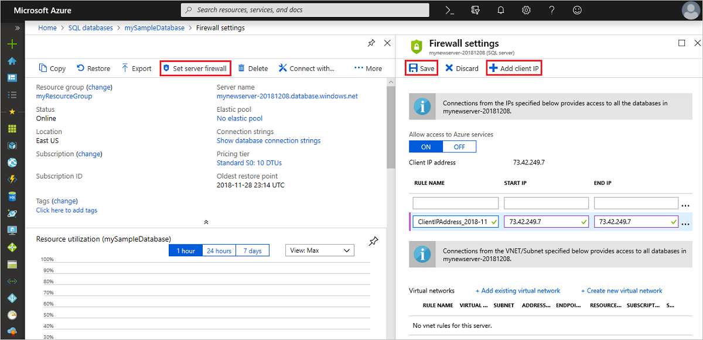

# Quickstart: Create a server-level firewall rule for your SQL database using the Azure portal

This quickstart walks through how to create a server-level firewall rule for an Azure SQL database to enable you to connect to it from an on-premises resource.

## Prerequisites

This quickstart uses as its starting point the resources created in this quickstart: [Create an Azure SQL database in the Azure portal](sql-database-get-started-portal.md)

## Log in to the Azure portal

Sign in to the [Azure portal](https://portal.azure.com/).

## Create a server-level firewall rule

The SQL Database service creates a firewall at the server-level that prevents applications and tools from connecting to the server or any databases on the server unless a firewall rule is created to open the firewall. For a connection from an IP address outside of Azure, create a firewall rule for a specific IP address or range of addresses. Follow these steps to create a [SQL Database server-level firewall rule](sql-database-firewall-configure.md) for your client's IP address and enable external connectivity through the SQL Database firewall for your IP address only.

> [!NOTE]
> SQL Database communicates over port 1433. If you are trying to connect from within a corporate network, outbound traffic over port 1433 may not be allowed by your network's firewall. If so, you cannot connect to your Azure SQL Database server unless your IT department opens port 1433.
>

1. After the deployment completes, click **SQL databases** from the left-hand menu and then click **mySampleDatabase** on the **SQL databases** page. The overview page for your database opens, showing you the fully qualified server name (such as **mynewserver-20170824.database.windows.net**) and provides options for further configuration.

2. Copy this fully qualified server name for use to connect to your server and its databases in subsequent quickstarts.

   

3. Click **Set server firewall** on the toolbar as shown in the previous image. The **Firewall settings** page for the SQL Database server opens.

   

4. Click **Add client IP** on the toolbar to add your current IP address to a new firewall rule. A firewall rule can open port 1433 for a single IP address or a range of IP addresses.

5. Click **Save**. A server-level firewall rule is created for your current IP address opening port 1433 on the logical server.

6. Click **OK** and then close the **Firewall settings** page.

You can now connect to the SQL Database server and its databases using SQL Server Management Studio or another tool of your choice from this IP address using the server admin account created previously.

> [!IMPORTANT]
> By default, access through the SQL Database firewall is enabled for all Azure services. Click **OFF** on this page to disable for all Azure services.
>

## Clean up resources

Save these resources if you want to go to [Next steps](#next-steps) and learn how to connect and query your database using a number of different methods. If, however, you wish to delete the resources that you created in this quickstart, use the following steps.

1. From the left-hand menu in the Azure portal, click **Resource groups** and then click **myResourceGroup**.
2. On your resource group page, click **Delete**, type **myResourceGroup** in the text box, and then click **Delete**.

## Next steps

- Now that you have a database, you can [connect and query](sql-database-connect-query.md) using one of your favorite tools or languages, including
  - [Connect and query using SQL Server Management Studio](sql-database-connect-query-ssms.md)
  - [Connect and query using Azure Data Studio](https://docs.microsoft.com/sql/azure-data-studio/quickstart-sql-database?toc=/azure/sql-database/toc.json)
- To learn how to design your first database, create tables, and insert data, see one of these tutorials:
 - [Design your first Azure SQL database using SSMS](sql-database-design-first-database.md)
 - [Design an Azure SQL database and connect with C# and ADO.NET](sql-database-design-first-database-csharp.md)
