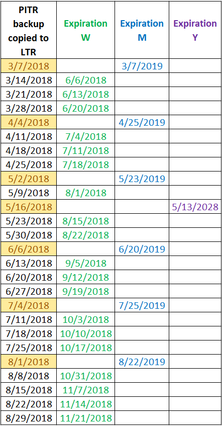

# Store Azure SQL Database backups for up to 10 years

Many applications have regulatory, compliance, or other business purposes that require you to retain database backups beyond the 7-35 days provided by Azure SQL Database [automatic backups](sql-database-automated-backups.md). By using the long-term retention (LTR) feature, you can store specified SQL database full backups in [RA-GRS](../storage/common/storage-redundancy-grs.md#read-access-geo-redundant-storage) blob storage for up to 10 years. You can then restore any backup as a new database.

> [!NOTE]
> LTR can be enabled for single and pooled databases. It is not yet available for instance databases in Managed Instances. You can use SQL Agent jobs to schedule [copy-only database backups](https://docs.microsoft.com/sql/relational-databases/backup-restore/copy-only-backups-sql-server) as an alternative to LTR beyond 35 days.
> 

## How SQL Database long-term retention works

Long-term backup retention (LTR) leverages the full database backups that are [automatically created](sql-database-automated-backups.md) to enable point-time restore (PITR). If an LTR policy is configured, these backups are copied to different blobs for long-term storage. The copy operation is a background job that has no performance impact on the database workload. The LTR backups are retained for a period of time set by the LTR policy. The LTR policy for each SQL database can also specify how frequently the LTR backups are created. To enable that flexibility you can define the policy using a combination of four parameters: weekly backup retention (W), monthly backup retention (M), yearly backup retention (Y), and week of year (WeekOfYear). If you specify W, one backup every week will be copied to the long-term storage. If you specify M, one backup during the first week of each month will be copied to the long-term storage. If you specify Y, one backup during the week specified by WeekOfYear will be copied to the long-term storage. Each backup will be kept in the long-term storage for the period specified by these parameters. Any change of the LTR policy applies to the future backups. For example, if the specified WeekOfYear is in the past when the policy is configured, the first LTR backup will be created next year. 

Examples of the LTR policy:

-  W=0, M=0, Y=5, WeekOfYear=3

   The third full backup of each year will be kept for five years.
   
- W=0, M=3, Y=0

   The first full backup of each month will be kept for three months.

- W=12, M=0, Y=0

   Each weekly full backup will be kept for 12 weeks.

- W=6, M=12, Y=10, WeekOfYear=16

   Each weekly full backup will be kept for six weeks. Except first full backup of each month, which will be kept for 12 months. Except the full backup taken on 16th week of year, which will be kept for 10 years. 

The following table illustrates the cadence and expiration of the long-term backups for the following policy:

W=12 weeks (84 days), M=12 months (365 days), Y=10 years (3650 days), WeekOfYear=15 (week after April 15)

   

If you modify the above policy and set W=0 (no weekly backups), the cadence of backup copies will change as shown in the above table by the highlighted dates. The storage amount needed to keep these backups would reduce accordingly. 

> [!IMPORTANT]
> The timing of the individual LTR backups is controlled by Azure SQL Database. You cannot manually create a LTR backup or control the timing of the backup creation. After configuring an LTR policy, it  may take up to 7 days before the first LTR backup will show up on the list of available backups.  
> 

## Geo-replication and long-term backup retention

If you are using active geo-replication or failover groups as your business continuity solution, you should prepare for eventual failovers and configure the same LTR policy on the geo-secondary database. Your LTR storage cost will not increase as backups are not generated from the secondaries. Only when the secondary becomes primary the backups will be created. It ensures non-interrupted generation of the LTR backups when the failover is triggered and the primary moves to the secondary region. 

> [!NOTE]
> When the original primary database recovers from an outage that caused the failover, it will become a new secondary. Therefore, the backup creation will not resume and the existing LTR policy will not take effect until it becomes the primary again. 

## Configure long-term backup retention

To learn how to configure long-term retention using the Azure portal or PowerShell, see [Manage Azure SQL Database long-term backup retention](sql-database-long-term-backup-retention-configure.md).

## Restore database from LTR backup

To restore a database from the LTR storage, you can select a specific backup based on its timestamp. The database can be restored to any existing server under the same subscription as the original database. To learn how to restore your database from an LTR backup, using the Azure portal or PowerShell, see [Manage Azure SQL Database long-term backup retention](sql-database-long-term-backup-retention-configure.md).

## Next steps

Because database backups protect data from accidental corruption or deletion, they're an essential part of any business continuity and disaster recovery strategy. To learn about the other SQL Database business-continuity solutions, see [Business continuity overview](sql-database-business-continuity.md).
