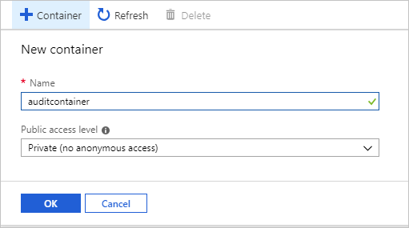
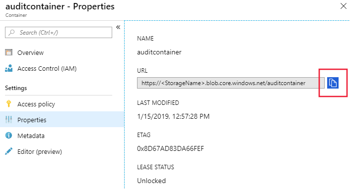
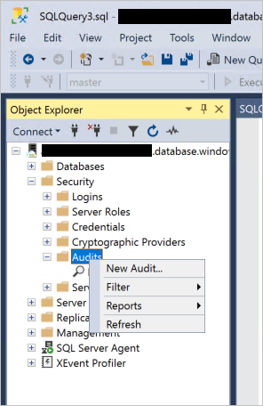
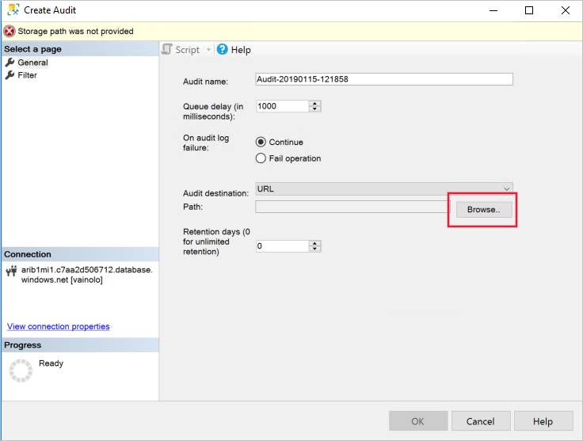
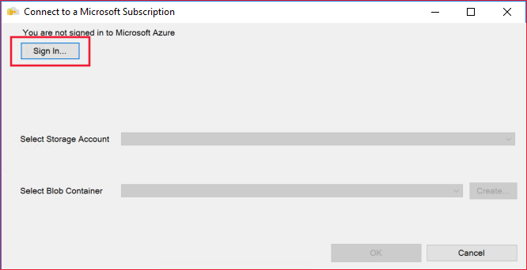
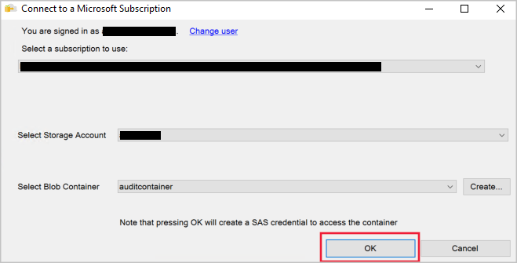
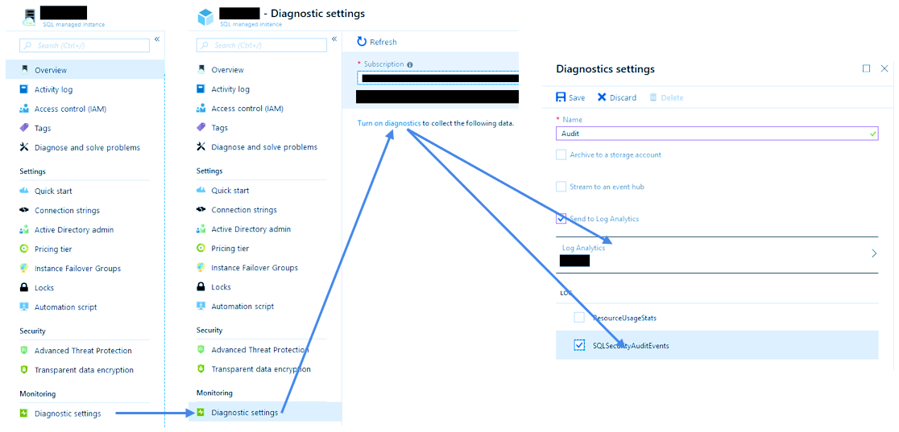

# Get started with Azure SQL Database managed instance auditing

[Managed instance](sql-database-managed-instance.md) auditing tracks database events and writes them to an audit log in your Azure storage account. Auditing also:

- Helps you maintain regulatory compliance, understand database activity, and gain insight into discrepancies and anomalies that could indicate business concerns or suspected security violations.
- Enables and facilitates adherence to compliance standards, although it doesn't guarantee compliance. For more information about Azure programs that support standards compliance, see the [Azure Trust Center](https://azure.microsoft.com/support/trust-center/compliance/) where you can find the most current list of SQL Database compliance certifications.

## Set up auditing for your server to Azure storage

The following section describes the configuration of auditing on your managed instance.

1. Go to the [Azure portal](https://portal.azure.com).
1. Create an Azure Storage **container** where audit logs are stored.

   1. Navigate to the Azure Storage where you would like to store your audit logs.

      > [!IMPORTANT]
      > Use a storage account in the same region as the managed instance to avoid cross-region reads/writes.

   1. In the storage account, go to **Overview** and click **Blobs**.

      

   1. In the top menu, click **+ Container** to create a new container.

      

   1. Provide a container **Name**, set Public access level to **Private**, and then click **OK**.

      

1. After creating the container for the Audit logs there are two ways to configure it as the target for the audit logs: [using T-SQL](#blobtsql) or [using the SQL Server Management Studio (SSMS) UI](#blobssms):

   - <a id="blobtsql"></a>Configure blog storage for audit logs using T-SQL:

     1. In the containers list, click the newly created container and then click **Container properties**.

        

     1. Copy the container URL by clicking the copy icon and save the URL (for example, in Notepad) for future use. The container URL format should be `https://<StorageName>.blob.core.windows.net/<ContainerName>`

        

     1. Generate an Azure Storage **SAS Token** to grant managed instance auditing access rights to the storage account:

        - Navigate to the Azure Storage account where you created the container in the previous step.

        - Click on **Shared access signature** in the Storage Settings menu.

          

        - Configure the SAS as follows:

          - **Allowed services**: Blob

          - **Start date**: to avoid time zone-related issues, it is recommended to use yesterday’s date

          - **End date**: choose the date on which this SAS Token expires

            > [!NOTE]
            > Renew the token upon expiry to avoid audit failures.

          - Click **Generate SAS**.
            
            

        - After clicking on Generate SAS, the SAS Token appears at the bottom. Copy the token by clicking on the copy icon, and save it (for example, in Notepad) for future use.

          

          > [!IMPORTANT]
          > Remove the question mark (“?”) character from the beginning of the token.

     1. Connect to your managed instance via SQL Server Management Studio (SSMS) or any other supported tool.

     1. Execute the following T-SQL statement to **create a new Credential** using the Container URL and SAS Token that you created in the previous steps:

        ```SQL
        CREATE CREDENTIAL [<container_url>]
        WITH IDENTITY='SHARED ACCESS SIGNATURE',
        SECRET = '<SAS KEY>'
        GO
        ```

     1. Execute the following T-SQL statement to create a new Server Audit (choose your own audit name, use the Container URL that you created in the previous steps). If not specified, `RETENTION_DAYS` default is 0 (unlimited retention):

        ```SQL
        CREATE SERVER AUDIT [<your_audit_name>]
        TO URL ( PATH ='<container_url>' [, RETENTION_DAYS =  integer ])
        GO
        ```

        1. Continue by [creating a Server Audit Specification or Database Audit Specification](#createspec)

   - <a id="blobssms"></a>Configure blob storage for audit logs using the SQL Server Management Studio (SSMS) 18 (Preview):

     1. Connect to the managed instance using SQL Server Management Studio (SSMS) UI.

     1. Expand the root note of the Object Explorer.

     1. Expand the **Security** node, right-click on the **Audits** node, and click on "New Audit":

        

     1. Make sure "URL" is selected in **Audit destination** and click on **Browse**:

        

     1. (Optional) Sign in to your Azure account:

        

     1. Select a subscription, storage account, and Blob container from the dropdowns, or create your own container by clicking on **Create**. Once you have finished click **OK**:

        

     1. Click **OK** in the "Create Audit" dialog.

1. <a id="createspec"></a>After configuring the Blob container as target for the audit logs, create a Server Audit Specification or Database Audit Specification as you would for SQL Server:

   - [Create Server audit specification T-SQL guide](https://docs.microsoft.com/sql/t-sql/statements/create-server-audit-specification-transact-sql)
   - [Create Database audit specification T-SQL guide](https://docs.microsoft.com/sql/t-sql/statements/create-database-audit-specification-transact-sql)

1. Enable the server audit that you created in step 6:

    ```SQL
    ALTER SERVER AUDIT [<your_audit_name>]
    WITH (STATE=ON);
    GO
    ```

For additional information:

- [Auditing differences between single databases, elastic pool,s, and managed instances in Azure SQL Database and databases in SQL Server](#auditing-differences-between-databases-in-azure-sql-database-and-databases-in-sql-server)
- [CREATE SERVER AUDIT](https://docs.microsoft.com/sql/t-sql/statements/create-server-audit-transact-sql)
- [ALTER SERVER AUDIT](https://docs.microsoft.com/sql/t-sql/statements/alter-server-audit-transact-sql)

## Set up auditing for your server to Event Hub or Azure Monitor logs

Audit logs from a managed instance can be  sent to Even Hubs or Azure Monitor logs. This section describes how to configure this:

1. Navigate in the [Azure Portal](https://portal.azure.com/) to the managed instance.

2. Click on **Diagnostic settings**.

3. Click on **Turn on diagnostics**. If diagnostics is already enabled the *+Add diagnostic setting* will show instead.

4. Select **SQLSecurityAuditEvents** in the list of logs.

5. Select a destination for the audit events - Event Hub, Azure Monitor logs, or  both. Configure for each target the required parameters (e.g. Log Analytics workspace).

6. Click **Save**.

    

7. Connect to the managed instance using **SQL Server Management Studio (SSMS)** or any other supported client.

8. Execute the following T-SQL statement to create a server audit:

    ```SQL
    CREATE SERVER AUDIT [<your_audit_name>] TO EXTERNAL_MONITOR;
    GO
    ```

9. Create a server audit specification or database audit specification as you would for SQL Server:

   - [Create Server audit specification T-SQL guide](https://docs.microsoft.com/sql/t-sql/statements/create-server-audit-specification-transact-sql)
   - [Create Database audit specification T-SQL guide](https://docs.microsoft.com/sql/t-sql/statements/create-database-audit-specification-transact-sql)

10. Enable the server audit created in step 8:
 
    ```SQL
    ALTER SERVER AUDIT [<your_audit_name>] WITH (STATE=ON);
    GO
    ```

## Consume audit logs

### Consume logs stored in Azure Storage

There are several methods you can use to view blob auditing logs.

- Use the system function `sys.fn_get_audit_file` (T-SQL) to return the audit log data in tabular format. For more information on using this function, see the [sys.fn_get_audit_file documentation](https://docs.microsoft.com/sql/relational-databases/system-functions/sys-fn-get-audit-file-transact-sql).

- You can explore audit logs by using a tool such as [Azure Storage Explorer](https://azure.microsoft.com/features/storage-explorer/). In Azure storage, auditing logs are saved as a collection of blob files within a container that was defined to store the audit logs. For further details about the hierarchy of the storage folder, naming conventions, and log format, see the [Blob Audit Log Format Reference](https://go.microsoft.com/fwlink/?linkid=829599).

- For a full list of audit log consumption methods, refer to the [Get started with SQL database auditing](sql-database-auditing.md).

### Consume logs stored in Event Hub

To consume audit logs data from Event Hub, you will need to set up a stream to consume events and write them to a target. For more information, see Azure Event Hubs Documentation.

### Consume and Analyze logs stored in Azure Monitor logs

If audit logs are written to Azure Monitor logs, they are available in the Log Analytics workspace, where you can run advanced searches on the audit data. As a starting point, navigate to the Log Analytics workspace and under *General* section click *Logs* and enter a simple query, such as: `search "SQLSecurityAuditEvents"` to view the audit logs.  

Azure Monitor logs gives you real-time operational insights using integrated search and custom dashboards to readily analyze millions of records across all your workloads and servers. For additional useful information about Azure Monitor logs search language and commands, see [Azure Monitor logs search reference](https://docs.microsoft.com/azure/azure-monitor/log-query/log-query-overview).

[!INCLUDE [azure-monitor-log-analytics-rebrand](../../includes/azure-monitor-log-analytics-rebrand.md)]

## Auditing differences between databases in Azure SQL Database and databases in SQL Server

The key differences between auditing in databases in Azure SQL Database and databases in SQL Server are:

- With the managed instance deployment option in Azure SQL Database, auditing works at the server level and stores `.xel` log files in Azure Blob storage.
- With the single database and elastic pool deployment options in Azure SQL Database, auditing works at the database level.
- In SQL Server on-premises / virtual machines, audit works at the server level, but stores events on files system/windows event logs.

XEvent auditing in managed instance supports Azure Blob storage targets. File and windows logs are **not supported**.

The key differences in the `CREATE AUDIT` syntax for auditing to Azure Blob storage are:

- A new syntax `TO URL` is provided and enables you to specify URL of the Azure blob Storage container where the `.xel` files are placed.
- A new syntax `TO EXTERNAL MONITOR` is provided to enable Even Hub and Azure Monitor logs targets.
- The syntax `TO FILE` is **not supported** because SQL Database cannot access Windows file shares.
- Shutdown option is **not supported**.
- `queue_delay` of 0 is **not supported**.

## Next steps

- For a full list of audit log consumption methods, refer to the [Get started with SQL database auditing](sql-database-auditing.md).
- For more information about Azure programs that support standards compliance, see the [Azure Trust Center](https://azure.microsoft.com/support/trust-center/compliance/) where you can find the most current list of SQL Database compliance certifications.

<!--Image references-->


