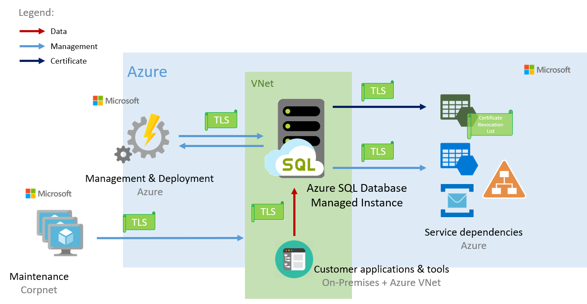
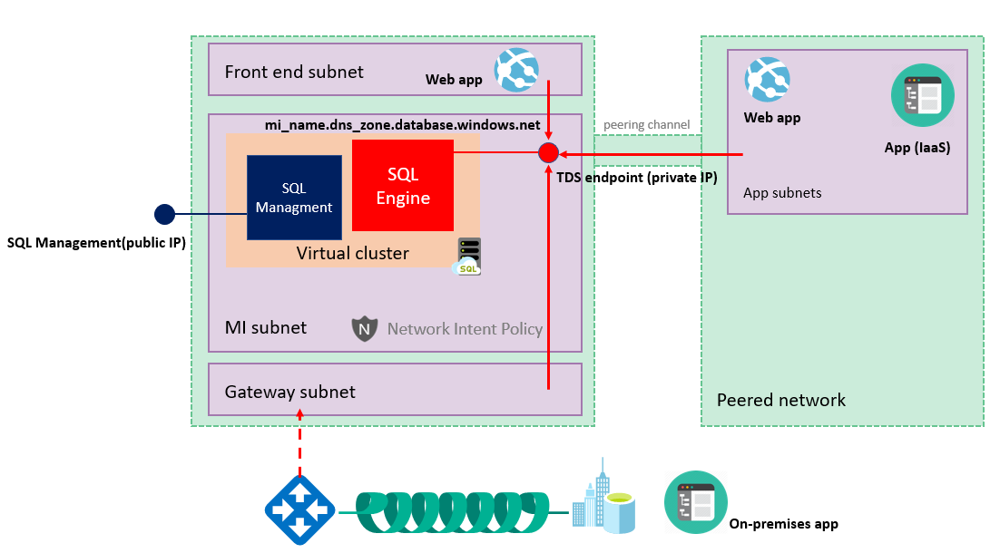
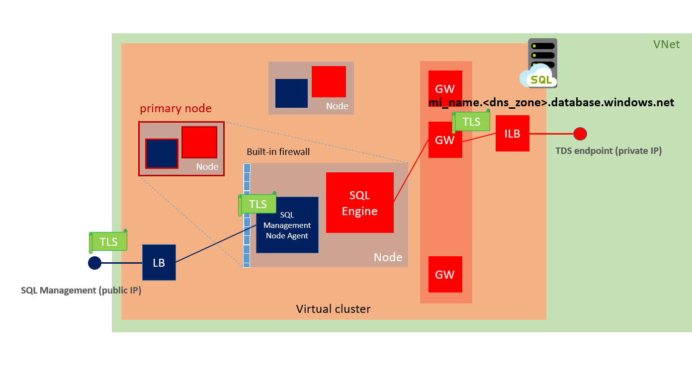

# Azure SQL Database Managed Instance Connectivity Architecture

This article provides the Azure SQL Database Managed Instance communication overview and explains connectivity architecture as well as how the different components function to direct traffic to the Managed Instance.  

## Communication overview

The following diagram shows entities that connect to Managed Instance as well as resources that Managed Instance has to reach out in order to function properly.

Communication that is depicted on the bottom of the diagram represents customer applications and tools connecting to Managed Instance as data source.  

As Managed Instance is platform-as-a-services (PaaS) offering, Microsoft manages this service using automated agents (management, deployment, and maintenance) based on telemetry data streams. As Managed Instance management is solely Microsoft responsibility, customers are not able to access Managed Instance virtual cluster machines through RDP.

Some SQL Server operations initiated by the end users or applications may require Managed Instance to interact with the platform. One case is the creation of a Managed Instance database - a resource that is exposed through the portal, PowerShell, and Azure CLI.

Managed Instance depends on other Azure Services for its proper functioning (such as Azure Storage for backups, Azure Service Bus for telemetry, Azure AD for authentication, Azure Key Vault for TDE, and so forth) and initiates connections to them accordingly.

All communications, stated above, are encrypted and signed using certificates. To make sure that communicating parties are trusted, Managed Instance constantly verifies these certificates by contacting Certificate Authority. If the certificates are revoked or Managed Instance could not verify them, it closes the connections to protect the data.

## High-level connectivity architecture

At a high level, Managed Instance is a set of service components, hosted on a dedicated set of isolated virtual machines that run inside the customer virtual network subnet and form a virtual cluster.

Multiple Managed Instances could be hosted in single virtual cluster. The cluster is automatically expanded or contracted if needed when the customer changes the number of provisioned instances in the subnet.

Customer applications could connect to Managed Instance, query and update databases only if they run inside the virtual network or peered virtual network or VPN / Express Route connected network using endpoint with private IP address.  

Microsoft management and deployment services run outside of the virtual network so connection between Managed Instance and Microsoft services goes over the endpoints with public IP addresses. When Managed Instance creates outbound connection, on receiving end it looks like it’s coming from this public IP due to Network Address Translation (NAT).

Management traffic flows through the customer virtual network. That means that elements of virtual network infrastructure affect and could potentially harm management traffic causing instance to enter faulty state and become unavailable.

> [!IMPORTANT]
> To improve customer experience and service availability, Microsoft applies Network Intent Policy on Azure virtual network infrastructure elements that could affect Managed Instance functioning. This is a platform mechanism to communicate transparently networking requirements to end users, with main goal to prevent network misconfiguration and ensure normal Managed Instance operations. Upon Managed Instance deletion Network Intent Policy is removed as well.

## Virtual cluster connectivity architecture

Let’s take a deeper dive in Managed Instance connectivity architecture. The following diagram shows the conceptual layout of the virtual cluster.

Clients connect to Managed Instance using the host name that has a form `<mi_name>.<dns_zone>.database.windows.net`. This host name resolves to private IP address although it is registered in public DNS zone and is publicly resolvable. The `zone-id` is automatically generated when the cluster is created. If a newly created cluster is hosting a secondary managed instance, it shares its zone id with the primary cluster. For more information, see [Auto-failover groups](sql-database-auto-failover-group.md##enabling-geo-replication-between-managed-instances-and-their-vnets)

This private IP address belongs to the Managed Instance Internal Load Balancer (ILB) that directs traffic to the Managed Instance Gateway (GW). As multiple Managed Instances could potentially run inside the same cluster, GW uses Managed Instance host name to redirect traffic to the correct SQL Engine service.

Management and deployment services connect to Managed Instance using [management endpoint](sql-database-managed-instance-management-endpoint.md) that maps to external load balancer. Traffic is routed to the nodes only if received on a predefined set of ports that are used exclusively by Managed Instance management components. Built-in firewall on the nodes is configured to allow traffic only from Microsoft specific IP ranges. All communication between management components and management plane is mutually certificate authenticated.

## Next steps

- For an overview, see [What is a Managed Instance](sql-database-managed-instance.md)
- For more information about VNet configuration, see [Managed Instance VNet Configuration](sql-database-managed-instance-vnet-configuration.md).
- For a quickstart see how to create Managed Instance:
  - From the [Azure portal](sql-database-managed-instance-get-started.md)
  - Using [PowerShell](https://blogs.msdn.microsoft.com/sqlserverstorageengine/2018/06/27/quick-start-script-create-azure-sql-managed-instance-using-powershell/)
  - using [Azure Resource Manager template](https://azure.microsoft.com/resources/templates/101-sqlmi-new-vnet/)
  - using [Azure Resource Manager template (jumpbox with SSMS included)](https://portal.azure.com/)
