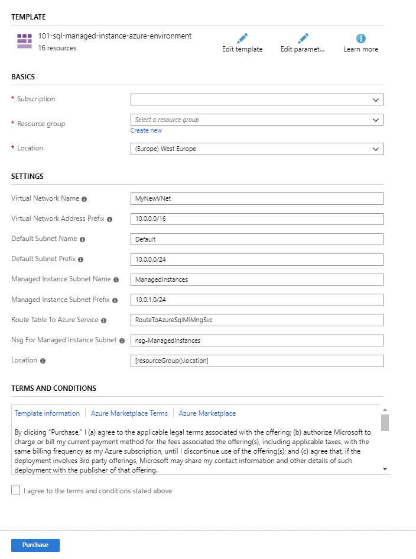

# Create a virtual network for Azure SQL Database Managed Instance

This article explains how to create a valid virtual network and subnet where you can deploy Azure SQL Database Managed Instance.

Azure SQL Database Managed Instance must be deployed within an Azure [virtual network](../virtual-network/virtual-networks-overview.md). This deployment enables the following scenarios:

- Secure private IP address
- Connecting to a Managed Instance directly from an on-premises network
- Connecting a Managed Instance to linked server or another on-premises data store
- Connecting a Managed Instance to Azure resources  

> [!Note]
> You should [determine the size of the subnet for Managed Instance](sql-database-managed-instance-determine-size-vnet-subnet.md) before you deploy the first instance. You can't resize the subnet after you put the resources inside.
>
> If you plan to use an existing virtual network, you need to modify that network configuration to accommodate your Managed Instance. For more information, see [Modify an existing virtual network for Managed Instance](sql-database-managed-instance-configure-vnet-subnet.md).

## Create a virtual network

The easiest way to create and configure a virtual network is to use an Azure Resource Manager deployment template.

1. Sign in to the Azure portal.

2. Select the **Deploy to Azure** button:

   

   This button opens a form that you can use to configure the network environment where you can deploy Managed Instance.

   > [!Note]
   > This Azure Resource Manager template will deploy a virtual network with two subnets. One subnet, called **ManagedInstances**, is reserved for Managed Instance and has a preconfigured route table. The other subnet, called **Default**, is used for other resources that should access Managed Instance (for example, Azure Virtual Machines).

3. Configure the network environment. On the following form, you can configure parameters of your network environment:

   

   You might change the names of the virtual network and subnets, and adjust the IP ranges associated with your networking resources. After you select the **Purchase** button, this form will create and configure your environment. If you don't need two subnets, you can delete the default one.

## Next steps

- For an overview, see [What is a Managed Instance?](sql-database-managed-instance.md).
- Learn about [connectivity architecture in Managed Instance](sql-database-managed-instance-connectivity-architecture.md).
- Learn how to [modify an existing virtual network for Managed Instance](sql-database-managed-instance-configure-vnet-subnet.md).
- For a tutorial that shows how to create a virtual network, create a Managed Instance, and restore a database from a database backup, see [Create an Azure SQL Database Managed Instance](sql-database-managed-instance-get-started.md).
- For DNS issues, see [Configuring a custom DNS](sql-database-managed-instance-custom-dns.md).
