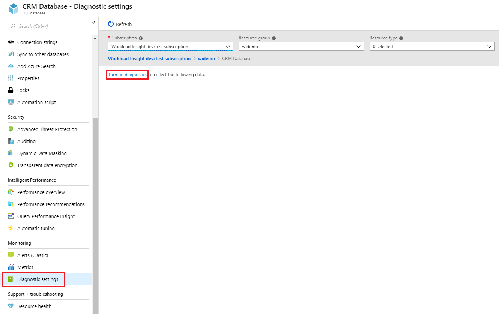
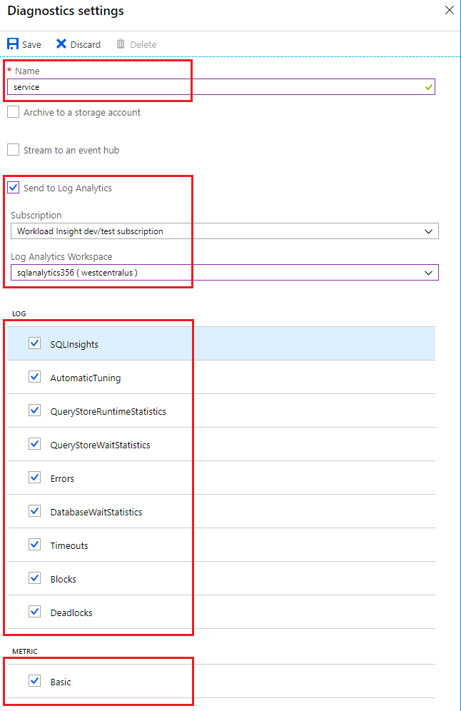
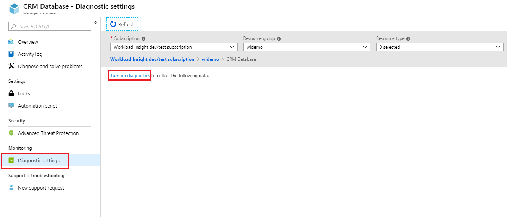
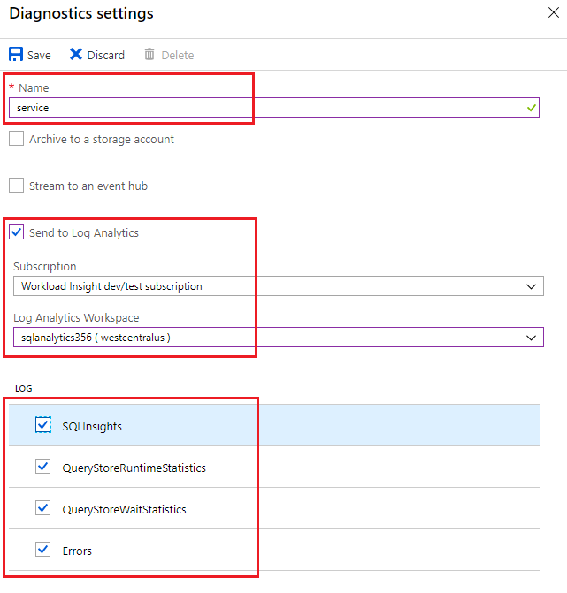
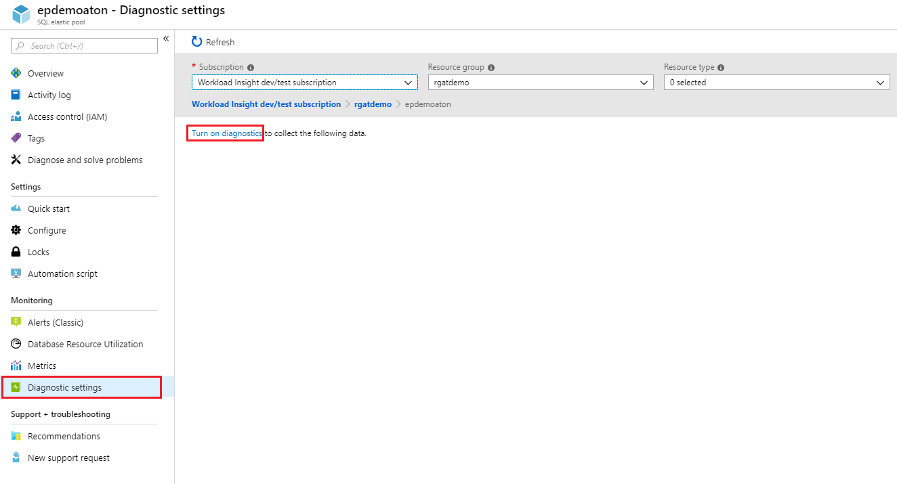
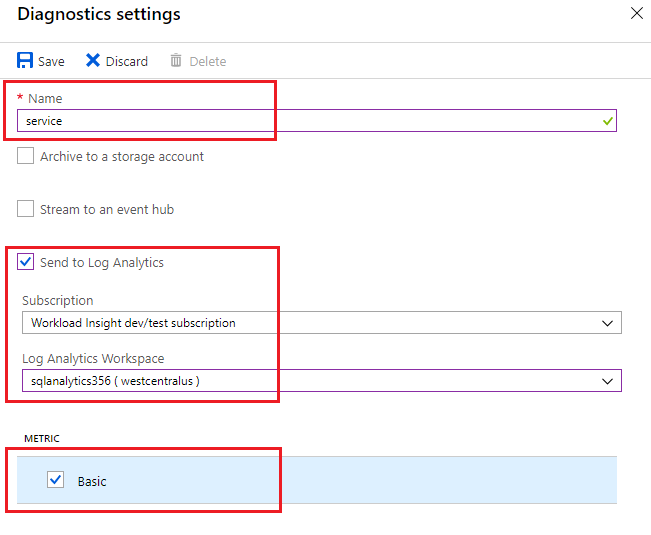
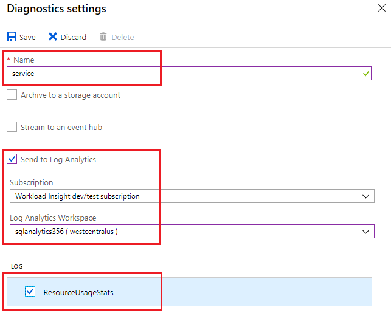

# Azure SQL Database metrics and diagnostics logging

Azure SQL Database, elastic pools, Managed Instance, and databases in Managed Instance can stream metrics and diagnostics logs for easier performance monitoring. You can configure a database to transmit resource usage, workers and sessions, and connectivity to one of the following Azure resources:

- **Azure SQL Analytics**: to get intelligent monitoring of your Azure databases that includes performance reports, alerts, and mitigation recommendations.
- **Azure Event Hubs**: to integrate SQL Database telemetry with your custom monitoring solutions or hot pipelines.
- **Azure Storage**: to archive vast amounts of telemetry for a fraction of the price.

    

For more information about the metrics and log categories supported by the various Azure services, see:

- [Overview of metrics in Microsoft Azure](../monitoring-and-diagnostics/monitoring-overview-metrics.md)
- [Overview of Azure diagnostics logs](../azure-monitor/platform/diagnostic-logs-overview.md)

This article provides guidance to help you enable diagnostics telemetry for databases, elastic pools, and Managed Instance. It also can help you understand how to configure Azure SQL Analytics as a monitoring tool for viewing database diagnostics telemetry.

## Enable logging of diagnostics telemetry

You can enable and manage metrics and diagnostics telemetry logging by using one of the following methods:

- Azure portal
- PowerShell
- Azure CLI
- Azure Monitor REST API
- Azure Resource Manager template

When you enable metrics and diagnostics logging, you need to specify the Azure resource destination for collecting the diagnotics telemetry. Available options include:

- Azure SQL Analytics
- Azure Event Hubs
- Azure Storage

You can provision a new Azure resource or select an existing resource. After you choose a resource by using the **Diagnostic settings** option, specify which data to collect.

> [!NOTE]
> If you are also using elastic pools or Managed Instance, we recommend that you enable diagnostics telemetry for these resources as well. Database containers in elastic pools and Managed Instance have their own separate diagnostics telemetry.

## Enable logging for Azure SQL Database or databases in Managed Instance

Enable the metrics and diagnostics logging on SQL Database and on databases in Managed Instance; they're not enabled by default.

You can set up Azure SQL Databases and databases in Managed Instance to collect the following diagnostics telemetry:

| Monitoring telemetry for databases | Azure SQL Database support | Database in Managed Instance support |
| :------------------- | ------------------- | ------------------- |
| [All metrics](sql-database-metrics-diag-logging.md#all-metrics): Contains DTU/CPU percentage, DTU/CPU limit, physical data read percentage, log write percentage, Successful/Failed/Blocked by firewall connections, sessions percentage, workers percentage, storage, storage percentage, and XTP storage percentage. | Yes | No |
| [QueryStoreRuntimeStatistics](sql-database-metrics-diag-logging.md#query-store-runtime-statistics): Contains information about the query runtime statistics such as CPU usage and query duration statistics. | Yes | Yes |
| [QueryStoreWaitStatistics](sql-database-metrics-diag-logging.md#query-store-wait-statistics): Contains information about the query wait statistics (what your queries waited on) such as CPU, LOG, and LOCKING. | Yes | Yes |
| [Errors](sql-database-metrics-diag-logging.md#errors-dataset): Contains information about SQL errors on the database. | Yes | Yes |
| [DatabaseWaitStatistics](sql-database-metrics-diag-logging.md#database-wait-statistics-dataset): Contains information about how much time the database spent waiting on different wait types. | Yes | No |
| [Timeouts](sql-database-metrics-diag-logging.md#time-outs-dataset): Contains information about timeouts on the database. | Yes | No |
| [Blocks](sql-database-metrics-diag-logging.md#blockings-dataset): Contains information about blocking events on the database. | Yes | No |
| [SQLInsights](sql-database-metrics-diag-logging.md#intelligent-insights-dataset): Contains Intelligent Insights into performance. To learn more, see [Intelligent Insights](sql-database-intelligent-insights.md). | Yes | Yes |

### Azure portal

You use the **Diagnostics settings** menu for each of databases in the Azure portal to configure the streaming of diagnostics telemetry for Azure SQL Databases and databases in Managed Instance. You can set the following destinations: Azure Storage, Azure Event Hubs, and Azure Log Analytics.

### Configure streaming of diagnostics telemetry for Azure SQL Database

   

To enable streaming of diagnostics telemetry for Azure SQL Database, follow these steps:

1. Go to your Azure SQL Database resource.
1. Select **Diagnostics settings**.
1. Select **Turn on diagnostics** if no previous settings exist, or select **Edit setting** to edit a previous setting.
   - You can create up to three parallel connections to stream diagnostics telemetry.
   - Select **+Add diagnostic setting** to configure parallel streaming of diagnostics data to multiple resources.

   
1. Enter a setting name for your own reference.
1. Select a destination resource for the streaming diagnostics data: **Archive to storage account**, **Stream to an event hub**, or **Send to Log Analytics**.
1. For the standard, event-based monitoring experience, select the following check boxes for database diagnostics log telemetry: **SQLInsights**, **AutomaticTuning**, **QueryStoreRuntimeStatistics**, **QueryStoreWaitStatistics**, **Errors**, **DatabaseWaitStatistics**, **Timeouts**, **Blocks**, and **Deadlocks**.
1. For an advanced, one-minute-based monitoring experience, select the check box for **AllMetrics**.
1. Select **Save**.

   

> [!NOTE]
> Security audit logs can't be enabled from the database diagnostics settings. To enable audit log streaming, see [Set up auditing for your database](sql-database-auditing.md#subheading-2), and [SQL Audit logs in Azure Log Analytics and Azure Event Hubs](https://blogs.msdn.microsoft.com/sqlsecurity/2018/09/13/sql-audit-logs-in-azure-log-analytics-and-azure-event-hubs/).
> [!TIP]
> Repeat these steps for each Azure SQL Database you want to monitor.

### Configure streaming of diagnostics telemetry for databases in Managed Instance

   

To enable streaming of diagnostics telemetry for databases in Managed Instance, follow these steps:

1. Go to your database in Managed Instance.
2. Select **Diagnostics settings**.
3. Select **Turn on diagnostics** if no previous settings exist, or select **Edit setting** to edit a previous setting.
   - You can create up to three (3) parallel connections to stream diagnostics telemetry.
   - Select **+Add diagnostic setting** to configure parallel streaming of diagnostics data to multiple resources.

   

4. Enter a setting name for your own reference.
5. Select a destination resource for the streaming diagnostics data: **Archive to storage account**, **Stream to an event hub**, or **Send to Log Analytics**.
6. Select the check boxes for database diagnostics telemetry: **SQLInsights**, **QueryStoreRuntimeStatistics**, **QueryStoreWaitStatistics** and **Errors**.
7. Select **Save**.

   

> [!TIP]
> Repeat these steps for each database in the Managed Instance you want to monitor.

## Enable logging for elastic pools or Managed Instance

Enable diagnostic telemetry for elastic pools and Managed Instance as database containers. They have their own diagnostics telemetry that isn't enabled by default.

### Configure streaming of diagnostics telemetry for elastic pools

   

You can set up an elastic pool resource to collect the following diagnostics telemetry:

| Resource | Monitoring telemetry |
| :------------------- | ------------------- |
| **Elastic pool** | [All metrics](sql-database-metrics-diag-logging.md#all-metrics) contains eDTU/CPU percentage, eDTU/CPU limit, physical data read percentage, log write percentage, sessions percentage, workers percentage, storage, storage percentage, storage limit, and XTP storage percentage. |

To enable streaming of diagnostics telemetry for an elastic pool resource, follow these steps:

1. Go to the elastic pool resource in Azure portal.
1. Select **Diagnostics settings**.
1. Select **Turn on diagnostics** if no previous settings exist, or select **Edit setting** to edit a previous setting.

   

1. Enter a setting name for your own reference.
1. Select a destination resource for the streaming diagnostics data: **Archive to storage account**, **Stream to an event hub**, or **Send to Log Analytics**.
1. For Log Analytics, select **Configure** and create a new workspace by selecting **+Create New Workspace**, or select an existing workspace.
1. Select the check box for elastic pool diagnostics telemetry: **AllMetrics**.
1. Select **Save**.

   

> [!TIP]
> Repeat these steps for each elastic pool you want to monitor.

### Configure streaming of diagnostics telemetry for Managed Instance

   

You can set up a Managed Instance resource to collect the following diagnostics telemetry:

| Resource | Monitoring telemetry |
| :------------------- | ------------------- |
| **Managed Instance** | [ResourceUsageStats](sql-database-metrics-diag-logging.md#logs-for-managed-instance) contains vCores count, average CPU percentage, IO requests, bytes read/written, reserved storage space, and used storage space. |

To enable streaming of diagnostics telemetry for a Managed Instance resource, follow these steps:

1. Go to the Managed Instance resource in Azure portal.
1. Select **Diagnostics settings**.
1. Select **Turn on diagnostics** if no previous settings exist, or select **Edit setting** to edit a previous setting.

   

1. Enter a setting name for your own reference.
1. Select a destination resource for the streaming diagnostics data: **Archive to storage account**, **Stream to an event hub**, or **Send to Log Analytics**.
1. For Log Analytics, select **Configure** and create a new workspace by selecting **+Create New Workspace**, or use an existing workspace.
1. Select the check box for instance diagnostics telemetry: **ResourceUsageStats**.
1. Select **Save**.

   

> [!TIP]
> Repeat these steps for each Managed Instance you wish to monitor.

### PowerShell

You can enable metrics and diagnostics logging by using PowerShell.

- To enable storage of diagnostics logs in a storage account, use this command:

   ```powershell
   Set-AzureRmDiagnosticSetting -ResourceId [your resource id] -StorageAccountId [your storage account id] -Enabled $true
   ```

   The storage account ID is the resource ID for the destination storage account.

- To enable streaming of diagnostics logs to an event hub, use this command:

   ```powershell
   Set-AzureRmDiagnosticSetting -ResourceId [your resource id] -ServiceBusRuleId [your service bus rule id] -Enabled $true
   ```

   The Azure Service Bus rule ID is a string with this format:

   ```powershell
   {service bus resource ID}/authorizationrules/{key name}
   ```

- To enable sending diagnostics logs to a Log Analytics workspace, use this command:

   ```powershell
   Set-AzureRmDiagnosticSetting -ResourceId [your resource id] -WorkspaceId [resource id of the log analytics workspace] -Enabled $true
   ```

- You can obtain the resource ID of your Log Analytics workspace by using the following command:

   ```powershell
   (Get-AzureRmOperationalInsightsWorkspace).ResourceId
   ```

You can combine these parameters to enable multiple output options.

### To configure multiple Azure resources

To support multiple subscriptions, use the PowerShell script from [Enable Azure resource metrics logging using PowerShell](https://blogs.technet.microsoft.com/msoms/2017/01/17/enable-azure-resource-metrics-logging-using-powershell/).

Provide the workspace resource ID \<$WSID\> as a parameter when executing the script `Enable-AzureRMDiagnostics.ps1` to send diagnostic data from multiple resources to the workspace.

- To get the workspace ID \<$WSID\> of the destination for your diagnostic data, use the following script:

    ```powershell
    PS C:\> $WSID = "/subscriptions/<subID>/resourcegroups/<RG_NAME>/providers/microsoft.operationalinsights/workspaces/<WS_NAME>"
    PS C:\> .\Enable-AzureRMDiagnostics.ps1 -WSID $WSID
    ```
   Replace \<subID\> with the subscription ID, \<RG_NAME\> with the resource group name, and \<WS_NAME\> with the workspace name.

### Azure CLI

You can enable metrics and diagnostics logging by using the Azure CLI.

- To enable the storage of diagnostics logs in a storage account, use this command:

   ```azurecli-interactive
   azure insights diagnostic set --resourceId <resourceId> --storageId <storageAccountId> --enabled true
   ```

   The storage account ID is the resource ID for the destination storage account.

- To enable the streaming of diagnostics logs to an event hub, use this command:

   ```azurecli-interactive
   azure insights diagnostic set --resourceId <resourceId> --serviceBusRuleId <serviceBusRuleId> --enabled true
   ```

   The Service Bus rule ID is a string with this format:

   ```azurecli-interactive
   {service bus resource ID}/authorizationrules/{key name}
   ```

- To enable the sending of diagnostics logs to a Log Analytics workspace, use this command:

   ```azurecli-interactive
   azure insights diagnostic set --resourceId <resourceId> --workspaceId <resource id of the log analytics workspace> --enabled true
   ```

You can combine these parameters to enable multiple output options.

### REST API

Read about how to [change diagnostics settings by using the Azure Monitor REST API](https://docs.microsoft.com/rest/api/monitor/diagnosticsettings).

### Resource Manager template

Read about how to [enable diagnostics settings at resource creation by using a Resource Manager template](../azure-monitor/platform/diagnostic-logs-stream-template.md).

## Stream into Azure SQL Analytics

Azure SQL Analytics is a cloud solution that monitors the performance of Azure SQL databases, elastic pools, and Managed Instance at scale and across multiple subscriptions. It can help you collect and visualize Azure SQL Database performance metrics, and it has built-in intelligence for performance troubleshooting.


SQL Database metrics and diagnostics logs can be streamed into Azure SQL Analytics by using the built-in **Send to Log Analytics** option in the diagnostics settings tab in the portal. You can also enable Log Analytics by using a diagnostics setting via PowerShell cmdlets, the Azure CLI, or the Azure Monitor REST API.

### Installation overview

You can monitor a SQL Database fleet with Azure SQL Analytics. Perform the following  steps:

1. Create an Azure SQL Analytics solution from the Azure Marketplace.
2. Create a monitoring workspace in the solution.
3. Configure databases to stream diagnostics telemetry into the workspace.

If you're using elastic pools or Managed Instance, you also need to configure  diagnostics telemetry streaming from these resources.

### Create Azure SQL Analytics resource

1. Search for Azure SQL Analytics in Azure Marketplace and select it.

   

2. Select **Create** on the solution's overview screen.

3. Fill in the Azure SQL Analytics form with the additional information that is required: workspace name, subscription, resource group, location, and pricing tier.

   

4. Select **OK** to confirm, and then select **Create**.

### Configure databases to record metrics and diagnostics logs

The easiest way to configure where databases record metric is by using the Azure portal. As previously described, go to your SQL Database resource in the Azure portal and select **Diagnostics settings**.

If you're using elastic pools or Managed Instance, you also need to configure diagnostics settings in these resources to enable the diagnostics telemetry to stream into the workspace.

### Use the SQL Analytics solution

You can use SQL Analytics as a hierarchical dashboard to view your SQL Database resources. To learn how to use the SQL Analytics solution, see [Monitor SQL Database by using the SQL Analytics solution](../log-analytics/log-analytics-azure-sql.md).

## Stream into Event Hubs

You can stream SQL Database metrics and diagnostics logs into Event Hubs by using the built-in **Stream to an event hub** option in the Azure portal. You also can enable the Service Bus rule ID by using a diagnostics setting via PowerShell cmdlets, the Azure CLI, or the Azure Monitor REST API.

### What to do with metrics and diagnostics logs in Event Hubs

After the selected data is streamed into Event Hubs, you're one step closer to enabling advanced monitoring scenarios. Event Hubs acts as the front door for an event pipeline. After data is collected into an event hub, it can be transformed and stored by using a real-time analytics provider or a storage adapter. Event Hubs decouples the production of a stream of events from the consumption of those events. In this way, event consumers can access the events on their own schedule. For more information on Event Hubs, see:

- [What are Azure Event Hubs?](../event-hubs/event-hubs-what-is-event-hubs.md)
- [Get started with Event Hubs](../event-hubs/event-hubs-csharp-ephcs-getstarted.md)

You can use streamed metrics in Event Hubs to:

- **View service health by streaming hot-path data to Power BI**. By using Event Hubs, Stream Analytics, and Power BI, you can easily transform your metrics and diagnostics data into near real-time insights on your Azure services. For an overview of how to set up an event hub, process data with Stream Analytics, and use Power BI as an output, see [Stream Analytics and Power BI](../stream-analytics/stream-analytics-power-bi-dashboard.md).

- **Stream logs to third-party logging and telemetry streams**. By using Event Hubs streaming, you can get your metrics and diagnostics logs into various third-party monitoring and log analytics solutions.

- **Build a custom telemetry and logging platform**. Do you already have a custom-built telemetry platform or are considering building one? The highly scalable publish-subscribe nature of Event Hubs allows you to flexibly ingest diagnostics logs. See [Dan Rosanova's guide to using Event Hubs in a global-scale telemetry platform](https://azure.microsoft.com/documentation/videos/build-2015-designing-and-sizing-a-global-scale-telemetry-platform-on-azure-event-Hubs/).

## Stream into Storage

You can store SQL Database metrics and diagnostics logs in Azure Storage by using the built-in **Archive to a storage account** option in the Azure portal. You  can also enable Storage by using a diagnostics setting via PowerShell cmdlets, the Azure CLI, or the Azure Monitor REST API.

### Schema of metrics and diagnostics logs in the storage account

After you set up metrics and diagnostics logs collection, a storage container is created in the storage account you selected when the first rows of data are available. The structure of the blobs is:

```powershell
insights-{metrics|logs}-{category name}/resourceId=/SUBSCRIPTIONS/{subscription ID}/ RESOURCEGROUPS/{resource group name}/PROVIDERS/Microsoft.SQL/servers/{resource_server}/ databases/{database_name}/y={four-digit numeric year}/m={two-digit numeric month}/d={two-digit numeric day}/h={two-digit 24-hour clock hour}/m=00/PT1H.json
```

Or, more simply:

```powershell
insights-{metrics|logs}-{category name}/resourceId=/{resource Id}/y={four-digit numeric year}/m={two-digit numeric month}/d={two-digit numeric day}/h={two-digit 24-hour clock hour}/m=00/PT1H.json
```

For example, a blob name for all metrics might be:

```powershell
insights-metrics-minute/resourceId=/SUBSCRIPTIONS/s1id1234-5679-0123-4567-890123456789/RESOURCEGROUPS/TESTRESOURCEGROUP/PROVIDERS/MICROSOFT.SQL/ servers/Server1/databases/database1/y=2016/m=08/d=22/h=18/m=00/PT1H.json
```

A blob name for storing data from an elastic pool looks like:

```powershell
insights-{metrics|logs}-{category name}/resourceId=/SUBSCRIPTIONS/{subscription ID}/ RESOURCEGROUPS/{resource group name}/PROVIDERS/Microsoft.SQL/servers/{resource_server}/ elasticPools/{elastic_pool_name}/y={four-digit numeric year}/m={two-digit numeric month}/d={two-digit numeric day}/h={two-digit 24-hour clock hour}/m=00/PT1H.json
```

### Download metrics and logs from Storage

Learn how to [download metrics and diagnostics logs from Storage](../storage/blobs/storage-quickstart-blobs-dotnet.md#download-the-sample-application).

## Data retention policy and pricing

If you select Event Hubs or a Storage account, you can specify a retention policy. This policy deletes data that is older than a selected time period. If you specify Log Analytics, the retention policy depends on the selected pricing tier. In this case, the provided free units of data ingestion can enable free monitoring of several databases each month. Any consumption of diagnostics telemetry in excess of the free units might incur costs. Be aware that active databases with heavier workloads ingest more data than idle databases. For more information, see [Log Analytics pricing](https://azure.microsoft.com/pricing/details/monitor/).

If you are using Azure SQL Analytics, you can monitor your data ingestion consumption in the solution by selecting **OMS Workspace** on the navigation menu of Azure SQL Analytics, and then selecting **Usage** and **Estimated Costs**.

## Metrics and logs available

Collected monitoring telemetry can be used for your own _custom analysis_ and _application development_ using [SQL Analytics language](https://docs.microsoft.com/azure/log-analytics/query-language/get-started-queries).

## All metrics

Refer to the following tables for details about all metrics by resource.

### All metrics for elastic pools

|**Resource**|**Metrics**|
|---|---|
|Elastic pool|eDTU percentage, eDTU used, eDTU limit, CPU percentage, physical data read percentage, log write percentage, sessions percentage, workers percentage, storage, storage percentage, storage limit, XTP storage percentage |

### All metrics for Azure SQL Databases

|**Resource**|**Metrics**|
|---|---|
|Azure SQL database|DTU percentage, DTU used, DTU limit, CPU percentage, physical data read percentage, log write percentage, Successful/Failed/Blocked by firewall connections, sessions percentage, workers percentage, storage, storage percentage, XTP storage percentage, and deadlocks |

## Logs for Managed Instance

Refer to the following table for details about logs for Managed Instance.

### Resource usage statistics

|Property|Description|
|---|---|
|TenantId|Your tenant ID |
|SourceSystem|Always: Azure|
|TimeGenerated [UTC]|Time stamp when the log was recorded |
|Type|Always: AzureDiagnostics |
|ResourceProvider|Name of the resource provider. Always: MICROSOFT.SQL |
|Category|Name of the category. Always: ResourceUsageStats |
|Resource|Name of the resource |
|ResourceType|Name of the resource type. Always: MANAGEDINSTANCES |
|SubscriptionId|Subscription GUID for the database |
|ResourceGroup|Name of the resource group for the database |
|LogicalServerName_s|Name of the Managed Instance |
|ResourceId|Resource URI |
|SKU_s|Managed Instance product SKU |
|virtual_core_count_s|Number of vCores available |
|avg_cpu_percent_s|Average CPU percentage |
|reserved_storage_mb_s|Reserved storage capacity on Managed Instance |
|storage_space_used_mb_s|Used storage on Managed Instance |
|io_requests_s|IOPS count |
|io_bytes_read_s|IOPS bytes read |
|io_bytes_written_s|IOPS bytes written |

## Logs for Azure SQL Databases and Managed Instance databases

Refer to the following tables for details about logs for Azure SQL and Managed Instance databases.

### Query Store runtime statistics

|Property|Description|
|---|---|
|TenantId|Your tenant ID |
|SourceSystem|Always: Azure |
|TimeGenerated [UTC]|Time stamp when the log was recorded |
|Type|Always: AzureDiagnostics |
|ResourceProvider|Name of the resource provider. Always: MICROSOFT.SQL |
|Category|Name of the category. Always: QueryStoreRuntimeStatistics |
|OperationName|Name of the operation. Always: QueryStoreRuntimeStatisticsEvent |
|Resource|Name of the resource |
|ResourceType|Name of the resource type. Always: SERVERS/DATABASES |
|SubscriptionId|Subscription GUID for the database |
|ResourceGroup|Name of the resource group for the database |
|LogicalServerName_s|Name of the server for the database |
|ElasticPoolName_s|Name of the elastic pool for the database, if any |
|DatabaseName_s|Name of the database |
|ResourceId|Resource URI |
|query_hash_s|Query hash |
|query_plan_hash_s|Query plan hash |
|statement_sql_handle_s|Statement sql handle |
|interval_start_time_d|Start datetimeoffset of the interval in number of ticks from 1900-1-1 |
|interval_end_time_d|End datetimeoffset of the interval in number of ticks from 1900-1-1 |
|logical_io_writes_d|Total number of logical IO writes |
|max_logical_io_writes_d|Max number of logical IO writes per execution |
|physical_io_reads_d|Total number of physical IO reads |
|max_physical_io_reads_d|Max number of logical IO reads per execution |
|logical_io_reads_d|Total number of logical IO reads |
|max_logical_io_reads_d|Max number of logical IO reads per execution |
|execution_type_d|Execution type |
|count_executions_d|Number of executions of the query |
|cpu_time_d|Total CPU time consumed by the query in microseconds |
|max_cpu_time_d|Max CPU time consumer by a single execution in microseconds |
|dop_d|Sum of degrees of parallelism |
|max_dop_d|Max degree of parallelism used for single execution |
|rowcount_d|Total number of rows returned |
|max_rowcount_d|Max number of rows returned in single execution |
|query_max_used_memory_d|Total amount of memory used in KB |
|max_query_max_used_memory_d|Max amount of memory used by a single execution in KB |
|duration_d|Total execution time in microseconds |
|max_duration_d|Max execution time of a single execution |
|num_physical_io_reads_d|Total number of physical reads |
|max_num_physical_io_reads_d|Max number of physical reads per execution |
|log_bytes_used_d|Total amount of log bytes used |
|max_log_bytes_used_d|Max amount of log bytes used per execution |
|query_id_d|ID of the query in Query Store |
|plan_id_d|ID of the plan in Query Store |

Learn more about [Query Store runtime statistics data](https://docs.microsoft.com/sql/relational-databases/system-catalog-views/sys-query-store-runtime-stats-transact-sql).

### Query Store wait statistics

|Property|Description|
|---|---|
|TenantId|Your tenant ID |
|SourceSystem|Always: Azure |
|TimeGenerated [UTC]|Time stamp when the log was recorded |
|Type|Always: AzureDiagnostics |
|ResourceProvider|Name of the resource provider. Always: MICROSOFT.SQL |
|Category|Name of the category. Always: QueryStoreWaitStatistics |
|OperationName|Name of the operation. Always: QueryStoreWaitStatisticsEvent |
|Resource|Name of the resource |
|ResourceType|Name of the resource type. Always: SERVERS/DATABASES |
|SubscriptionId|Subscription GUID for the database |
|ResourceGroup|Name of the resource group for the database |
|LogicalServerName_s|Name of the server for the database |
|ElasticPoolName_s|Name of the elastic pool for the database, if any |
|DatabaseName_s|Name of the database |
|ResourceId|Resource URI |
|wait_category_s|Category of the wait |
|is_parameterizable_s|Is the query parameterizable |
|statement_type_s|Type of the statement |
|statement_key_hash_s|Statement key hash |
|exec_type_d|Type of execution |
|total_query_wait_time_ms_d|Total wait time of the query on the specific wait category |
|max_query_wait_time_ms_d|Max wait time of the query in individual execution on the specific wait category |
|query_param_type_d|0 |
|query_hash_s|Query hash in Query Store |
|query_plan_hash_s|Query plan hash in Query Store |
|statement_sql_handle_s|Statement handle in Query Store |
|interval_start_time_d|Start datetimeoffset of the interval in number of ticks from 1900-1-1 |
|interval_end_time_d|End datetimeoffset of the interval in number of ticks from 1900-1-1 |
|count_executions_d|Count of executions of the query |
|query_id_d|ID of the query in Query Store |
|plan_id_d|ID of the plan in Query Store |

Learn more about [Query Store wait statistics data](https://docs.microsoft.com/sql/relational-databases/system-catalog-views/sys-query-store-wait-stats-transact-sql).

### Errors dataset

|Property|Description|
|---|---|
|TenantId|Your tenant ID |
|SourceSystem|Always: Azure |
|TimeGenerated [UTC]|Time stamp when the log was recorded |
|Type|Always: AzureDiagnostics |
|ResourceProvider|Name of the resource provider. Always: MICROSOFT.SQ |
|Category|Name of the category. Always: Errors |
|OperationName|Name of the operation. Always: ErrorEvent |
|Resource|Name of the resource |
|ResourceType|Name of the resource type. Always: SERVERS/DATABASES |
|SubscriptionId|Subscription GUID for the database |
|ResourceGroup|Name of the resource group for the database |
|LogicalServerName_s|Name of the server for the database |
|ElasticPoolName_s|Name of the elastic pool for the database, if any |
|DatabaseName_s|Name of the database |
|ResourceId|Resource URI |
|Message|Error message in plain text |
|user_defined_b|Is the error user defined bit |
|error_number_d|Error code |
|Severity|Severity of the error |
|state_d|State of the error |
|query_hash_s|Query hash of the failed query, if available |
|query_plan_hash_s|Query plan hash of the failed query, if available |

Learn more about [SQL Server error messages](https://msdn.microsoft.com/library/cc645603.aspx).

### Database wait statistics dataset

|Property|Description|
|---|---|
|TenantId|Your tenant ID |
|SourceSystem|Always: Azure |
|TimeGenerated [UTC]|Time stamp when the log was recorded |
|Type|Always: AzureDiagnostics |
|ResourceProvider|Name of the resource provider. Always: MICROSOFT.SQL |
|Category|Name of the category. Always: DatabaseWaitStatistics |
|OperationName|Name of the operation. Always: DatabaseWaitStatisticsEvent |
|Resource|Name of the resource |
|ResourceType|Name of the resource type. Always: SERVERS/DATABASES |
|SubscriptionId|Subscription GUID for the database |
|ResourceGroup|Name of the resource group for the database |
|LogicalServerName_s|Name of the server for the database |
|ElasticPoolName_s|Name of the elastic pool for the database, if any |
|DatabaseName_s|Name of the database |
|ResourceId|Resource URI |
|wait_type_s|Name of the wait type |
|start_utc_date_t [UTC]|Measured period start time |
|end_utc_date_t [UTC]|Measured period end time |
|delta_max_wait_time_ms_d|Max waited time per execution |
|delta_signal_wait_time_ms_d|Total signals wait time |
|delta_wait_time_ms_d|Total wait time in the period |
|delta_waiting_tasks_count_d|Number of waiting tasks |

Learn more about [database wait statistics](https://docs.microsoft.com/sql/relational-databases/system-dynamic-management-views/sys-dm-os-wait-stats-transact-sql).

### Time-outs dataset

|Property|Description|
|---|---|
|TenantId|Your tenant ID |
|SourceSystem|Always: Azure |
|TimeGenerated [UTC]|Time stamp when the log was recorded |
|Type|Always: AzureDiagnostics |
|ResourceProvider|Name of the resource provider. Always: MICROSOFT.SQL |
|Category|Name of the category. Always: Timeouts |
|OperationName|Name of the operation. Always: TimeoutEvent |
|Resource|Name of the resource |
|ResourceType|Name of the resource type. Always: SERVERS/DATABASES |
|SubscriptionId|Subscription GUID for the database |
|ResourceGroup|Name of the resource group for the database |
|LogicalServerName_s|Name of the server for the database |
|ElasticPoolName_s|Name of the elastic pool for the database, if any |
|DatabaseName_s|Name of the database |
|ResourceId|Resource URI |
|error_state_d|Error state code |
|query_hash_s|Query hash, if available |
|query_plan_hash_s|Query plan hash, if available |

### Blockings dataset

|Property|Description|
|---|---|
|TenantId|Your tenant ID |
|SourceSystem|Always: Azure |
|TimeGenerated [UTC]|Time stamp when the log was recorded |
|Type|Always: AzureDiagnostics |
|ResourceProvider|Name of the resource provider. Always: MICROSOFT.SQL |
|Category|Name of the category. Always: Blocks |
|OperationName|Name of the operation. Always: BlockEvent |
|Resource|Name of the resource |
|ResourceType|Name of the resource type. Always: SERVERS/DATABASES |
|SubscriptionId|Subscription GUID for the database |
|ResourceGroup|Name of the resource group for the database |
|LogicalServerName_s|Name of the server for the database |
|ElasticPoolName_s|Name of the elastic pool for the database, if any |
|DatabaseName_s|Name of the database |
|ResourceId|Resource URI |
|lock_mode_s|Lock mode used by the query |
|resource_owner_type_s|Owner of the lock |
|blocked_process_filtered_s|Blocked process report XML |
|duration_d|Duration of the lock in microseconds |

### Deadlocks dataset

|Property|Description|
|---|---|
|TenantId|Your tenant ID |
|SourceSystem|Always: Azure |
|TimeGenerated [UTC] |Time stamp when the log was recorded |
|Type|Always: AzureDiagnostics |
|ResourceProvider|Name of the resource provider. Always: MICROSOFT.SQL |
|Category|Name of the category. Always: Deadlocks |
|OperationName|Name of the operation. Always: DeadlockEvent |
|Resource|Name of the resource |
|ResourceType|Name of the resource type. Always: SERVERS/DATABASES |
|SubscriptionId|Subscription GUID for the database |
|ResourceGroup|Name of the resource group for the database |
|LogicalServerName_s|Name of the server for the database |
|ElasticPoolName_s|Name of the elastic pool for the database, if any |
|DatabaseName_s|Name of the database |
|ResourceId|Resource URI |
|deadlock_xml_s|Deadlock report XML |

### Automatic tuning dataset

|Property|Description|
|---|---|
|TenantId|Your tenant ID |
|SourceSystem|Always: Azure |
|TimeGenerated [UTC]|Time stamp when the log was recorded |
|Type|Always: AzureDiagnostics |
|ResourceProvider|Name of the resource provider. Always: MICROSOFT.SQL |
|Category|Name of the category. Always: AutomaticTuning |
|Resource|Name of the resource |
|ResourceType|Name of the resource type. Always: SERVERS/DATABASES |
|SubscriptionId|Subscription GUID for the database |
|ResourceGroup|Name of the resource group for the database |
|LogicalServerName_s|Name of the server for the database |
|LogicalDatabaseName_s|Name of the database |
|ElasticPoolName_s|Name of the elastic pool for the database, if any |
|DatabaseName_s|Name of the database |
|ResourceId|Resource URI |
|RecommendationHash_s|Unique hash of Automatic tuning recommendation |
|OptionName_s|Automatic tuning operation |
|Schema_s|Database schema |
|Table_s|Table affected |
|IndexName_s|Index name |
|IndexColumns_s|Column name |
|IncludedColumns_s|Columns included |
|EstimatedImpact_s|Estimated impact of Automatic tuning recommendation JSON |
|Event_s|Type of Automatic tuning event |
|Timestamp_t|Last updated timestamp |

### Intelligent Insights dataset

Learn more about the [Intelligent Insights log format](sql-database-intelligent-insights-use-diagnostics-log.md).

## Next steps

To learn how to enable logging and to understand the metrics and log categories supported by the various Azure services, see:

- [Overview of metrics in Microsoft Azure](../monitoring-and-diagnostics/monitoring-overview-metrics.md)
- [Overview of Azure diagnostics logs](../azure-monitor/platform/diagnostic-logs-overview.md)

To learn about Event Hubs, read:

- [What is Azure Event Hubs?](../event-hubs/event-hubs-what-is-event-hubs.md)
- [Get started with Event Hubs](../event-hubs/event-hubs-csharp-ephcs-getstarted.md)

To learn more about Azure Storage, see [how to download metrics and diagnostics logs from Storage](../storage/blobs/storage-quickstart-blobs-dotnet.md#download-the-sample-application).
