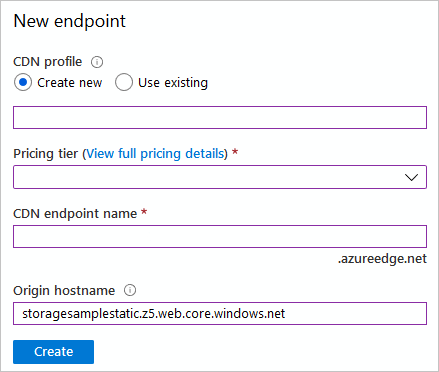

# Integrate a static website with Azure CDN

You can enable [Azure Content Delivery Network (CDN)](../../cdn/cdn-overview.md) to cache content from a [static website](storage-blob-static-website.md) that is hosted in an Azure storage account. You can use Azure CDN to configure the custom domain endpoint for your static website, provision custom TLS/SSL certificates, and configure custom rewrite rules. Configuring Azure CDN results in additional charges, but provides consistent low latencies to your website from anywhere in the world. Azure CDN also provides TLS encryption with your own certificate.

For information on Azure CDN pricing, see [Azure CDN pricing](https://azure.microsoft.com/pricing/details/cdn/).

## Enable Azure CDN for your static website

You can enable Azure CDN for your static website directly from your storage account. If you want to specify advanced configuration settings for your CDN endpoint, such as [large file download optimization](../../cdn/cdn-optimization-overview.md#large-file-download), you can instead use the [Azure CDN extension](../../cdn/cdn-create-new-endpoint.md) to create a CDN profile and endpoint.

1. Locate your storage account in the Azure portal and display the account overview.

1. Under the **Security + Networking** menu, select **Azure CDN** to open the **Azure CDN** page:

    

1. In the **CDN profile** section, specify whether to create a new CDN profile or use an existing one. A CDN profile is a collection of CDN endpoints that share a pricing tier and provider. Then enter a name for the CDN that's unique within your subscription.

1. Specify a pricing tier for the CDN endpoint. To learn more about pricing, see [Content Delivery Network pricing](https://azure.microsoft.com/pricing/details/cdn/). For more information about the features available with each tier, see [Compare Azure CDN product features](../../cdn/cdn-features.md).

1. In the **CDN endpoint name** field, specify a name for your CDN endpoint. The CDN endpoint must be unique across Azure and provides the first part of the endpoint URL. The form validates that the endpoint name is unique.

1. Specify your static website endpoint in the **Origin hostname** field.

   To find your static website endpoint, navigate to the **Static website** settings for your storage account.  Copy the primary endpoint and paste it into the CDN configuration.

   > [!IMPORTANT]
   > Make sure to remove the protocol identifier (*e.g.*, HTTPS) and the trailing slash in the URL. For example, if the static website endpoint is
   > `https://mystorageaccount.z5.web.core.windows.net/`, then you would specify `mystorageaccount.z5.web.core.windows.net` in the **Origin hostname** field.

   The following image shows an example endpoint configuration:

   

1. Select **Create**, and then wait for the CDN to provision. After the endpoint is created, it appears in the endpoint list. (If you have any errors in the form, an exclamation mark appears next to that field.)

1. To verify that the CDN endpoint is configured correctly, click on the endpoint to navigate to its settings. From the CDN overview for your storage account, locate the endpoint hostname, and navigate to the endpoint, as shown in the following image. The format of your CDN endpoint will be similar to `https://staticwebsitesamples.azureedge.net`.

    

1. Once the CDN endpoint is provisioned, navigating to the CDN endpoint displays the contents of the index.html file that you previously uploaded to your static website.

1. To review the origin settings for your CDN endpoint, navigate to **Origin** under the **Settings** section for your CDN endpoint. You will see that the **Origin type** field is set to *Custom Origin* and that the **Origin hostname** field displays your static website endpoint.

    

## Remove content from Azure CDN

If you no longer want to cache an object in Azure CDN, you can take one of the following steps:

- Make the container private instead of public. For more information, see [Remediate anonymous public read access to blob data (Azure Resource Manager deployments)](anonymous-read-access-prevent.md).
- Disable or delete the CDN endpoint by using the Azure portal.
- Modify your hosted service to no longer respond to requests for the object.

An object that's already cached in Azure CDN remains cached until the time-to-live period for the object expires or until the endpoint is [purged](../../cdn/cdn-purge-endpoint.md). When the time-to-live period expires, Azure CDN determines whether the CDN endpoint is still valid and the object is still anonymously accessible. If they are not, the object will no longer be cached.

## Next steps

(Optional) Add a custom domain to your Azure CDN endpoint. See [Tutorial: Add a custom domain to your Azure CDN endpoint](../../cdn/cdn-map-content-to-custom-domain.md).
