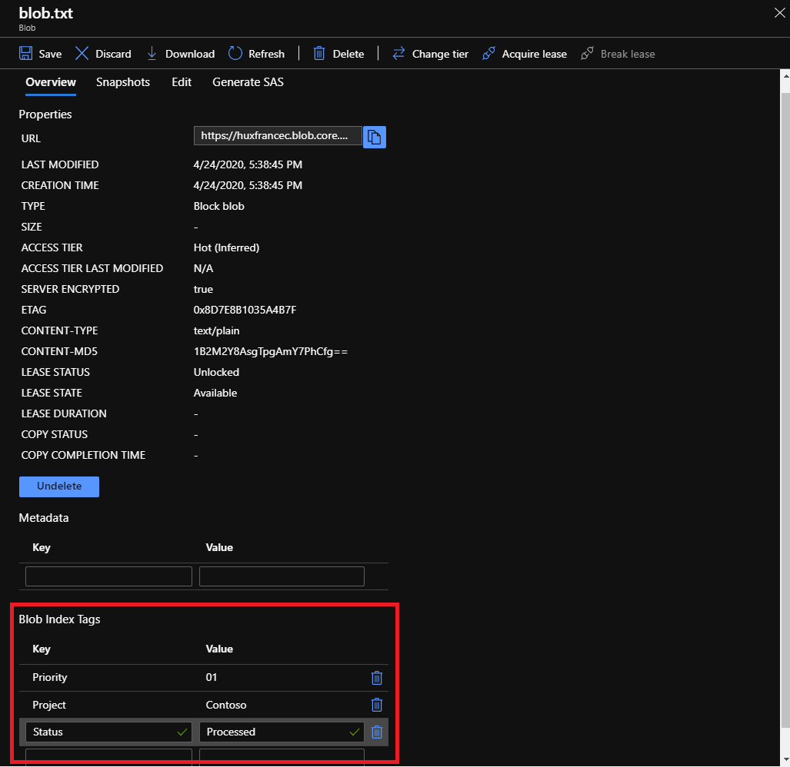
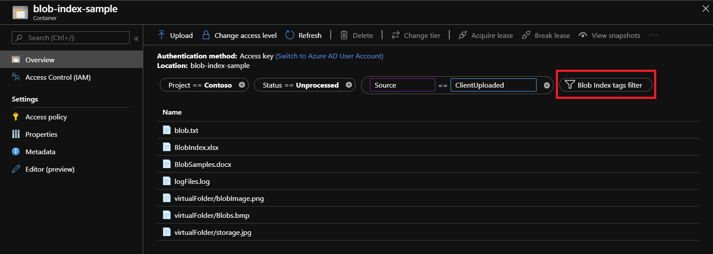

# Utilize Blob Index tags (Preview) to manage and find data on Azure Blob storage

Blob Index tags categorize data in your storage account utilizing key-value tag attributes. These tags are automatically indexed and exposed as a queryable multi-dimensional index to easily find data. This article shows you how to set, get, and find data using blob index tags.

To learn more about the Blob Index, see [Manage and find data on Azure Blob Storage with Blob Index (Preview)](storage-manage-find-blobs.md).

> [!NOTE]
> Blob Index is in public preview, and is available in the **France Central** and **France South** regions. To learn more about this feature along with known issues and limitations, see [Manage and find data on Azure Blob Storage with Blob Index (Preview)](storage-manage-find-blobs.md).

## Prerequisites
# [Portal](#tab/azure-portal)
- Subscription registered and approved for access to the Blob Index preview
- Access to [Azure portal](https://portal.azure.com/)

# [.NET](#tab/net)
As Blob Index is in public preview, the .NET storage package is released in the preview NuGet feed. This library is subject to change between now and when it becomes official. 

1. In Visual Studio, add the URL `https://azuresdkartifacts.blob.core.windows.net/azure-sdk-for-net/index.json` to your NuGet package sources. 

   To learn how, see [package sources](https://docs.microsoft.com/nuget/consume-packages/install-use-packages-visual-studio#package-sources).

2. In the NuGet Package Manager, Find the **Azure.Storage.Blobs** package, and install version **12.5.0-dev.20200422.2** to your project. You can also run the command ```Install-Package Azure.Storage.Blobs -Version12.5.0-dev.20200422.2```

   To learn how, see [Find and install a package](https://docs.microsoft.com/nuget/consume-packages/install-use-packages-visual-studio#find-and-install-a-package).

3. Add the following using statements to the top of your code file.
```csharp
using Azure;
using Azure.Storage.Blobs;
using Azure.Storage.Blobs.Models;
using Azure.Storage.Blobs.Specialized;
using System;
using System.Collections.Generic;
using System.Threading.Tasks;
```
---

## Upload a new blob with index tags
# [Portal](#tab/azure-portal)

1. In the [Azure portal](https://portal.azure.com/), select your storage account 

2. Navigate to the **Containers** option under **Blob Service**, select your container

3. Select the **Upload** button to open the upload blade and browse your local file system to find a file to upload as a block blob.

4. Expand the **Advanced** dropdown and go to the **Blob Index Tags** section

5. Input the key/value blob index tags that you want applied to your data

6. Select the **Upload** button to upload the blob


# [.NET](#tab/net)
The following example shows how to create an append blob with tags set during creation.
```csharp
static async Task BlobIndexTagsOnCreate()
   {
      BlobServiceClient serviceClient = new BlobServiceClient(ConnectionString);
      BlobContainerClient container = serviceClient.GetBlobContainerClient("mycontainer");

      try
      {
          // Create a container
          await container.CreateIfNotExistsAsync();

          // Create an append blob
          AppendBlobClient appendBlobWithTags = container.GetAppendBlobClient("myAppendBlob0.logs");
         
          // Blob Index tags to upload
          CreateAppendBlobOptions appendOptions = new CreateAppendBlobOptions();
          appendOptions.Tags = new Dictionary<string, string>
          {
              { "Sealed", "false" },
              { "Content", "logs" },
              { "Date", "2020-04-20" }
          };

          // Upload data with tags set on creation
          await appendBlobWithTags.CreateAsync(appendOptions);
      }
      finally
      {
      }
   }
```

---

## Get, set, and update blob index tags
# [Portal](#tab/azure-portal)

1. In the [Azure portal](https://portal.azure.com/), select your storage account 

2. Navigate to the **Containers** option under **Blob Service**, select your container

3. Select your desired blob from the list of blobs within the selected container

4. The blob overview tab will display your blob's properties including any **Blob Index Tags**

5. You can get, set, modify, or delete any of the key/value index tags for your blob

6. Select the **Save** button to confirm any updates to your blob



# [.NET](#tab/net)
```csharp
static async Task BlobIndexTagsExample()
   {
      BlobServiceClient serviceClient = new BlobServiceClient(ConnectionString);
      BlobContainerClient container = serviceClient.GetBlobContainerClient("mycontainer");

      try
      {
          // Create a container
          await container.CreateIfNotExistsAsync();

          // Create a new append blob
          AppendBlobClient appendBlob = container.GetAppendBlobClient("myAppendBlob1.logs");
          await appendBlob.CreateAsync();

          // Set or Update Blob Index tags on existing blob
          Dictionary<string, string> tags = new Dictionary<string, string>
          {
              { "Project", "Contoso" },
              { "Status", "Unprocessed" },
              { "Sealed", "true" }
          };
          await appendBlob.SetTagsAsync(tags);

          // Get Blob Index tags
          Response<IDictionary<string, string>> tagsResponse = await appendBlob.GetTagsAsync();
          Console.WriteLine(appendBlob.Name);
          foreach (KeyValuePair<string, string> tag in tagsResponse.Value)
          {
              Console.WriteLine($"{tag.Key}={tag.Value}");
          }

          // List Blobs with all options returned including Blob Index tags
          await foreach (BlobItem blobItem in container.GetBlobsAsync(BlobTraits.All))
          {
              Console.WriteLine(Environment.NewLine + blobItem.Name);
              foreach (KeyValuePair<string, string> tag in blobItem.Tags)
              {
                  Console.WriteLine($"{tag.Key}={tag.Value}");
              }
          }

          // Delete existing Blob Index tags by replacing all tags
          Dictionary<string, string> noTags = new Dictionary<string, string>();
          await appendBlob.SetTagsAsync(noTags);

      }
      finally
      {
      }
   }
```

---

## Filter and Find data with blob index tags

# [Portal](#tab/azure-portal)

Within the Azure portal, the Blob Index tags filter automatically applies the `@container` parameter to scope your selected container. If you wish to filter and find tagged data across your entire storage account, please use our REST API, SDKs, or tools.

1. In the [Azure portal](https://portal.azure.com/), select your storage account. 

2. Navigate to the **Containers** option under **Blob Service**, select your container

3. Select the **Blob Index tags filter** button to filter within the selected container

4. Enter a Blob Index tag key and tag value

5. Select the **Blob Index tags filter** button to add additional tag filters (up to 10)



# [.NET](#tab/net)
```csharp
static async Task FindBlobsByTagsExample()
   {
      BlobServiceClient serviceClient = new BlobServiceClient(ConnectionString);
      BlobContainerClient container1 = serviceClient.GetBlobContainerClient("mycontainer");
      BlobContainerClient container2 = serviceClient.GetBlobContainerClient("mycontainer2");

      // Blob Index queries and selection
      String singleEqualityQuery = @"""Archive"" = 'false'";
      String andQuery = @"""Archive"" = 'false' AND ""Priority"" = '01'";
      String rangeQuery = @"""Date"" >= '2020-04-20' AND ""Date"" <= '2020-04-30'";
      String containerScopedQuery = @"@container = 'mycontainer' AND ""Archive"" = 'false'";

      String queryToUse = containerScopedQuery;

      try
      {
          // Create a container
          await container1.CreateIfNotExistsAsync();
          await container2.CreateIfNotExistsAsync();

          // Create append blobs
          AppendBlobClient appendBlobWithTags0 = container1.GetAppendBlobClient("myAppendBlob00.logs");
          AppendBlobClient appendBlobWithTags1 = container1.GetAppendBlobClient("myAppendBlob01.logs");
          AppendBlobClient appendBlobWithTags2 = container1.GetAppendBlobClient("myAppendBlob02.logs");
          AppendBlobClient appendBlobWithTags3 = container2.GetAppendBlobClient("myAppendBlob03.logs");
          AppendBlobClient appendBlobWithTags4 = container2.GetAppendBlobClient("myAppendBlob04.logs");
          AppendBlobClient appendBlobWithTags5 = container2.GetAppendBlobClient("myAppendBlob05.logs");
           
          // Blob Index tags to upload
          CreateAppendBlobOptions appendOptions = new CreateAppendBlobOptions();
          appendOptions.Tags = new Dictionary<string, string>
          {
              { "Archive", "false" },
              { "Priority", "01" },
              { "Date", "2020-04-20" }
          };
          
          CreateAppendBlobOptions appendOptions2 = new CreateAppendBlobOptions();
          appendOptions2.Tags = new Dictionary<string, string>
          {
              { "Archive", "true" },
              { "Priority", "02" },
              { "Date", "2020-04-24" }
          };

          // Upload data with tags set on creation
          await appendBlobWithTags0.CreateAsync(appendOptions);
          await appendBlobWithTags1.CreateAsync(appendOptions);
          await appendBlobWithTags2.CreateAsync(appendOptions2);
          await appendBlobWithTags3.CreateAsync(appendOptions);
          await appendBlobWithTags4.CreateAsync(appendOptions2);
          await appendBlobWithTags5.CreateAsync(appendOptions2);

          // Find Blobs given a tags query
          Console.WriteLine("Find Blob by Tags query: " + queryToUse + Environment.NewLine);

          List<FilterBlobItem> blobs = new List<FilterBlobItem>();
          await foreach (FilterBlobItem filterBlobItem in serviceClient.FindBlobsByTagsAsync(queryToUse))
          {
              blobs.Add(filterBlobItem);
          }

          foreach (var filteredBlob in blobs)
          {
              Console.WriteLine($"BlobIndex result: ContainerName= {filteredBlob.ContainerName}, " +
                  $"BlobName= {filteredBlob.Name}");
          }

      }
      finally
      {
      }
   }
```

---

## Lifecycle management with blob index tag filters

# [Portal](#tab/azure-portal)

1. In the [Azure portal](https://portal.azure.com/), select your storage account. 

2. Navigate to the **Lifecycle Management** option under **Blob Service**

3. Select *Add rule* and then fill out the Action set form fields

4. Select Filter set to add optional filter for Prefix match and Blob Index match
  

5. Select **Review + add** to review the rule settings
  

6. Select **Add** to apply the new rule to the lifecycle management policy

# [.NET](#tab/net)
[Lifecycle management](storage-lifecycle-management-concepts.md) policies are applied for each storage account at the control plane level. For .NET, install the [Microsoft Azure Management Storage Library version 16.0.0](https://www.nuget.org/packages/Microsoft.Azure.Management.Storage/) or higher to take advantage of the Blob Index match filter within a lifecycle management rule.

---

## Next steps

Learn more about Blob Index. See [Manage and find data on Azure Blob Storage with Blob Index (Preview)](storage-manage-find-blobs.md )

Learn more about Lifecycle Management. See [Manage the Azure Blob storage lifecycle](storage-lifecycle-management-concepts.md)
