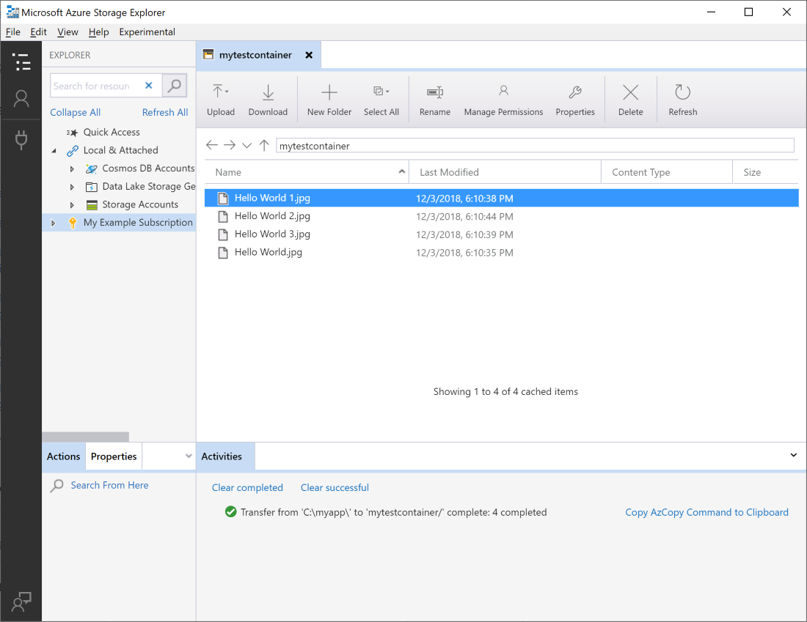
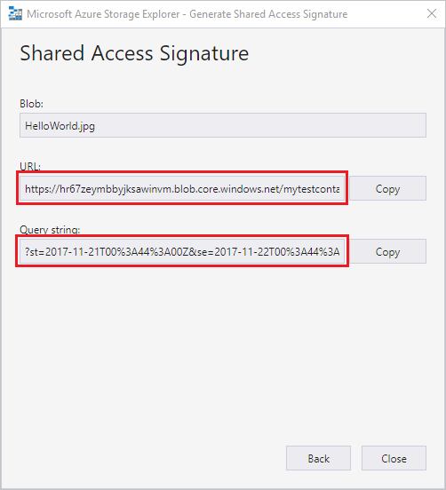

# Quickstart: Upload, download, and list blobs using Azure Storage Explorer

[Azure Storage Explorer](https://azure.microsoft.com/features/storage-explorer/) is a multi platform user interface used to manager the contents of your storage accounts. This guide details using Azure Storage Explorer to transfer files between a local disk and Azure Blob storage.

If you don't have an Azure subscription, create a [free account](https://azure.microsoft.com/free/?WT.mc_id=A261C142F) before you begin.

This quickstart requires the Azure Storage Explorer to be installed. If you need to install it, visit [Azure Storage Explorer](https://azure.microsoft.com/features/storage-explorer/) to download it for Windows, Macintosh, or Linux.

[!INCLUDE [storage-quickstart-tutorial-create-account-portal](../../../includes/storage-quickstart-tutorial-create-account-portal.md)]

## Log in to Storage Explorer

On first launch, the **Microsoft Azure Storage Explorer - Connect** window is shown. Storage Explorer provides several ways to connect to storage accounts. The following table lists the different ways you can connect:

|Task|Purpose|
|---|---|
|Add an Azure Account | Redirects you to your organizations login page to authenticate you to Azure. |
|Use a connection string or shared access signature URI | Can be used to directly access a container or storage account with a SAS token or a shared connection string. |
|Use a storage account name and key| Use the storage account name and key of your storage account to connect to Azure storage.|

Select **Add an Azure Account** and click **Sign in..**. Follow the on-screen prompts to sign into your Azure account.

When it completes connecting, Azure Storage Explorer loads with the **Explorer** tab shown. This view gives you insight to all of your Azure storage accounts as well as local storage configured through the [Azure Storage Emulator](../common/storage-use-emulator.md?toc=%2fazure%2fstorage%2fblobs%2ftoc.json), [Cosmos DB](../../cosmos-db/storage-explorer.md?toc=%2fazure%2fstorage%2fblobs%2ftoc.json) accounts, or [Azure Stack](../../azure-stack/user/azure-stack-storage-connect-se.md?toc=%2fazure%2fstorage%2fblobs%2ftoc.json) environments.

## Create a container

Blobs are always uploaded into a container. This allows you to organize groups of blobs like you organize your files on your computer in folders.

To create a container, expand the storage account you created in the proceeding step. Select **Blob Containers**, right-click and select **Create Blob Container**. Enter the name for your blob container. See the [container naming rules](storage-dotnet-how-to-use-blobs.md#create-a-container) section for a list of rules and restrictions on naming blob containers. When complete, press **Enter** to create the blob container. Once the blob container has been successfully created, it is displayed under the **Blob Containers** folder for the selected storage account.

## Upload blobs to the container

Blob storage supports block blobs, append blobs, and page blobs. VHD files used to back IaaS VMs are page blobs. Append blobs are used for logging, such as when you want to write to a file and then keep adding more information. Most files stored in Blob storage are block blobs.

On the container ribbon, select **Upload**. This operation gives you the option to upload a folder or a file.

Choose the files or folder to upload. Select the **blob type**. Acceptable choices are **Append**, **Page**, or **Block** blob.

If uploading a .vhd or .vhdx file, choose **Upload .vhd/.vhdx files as page blobs (recommended)**.

In the **Upload to folder (optional)** field either a folder name to store the files or folders in a folder under the container. If no folder is chosen, the files are uploaded directly under the container.

When you select **OK**, the files selected are queued to upload, each file is uploaded. When the upload is complete, the results are shown in the **Activities** window.

## View blobs in a container

In the **Azure Storage Explorer** application, select a container under a storage account. The main pane shows a list of the blobs in the selected container.

## Download blobs

To download blobs using **Azure Storage Explorer**, with a blob selected, select **Download** from the ribbon. A file dialog opens and provides you the ability to enter a file name. Select **Save** to start the download of a blob to the local location.

## Manage snapshots

Azure Storage Explorer provides the capability to take and manage [snapshots](storage-blob-snapshots.md) of your blobs. To take a snapshot of a blob, right-click the blob and select **Make Snapshot**. To view snapshots for a blob, right-click the blob and select **Manage Snapshots**. A list of the snapshots for the blob are shown in the current tab.

## Manage access policies

Storage Explorer provides the ability to manage access policies for containers within its user interface. There are two types of secure access policies (SAS), service level and account level. Account level SAS targets the storage account and can apply to multiple services and resources. Service level SAS are defined on a resource under a particular service. To generate a service level SAS, right-click any container and select **Manage Access Policies...**. To generate an account level SAS, right-click on the storage account.

Select **Add** to add a new access policy and define the permissions for the policy. When complete select **Save** to save the access policy. This policy is now available for use when configuring a Shared Access Signature.

## Work with Shared Access Signatures

Shared Access Signatures (SAS) can be retrieved through Storage Explorer. Right-click a storage account, container, or blob and choose **Get Shared Access Signature...**. Choose the start and expiry time, and permissions for the SAS URL and select **Create**. The full URL with the query string as well as the query string by itself are provided and can be copied from the next screen.

## Next steps

In this quickstart, you learned how to transfer files between a local disk and Azure Blob storage using **Azure Storage Explorer**. To learn more about working with Blob storage, continue to the Blob storage How-to.

> [!div class="nextstepaction"]
> [Blob Storage Operations How-To](storage-how-to-use-blobs-powershell.md)
