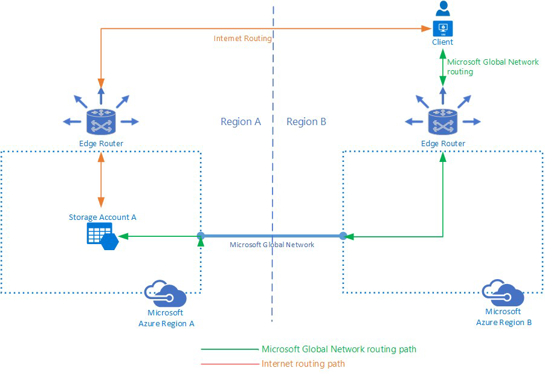

# Network routing preference for Azure Storage

You can configure network [routing preference](../../virtual-network/ip-services/routing-preference-overview.md) for your Azure storage account to specify how network traffic is routed to your account from clients over the internet. By default, traffic from the internet is routed to the public endpoint of your storage account over the [Microsoft global network](../../networking/microsoft-global-network.md). Azure Storage provides additional options for configuring how traffic is routed to your storage account.

Configuring routing preference gives you the flexibility to optimize your traffic either for premium network performance or for cost. When you configure a routing preference, you specify how traffic will be directed to the public endpoint for your storage account by default. You can also publish route-specific endpoints for your storage account.

> [!NOTE]
> This feature is not supported in premium performance storage accounts or accounts configured to use Zone-redundant storage (ZRS).

## Microsoft global network versus Internet routing

By default, clients outside of the Azure environment access your storage account over the Microsoft global network. The Microsoft global network is optimized for low-latency path selection to deliver premium network performance with high reliability. Both inbound and outbound traffic are routed through the point of presence (POP) that is closest to the client. This default routing configuration ensures that traffic to and from your storage account traverses over the Microsoft global network for the bulk of its path, maximizing network performance.

You can change the routing configuration for your storage account so that both inbound and outbound traffic are routed to and from clients outside of the Azure environment through the POP closest to the storage account. This route minimizes the traversal of your traffic over the Microsoft global network, handing it off to the transit ISP at the earliest opportunity. Utilizing this routing configuration lowers networking costs.

The following diagram shows how traffic flows between the client and the storage account for each routing preference:

For more information on routing preference in Azure, see [What is routing preference?](../../virtual-network/ip-services/routing-preference-overview.md).

## Routing configuration

For step-by-step guidance that shows you how to configure the routing preference and route-specific endpoints, see [Configure network routing preference for Azure Storage](configure-network-routing-preference.md).

You can choose between the Microsoft global network and internet routing as the default routing preference for the public endpoint of your storage account. The default routing preference applies to all traffic from clients outside Azure and affects the endpoints for Azure Data Lake Storage Gen2, Blob storage, Azure Files, and static websites. Configuring routing preference is not supported for Azure Queues or Azure Tables.

You can also publish route-specific endpoints for your storage account. When you publish route-specific endpoints, Azure Storage creates new public endpoints for your storage account that route traffic over the desired path. This flexibility enables you to direct traffic to your storage account over a specific route without changing your default routing preference.

For example, publishing an internet route-specific endpoint for the 'StorageAccountA' will publish the following endpoints for your storage account:

| Storage service        | Route-specific endpoint                                  |
| :--------------------- | :------------------------------------------------------- |
| Blob service           | `StorageAccountA-internetrouting.blob.core.windows.net`  |
| Data Lake Storage Gen2 | `StorageAccountA-internetrouting.dfs.core.windows.net`   |
| File service           | `StorageAccountA-internetrouting.file.core.windows.net`  |
| Static Websites        | `StorageAccountA-internetrouting.web.core.windows.net`   |

If you have a read-access geo-redundant storage (RA-GRS) or a read-access geo-zone-redundant storage (RA-GZRS) storage account, publishing route-specific endpoints also automatically creates the corresponding endpoints in the secondary region for read access.

| Storage service        | Route-specific read-only secondary endpoint                        |
| :--------------------- | :----------------------------------------------------------------- |
| Blob service           | `StorageAccountA-internetrouting-secondary.blob.core.windows.net`  |
| Data Lake Storage Gen2 | `StorageAccountA-internetrouting-secondary.dfs.core.windows.net`   |
| File service           | `StorageAccountA-internetrouting-secondary.file.core.windows.net`  |
| Static Websites        | `StorageAccountA-internetrouting-secondary.web.core.windows.net`   |

The connection strings for the published route-specific endpoints can be copied via the [Azure portal](https://portal.azure.com). These connection strings can be used for Shared Key authorization with all existing Azure Storage SDKs and APIs.

## Regional availability

Routing preference for Azure Storage is available in the following regions:

- Central US 
- Central US EUAP
- East US 
- East US 2
- East US 2 
- East US 2 EUAP
- South Central US
- West Central US
- West US 
- West US 2 
- France Central 
- France South 
- Germany North 
- Germany West Central 
- North Central US
- North Europe 
- Norway East 
- Switzerland North
- Switzerland West
- UK South 
- UK West 
- West Europe 
- UAE Central
- East Asia 
- Southeast Asia 
- Japan East 
- Japan West 
- West India
- Australia East 
- Australia Southeast 

The following known issues affect the routing preference for Azure Storage:

- Access requests for the route-specific endpoint for the Microsoft global network fail with HTTP error 404 or equivalent. Routing over the Microsoft global network works as expected when it is set as the default routing preference for the public endpoint.

## Pricing and billing

For pricing and billing details, see the **Pricing** section in [What is routing preference?](../../virtual-network/ip-services/routing-preference-overview.md#pricing).

## Next steps

- [What is routing preference?](../../virtual-network/ip-services/routing-preference-overview.md)
- [Configure network routing preference](configure-network-routing-preference.md)
- [Configure Azure Storage firewalls and virtual networks](storage-network-security.md)
- [Security recommendations for Blob storage](../blobs/security-recommendations.md)
