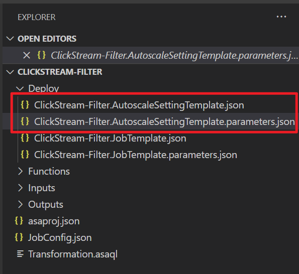

# Configure autoscale settings for a Stream Analytics job using ASA CI/CD tool

Streaming units (SUs) represent the computing resources that are allocated to execute a Stream Analytics job. The higher the number of SUs, the more CPU and memory resources are allocated to your job. The autoscale feature dynamically adjust SUs based on your rule definitions. You can configure autoscale settings for your Stream Analytics job in the Azure portal or using ASA CI/CD tool in your local machine. 

This article explains how you can use ASA CI/CD tool to configure autoscale settings for Stream Analytics jobs. If you want to learn more about autoscaling jobs in the Azure portal, see [Autoscale streaming units (Preview)](stream-analytics-autoscale.md).

The ASA CI/CD tool allows you to specify the maximum number of streaming units and configure set of rules for autoscaling your jobs. Then it determines to add SUs to handle increases in load or to reduce the number of SUs when computing resources are sitting idle. 

Examples of an autoscale setting:
- If the maximum number of SUs is set to 12, it increases SUs when the average SU% utilization of the job over the last 2 minutes goes above 75%.

## Prerequisites
- A Stream Analytics project in the local machine. If don't have one, follow this [guide](quick-create-visual-studio-code.md) to create one. 
- Or you have a running ASA job in Azure.

## How to configure autoscale settings?

### Scenario 1: configure for a local Stream Analytics project

If you have a working Stream Analytics project in the local machine, follow the steps to configure autoscale settings:

1. Open your Stream Analytics project in Visual Studio Code. 
2. On the **Terminal** panel, run the command to install ASA CI/CD tool.
    ```powershell
    npm install -g azure-streamanalytics-cicd
    ```
    
    Here's the list of command supported for `azure-streamanalytics-cicd`:

    |Command        |Description    |
    |---------------|---------------|
    |build          |Generate standard ARM template for the given Azure Stream Analytics Visual Studio Code project.|
    |localrun       |Run locally for the given Azure Stream Analytics Visual Studio Code project.|
    |test           |Test for given Azure Stream Analytics Visual Studio Code project.| 
    |addtestcase    |Add test cases for the given Azure Stream Analytics Visual Studio Code project.| 
    |autoscale      |Generate autoscale setting ARM template file.| 
    |help           |Display more information on a specific command.| 

3. Build project.
    ```powershell
    azure-streamanalytics-cicd build --v2 --project ./asaproj.json --outputPath ./Deploy
    ```

    If the project is built successfully, you see 2 JSON files created under **Deploy** folder. One is the ARM template file and the other one is the parameter file. 

    

    > [!NOTE]
    > It is highly recommended to use the `--v2` option for the updated ARM template schema, which has fewer parameters yet retains the same functionality as the previous version. The old ARM template will be deprecated in the future, and only templates created using `build --v2` will receive updates or bug fixes.

4. Configure autoscale setting.
    You need to add parameter keys and values using `azure-streamanalytics-cicd autoscale` command.

    |Parameter key   | Value | Example|
    |----------------|-------|--------|
    |capacity| maximum SUs (1, 3, 6 or multiples of 6 up to 396)|12|
    |metrics | metrics used for autoscale rules | ProcessCPUUsagePercentage ResourceUtilization|
    |targetJobName| project name| ClickStream-Filter|
    |outputPath| output path for ARM templates | ./Deploy|
    
    Example: 
    ```powershell
    azure-streamanalytics-cicd autoscale --capacity 12 --metrics ProcessCPUUsagePercentage ResourceUtilization --targetJobName ClickStream-Filter --outputPath ./Deploy
    ```

    If the autoscale setting is configured successfully, you see 2 JSON files created under **Deploy** folder. One is the ARM template file and the other one is the parameter file. 

    

    Here's the list of metrics you can use for defining autoscale rules: 

    |Metrics                        | Description           |
    |-------------------------------|-------------------|
    |ProcessCPUUsagePercentage      | CPU % Utilization |
    |ResourceUtilization            | SU/Memory % Utilization |
    |OutputWatermarkDelaySeconds    | Watermark Delay |
    |InputEventsSourcesBacklogged   | Backlogged Input Events |
    |DroppedOrAdjustedEvents        | Out of order Events |
    |Errors                         | Runtime Errors |
    |InputEventBytes                | Input Event Bytes |
    |LateInputEvents                | Late Input Events |
    |InputEvents                    | Input Events |
    |EarlyInputEvents               | Early Input Events |
    |InputEventsSourcesPerSecond    | Input Sources Received |
    |OutputEvents                   | Output Events |
    |AMLCalloutRequests             | Function Requests |
    |AMLCalloutFailedRequests       | Failed Function Requests |
    |AMLCalloutInputEvents          | Function Events |
    |ConversionErrors               | Data Conversion Errors |
    |DeserializationError           | Input Deserialization Errors |

    The default value for all metric threshold is **70**. If you want to set the metric threshold to another number, open **\*.AutoscaleSettingTemplate.parameters.json** file and change the **Threshold** value. 

    
    
    To learn more about defining autoscale rules, visit [here](https://learn.microsoft.com/azure/azure-monitor/autoscale/autoscale-understanding-settings).
    
5. Deploy to Azure
    1. Connect to Azure account.
        ```powershell
        # Connect to Azure
        Connect-AzAccount

        # Set Azure subscription.
        Set-AzContext [SubscriptionID/SubscriptionName]
        ```
    1. Deploy your Stream Analytics project.
        ```powershell
        $templateFile = ".\Deploy\ClickStream-Filter.JobTemplate.json"
        $parameterFile = ".\Deploy\ClickStream-Filter.JobTemplate.parameters.json"
        New-AzResourceGroupDeployment `
          -Name devenvironment `
          -ResourceGroupName myResourceGroupDev `
          -TemplateFile $templateFile `
          -TemplateParameterFile $parameterFile
        ```
    1. Deploy your autoscale settings.
        ```powershell
        $templateFile = ".\Deploy\ClickStream-Filter.AutoscaleSettingTemplate.json"
        $parameterFile = ".\Deploy\ClickStream-Filter.AutoscaleSettingTemplate.parameters.json"
        New-AzResourceGroupDeployment `
          -Name devenvironment `
          -ResourceGroupName myResourceGroupDev `
          -TemplateFile $templateFile `
          -TemplateParameterFile $parameterFile
        ```

Once your project is deployed successfully, you can view the autoscale settings in Azure portal. 


### Scenario 2: Configure for a running ASA job in Azure

If you have a Stream Analytics job running in Azure, you can use ASA CI/CD tool in the PowerShell to configure autoscale settings. 

Replace **$jobResourceId** with your Stream Analytics job resource ID and run this command: 
```powershell
azure-streamanalytics-cicd autoscale --capacity 12 --metrics ProcessCPUUsagePercentage ResourceUtilization --targetJobResourceId $jobResourceId --outputPath ./Deploy
```

If configure successfully, you see ARM template and parameter files created in the current directory.

Then you can deploy the autoscale settings to Azure by following the Deployment steps in scenario 1.

## Help

For more information about autoscale settings, run this command in PowerShell: 
```powershell
azure-streamanalytics-cicd autoscale --help
```

If you have any issues about the ASA CI/CD tool, you can report it [here](https://github.com/microsoft/vscode-asa/issues).
