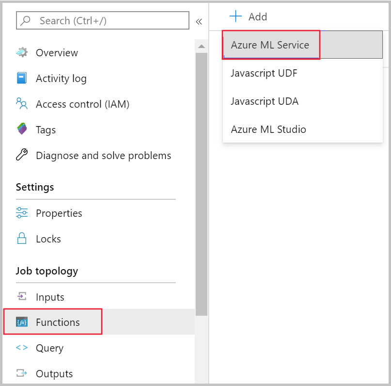
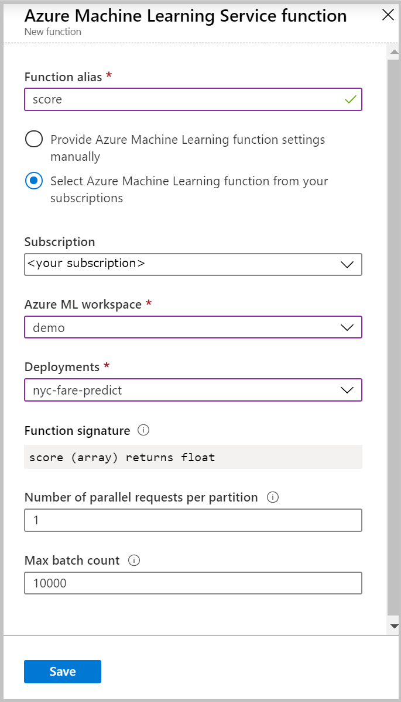

# Integrate Azure Stream Analytics with Azure Machine Learning (Preview)

You can implement machine learning models as a user-defined function (UDF) in your Azure Stream Analytics jobs to do real-time scoring and predictions on your streaming input data. [Azure Machine Learning](../machine-learning/overview-what-is-azure-ml.md) allows you to use any popular open-source tool, such as Tensorflow, scikit-learn, or PyTorch, to prep, train, and deploy models.

> [!NOTE]
> This functionality is in public preview. You can access this feature on the Azure portal only by using the [Stream Analytics portal preview link](https://aka.ms/asaportalpreview). This functionality is also available in the latest version of [Stream Analytics tools for Visual Studio](https://docs.microsoft.com/azure/stream-analytics/stream-analytics-tools-for-visual-studio-install).

## Prerequisites

Complete the following steps before you add a machine learning model as a function to your Stream Analytics job:

1. Use Azure Machine Learning to [deploy your model as a web service](https://docs.microsoft.com/azure/machine-learning/how-to-deploy-and-where).

2. Your scoring script should have [sample inputs and outputs](../machine-learning/how-to-deploy-and-where.md#example-entry-script) which is used by Azure Machine Learning to generate a schema specification. Stream Analytics uses the schema to understand the function signature of your web service.

3. Make sure your web service accepts and returns JSON serialized data.

4. Deploy your model on [Azure Kubernetes Service](../machine-learning/how-to-deploy-and-where.md#choose-a-compute-target) for high-scale production deployments. If the web service is not able to handle the number of requests coming from your job, the performance of your Stream Analytics job will be degraded, which impacts latency.

## Add a machine learning model to your job

You can add Azure Machine Learning functions to your Stream Analytics job directly from the Azure portal.

1. Navigate to your Stream Analytics job in the Azure portal, and select **Functions** under **Job topology**. Then, select **Azure ML Service** from the **+ Add** dropdown menu.

   

2. Fill in the **Azure Machine Learning Service function** form with the following property values:

   

The following table describes each property of Azure ML Service functions in Stream Analytics.

|Property|Description|
|--------|-----------|
|Function alias|Enter a name to invoke the function in your query.|
|Subscription|Your Azure subscription..|
|Azure ML workspace|The Azure Machine Learning workspace you used to deploy your model as a web service.|
|Deployments|The web service hosting your model.|
|Function signature|The signature of your web service inferred from the API's schema specification. If your signature fails to load, check that you have provided sample input and output in your scoring script to automatically generate the schema.|
|Number of parallel requests per partition|This is an advanced configuration to optimize high-scale throughput. This number represents the concurrent requests sent from each partition of your job to the web service. Jobs with six streaming units (SU) and lower have one partition. Jobs with 12 SUs have two partitions, 18 SUs have three partitions and so on.<br><br> For example, if your job has two partitions and you set this parameter to four, there will be eight concurrent requests from your job to your web service. At this time of public preview, this value defaults to 20 and cannot be updated.|
|Max batch count|This is an advanced configuration for optimizing high-scale throughput. This number represents the maximum number of events be batched together in a single request sent to your web service.|

## Supported input parameters

When your Stream Analytics query invokes an Azure Machine Learning UDF, the job creates a JSON serialized request to the web service. The request is based on a model-specific schema. You have to provide a sample input and output in your scoring script to [automatically generate a schema](../machine-learning/how-to-deploy-and-where.md#optional-automatic-schema-generation). The schema allows Stream Analytics to construct the JSON serialized request for any of the supported data types such as numpy, pandas and PySpark. Multiple input events can be batched together in a single request.

The following Stream Analytics query is an example of how to invoke an Azure Machine Learning UDF:

```SQL
SELECT udf.score(<model-specific-data-structure>)
INTO output
FROM input
```

Stream Analytics only supports passing one parameter for Azure Machine Learning functions. You may need to prepare your data before passing it as an input to machine learning UDF.

## Pass multiple input parameters to the UDF

Most common examples of inputs to machine learning models are numpy arrays and DataFrames. You can create an array using a JavaScript UDF, and create a JSON-serialized DataFrame using the `WITH` clause.

### Create an input array

You can create a JavaScript UDF which accepts *N* number of inputs and creates an array that can be used as input to your Azure Machine Learning UDF.

```javascript
function createArray(vendorid, weekday, pickuphour, passenger, distance) {
    'use strict';
    var array = [vendorid, weekday, pickuphour, passenger, distance]
    return array;
}
```

Once you have added the JavaScript UDF to your job, you can invoke your Azure Machine Learning UDF using the following query:

```SQL
SELECT udf.score(
udf.createArray(vendorid, weekday, pickuphour, passenger, distance)
)
INTO output
FROM input
```

The following JSON is an example request:

```JSON
{
    "data": [
        ["1","Mon","12","1","5.8"],
        ["2","Wed","10","2","10"]
    ]
}
```

### Create a Pandas or PySpark DataFrame

You can use the `WITH` clause to create a JSON serialized DataFrame that can be passed as input to your Azure Machine Learning UDF as shown below.

The following query creates a DataFrame by selecting the necessary fields and uses the DataFrame as input to the Azure Machine Learning UDF.

```SQL
WITH 
Dataframe AS (
SELECT vendorid, weekday, pickuphour, passenger, distance
FROM input
)

SELECT udf.score(Dataframe)
INTO output
FROM input
```

The following JSON is an example request from the previous query:

```JSON
{
    "data": [{
            "vendorid": "1",
            "weekday": "Mon",
            "pickuphour": "12",
            "passenger": "1",
            "distance": "5.8"
        }, {
            "vendorid": "2",
            "weekday": "Tue",
            "pickuphour": "10",
            "passenger": "2",
            "distance": "10"
        }
    ]
}
```

## Optimize the performance for Azure Machine Learning UDFs

When you deploy your model to Azure Kubernetes Service, you can [profile your model to determine resource utilization](../machine-learning/how-to-deploy-and-where.md#profilemodel). You can also [enable App Insights for your deployments](../machine-learning/how-to-enable-app-insights.md) to understand request rates, response times, and failure rates.

If you have a scenario with high event throughput, you may need to change the following parameters in Stream Analytics to achieve optimal performance with low end-to-end latencies:

1. Max batch count.
2. Number of parallel requests per partition.

### Determine the right batch size

After you have deployed your web service, you send sample request with varying batch sizes starting from 50 and increasing it in order of hundreds. For example, 200, 500, 1000, 2000 and so on. You'll notice that after a certain batch size, the latency of the response increases. The point after which latency of response increases should be the max batch count for your job.

### Determine the number of parallel requests per partition

At optimal scaling, your Stream Analytics job should be able to send multiple parallel requests to your web service and get a response within few milliseconds. The latency of the web service's response can directly impact the latency and performance of your Stream Analytics job. If the call from your job to the web service takes a long time, you will likely see an increase in watermark delay and may also see an increase in the number of backlogged input events.

To prevent such latency, ensure that your Azure Kubernetes Service (AKS) cluster has been provisioned with the [right number of nodes and replicas](../machine-learning/how-to-deploy-azure-kubernetes-service.md#using-the-cli). It's critical that your web service is highly available and returns successful responses. If your job receives a service unavailable response (503) from your web service, it will continuously retry with exponential back off. Any response other than success (200) and service unavailable (503) will cause your job to go to a failed state.

## Next steps

* [Tutorial: Azure Stream Analytics JavaScript user-defined functions](stream-analytics-javascript-user-defined-functions.md)
* [Scale your Stream Analytics job with Azure Machine Learning Studio (classic) function](stream-analytics-scale-with-machine-learning-functions.md)

