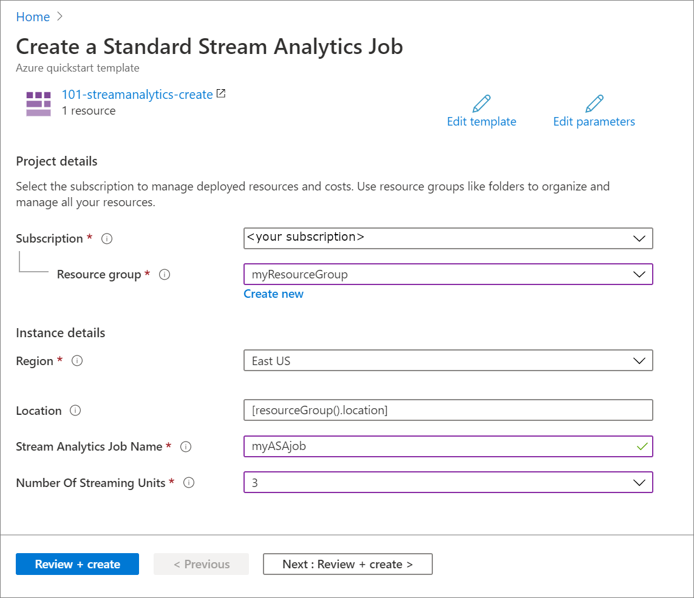

# Quickstart: Create an Azure Stream Analytics job by using an ARM template

In this quickstart, you use an Azure Resource Manager template (ARM template) to create an Azure Stream Analytics job. Once the job is created, you validate the deployment.

[!INCLUDE [About Azure Resource Manager](../../includes/resource-manager-quickstart-introduction.md)]

If your environment meets the prerequisites and you're familiar with using ARM templates, select the **Deploy to Azure** button. The template will open in the Azure portal.

[](https://portal.azure.com/#create/Microsoft.Template/uri/https%3A%2F%2Fraw.githubusercontent.com%2FAzure%2Fazure-quickstart-templates%2Fmaster%2Fquickstarts%2Fmicrosoft.streamanalytics%2Fstreamanalytics-create%2Fazuredeploy.json)

## Prerequisites

To complete this article, you need to:

* Have an Azure subscription - [create one for free](https://azure.microsoft.com/free/).

## Review the template

The template used in this quickstart is from [Azure Quickstart Templates](https://azure.microsoft.com/resources/templates/streamanalytics-create/).

:::code language="json" source="~/quickstart-templates/quickstarts/microsoft.streamanalytics/streamanalytics-create/azuredeploy.json":::

The Azure resource defined in the template is [Microsoft.StreamAnalytics/StreamingJobs](/azure/templates/microsoft.streamanalytics/streamingjobs): create an Azure Stream Analytics job.

## Deploy the template

In this section, you create an Azure Stream Analytics job using the ARM template.

1. Select the following image to sign in to Azure and open a template. The template creates an Azure Stream Analytics job.

   [](https://portal.azure.com/#create/Microsoft.Template/uri/https%3A%2F%2Fraw.githubusercontent.com%2FAzure%2Fazure-quickstart-templates%2Fmaster%2Fquickstarts%2Fmicrosoft.streamanalytics%2Fstreamanalytics-create%2Fazuredeploy.json)

2. Provide the required values to create your Azure Stream Analytics job.

   

   Provide the following values:

   |Property  |Description  |
   |---------|---------|
   |**Subscription**     | From the drop-down, select your Azure subscription.        |
   |**Resource group**     | Specify whether you want to create a new resource group or use an existing one. A resource group is a container that holds related resources for an Azure solution. For more information, see [Azure Resource Group overview](../azure-resource-manager/management/overview.md). |
   |**Region**     | Select **East US**. For other available regions, see [Azure services available by region](https://azure.microsoft.com/regions/services/).        |
   |**Stream Analytics Job Name**     | Provide a name for your Stream Analytics job.      |
   |**Number of Streaming Units**     |  Choose the number of streaming units you need. For more information, see [Understand and adjust Streaming Units](stream-analytics-streaming-unit-consumption.md).       |

3. Select **Review + Create**, then **Create**.

## Review deployed resources

You can either use the Azure portal to check the Azure Stream Analytics job or use the following Azure CLI or Azure PowerShell script to list the resource.

### Azure CLI

```azurecli-interactive
echo "Enter your Azure Stream Analytics job name:" &&
read streamAnalyticsJobName &&
echo "Enter the resource group where the Azure Stream Analytics job exists:" &&
read resourcegroupName &&
az stream-analytics job show -g $resourcegroupName -n $streamAnalyticsJobName
```

### Azure PowerShell

```azurepowershell-interactive
$resourceGroupName = Read-Host -Prompt "Enter the resource group name where your Azure Stream Analytics job exists"
(Get-AzResource -ResourceType "Microsoft.StreamAnalytics/StreamingJobs" -ResourceGroupName $resourceGroupName).Name
 Write-Host "Press [ENTER] to continue..."
```

## Clean up resources

If you plan to continue on to subsequent tutorials, you may wish to leave these resources in place. When no longer needed, delete the resource group, which deletes the Azure Stream Analytics job. To delete the resource group by using Azure CLI or Azure PowerShell:

### Azure CLI

```azurecli-interactive
echo "Enter the Resource Group name:" &&
read resourceGroupName &&
az group delete --name $resourceGroupName &&
echo "Press [ENTER] to continue ..."
```

### Azure PowerShell

```azurepowershell-interactive
$resourceGroupName = Read-Host -Prompt "Enter the Resource Group name"
Remove-AzResourceGroup -Name $resourceGroupName
Write-Host "Press [ENTER] to continue..."
```

## Next steps

In this quickstart, you created an Azure Stream Analytics job by using an ARM template and validated the deployment. Advance to the next article to learn how to export an ARM template for an existing job using VS Code.

> [!div class="nextstepaction"]
> [Export an Azure Stream Analytics job ARM template](resource-manager-export.md)
