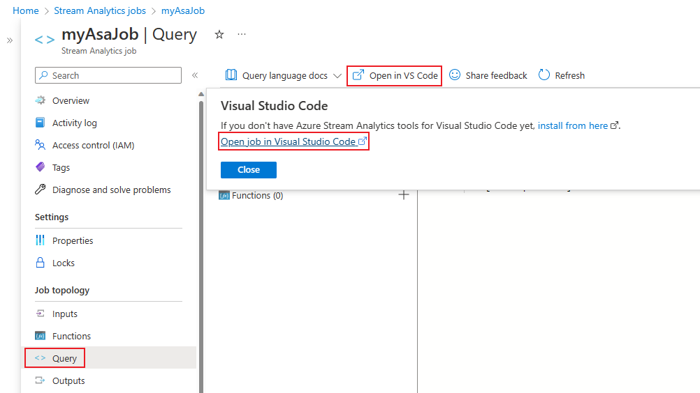
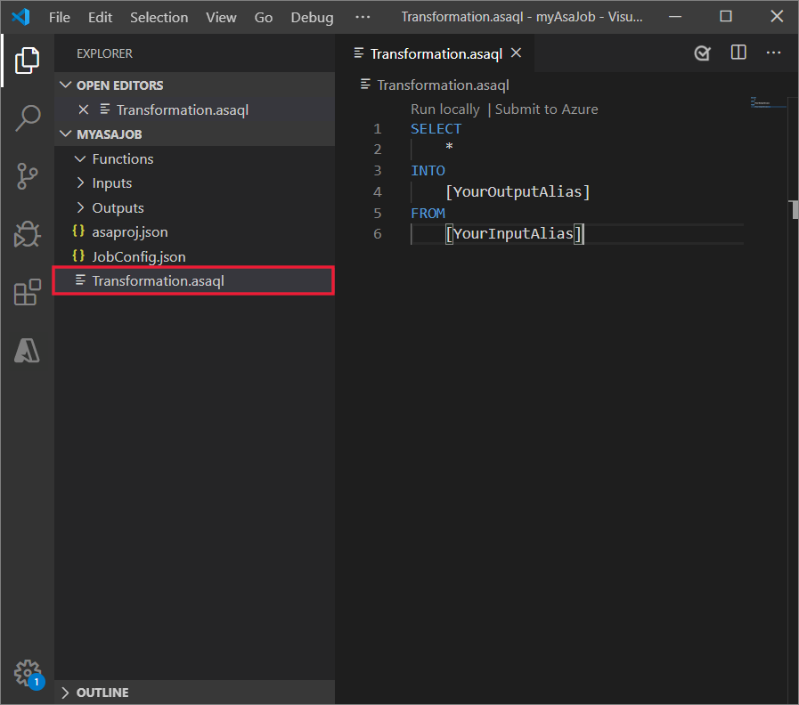

# Export an Azure Stream Analytics job Azure Resource Manager template

[Azure Resource Manager templates](../azure-resource-manager/templates/overview.md) allow you to implement infrastructure as code. The template is a JavaScript Object Notation (JSON) file that defines the infrastructure and configuration for your resources. You specify the resources to deploy and the properties for those resources.

You can redeploy an Azure Stream Analytics job by exporting the Azure Resource Manager template.

## Open a job in VS Code

Before you can export a template, you must first open an existing Stream Analytics job in Visual Studio Code. 

To export a job to a local project, locate the job you want to export in the **Stream Analytics Explorer** in the Azure portal. From the **Query** page, select **Open in VS Code**. And then select **Open job in Visual Studio Code**.



For more information on using Visual Studio Code to manage Stream Analytics jobs, see the [Visual Studio Code quickstart](quick-create-visual-studio-code.md).

## Compile the script 

The next step is to compile the job script to an Azure Resource Manager template. Before you compile the script, ensure that your job has at least one input, and one output configured. If no input or output is configured, you need to configure the input and output first.

1. In Visual Studio Code, navigate to your job's *Transformation.asaql* file.

   

1. Right-click the *Transformation.asaql* file and select **ASA: Compile Script** from the menu.

1. Notice that a **Deploy** folder appears in your Stream Analytics job workspace.

1. Explore the *JobTemplate.json* file, which is the Azure Resource Manager template used to deploy.

## Complete the parameters file

Next, complete the Azure Resource Manager template parameters file.

1. Open the *JobTemplate.parameters.json* file located in the **Deploy** folder of your Stream Analytics job workspace in Visual Studio Code.

1. Notice that the input and output keys are null. Replace the null values with the actual access keys for your input and output resources.

1. Save the parameters file.

## Deploy using templates

You're ready to deploy your Azure Stream Analytics job using the Azure Resource Manager templates you generated in the previous section.

In a PowerShell window, run the following command. Be sure to replace the *ResourceGroupName*, *TemplateFile*, and *TemplateParameterFile* with your actual resource group name, and the complete file paths to the *JobTemplate.json* and *JobTemplate.parameters.json* files in the **Deploy Folder** of your job workspace.

If you don't have Azure PowerShell configured, follow the steps in [Install Azure PowerShell module](/powershell/azure/install-Az-ps).

```azurepowershell
New-AzResourceGroupDeployment -ResourceGroupName "<your resource group>" -TemplateFile "<path to JobTemplate.json>" -TemplateParameterFile "<path to JobTemplate.parameters.json>"
```

## Next steps

* [Test Azure Stream Analytics jobs locally with live input using Visual Studio Code](visual-studio-code-local-run-live-input.md)

* [Explore Azure Stream Analytics jobs with Visual Studio Code (Preview)](visual-studio-code-explore-jobs.md)
