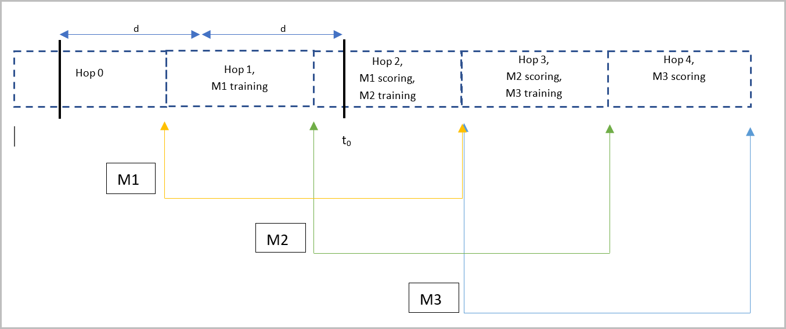
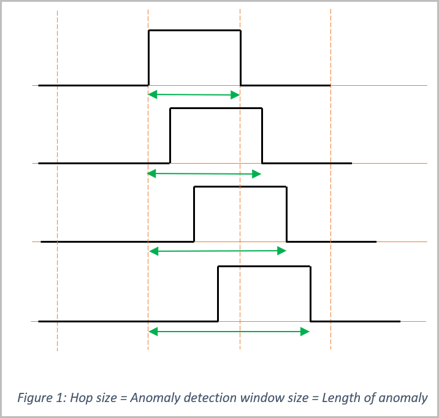
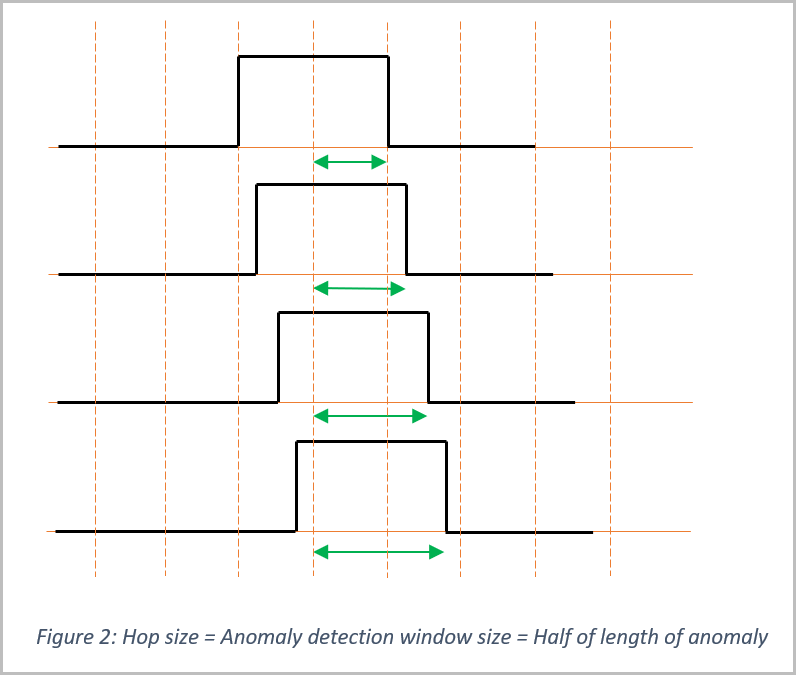
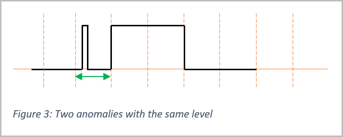

# Anomaly Detection in Azure Stream Analytics

> [!IMPORTANT]
> This functionality is in preview, it’s not recommend using with production workloads.

The **AnomalyDetection** operator is used to detect different types of anomalies in event streams. For example, a slow decrease in free memory over a long time can be indicative of a memory leak, or the number of web service requests that are stable in a range might dramatically increase or decrease.  

The AnomalyDetection operator detects three types of anomalies: 

* **Bi-directional Level Change**: A sustained increase or decrease in the level of values, both upward and downward. This value is different from spikes and dips, which are instantaneous or short-lived changes.  

* **Slow Positive Trend**: A slow increase in the trend over time.  

* **Slow Negative Trend**: A slow decrease in the trend over time.  

When using the AnomalyDetection operator, you must specify the **Limit Duration** clause. This clause specifies the time interval (how far back in history from the current event) should be considered when detecting anomalies. This operator can optionally be limited to only events that match a certain property or condition by using the **When** clause. This operator can also optionally process groups of events separately based on the key specified in the **Partition by** clause. Training and prediction occur independently for each partition. 

## Syntax for AnomalyDetection operator

`ANOMALYDETECTION(<scalar_expression>) OVER ([PARTITION BY <partition key>] LIMIT DURATION(<unit>, <length>) [WHEN boolean_expression])` 

**Example usage**  

`SELECT id, val, ANOMALYDETECTION(val) OVER(PARTITION BY id LIMIT DURATION(hour, 1) WHEN id > 100) FROM input`

### Arguments

* **scalar_expression** - The scalar expression over which the anomaly detection is performed. Allowed values for this parameter include Float or Bigint data types that return a single (scalar) value. The wildcard expression **\*** is not allowed. Scalar expression cannot contain other analytic functions or external functions. 

* **partition_by_clause** - The `PARTITION BY <partition key>` clause divides the
learning and training across separate partitions. In other words, a separate
model would be used per value of `<partition key>` and only events with that
value would be used for learning and training in that model. For example, the following query trains and scores a reading against other readings of the same sensor only:

  `SELECT sensorId, reading, ANOMALYDETECTION(reading) OVER(PARTITION BY sensorId LIMIT DURATION(hour, 1)) FROM input`

* **limit_duration clause** `DURATION(<unit>, <length>)` - Specifies the time interval (how far back in history from the current event) should be considered when detecting anomalies. See [DATEDIFF](https://msdn.microsoft.com/azure/stream-analytics/reference/datediff-azure-stream-analytics) for a detailed description of supported units and their abbreviations. 

* **when_clause** - Specifies a boolean condition for the events considered in the
anomaly detection computation.

### Return Types

The AnomalyDetection operator returns a record containing all three scores as its output. The
properties associated with the different types of anomaly detectors are:

- BiLevelChangeScore
- SlowPosTrendScore
- SlowNegTrendScore

To extract the individual values out of the record, use the **GetRecordPropertyValue** function. For example:

`SELECT id, val FROM input WHERE (GetRecordPropertyValue(ANOMALYDETECTION(val) OVER(LIMIT DURATION(hour, 1)), 'BiLevelChangeScore')) > 3.25` 

Anomaly of a type is detected when one of the anomaly scores crosses a threshold. The threshold can be any floating-point number >= 0. The threshold is a tradeoff between sensitivity and confidence. For example, a lower threshold would make detection more sensitive to changes and generate more alerts, whereas a higher threshold could make detection less sensitive and more confident but mask some anomalies. The exact threshold value to use depends on the scenario. There is no upper limit, but the recommended range is 3.25-5. 

## Anomaly detection algorithm

* AnomalyDetection operator uses an **unsupervised learning** approach where it does not assume any type of distribution in the events. In general, two models are maintained in parallel at any given time, where one of them is used for scoring and the other is trained in the background. The anomaly detection models are trained using data from the current stream rather than using an out-of-band mechanism. The amount of data used for training depends on the window size d specified by the user within the Limit Duration parameter. Each model ends up getting trained based on d to 2d worth of events. It is recommended to have at least 50 events in each window for best results. 

* AnomalyDetection operator uses **sliding window semantics** to train models and score events. Which means that each event is evaluated for anomaly and a score is returned. The score is an indication of the confidence level of that anomaly. 

* AnomalyDetection operator provides a **repeatability guarantee** the same input always produces the same score regardless of the job output start time. The job output start time represents the time at which the first output event is produced by the job. It is set by the user to the current time, a custom value, or the last output time (if the job had produced an output previously). 

### Training the models 

As time progresses, models are trained with different data. To make sense of the scores, it helps to understand the underlying mechanism by which the models are trained. Here, **t<sub>0</sub>** is the **job output start time** and **d** is the **window size** from the Limit Duration parameter. Assume that time is divided up into **hops of size d**, starting from `01/01/0001 00:00:00`. The following steps are used to train the model and score the events:

* When a job starts up, it reads data starting at time t<sub>0</sub> – 2d.  
* When time reaches the next hop, a new model M1 is created and starts getting trained.  
* When time advances by another hop, a new model M2 is created and starts getting trained.  
* When time reaches t<sub>0</sub>, M1 is made active and its score starts getting outputted.  
* At the next hop, three things happen at the same time:  

  * M1 is no longer needed and it is discarded.  
  * M2 has been sufficiently trained so it's used for scoring.  
  * A new model M3 is created and starts getting trained in the background.  

* This cycle repeats for every hop, where the active model is discarded, switch to the parallel model, and start training a third model in the background. 

Diagrammatically, the steps look as follows: 



|**Model** | **Training start time** | **Time to start using its score** |
|---------|---------|---------|
|M1     | 11:20   | 11:33   |
|M2     | 11:30   | 11:40   |
|M3     | 11:40   | 11:50   |

* Model M1 starts training at 11:20 am, which is the next hop after the job starts reading at 11:13 am. The first output is produced from M1 at 11:33 am after training with 13 minutes of data. 

* A new model M2 also starts training at 11:30 am but its score does not get used until 11:40 am, which is after it has been trained with 10 minutes of data. 

* M3 follows the same pattern as M2. 

### Scoring with the models 

At the Machine Learning level, the anomaly detection algorithm computes a strangeness value for each incoming event by comparing it with events in a history window. The strangeness computation differs for each type of anomaly.  

Let's review the strangeness computation in detail (assume a set of historical windows with events exists): 

1. **Bi-directional level change:** Based on the history window, a normal operating range is computed as [10th percentile, 90th percentile] that is, 10th percentile value as the lower bound and 90th percentile value as the upper bound. A strangeness value for the current event is computed as:  

   - 0, if event_value is in normal operating range  
   - event_value/90th_percentile, if event_value > 90th_percentile  
   - 10th_percentile/event_value, if the event_value is < 10th_percentile  

2. **Slow positive trend:** A trend line over the event values in the history window is calculated and we look for a positive trend within the line. The strangeness value is computed as:  

   - Slope, if slope is positive  
   - 0, otherwise 

1. **Slow negative trend:** A trend line over the event values in the history window is calculated and we look for negative trend within the line. The strangeness value is computed as: 

   - Slope, if slope is negative  
   - 0, otherwise  

Once the strangeness value for the incoming event is computed, a martingale value is computed based on the strangeness value (see the [Machine Learning blog](https://blogs.technet.microsoft.com/machinelearning/2014/11/05/anomaly-detection-using-machine-learning-to-detect-abnormalities-in-time-series-data/) for details on how the martingale value is computed). This martingale value is retuned as the anomaly score. The martingale value increases slowly in response to strange values, which allows the detector to remain robust to sporadic changes and reduces false alerts. It also has a useful property: 

Probability [there exists t such that M<sub>t</sub> > λ ] < 1/λ, where M<sub>t</sub> is the martingale value at instant t and λ is a real value. For example, if we alert when M<sub>t</sub>>100, then the probability of false positives is less than 1/100.  

## Guidance for using the bi-directional level change detector 

The bi-directional level change detector can be used in scenarios such as power outage and recovery, or rush hour traffic, etc. However, it operates in such a way that once a model is trained with certain data, another level change is anomalous if and only if the new value is higher than the previous upper limit (upward level change case) or lower than the previous lower limit (downward level change case). Hence, a model should not see data values in the range of the new level (upward or downward) in its training window for them to be considered anomalous. 

The following points should be considered when using this detector: 

1. When the time series suddenly sees an increase or drop in value, the AnomalyDetection operator detects it. But detecting the return to normal requires more planning. If a time series was in steady state before the anomaly, which can be achieved by setting the AnomalyDetection operator’s detection window to at most half the length of the anomaly. This scenario assumes that the minimum duration of the anomaly can be estimated ahead of time, and there are enough events in that time frame to train the model sufficiently (at least 50 events). 

   This is shown in figures 1 and 2 below using an upper limit change (the same logic applies to a lower limit change). In both figures, the waveforms are an anomalous level change. Vertical orange lines denote hop boundaries and the hop size is the same as the detection window specified in the AnomalyDetection operator. The green lines indicate the size of the training window. In Figure 1, the hop size is the same as the time for which anomaly lasts. In Figure 2, the hop size is half the time for which the anomaly lasts. In all cases, an upward change is detected because the model used for scoring was trained on normal data. But based on how the bi-directional level change detector works, we must exclude the normal values from the training window used for the model that scores the return to normal. In Figure 1, the scoring model’s training includes some normal events, so return to normal can't be detected. But in Figure 2, the training only includes the anomalous part, which ensures that the return to normal is detected. Anything smaller than half also works for the same reason, whereas anything bigger will end up including a bit of the normal events. 

   

   

2. In cases where the length of the anomaly cannot be predicted, this detector operates at best effort. However, choosing a narrower time window limits the training data, which would increase the probability of detecting the return to normal. 

3. In the following scenario, the longer anomaly isn't detected as the training window already includes an anomaly of the same high value. 

   

## Example query to detect anomalies 

The following query can be used to output an alert if an anomaly is detected.
When the input stream is not uniform, the aggregation step can help transform it
into a uniform time series. The example uses AVG but the specific type of
aggregation depends on the user scenario. Furthermore, when a time series has
gaps greater than the aggregation window, there aren't any events in the time
series to trigger anomaly detection (as per sliding window semantics). As a
result, the assumption of uniformity is broken when the next event does
arrive. In such situations, the gaps in the time
series should be filled. One possible approach is to take the last event in every hop window, as
shown below.

```sql
    WITH AggregationStep AS 
    (
         SELECT
               System.Timestamp as tumblingWindowEnd,

               AVG(value) as avgValue

         FROM input
         GROUP BY TumblingWindow(second, 5)
    ),

    FillInMissingValuesStep AS
    (
          SELECT
                System.Timestamp AS hoppingWindowEnd,

                TopOne() OVER (ORDER BY tumblingWindowEnd DESC) AS lastEvent

         FROM AggregationStep
         GROUP BY HOPPINGWINDOW(second, 300, 5)

    ),

    AnomalyDetectionStep AS
    (

          SELECT
                hoppingWindowEnd,
                lastEvent.tumblingWindowEnd as lastTumblingWindowEnd,
                lastEvent.avgValue as lastEventAvgValue,
                system.timestamp as anomalyDetectionStepTimestamp,

                ANOMALYDETECTION(lastEvent.avgValue) OVER (LIMIT DURATION(hour, 1)) as
                scores

          FROM FillInMissingValuesStep
    )

    SELECT
          alert = 1,
          hoppingWindowEnd,
          lastTumblingWindowEnd,
          lastEventAvgValue,
          anomalyDetectionStepTimestamp,
          scores

    INTO output

    FROM AnomalyDetectionStep

    WHERE

        CAST(GetRecordPropertyValue(scores, 'BiLevelChangeScore') as float) >= 3.25

        OR CAST(GetRecordPropertyValue(scores, 'SlowPosTrendScore') as float) >=
        3.25

       OR CAST(GetRecordPropertyValue(scores, 'SlowNegTrendScore') as float) >=
       3.25
```

## Performance Guidance

* Use six streaming units for jobs. 
* Send events at least one second apart.
* A non-partitioned query that is using the AnomalyDetection operator can produce results with a computation latency of about 25 ms on average.
* The latency experienced by a partitioned query varies slightly with the number of partitions, as the number of computations is higher. However, the latency is about the same as the non-partitioned case for a comparable total number of events across all partitions.
* While reading non-real-time data, a large amount of data is ingested quickly. Processing this data is currently slower. The latency in such scenarios was found to increase linearly with the number of data points in the window rather than the window size or event interval. To reduce the latency in non-real-time cases, consider using a smaller window size. Alternatively, consider starting your job from the current time. A few examples of latencies in a non-partitioned query: 
    - 60 data points in the detection window can result in a latency of 10 seconds with a throughput of 3 MBps. 
    - At 600 data points, the latency can reach about 80 seconds with a throughput of 0.4 MBps.

## Limitations of the AnomalyDetection operator 

* This operator currently does not support spike and dip detection. Spikes and dips are spontaneous or short-lived changes in the time series. 

* This operator currently does not handle seasonality patterns. Seasonality patterns are repeated patterns in the data, for example a different web traffic behavior during weekends or different shopping trends during Black Friday, which are not anomalies but an expected pattern in behavior. 

* This operator expects the input time series to be uniform. An event stream can be made uniform by aggregating over a tumbling or hopping window. In scenarios where the gap between events is always smaller than the aggregation window, a tumbling window is sufficient to make the time series uniform. When the gap can be larger, the gaps can be filled by repeating the last value using a hopping window. 

## References

* [Anomaly detection – Using machine learning to detect abnormalities in time series data](https://blogs.technet.microsoft.com/machinelearning/2014/11/05/anomaly-detection-using-machine-learning-to-detect-abnormalities-in-time-series-data/)
* [Machine learning anomaly detection API](https://docs.microsoft.com/en-gb/azure/machine-learning/machine-learning-apps-anomaly-detection-api)
* [Time series anomaly detection](https://msdn.microsoft.com/library/azure/mt775197.aspx)

## Next steps

* [Introduction to Azure Stream Analytics](stream-analytics-introduction.md)
* [Get started using Azure Stream Analytics](stream-analytics-real-time-fraud-detection.md)
* [Scale Azure Stream Analytics jobs](stream-analytics-scale-jobs.md)
* [Azure Stream Analytics Query Language Reference](https://msdn.microsoft.com/library/azure/dn834998.aspx)
* [Azure Stream Analytics Management REST API Reference](https://msdn.microsoft.com/library/azure/dn835031.aspx)

