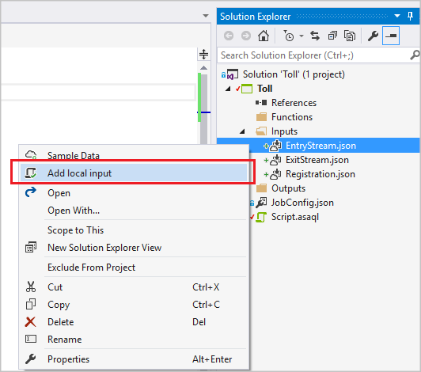
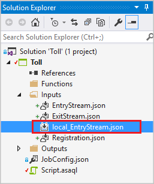
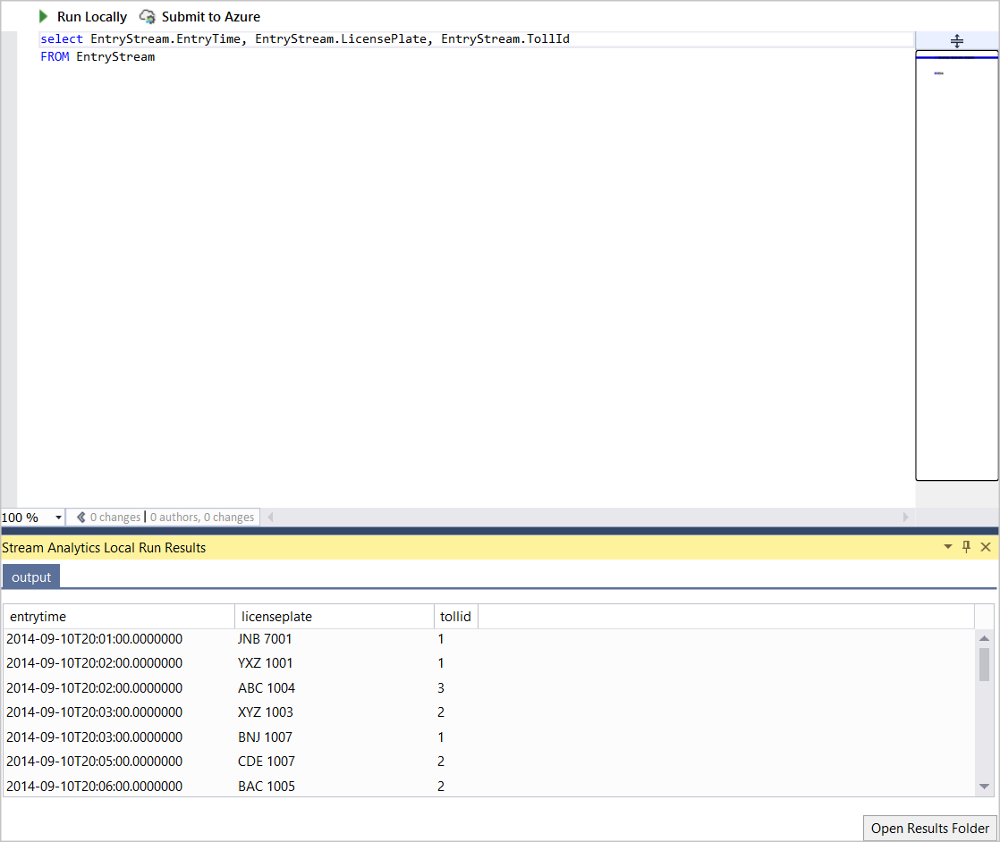
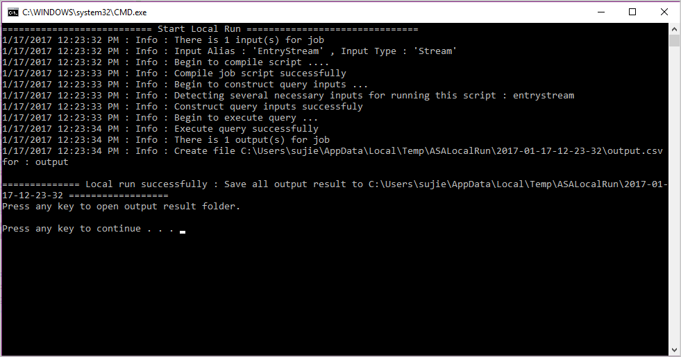
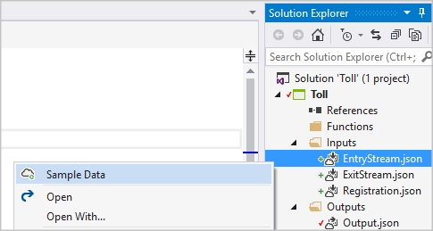
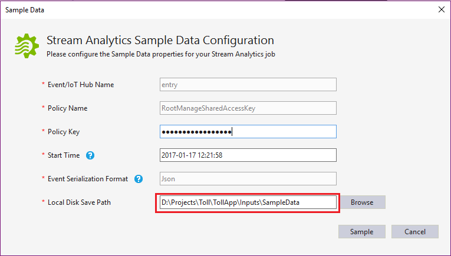

# Test Stream Analytics queries locally with Visual Studio

You can use Azure Stream Analytics tools for Visual Studio to test your Stream Analytics jobs locally with sample data.

Use this [Quickstart](stream-analytics-quick-create-vs.md) to learn how to create a Stream Analytics job using Visual Studio.

## Test your query

In your Azure Stream Analytics project, double-click **Script.asaql** to open the script in the editor. You can compile the query to see if there are any syntax errors. The query editor supports IntelliSense, syntax coloring, and an error marker.

 
### Add local input

To validate your query against local static data, right-click the input and select **Add local input**.
   

   
In the pop-up window, select sample data from your local path and **Save**.
   

   
A file named **local_EntryStream.json** is added automatically to your inputs folder.
   

   
Select **Run Locally** in the query editor. Or you can press F5.
   

   
The output can be viewed in a table format directly from Visual Studio.

You can find the output path from the console output. Press any key to open the result folder.
   

   
Check the results in the local folder.
   

   

### Sample input
You can also collect sample input data from your input sources to a local file. Right-click the input configuration file, and select **Sample Data**. 

You can only sample data streaming from Event Hubs or IoT Hubs. Other input sources are not supported. In the pop-up dialog box, fill in the local path to save the sample data and select **Sample**.

 
You can see the progress in the **Output** window. 

## Next steps

* [Use Visual Studio to view Azure Stream Analytics jobs](stream-analytics-vs-tools.md)
* [Quickstart: Create a Stream Analytics job using Visual Studio](stream-analytics-quick-create-vs.md)
* [Tutorial: Deploy an Azure Stream Analytics job with CI/CD using VSTS](stream-analytics-tools-visual-studio-cicd-vsts.md)
* [Continuously integrate and develop with Stream Analytics tools](stream-analytics-tools-for-visual-studio-cicd.md)