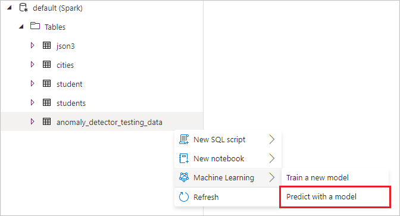
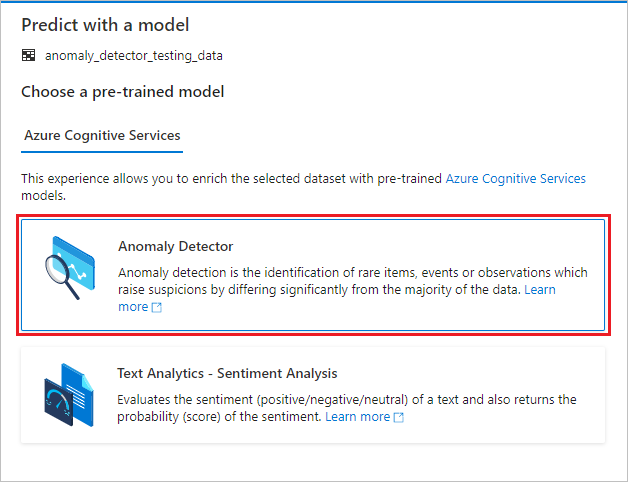

# Tutorial: Anomaly detection with Azure AI services

In this tutorial, you'll learn how to easily enrich your data in Azure Synapse Analytics with [Azure AI services](../../ai-services/index.yml). You'll use [Azure AI Anomaly Detector](../../ai-services/anomaly-detector/index.yml) to find anomalies. A user in Azure Synapse can simply select a table to enrich for detection of anomalies.

This tutorial covers:

> [!div class="checklist"]
> - Steps for getting a Spark table dataset that contains time series data.
> - Use of a wizard experience in Azure Synapse to enrich data by using Anomaly Detector.

If you don't have an Azure subscription, [create a free account before you begin](https://azure.microsoft.com/free/).

## Prerequisites

- [Azure Synapse Analytics workspace](../get-started-create-workspace.md) with an Azure Data Lake Storage Gen2 storage account configured as the default storage. You need to be the *Storage Blob Data Contributor* of the Data Lake Storage Gen2 file system that you work with.
- Spark pool in your Azure Synapse Analytics workspace. For details, see [Create a Spark pool in Azure Synapse](../quickstart-create-sql-pool-studio.md).
- Completion of the pre-configuration steps in the [Configure Azure AI services in Azure Synapse](tutorial-configure-cognitive-services-synapse.md) tutorial.

## Sign in to the Azure portal

Sign in to the [Azure portal](https://portal.azure.com/).

## Create a Spark table

You need a Spark table for this tutorial.

Create a PySpark notebook and run following code.

```python
from pyspark.sql.functions import lit

df = spark.createDataFrame([
    ("1972-01-01T00:00:00Z", 826.0),
    ("1972-02-01T00:00:00Z", 799.0),
    ("1972-03-01T00:00:00Z", 890.0),
    ("1972-04-01T00:00:00Z", 900.0),
    ("1972-05-01T00:00:00Z", 766.0),
    ("1972-06-01T00:00:00Z", 805.0),
    ("1972-07-01T00:00:00Z", 821.0),
    ("1972-08-01T00:00:00Z", 20000.0),
    ("1972-09-01T00:00:00Z", 883.0),
    ("1972-10-01T00:00:00Z", 898.0),
    ("1972-11-01T00:00:00Z", 957.0),
    ("1972-12-01T00:00:00Z", 924.0),
    ("1973-01-01T00:00:00Z", 881.0),
    ("1973-02-01T00:00:00Z", 837.0),
    ("1973-03-01T00:00:00Z", 9000.0)
], ["timestamp", "value"]).withColumn("group", lit("series1"))

df.write.mode("overwrite").saveAsTable("anomaly_detector_testing_data")

```
A Spark table named **anomaly_detector_testing_data** should now appear in the default Spark database.

## Open the Cognitive Services wizard

1. Right-click the Spark table created in the previous step. Select **Machine Learning** > **Predict with a model** to open the wizard.

   

2. A configuration panel appears, and you're asked to select a pre-trained model. Select **Anomaly Detector**.

   

## Configure Anomaly Detector

Provide the following details to configure Anomaly Detector:

- **Azure Cognitive Services linked service**: As part of the prerequisite steps, you created a linked service to your [Azure AI service](tutorial-configure-cognitive-services-synapse.md). Select it here.

- **Granularity**: The rate at which your data is sampled. Choose **monthly**. 

- **Timestamp column**: The column that represents the time of the series. Choose **timestamp (string)**.

- **Time series value column**: The column that represents the value of the series at the time specified by the Timestamp column. Choose **value (double)**.

- **Grouping column**: The column that groups the series. That is, all rows that have the same value in this column should form one time series. Choose **group (string)**.

When you're done, select **Open notebook**. This will generate a notebook for you with PySpark code that uses Azure AI services to detect anomalies.


## Run the notebook

The notebook that you just opened uses the [SynapseML library](https://github.com/microsoft/SynapseML) to connect to Azure AI services. The Azure AI services linked service that you provided allow you to securely reference your Azure AI service from this experience without revealing any secrets.

You can now run all cells to perform anomaly detection. Select **Run All**. [Learn more about Anomaly Detector in Azure AI services](../../ai-services/anomaly-detector/index.yml).


## Next steps

- [Tutorial: Sentiment analysis with Azure AI services](tutorial-cognitive-services-sentiment.md)
- [Tutorial: Machine learning model scoring in Azure Synapse dedicated SQL pools](tutorial-sql-pool-model-scoring-wizard.md)
- [Tutorial: Use Multivariate Anomaly Detector in Azure Synapse Analytics](../../ai-services/Anomaly-Detector/tutorials/multivariate-anomaly-detection-synapse.md)
- [SynapseML anomaly detection](https://microsoft.github.io/SynapseML/docs/documentation/transformers/transformers_cognitive/#anomaly-detection)
- [Machine Learning capabilities in Azure Synapse Analytics](what-is-machine-learning.md)

