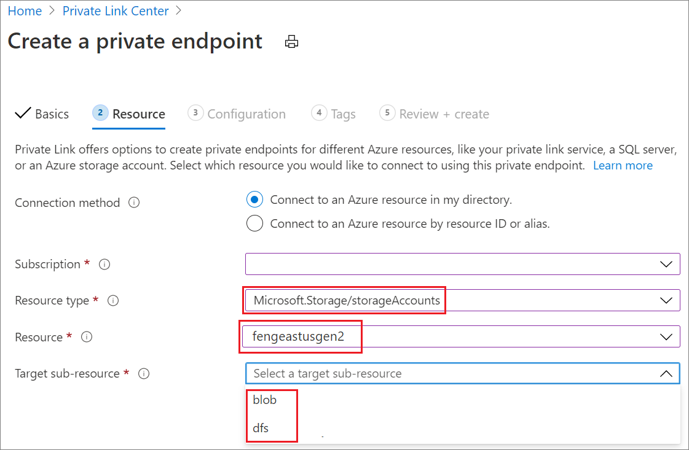
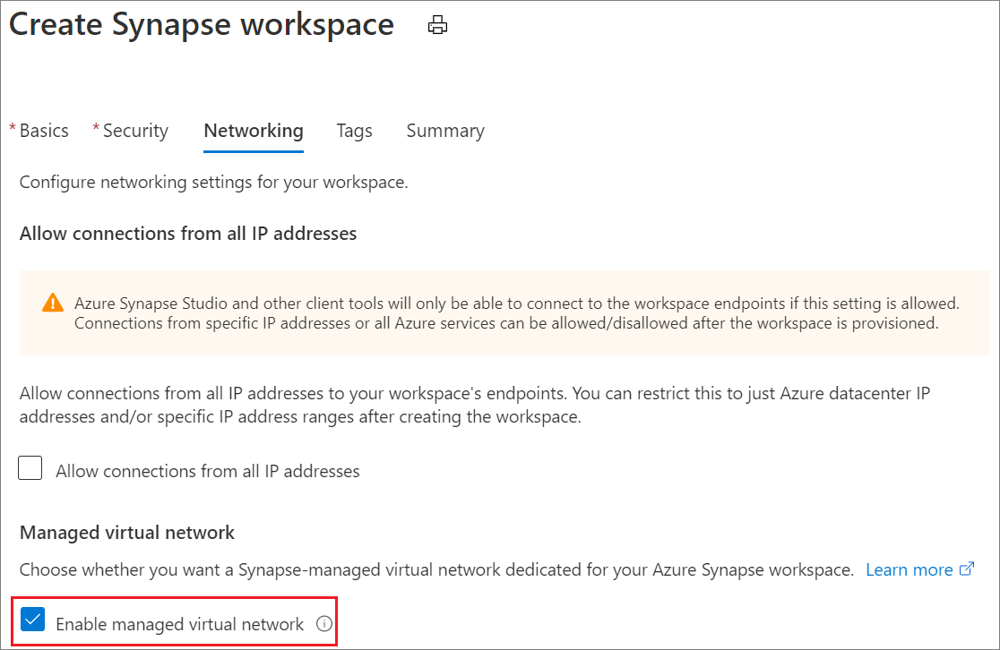
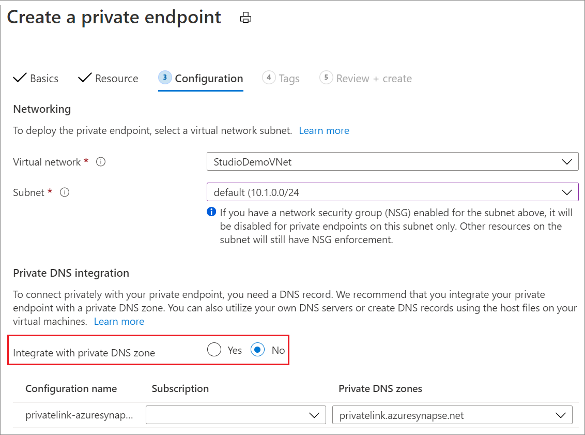
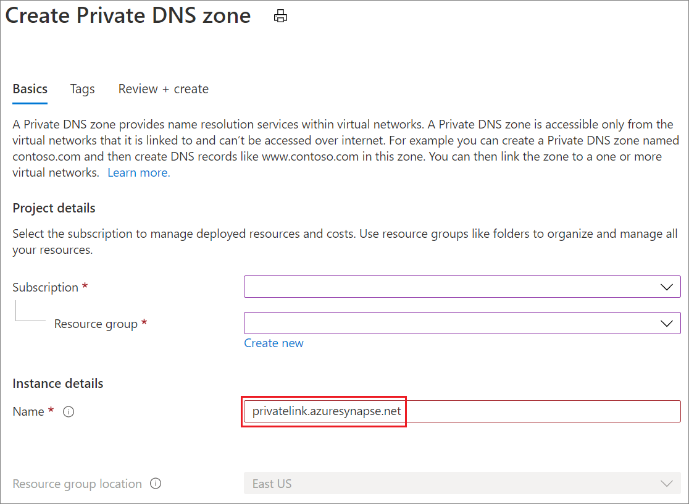
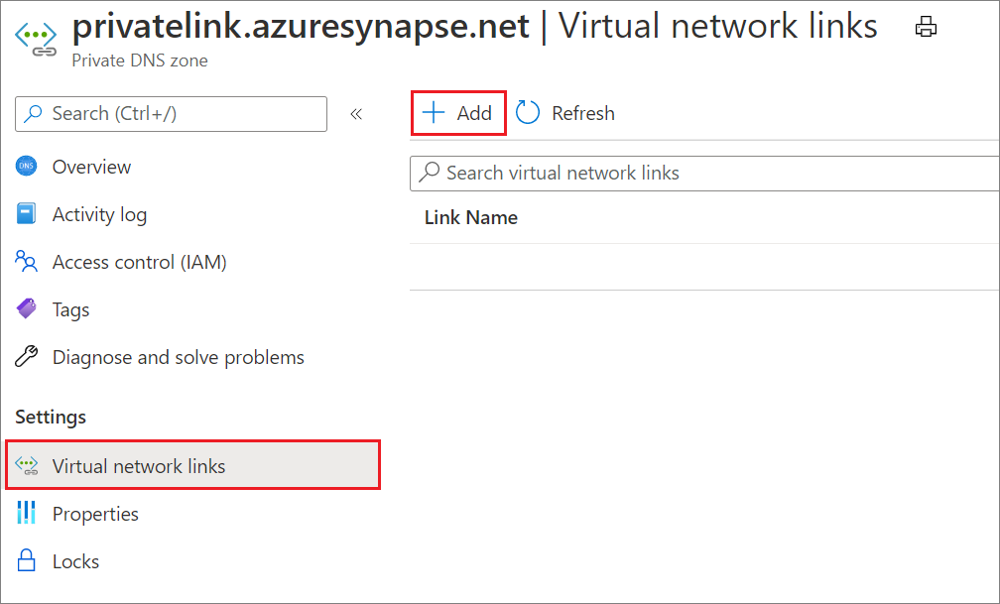
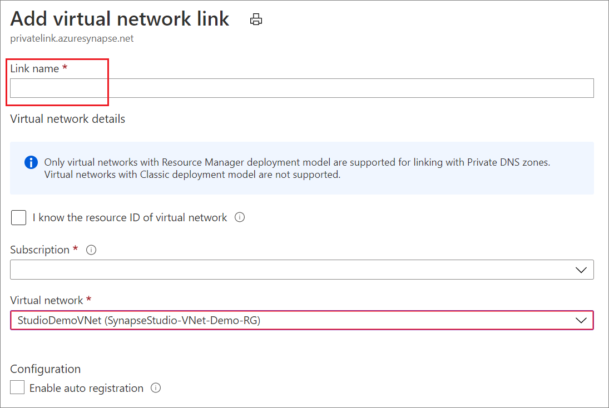
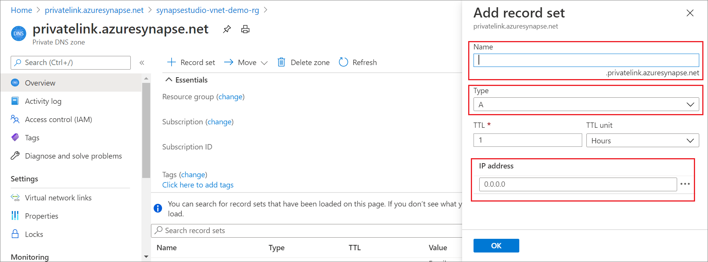

# Connect to workspace resources from a restricted network

Suppose you are an IT administrator who is managing your organization's restricted network. You want to enable the network connection between Azure Synapse Analytics Studio and a workstation within this restricted network. This article shows you how.

## Prerequisites

* **Azure subscription**: If you don't have an Azure subscription, create a [free Azure account](https://azure.microsoft.com/free/) before you begin.
* **Azure Synapse Analytics workspace**: You can create one from Azure Synapse Analytics. You need the workspace name in step 4.
* **A restricted network**: The IT admin maintains the restricted network for the organization, and has permission to configure the network policy. You need the virtual network name and its subnet in step 3.

## Step 1: Add network outbound security rules to the restricted network

You'll need to add four network outbound security rules with four service tags. 
* AzureResourceManager
* AzureFrontDoor.Frontend
* AzureActiveDirectory
* AzureMonitor (This type of rule is optional. Add it only when you want to share the data with Microsoft.)

The following screenshot shows details for the Azure Resource Manager outbound rule.

When you're creating the other three rules, replace the value of **Destination service tag** with **AzureFrontDoor.Frontend**, **AzureActiveDirectory**, or **AzureMonitor** from the list.

For more information, see [Service tags overview](../../virtual-network/service-tags-overview.md).

## Step 2: Create private link hubs

Next, create private link hubs from the Azure portal. To find this in the portal, search for *Azure Synapse Analytics (private link hubs)*, and then fill in the required information to create it. 

## Step 3: Create a private endpoint for your Synapse Studio

To access the Azure Synapse Analytics Studio, you must create a private endpoint from the Azure portal. To find this in the portal, search for *Private Link*. In the **Private Link Center**, select **Create private endpoint**, and then fill in the required information to create it. 

> [!Note]
> Ensure that the **Region** value is the same as the one where your Azure Synapse Analytics workspace is.

On the **Resource** tab, choose the private link hub, which you created in step 2.

On the **Configuration** tab: 
* For **Virtual network**, select the restricted virtual network name.
* For **Subnet**, select the subnet of the restricted virtual network. 
* For **Integrate with private DNS zone**, select **Yes**.

After the private link endpoint is created, you can access the sign-in page of the web tool for Azure Synapse Analytics Studio. However, you aren't able to access the resources inside your workspace yet. For that, you need to complete the next step.

## Step 4: Create private endpoints for your workspace resource

To access the resources inside your Azure Synapse Analytics Studio workspace resource, you need to create the following:

- At least one private link endpoint with a **Target sub-resource** type of **Dev**.
- Two other optional private link endpoints with types of **Sql** or **SqlOnDemand**, depending on what resources in the workspace you want to access.

Creating these is similar to how you create the endpoint in the previous step.  

On the **Resource** tab:

* For **Resource type**, select **Microsoft.Synapse/workspaces**.
* For **Resource**, select the workspace name that you created previously.
* For **Target sub-resource**, select the endpoint type:
  * **Sql** is for SQL query execution in SQL pool.
  * **SqlOnDemand** is for SQL built-in query execution.
  * **Dev** is for accessing everything else inside Azure Synapse Analytics Studio workspaces. You need to create at least one private link endpoint of this type.

## Step 5: Create private endpoints for workspace linked storage

To access the linked storage with the storage explorer in Azure Synapse Analytics Studio workspace, you must create one private endpoint. The steps for this are similar to those of step 3. 

On the **Resource** tab:
* For **Resource type**, select **Microsoft.Synapse/storageAccounts**.
* For **Resource**, select the storage account name that you created previously.
* For **Target sub-resource**, select the endpoint type:
  * **blob** is for Azure Blob Storage.
  * **dfs** is for Azure Data Lake Storage Gen2.

Now, you can access the linked storage resource. Within your virtual network, in your Azure Synapse Analytics Studio workspace, you can use the storage explorer to access the linked storage resource.

You can enable a managed virtual network for your workspace, as shown in this screenshot:

If you want your notebook to access the linked storage resources under a certain storage account, add managed private endpoints under your Azure Synapse Analytics Studio. The storage account name should be the one your notebook needs to access. For more information, see [Create a managed private endpoint to your data source](./how-to-create-managed-private-endpoints.md).

After you create this endpoint, the approval state shows a status of **Pending**. Request approval from the owner of this storage account, in the **Private endpoint connections** tab of this storage account in the Azure portal. After it's approved, your notebook can access the linked storage resources under this storage account.

Now, all set. You can access your Azure Synapse Analytics Studio workspace resource.

## Appendix: DNS registration for private endpoint

If the "Integrate with private DNS zone" is not enabled during the private endpoint creation as screenshot below, you must create the "**Private DNS zone**" for each of your private endpoints.

To find the **Private DNS zone** in the portal, search for *Private DNS zone*. In the **Private DNS zone**, fill in the required information below to create it.

* For **Name**, input the private DNS zone dedicated name for specific private endpoint as below:
  * **`privatelink.azuresynapse.net`** is for the private endpoint of accessing Azure Synapse Analytics Studio gateway. See this type of private endpoint creation in step 3.
  * **`privatelink.sql.azuresynapse.net`** is for this type of private endpoint of sql query execution in SQL pool and built-in pool. See the endpoint creation in step 4.
  * **`privatelink.dev.azuresynapse.net`** is for this type of private endpoint of accessing everything else inside Azure Synapse Analytics Studio workspaces. See this type of private endpoint creation in step 4.
  * **`privatelink.dfs.core.windows.net`** is for the private endpoint of accessing workspace linked Azure Data Lake Storage Gen2. See this type of private endpoint creation in step 5.
  * **`privatelink.blob.core.windows.net`** is for the private endpoint of accessing workspace linked Azure Blob Storage. See this type of private endpoint creation in step 5.

After the **Private DNS zone** created, enter the created private DNS zone and select the **Virtual network links** to add the link to your virtual network. 

Fill in the mandatory fields as below:
* For **Link name**, input the link name.
* For **Virtual network**, select your virtual network.

After the virtual network link is added, you need to add the DNS record set in the **Private DNS zone** you created before.

* For **Name**, input the dedicated name strings for different private endpoint: 
  * **web** is for the private endpoint of accessing Azure Synapse Analytics Studio.
  * "***YourWorkSpaceName***" is for the private endpoint of sql query execution in SQL pool and also for the private endpoint of accessing everything else inside Azure Synapse Analytics Studio workspaces.
  * "***YourWorkSpaceName*-ondemand**" is for the private endpoint of sql query execution in built-in pool.
* For **Type**, select DNS record type **A** only. 
* For **IP address**, input the corresponding IP address of each private endpoint. You can get the IP address in **Network interface** from your private endpoint overview.

## Next steps

Learn more about [Managed workspace virtual network](./synapse-workspace-managed-vnet.md).

Learn more about [Managed private endpoints](./synapse-workspace-managed-private-endpoints.md).
