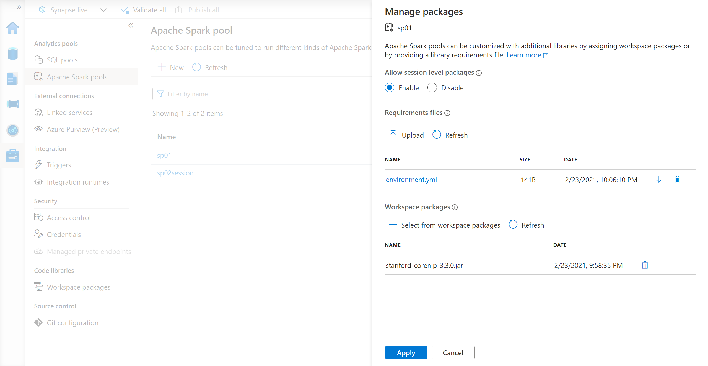
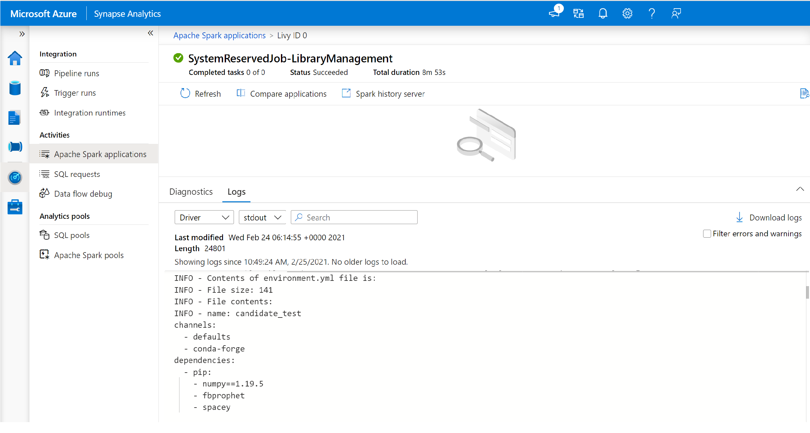

# Manage Scala and Java packages for Apache Spark in Azure Synapse Analytics

Libraries provide reusable code that you may want to include in your programs or projects. 

You may need to update your serverless Apache Spark pool environment for several reasons. For example, you may find that:
- one of your core dependencies released a new version.
- you need an extra package for training your machine learning model or preparing your data.
- you have found a better package and no longer need the older package.

To make third party or locally built code available to your applications, you can install a library onto one of your serverless Apache Spark pools or notebook session. In this article, we will cover how you can manage Scala and Java packages.

## Default Installation
Apache Spark in Azure Synapse Analytics has a full set of libraries for common data engineering, data preparation, machine learning, and data visualization tasks. The full libraries list can be found at [Apache Spark version support](apache-spark-version-support.md). 

When a Spark instance starts up, these libraries will automatically be included. Extra Scala/Java packages can be added at the Spark pool and session level.

## Workspace packages
Workspace packages can be custom or private jar files. You can upload these packages to your workspace and later assign them to a specific Spark pool.

To add workspace packages:
1. Navigate to the **Manage** > **Workspace packages** tab.
2. Upload your jar files by using the file selector.
3. Once the files have been uploaded to the Azure Synapse workspace, you can add these jar files to a given Apache Spark pool.


## Pool libraries
Once you have identified the Scala and Java packages that you would like to use for your Spark application, you can install them into a Spark pool. Pool-level libraries are available to all notebooks and jobs running on the pool.

You can update the Spark pool libraries by navigating to the Synapse Studio or Azure portal. Here, you can select the workspace libraries to install. 

After the changes are saved, a Spark job will run the installation and cache the resulting environment for later reuse. Once the job is complete, new Spark jobs or notebook sessions will use the updated pool libraries. 

> [!IMPORTANT]
> - If the package you are installing is large or takes a long time to install, this affects the Spark instance start up time.
> - Altering the PySpark, Python, Scala/Java, .NET, or Spark version is not supported.

#### Manage packages from Synapse Studio or Azure portal
Spark pool libraries can be managed either from the Synapse Studio or Azure portal. 

To update or add  libraries to a Spark pool:
1. Navigate to your Azure Synapse Analytics workspace from the Azure portal.

    If you are updating from the **Azure portal**:

    - Under the **Synapse resources** section, select the **Apache Spark pools** tab and select a Spark pool from the list.
     
    - Select the **Packages** from the **Settings** section of the Spark pool.
  
    
   
    If you are updating from the **Synapse Studio**:
    - Select **Manage** from the main navigation panel and then select **Apache Spark pools**.

    - Select the **Packages** section for a specific Spark pool.
    
   
2. To add Jar files, navigate to the **Workspace packages** section to add to your pool. 
3. Once you save your changes, a system job will be triggered to install and cache the specified libraries. This process helps reduce overall session startup time. 
4. Once the job has successfully completed, all new sessions will pick up the updated pool libraries.

> [!IMPORTANT]
> By selecting the option to **Force new settings**, you will end the all current sessions for the selected Spark pool. Once the sessions are ended, you will have to wait for the pool to restart. 
>
> If this setting is unchecked, then you  will have to wait for the current Spark session to end or stop it manually. Once the session has ended, you will need to let the pool restart.

#### Track installation progress 
A system reserved Spark job is initiated each time a pool is updated with a new set of libraries. This Spark job helps monitor the status of the library installation. If the installation fails due to library conflicts or other issues, the Spark pool will revert to its previous or default state. 

In addition, users can also inspect the installation logs to identify dependency conflicts or see which libraries were installed during the pool update.

To view these logs:
1. Navigate to the Spark applications list in the **Monitor** tab. 
2. Select the system Spark application job that corresponds to your pool update. These system jobs run under the *SystemReservedJob-LibraryManagement* title.
   
3. Switch to view the **driver** and **stdout** logs. 
4. Within the results, you will see the logs related to the installation of your packages.
    

## Session-scoped libraries 
In addition to pool level libraries, you can also specify session-scoped libraries at the beginning of a notebook session.  Session-scoped libraries let you specify and use jar packages exclusively within a notebook session. 

When using session-scoped libraries, it is important to keep the following points in mind:
   - When you install session-scoped libraries, only the current notebook has access to the specified libraries. 
   - These libraries will not impact other sessions or jobs using the same Spark pool. 
   - These libraries are installed on top of the base runtime and pool level libraries. 
   - Notebook libraries will take the highest precedence.

To specify session-scoped Java or Scala packages, you can use the ```%%configure``` option:

```scala
%%configure -f
{
    "conf": {
        "spark.jars": "abfss://<<file system>>@<<storage account>.dfs.core.windows.net/<<path to JAR file>>",
    }
}
```

We recommend you to run the %%configure at the beginning of your notebook. You can refer to this [document](https://github.com/cloudera/livy#request-body) for the full list of valid parameters.

## Next steps
- View the default libraries: [Apache Spark version support](apache-spark-version-support.md)
- Troubleshoot library installation errors: [Troubleshoot library errors](apache-spark-troubleshoot-library-errors.md)
