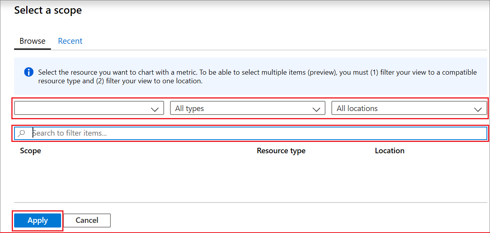
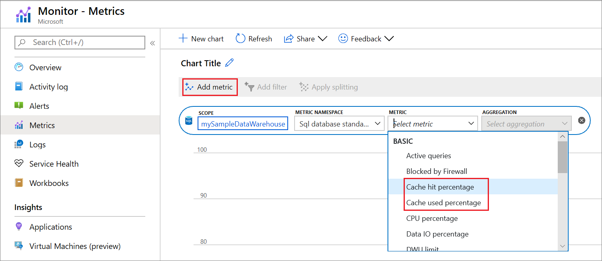

# How to monitor the adaptive cache

This article describes how to monitor and troubleshoot slow query performance by determining whether your workload is optimally leveraging the adaptive cache for dedicated SQL pools.

The dedicated SQL pool storage architecture automatically tiers your most frequently queried columnstore segments in a cache residing on NVMe based SSDs. You will have greater performance when your queries retrieve segments that are residing in the cache.
 
## Troubleshoot using the Azure portal

You can use Azure Monitor to view  cache metrics to troubleshoot query performance. First go to the Azure portal and click on **Monitor**, **Metrics** and **+ Select a scope**:

Use the search and drop down bars to locate your dedicated SQL pool. Then select apply.

The key metrics for troubleshooting the cache are **Cache hit percentage** and **Cache used percentage**. Select **Cache hit percentage** then use the **add metric** button to add **Cache used percentage**. 

## Cache hit and used percentage

The matrix below describes scenarios based on the values of the cache metrics:

|                                | **High Cache hit percentage** | **Low Cache hit percentage** |
| :----------------------------: | :---------------------------: | :--------------------------: |
| **High Cache used percentage** |          Scenario 1           |          Scenario 2          |
| **Low Cache used percentage**  |          Scenario 3           |          Scenario 4          |

**Scenario 1:** You are optimally using your cache. [Troubleshoot](sql-data-warehouse-manage-monitor.md) other areas that may be slowing down your queries.

**Scenario 2:** Your current working data set cannot fit into the cache which causes a low cache hit percentage due to physical reads. Consider scaling up your performance level and rerun your workload to populate the cache.

**Scenario 3:** It is likely that your query is running slow due to reasons unrelated to the cache. [Troubleshoot](sql-data-warehouse-manage-monitor.md) other areas that may be slowing down your queries. You can also consider [scaling down your instance](sql-data-warehouse-manage-monitor.md) to reduce your cache size to save costs. 

**Scenario 4:** You had a cold cache which could be the reason why your query was slow. Consider rerunning your query as your working dataset should now be in cached. 

> [!IMPORTANT]
> If the cache hit percentage or cache used percentage isn't updating after rerunning your workload, your working set can already be residing in memory. Only clustered columnstore tables are cached.

## Next steps
For more information on general query performance tuning, see [Monitor query execution](sql-data-warehouse-manage-monitor.md#monitor-query-execution).
