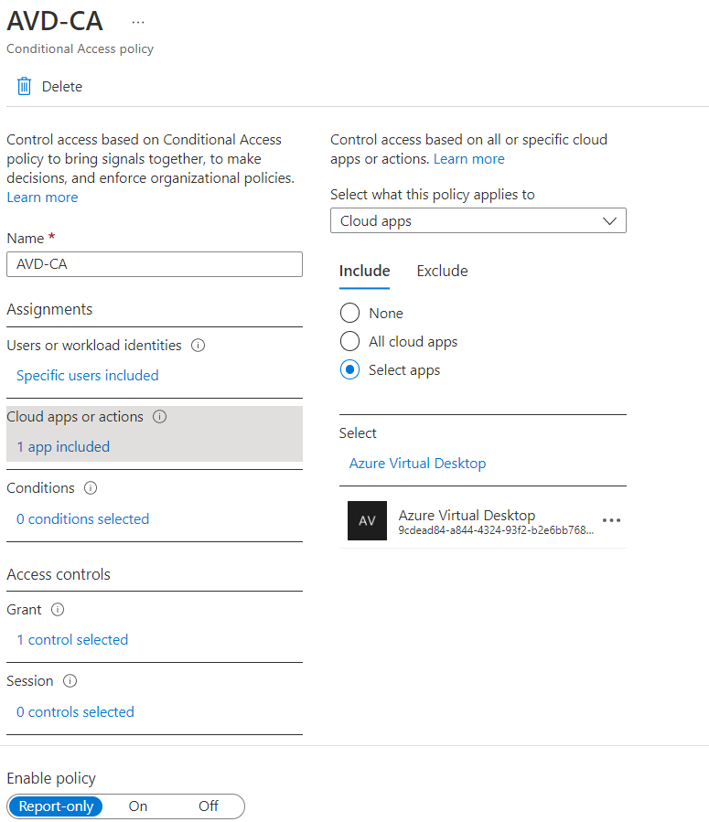

# Enable Azure multifactor authentication for Azure Virtual Desktop

>[!IMPORTANT]
> If you're visiting this page from the Azure Virtual Desktop (classic) documentation, make sure to [return to the Azure Virtual Desktop (classic) documentation](./virtual-desktop-fall-2019/tenant-setup-azure-active-directory.md) once you're finished.

The Windows client for Azure Virtual Desktop is an excellent option for integrating Azure Virtual Desktop with your local machine. However, when you configure your Azure Virtual Desktop account into the Windows Client, there are certain measures you'll need to take to keep yourself and your users safe.

When you first sign in, the client asks for your username, password, and Azure multifactor authentication. After that, the next time you sign in, the client will remember your token from your Azure Active Directory (AD) Enterprise Application. When you select **Remember me** on the prompt for credentials for the session host, your users can sign in after restarting the client without needing to reenter their credentials.

While remembering credentials is convenient, it can also make deployments on Enterprise scenarios or personal devices less secure. To protect your users, you can make sure the client keeps asking for Azure multifactor authentication credentials more frequently. This article will show you how to configure the Conditional Access policy for Azure Virtual Desktop to enable this setting.

## Prerequisites

Here's what you'll need to get started:

- Assign users a license that includes Azure Active Directory Premium P1 or P2.
- An Azure Active Directory group with your users assigned as group members.
- Enable Azure multifactor authentication for all your users. For more information about how to do that, see [How to require two-step verification for a user](../active-directory/authentication/howto-mfa-userstates.md#view-the-status-for-a-user).

> [!NOTE]
> The following setting also applies to the [Azure Virtual Desktop web client](https://rdweb.wvd.microsoft.com/arm/webclient/index.html).

## Create a Conditional Access policy

Here's how to create a Conditional Access policy that requires multifactor authentication when connecting to Azure Virtual Desktop:

1. Sign in to the **Azure portal** as a global administrator, security administrator, or Conditional Access administrator.
2. Browse to **Azure Active Directory** > **Security** > **Conditional Access**.
3. Select **New policy**.
4. Give your policy a name. We recommend that organizations create a meaningful standard for the names of their policies.
5. Under **Assignments**, select **Users and groups**.
6. Under **Include**, select **Select users and groups** > **Users and groups** > Choose the group you created in the [prerequisites](#prerequisites) stage.
7. Select **Done**.
8. Under **Cloud apps or actions** > **Include**, select **Select apps**.
9. Select one of the following apps based on which version of Azure Virtual Desktop you're using.
   
   - If you're using Azure Virtual Desktop (classic), choose these apps:
       
       - **Windows Virtual Desktop** (App ID 5a0aa725-4958-4b0c-80a9-34562e23f3b7)
       - **Windows Virtual Desktop Client** (App ID fa4345a4-a730-4230-84a8-7d9651b86739), which will let you set policies on the web client
       
        After that, skip ahead to step 11.

   - If you're using Azure Virtual Desktop, choose this app instead:
       
       -  **Azure Virtual Desktop** (App ID 9cdead84-a844-4324-93f2-b2e6bb768d07)
       
        After that, go to step 10.

   >[!IMPORTANT]
   > Don't select the app called Azure Virtual Desktop Azure Resource Manager Provider (50e95039-b200-4007-bc97-8d5790743a63). This app is only used for retrieving the user feed and shouldn't have multifactor authentication.
   > 
   > If you're using Azure Virtual Desktop (classic), if the Conditional Access policy blocks all access and only excludes Azure Virtual Desktop app IDs, you can fix this by adding the app ID 9cdead84-a844-4324-93f2-b2e6bb768d07 to the policy. Not adding this app ID will block feed discovery of Azure Virtual Desktop (classic) resources.

10. Once you've selected your app, choose **Select**, and then select **Done**.

    > [!div class="mx-imgBorder"]
    > 

    >[!NOTE]
    >To find the App ID of the app you want to select, go to **Enterprise Applications** and select **Microsoft Applications** from the application type drop-down menu.
    
11. Go to **Conditions** > **Client apps**. In **Configure**, select **Yes**, and then select where to apply the policy:
    
    - Select **Browser** if you want the policy to apply to the web client.
    - Select **Mobile apps and desktop clients** if you want to apply the policy to other clients.
    - Select both check boxes if you want to apply the policy to all clients.
   
    > [!div class="mx-imgBorder"]
    > 

12. Under **Access controls** > **Grant**, select **Grant access**, **Require multi-factor authentication**, and then **Select**.
13. Under **Access controls** > **Session**, select **Sign-in frequency**, set the value to the time you want between prompts, and then select **Select**. For example, setting the value to **1** and the unit to **Hours**, will require multifactor authentication if a connection is launched an hour after the last one.
14. Confirm your settings and set **Enable policy** to **On**.
15. Select **Create** to enable your policy.

>[!NOTE]
>When you use the web client to sign in to Azure Virtual Desktop through your browser, the log will list the client app ID as a85cf173-4192-42f8-81fa-777a763e6e2c (Azure Virtual Desktop client). This is because the client app is internally linked to the server app ID where the conditional access policy was set. 

## Next steps

- [Learn more about Conditional Access policies](../active-directory/conditional-access/concept-conditional-access-policies.md)

- [Learn more about user sign in frequency](../active-directory/conditional-access/howto-conditional-access-session-lifetime.md#user-sign-in-frequency)
