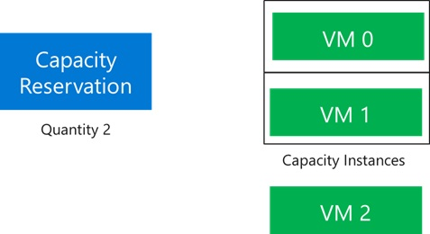
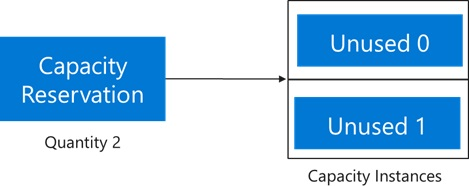
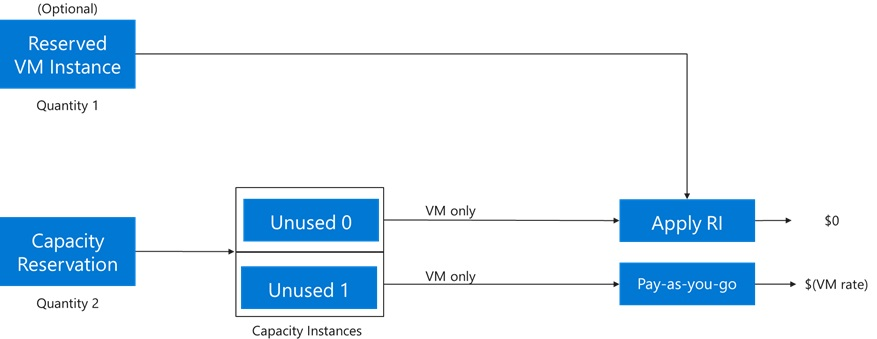
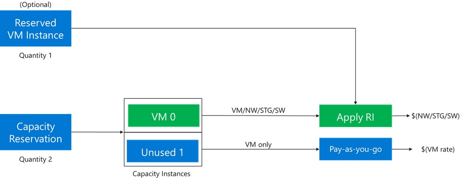

# On-demand Capacity Reservation (preview)

On-demand Capacity Reservation enables you to reserve Compute capacity in an Azure region or an Availability Zone for any duration of time. Unlike [Reserved Instances](https://azure.microsoft.com/pricing/reserved-vm-instances/), you don't have to sign up for a 1-year or a 3-year term commitment. Create and delete reservations at any time and have full control over how you want to manage your reservations.  

Once the capacity reservation is created, the capacity is available immediately and is exclusively reserved for your use until the reservation is deleted.  

> [!IMPORTANT]
> Capacity Reservation is currently in public preview.
> This preview version is provided without a service-level agreement, and we don't recommend it for production workloads. Certain features might not be supported or might have constrained capabilities. 
> For more information, see [Supplemental Terms of Use for Microsoft Azure Previews](https://azure.microsoft.com/support/legal/preview-supplemental-terms/).

Capacity Reservation has some basic properties that are always defined at the time of creation: 
- **VM size** - Each reservation is for one VM size. For example, `Standard_D2s_v3`. 
- **Location** - Each reservation is for one location (region). If that location has availability zones, then the reservation can also specify one of the zones. 
- **Quantity** - Each reservation has a quantity of instances to be reserved. 

To create a Capacity Reservation, these parameters are passed to Azure as a capacity request. If the subscription lacks the required quota or Azure doesn't have capacity available that meets the specification, the reservation will fail to deploy. To avoid deployment failure, request more quota or try a different VM size, location, or zone combination. 

Once Azure accepts a reservation request, it's available to be consumed by VMs of matching configurations. To consume capacity reservation, the VM will have to specify the reservation as one of its properties. Otherwise, the capacity reservation will remain unused. One benefit of this design is that you can target only critical workloads to reservations and other non-critical workloads can run without reserved capacity.   

> [!NOTE]
> Capacity Reservation also comes with Azure availability SLA for use with virtual machines. The SLA won't be enforced during public preview and will be defined when Capacity Reservation is generally available.

## Benefits of Capacity Reservation 

- Once deployed, capacity is reserved for your use and always available within the scope of applicable SLAs  
- Can be deployed and deleted at any time with no term commitment 
- Can be combined automatically with Reserved Instances to avail term commitments discounts  

## SLA for Capacity Reservation 

The SLA for Capacity Reservation will be defined later when the feature is generally available.  

## Limitations and restrictions 

- Creating capacity reservations requires quota in the same manner as creating virtual machines. 
- Spot VMs and Azure Dedicated Host Nodes aren't supported with Capacity Reservation. 
- Some deployment constraints aren't supported: 
    - Proximity Placement Group 
    - Update domains 
    - UltraSSD storage  
- Only Av2, B, D, E, & F VM series are supported during public preview. 
- For the supported VM series during public preview, up to 3 Fault Domains (FDs) will be supported. A deployment with more than 3 FDs will fail to deploy against capacity reservation. 
- Availability Sets aren't supported with capacity reservation. 
- During this preview, only the subscription that created the reservation can use it. 
- Reservations are only available to paid Azure customers. Sponsored accounts such as Free Trial and Azure for Students aren't eligible to use this feature. 

## Pricing and billing 

Capacity Reservations are priced at the same rate as the underlying VM size. For example, if you create a reservation for 10 quantities of D2s_v3 VM, as soon as the reservation is created, you'll start getting billed for 10 D2s_v3 VMs, even if the reservation isn't being used.  

If you then deploy a D2s_v3 VM and specify reservation as its property, the capacity reservation gets used. Once in use, you'll only pay for the VM and nothing extra for the capacity reservation. Let’s say you deploy 5 D2s_v3 VMs against the previously mentioned capacity reservation. You will see a bill for 5 D2s_v3 VMs and 5 unused capacity reservation, both charged at the same rate as a D2s_v3 VM.    

Both used and unused capacity reservation are eligible for Reserved Instances term commitment discounts. In the above example, if you have Reserved Instances for 2 D2s_v3 VM in the same Azure region, the billing for 2 resources (either VM or unused capacity reservation) will be zeroed out and you'll only pay for the rest of the 8 resources (that is, 5 unused capacity reservations and 3 D2s_v3 VMs). In this case, the term commitment discounts could be applied on either the VM or the unused Capacity Reservation, both of which are charged at the same PAYG rate. 

## Difference between On-demand Capacity Reservation and Reserved Instances 

| | On-demand Capacity Reservation | Reserved Instances|
|---|---|---|
| Term | No term commitment required. Can be created and deleted as per the customer requirement | Fixed term commitment of either one-year or three-years|
| Billing discount | Charged at pay-as-you-go rates for the underlying VM size* | Significant cost savings over pay-as-you-go rates |
| Capacity SLA | Provides capacity guarantee in the specified location (region or availability zone) | Does not provide a capacity guarantee. Customers can choose “capacity priority” to gain better access, but that option does not carry an SLA |
| Region vs Availability Zones | Can be deployed per region or per availability zone | Only available at regional level |

*Eligible for Reserved Instances discount if purchased separately

## Work with Capacity Reservation 

Capacity reservation can be created for a specific VM size in an Azure region or an Availability Zone. All reservations are created and managed as part of a Capacity Reservation group, which allows creation of a group to manage different VM sizes in a single multi-tier application. Each reservation is for one VM size and a group can have only one reservation per VM size.  

To consume capacity reservation, specify capacity reservation group as one of the VM properties. If the group doesn’t have a matching reservation, Azure will return an error message. 

The quantity reserved for reservation can be adjusted after initial deployment by changing the capacity property. Other changes to capacity reservation, such as VM size or location, aren't permitted. The recommended approach is to delete the existing reservation and create a new one with the new requirements. 

Capacity Reservation doesn’t create limits on the number of VM deployments. Azure supports allocating as many VMs as desired against the reservation. As the reservation itself requires quota, the quota checks are omitted for VM deployment up to the reserved quantity. Allocating more VMs against the reservation is subject to quota checks and Azure fulfilling the extra capacity. Once deployed, these extra VM instances can cause the quantity of VMs allocated against the reservation to exceed the reserved quantity. This state is called overallocating. To learn more, go to [Overallocating Capacity Reservation](capacity-reservation-overallocate.md). 

## Capacity Reservation lifecycle

When a reservation is created, Azure sets aside the requested number of capacity instances in the specified location: 

 

Track the state of the overall reservation through the following properties:  
- `capacity` = Total quantity of instances reserved by the customer 
- `virtualMachinesAllocated` = List of VMs allocated against the capacity reservation and count towards consuming the capacity. These VMs are either *Running* or *Stopped* (*Allocated*), or may be in a transitional state such as *Starting* or *Stopping*. This list doesn’t include the VMs that are in deallocated state, referred to as *Stopped* (*deallocated*). 
- `virtualMachinesAssociated` = List of VMs associated with the capacity reservation. This list has all the VMs that have been configured to use the reservation, including the ones that are in deallocated state.  

The above example will start with `capacity` as 2 and length of `virutalMachinesAllocated` and `virtualMachinesAssociated` as 0.  

When a VM is then allocated against the Capacity Reservation, it will logically consume one of the reserved capacity instances: 

 

The status of the Capacity Reservation will now show `capacity` as 2 and length of `virutalMachinesAllocated` and `virtualMachinesAssociated` as 1.  

Allocations against the Capacity Reservation will succeed as along as the VMs have matching properties and there is at least one empty capacity instance.  

Using our example, when a third VM is allocated against the Capacity Reservation, the reservation enters the [overallocated](capacity-reservation-overallocate.md) state. This third VM will require unused quota and extra capacity fulfillment from Azure. Once the third VM is allocated, the Capacity Reservation now looks like this: 

 

The `capacity` is 2 and the length of `virutalMachinesAllocated` and `virtualMachinesAssociated` is 3. 

Now suppose the application scales down to the minimum of two VMs. Since VM 0 needs an update, it's chosen for deallocation. The reservation automatically shifts to this state: 

 

The `capacity` and the length of `virtualMachinesAllocated` are both 2. However, the length for `virtualMachinesAssociated` is still 3 as VM 0, though deallocated, is still associated with the capacity reservation.  

The Capacity Reservation will exist until explicitly deleted. To delete a Capacity Reservation, the first step is to dissociate all the VMs in the `virtualMachinesAssociated` property. Once disassociation is complete, the Capacity Reservation should look like this: 

 

The status of the Capacity Reservation will now show `capacity` as 2 and length of `virtualMachinesAssociated` and `virtualMachinesAllocated` as 0. From this state, the Capacity Reservation can be deleted. Once deleted, you'll not pay for the reservation anymore.  

## Usage and billing 

When a Capacity Reservation is empty, VM usage will be reported for the corresponding VM size and the location. [VM Reserved Instances](https://azure.microsoft.com/pricing/reserved-vm-instances/) can cover some or all of the Capacity Reservation usage even when VMs aren't deployed. 

### Example

For example, let's say a Capacity Reservation with quantity reserved 2 has been created. The subscription has access to one matching Reserved VM Instance of the same size. The result is two usage streams for the Capacity Reservation, one of which is covered by the Reserved Instance: 

In the image above, a Reserved VM Instance discount is applied to one of the unused instances and the cost for that instance will be zeroed out. For the other instance, PAYG rate will be charged for the VM size reserved.  

When a VM is allocated against the Capacity Reservation, the other VM components such as disks, network, extensions, and any other requested components must also be allocated. In this state, the VM usage will reflect one allocated VM and one unused capacity instance. The Reserved VM Instance will zero out the cost of either the VM or the unused capacity instance. The other charges for disks, networking, and other components associated with the allocated VM will also appear on the bill. 

In the image above, the VM Reserved Instance discount is applied to VM 0, which will only be charged for other components such as disk and networking. The other unused instance is being charged at PAYG rate for the VM size reserved.

## Frequently asked questions 

- **What’s the price of on-demand capacity reservation?**

    The price of your on-demand capacity reservation is same as the price of underlying VM size associated with the reservation. When using capacity reservation, you will be charged for the VM size you selected at pay-as-you-go rates, whether the VM has been provisioned or not.  Visit the [Windows](https://azure.microsoft.com/pricing/details/virtual-machines/windows/) and [Linux](https://azure.microsoft.com/pricing/details/virtual-machines/linux/) VM pricing pages for more details.

- **Will I get charged twice, for the cost of on-demand capacity reservation and for the actual VM when I finally provision it?**

    No, you will only get charged once for on-demand capacity reservation.   

- **Can I apply Reserved Virtual Machine Instance (RI) to on-demand capacity reservation to lower my costs?**

    Yes, you can apply existing or future RIs to on-demand capacity reservations and receive RI discounts. Available RIs are applied automatically to capacity reservation the same way they are applied to VMs.

- **What is the difference between Reserved Virtual Machine Instance (RI) and on-demand capacity reservation?**

    Both RIs and on-demand capacity reservations are applicable to Azure VMs. However, RIs provide discounted reservation rates for your VMs compared to pay-as-you-go rates as a result of a term commitment, 1-year or 3-year terms. Conversely, on-demand capacity reservations do not require a commitment. You can create or cancel a capacity reservation at any time. However, no discounts are applied, and you will incur charges at pay-as-you-go rates after your capacity reservation has been successfully provisioned. Unlike RIs, which prioritize capacity but do not guarantee it, when you purchase an on-demand capacity reservation, Azure sets aside compute capacity for your VM and provides an SLA guarantee.  

- **Which scenarios would benefit the most from on-demand capacity reservations?**

    Typical scenarios include business continuity, disaster recovery, and scale-out of mission-critical applications.  

## Next steps

Create a Capacity Reservation and start reserving Compute capacity in an Azure region or an Availability Zone. 

> [!div class="nextstepaction"]
> [Create a Capacity Reservation](capacity-reservation-create.md)
