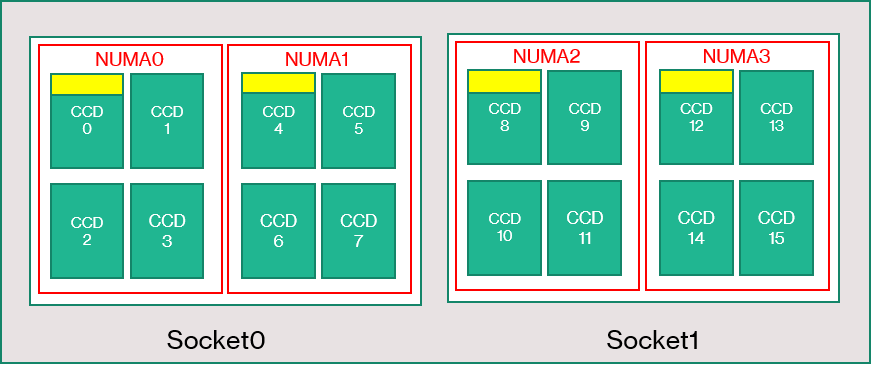
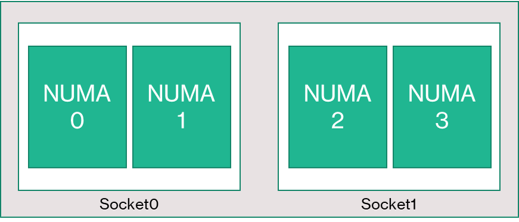
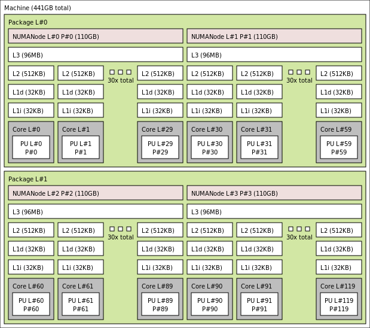
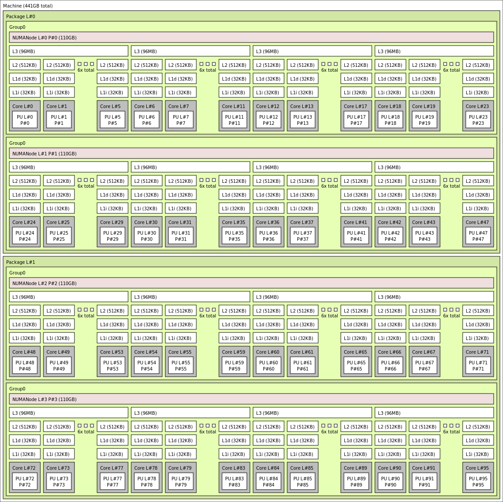
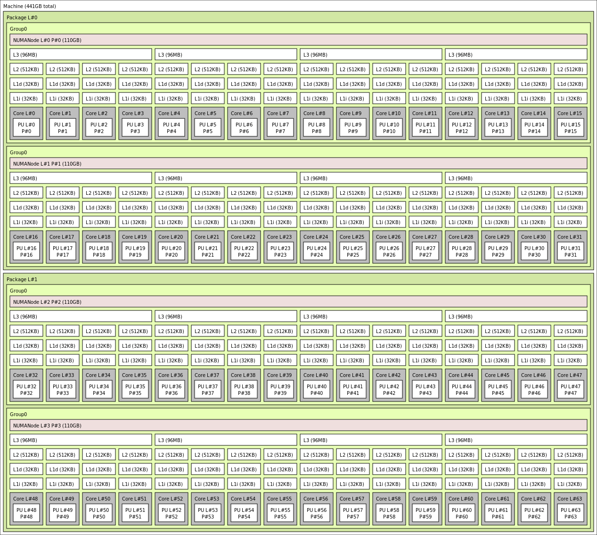
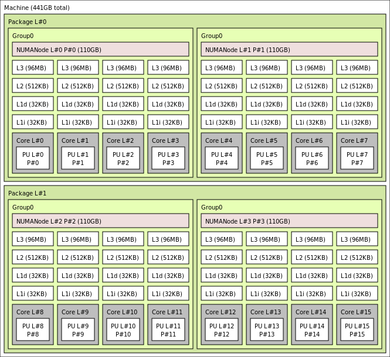

# HBv3-series virtual machine overview 

**Applies to:** :heavy_check_mark: Linux VMs :heavy_check_mark: Windows VMs :heavy_check_mark: Flexible scale sets :heavy_check_mark: Uniform scale sets

An [HBv3-series](hbv3-series.md) server features 2 * 64-core EPYC 7V73X CPUs for a total of 128 physical "Zen3" cores with AMD 3D V-Cache. Simultaneous Multithreading (SMT) is disabled on HBv3. These 128 cores are divided into 16 sections (8 per socket), each section containing 8 processor cores with uniform access to a 96 MB L3 cache. Azure HBv3 servers also run the following AMD BIOS settings:

```output
Nodes per Socket (NPS) = 2
L3 as NUMA = Disabled
NUMA domains within VM OS = 4
C-states = Enabled
```

As a result, the server boots with 4 NUMA domains (2 per socket) each 32 cores in size. Each NUMA has direct access to 4 channels of physical DRAM operating at 3200 MT/s.

To provide room for the Azure hypervisor to operate without interfering with the VM, we reserve 8 physical cores per server.

## VM topology

The following diagram shows the topology of the server. We reserve these 8 hypervisor host cores (yellow) symmetrically across both CPU sockets, taking the first 2 cores from specific Core Complex Dies (CCDs) on each NUMA domain, with the remaining cores for the HBv3-series VM (green).



The CCD boundary is not equivalent to a NUMA boundary. On HBv3, a group of four consecutive (4) CCDs is configured as a NUMA domain, both at the host server level and within a guest VM. Thus, all HBv3 VM sizes expose 4 NUMA domains that appear to an OS and application as shown. 4 uniform NUMA domains, each with different number of cores depending on the specific [HBv3 VM size](hbv3-series.md).



Each HBv3 VM size is similar in physical layout, features, and performance of a different CPU from the AMD EPYC 7003-series, as follows:

| HBv3-series VM size             | NUMA domains | Cores per NUMA domain  | Similarity with AMD EPYC         |
|---------------------------------|--------------|------------------------|----------------------------------|
Standard_HB120rs_v3               | 4            | 30                     | Dual-socket EPYC 7773X           |
Standard_HB120-96rs_v3            | 4            | 24                     | Dual-socket EPYC 7643            |
Standard_HB120-64rs_v3            | 4            | 16                     | Dual-socket EPYC 7573X           |
Standard_HB120-32rs_v3            | 4            | 8                      | Dual-socket EPYC 7373X           |
Standard_HB120-16rs_v3            | 4            | 4                      | Dual-socket EPYC 72F3            |

> [!NOTE]
> The constrained cores VM sizes only reduce the number of physical cores exposed to the VM. All global shared assets (RAM, memory bandwidth, L3 cache, GMI and xGMI connectivity, InfiniBand, Azure Ethernet network, local SSD) stay constant. This allows a customer to pick a VM size best tailored to a given set of workload or software licensing needs.

The virtual NUMA mapping of each HBv3 VM size is mapped to the underlying physical NUMA topology. There is no potentially misleading abstraction of the hardware topology. 

The exact topology for the various [HBv3 VM size](hbv3-series.md) appears as follows using the output of [lstopo](https://linux.die.net/man/1/lstopo):
```bash
lstopo-no-graphics --no-io --no-legend --of txt
```
<br>
<details>
<summary>Click to view lstopo output for Standard_HB120rs_v3</summary>


</details>

<details>
<summary>Click to view lstopo output for Standard_HB120rs-96_v3</summary>


</details>

<details>
<summary>Click to view lstopo output for Standard_HB120rs-64_v3</summary>


</details>

<details>
<summary>Click to view lstopo output for Standard_HB120rs-32_v3</summary>


</details>

<details>
<summary>Click to view lstopo output for Standard_HB120rs-16_v3</summary>


</details>

## InfiniBand networking
HBv3 VMs also feature Nvidia Mellanox HDR InfiniBand network adapters (ConnectX-6) operating at up to 200 Gigabits/sec. The NIC is passed through to the VM via SRIOV, enabling network traffic to bypass the hypervisor. As a result, customers load standard Mellanox OFED drivers on HBv3 VMs as they would a bare metal environment.

HBv3 VMs support Adaptive Routing, the Dynamic Connected Transport (DCT, along with standard RC and UD transports), and hardware-based offload of MPI collectives to the onboard processor of the ConnectX-6 adapter. These features enhance application performance, scalability, and consistency, and usage of them is recommended.

## Temporary storage
HBv3 VMs feature 3 physically local SSD devices. One device is preformatted to serve as a page file and it appeared within your VM as a generic "SSD" device.

Two other, larger SSDs are provided as unformatted block NVMe devices via NVMeDirect. As the block NVMe device bypasses the hypervisor, it has higher bandwidth, higher IOPS, and lower latency per IOP.

When paired in a striped array, the NVMe SSD provides up to 7 GB/s reads and 3 GB/s writes, and up to 186,000 IOPS (reads) and 201,000 IOPS (writes) for deep queue depths.

## Hardware specifications 

| Hardware specifications          | HBv3-series VMs              |
|----------------------------------|----------------------------------|
| Cores                            | 120, 96, 64, 32, or 16 (SMT disabled)               | 
| CPU                              | AMD EPYC 7V73X                   | 
| CPU Frequency (non-AVX)          | 3.0 GHz (all cores), 3.5 GHz (up to 10 cores)    | 
| Memory                           | 448 GB (RAM per core depends on VM size)         | 
| Local Disk                       | 2 * 960 GB NVMe (block), 480 GB SSD (page file) | 
| Infiniband                       | 200 Gb/s Mellanox ConnectX-6 HDR InfiniBand | 
| Network                          | 50 Gb/s Ethernet (40 Gb/s usable) Azure second Gen SmartNIC | 

## Software specifications 

| Software specifications        | HBv3-series VMs                                            | 
|--------------------------------|-----------------------------------------------------------|
| Max MPI Job Size               | 36,000 cores (300 VMs in a single Virtual Machine Scale Set with singlePlacementGroup=true) |
| MPI Support                    | HPC-X, Intel MPI, OpenMPI, MVAPICH2, MPICH  |
| Additional Frameworks          | UCX, libfabric, PGAS                  |
| Azure Storage Support          | Standard and Premium Disks (maximum 32 disks)              |
| OS Support for SRIOV RDMA      | CentOS/RHEL 7.9+, Ubuntu 18.04+, SLES 15.4, WinServer 2016+           |
| Recommended OS for Performance | CentOS 8.1, Windows Server 2019+
| Orchestrator Support           | Azure CycleCloud, Azure Batch, AKS; [cluster configuration options](sizes-hpc.md#cluster-configuration-options)                      | 

> [!NOTE] 
> Windows Server 2012 R2 is not supported on HBv3 and other VMs with more than 64 (virtual or physical) cores. For more details, see [Supported Windows guest operating systems for Hyper-V on Windows Server](/windows-server/virtualization/hyper-v/supported-windows-guest-operating-systems-for-hyper-v-on-windows).

> [!IMPORTANT] 
> This document references a release version of Linux that is nearing or at, End of Life(EOL). Please consider updating to a more current version.

## Next steps

- Read about the latest announcements, HPC workload examples, and performance results at the [Azure Compute Tech Community Blogs](https://techcommunity.microsoft.com/t5/azure-compute/bg-p/AzureCompute).
- For a higher level architectural view of running HPC workloads, see [High Performance Computing (HPC) on Azure](/azure/architecture/topics/high-performance-computing/).
