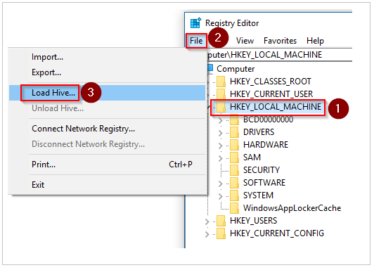
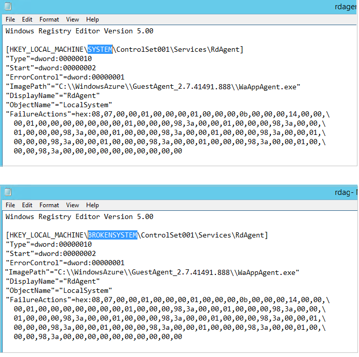
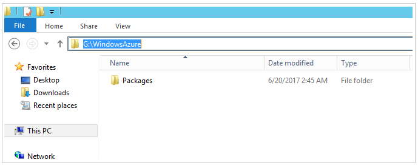

---
title: Install the Azure VM Agent in Offline mode | Microsoft Docs
description: Learn Install the Azure VM Agent in Offline mode.
services: virtual-machines-windows
documentationcenter: ''
author: genlin
manager: timlt
editor: ''
tags: azure-resource-manager

ms.service: virtual-machines-windows
ms.workload: infrastructure-services
ms.tgt_pltfrm: vm-windows
ms.devlang: na
ms.topic: article
ms.date: 01/26/2018
ms.author: genli

---
# Install the VM agent in offline mode in an Azure Windows VM 

VM agent provides useful features like local administrator password reset, and script push. This article shows how to install the VM agent for a VM that is offline. 

## When to use offline mode

You would need to install the VM agent in offline mode in the following scenario:

- You deploy an Azure VM that does not have the VM agent installed or the VM agent is not working.
- You do not remember the password of the administrator or you cannot access the VM.

In this scenario, you would need to install the VM agent in offline mode. 

## Detailed steps

**Step 1: Attach the OS disk of the VM to another VM as a data disk**

1.  Delete the VM. Make sure that you select the **Keep the disks** option when you do this.

2.  Attach the OS disk as a data disk to another VM (a troubleshooter VM). For more information, see [How to attach a data disk to a Windows VM in the Azure portal](attach-managed-disk-portal.md).

3.  Connect to the troubleshooting VM. Open **Computer management** > **Disk management**. Make sure that the OS disk is online and that its partitions have drive letters assigned.

**Step 2: Modify the OS disk to install VM Agent**

1.  Make a remote desktop connection to the troubleshoot VM.

2.  On the OS disk you attached, navigate to **\windows\system32\config**. Copy all the files as a backup in case a rollback is required.

3.  Start Registry Editor (regedit.exe).

4.  Click the **HKEY_LOCAL_MACHINE** key, and then select **File** > **Load Hive** on the menu.

    

5.  Navigate to **\windows\system32\config\SYSTEM** on the OS disk that you attached, and then type BROKENSYSTEM as the name of the hive. After you do this, you will see the registry hive under **HKEY_LOCAL_MACHINE**.

6.  Navigate to **\windows\system32\config\SOFTWARE** on the OS disk you attached, type BROKENSOFTWARE as the name for the hive.

7.  If you have a current version of the agent that is not working, perform a backup of the current configuration. If the VM does not have the VM agent installed, go to the next step.  
      
    1. Rename the folder \windowsazure to \windowsazure.old

    2. Export the following registries
        - HKEY_LOCAL_MACHINE\BROKENSYSTEM\ControlSet001\Services\WindowsAzureGuestAgent
        - HKEY_LOCAL_MACHINE
        \BROKENSYSTEM\\ControlSet001\Services\WindowsAzureTelemetryService
        - HKEY_LOCAL_MACHINE\BROKENSYSTEM\ControlSet001\Services\RdAgent

8.	Use the existing files on the troubleshooting VM as a repository for the VM agent installation: 

    1. From the troubleshooter VM, export the following subkeys in registry format (.reg): 

        - HKEY_LOCAL_MACHINE  \SYSTEM\ControlSet001\Services\WindowsAzureGuestAgent
        - HKEY_LOCAL_MACHINE  \SYSTEM\ControlSet001\Services\WindowsAzureTelemetryService
        - HKEY_LOCAL_MACHINE  \SYSTEM\ControlSet001\Services\RdAgent

        

    2. Edit these three registry files, change the **SYSTEM** key entry to **BROKENSYSTEM**, and then save the files.
        
    3. Double-clicking the registry files to import them.
    4. Make sure that the following keys are imported into the BROKENSYSTEM hive successfully: WindowsAzureGuestAgent, WindowsAzureTelemetryService and RdAgent.

9.  Copy the VM agent folder from C:\windowsazure\packages to the &lt;OS disk that you attached&gt;:\windowsazure\packages.
    
      
    **Note** Don’t copy the logs folder. After service starts, new logs will be generated.

10.  Click BROKENSYSTEM and select **File** > **Unload Hive**​ from the menu.

11.  Click BROKENSOFTWARE and select **File** > **Unload Hive**​ from the menu.

12.  Detach the disk and then recreate the VM by using the OS disk.

13.  If you access the VM you will now see the RDAgent running and the logs getting created.

14. If this is a VM created using the classic deployment model, you are done. However, if this is a VM created using the Resource Manager deployment model, you must also use Azure PowerShell to update the ProvisionGuestAgent property so that Azure knows that the VM has the agent installed. To accomplish this, run the following commands in Azure PowerShell:

        $vm = Get-AzureVM –ServiceName <cloud service name> –Name <VM name>
        $vm.VM.ProvisionGuestAgent = $true
        Update-AzureVM –Name <VM name> –VM $vm.VM –ServiceName <cloud service name>

    If you run **Get-AzureVM** after you follow these steps, the **GuestAgentStatus** property should be populated instead of a blank page being displayed:

        Get-AzureVM –ServiceName <cloud service name> –Name <VM name>
        GuestAgentStatus:Microsoft.WindowsAzure.Commands.ServiceManagement.Model.PersistentVMModel.GuestAgentStatus

## Next steps

- [Azure Virtual Machine Agent overview](agent-user-guide.md)
- [Virtual machine extensions and features for Windows](extensions-features.md)