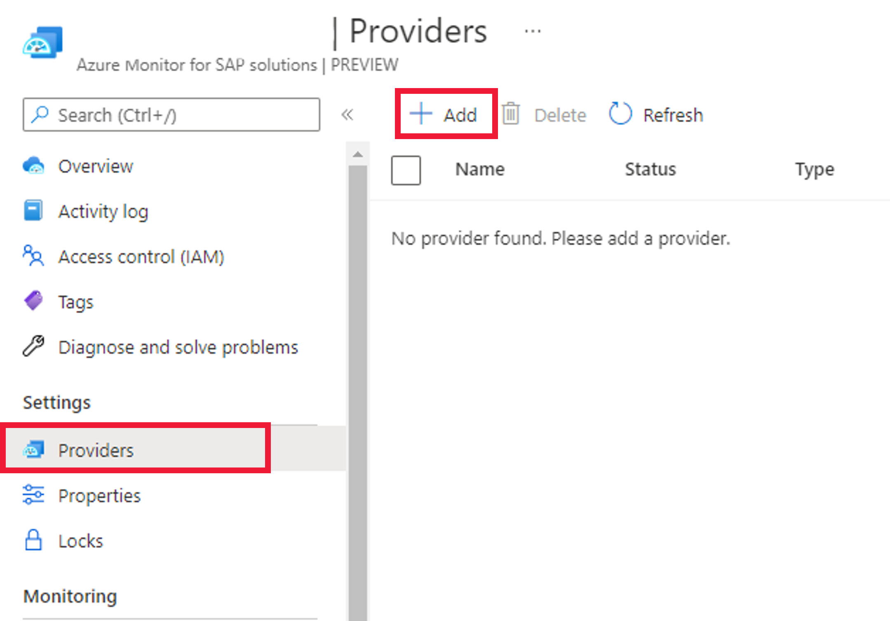
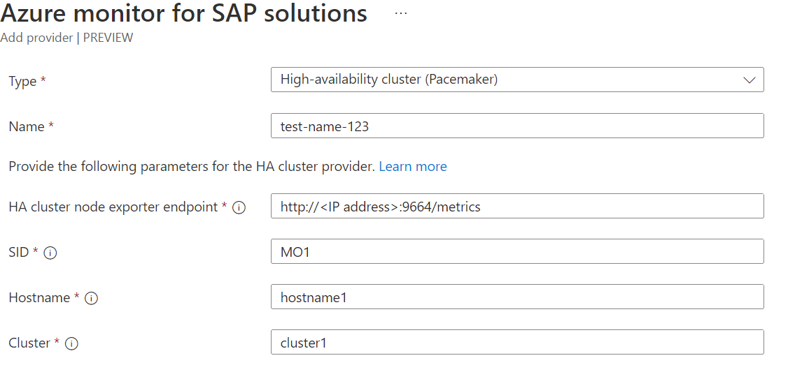

# Create High Availability cluster provider for Azure Monitor for SAP solutions (preview)

[!INCLUDE [Azure Monitor for SAP solutions public preview notice](./includes/preview-azure-monitor.md)]

In this how-to guide, you'll learn to create a High Availability (HA) Pacemaker cluster provider for Azure Monitor for SAP solutions. You'll install the HA agent, then create the provider for Azure Monitor for SAP solutions.

This content applies to both Azure Monitor for SAP solutions and Azure Monitor for SAP solutions (classic) versions.

## Prerequisites

- An Azure subscription.
- An existing Azure Monitor for SAP solutions resource. To create an Azure Monitor for SAP solutions resource, see the [quickstart for the Azure portal](azure-monitor-sap-quickstart.md) or the [quickstart for PowerShell](azure-monitor-sap-quickstart-powershell.md).

## Install HA agent

Before adding providers for HA (Pacemaker) clusters, install the appropriate agent for your environment in each cluster node.

For SUSE-based clusters, install **ha_cluster_provider** in each node. For more information, see [the HA cluster exporter installation guide](https://github.com/ClusterLabs/ha_cluster_exporter#installation). Supported SUSE versions include SLES for SAP 12 SP3 and above.

For RHEL-based clusters, install **performance co-pilot (PCP)** and the **pcp-pmda-hacluster** sub package in each node.For more information, see the [PCP HACLUSTER agent installation guide](https://access.redhat.com/articles/6139852). Supported RHEL versions include 8.2, 8.4 and above.

For RHEL-based pacemaker clusters, also install [PMProxy](https://access.redhat.com/articles/6139852) in each node.

### Install HA Cluster Exporter on RHEL
1. Install the required packages on the system.

    ```bash
    yum install pcp pcp-pmda-hacluster
    ```

1. Enable and start the required PCP Collector Services.

    ```bash
    systemctl enable pmcd
    ```

    ```bash
    systemctl start pmcd
    ```

1. Install and enable the HA Cluster PMDA. Replace `$PCP_PMDAS_DIR` with the path where `hacluster` is installed. Use the `find` command in Linuxto find the path.

    ```bash
    cd $PCP_PMDAS_DIR/hacluster
    ```

    ```bash
    . ./install
    ```

1. Enable and start the `pmproxy` service.

    ```bash
    sstemctl start pmproxy
    ```

    ```bash
    systemctl enable pmproxy
    ```

1. Data will then be collected by PCP on the system. You can export the data using `pmproxy` at `http://<SERVER-NAME-OR-IP-ADDRESS>:44322/metrics?names=ha_cluster`. Replace `<SERVER-NAME-OR-IP-ADDRESS>` with your server name or IP address.

## Create provider for Azure Monitor for SAP solutions

1. Sign in to the [Azure portal](https://portal.azure.com).
1. Go to the Azure Monitor for SAP solutions service.
1. Open your Azure Monitor for SAP solutions resource.
1. In the resource's menu, under **Settings**, select **Providers**.
1. Select **Add** to add a new provider.

    

1. For **Type**, select **High-availability cluster (Pacemaker)**.
1. Configure providers for each node of the cluster by entering the endpoint URL for **HA Cluster Exporter Endpoint**.

    1. For SUSE-based clusters, enter `http://<IP-address> :9664/metrics`.

    


    1. For RHEL-based clusters, enter `http://<'IP address'>:44322/metrics?names=ha_cluster`.

    


1. Enter the system identifiers, host names, and cluster names. For the system identifier, enter a unique SAP system identifier for each cluster. For the hostname, the value refers to an actual hostname in the VM. Use `hostname -s` for SUSE- and RHEL-based clusters.

1. Select **Add provider** to save.

1. Continue to add more providers as needed.

1. Select **Review + create** to review the settings.

1. Select **Create** to finish creating the resource.

## Troubleshooting

Use the following troubleshooting steps for common errors.

### Unable to reach the Prometheus endpoint

When the provider settings validation operation fails with the code ‘PrometheusURLConnectionFailure’:

1. Restart the HA cluster exporter agent.

    ```bash
    sstemctl start pmproxy
    ```

1. Reenable the HA cluster exporter agent.
    ```bash
    systemctl enable pmproxy
    ```

1. Verify that the Prometheus endpoint is reachable from the subnet that provided while creating the Azure Monitor for SAP solutions resource.

## Next steps

> [!div class="nextstepaction"]
> [Learn about Azure Monitor for SAP solutions provider types](azure-monitor-providers.md)
