# How to install and configure SAP HANA (large instances) on Azure

Following are some important definitions to know before you read this guide. In [SAP HANA (large instances) overview and architecture on Azure](https://docs.microsoft.com/azure/virtual-machines/workloads/sap/hana-overview-architecture) we introduced two different classes of HANA Large Instance units with:

- S72, S72m, S144, S144m, S192, S192m, and S192xm, which we refer to as the 'Type I class' of SKUs.
- S384, S384m, S384xm, S384xxm, S576m, S576xm, S768m, S768xm and S960m, which  we refer to as the 'Type II class' of SKUs.

The class specifier is going to be used throughout the HANA Large Instance documentation to eventually refer to different capabilities and requirements based on HANA Large Instance SKUs.

Other definitions we use frequently are:
- **Large Instance stamp:** A hardware infrastructure stack that is SAP HANA TDI certified and dedicated to run SAP HANA instances within Azure.
- **SAP HANA on Azure (Large Instances):** Official name for the offer in Azure to run HANA instances in on SAP HANA TDI certified hardware that is deployed in Large Instance stamps in different Azure regions. The related term **HANA Large Instance** is short for SAP HANA on Azure (Large Instances) and is widely used this technical deployment guide.


The installation of SAP HANA is your responsibility and you can start the activity after handoff of a new SAP HANA on Azure (Large Instances) server. And after the connectivity between your Azure VNet(s) and the HANA Large Instance unit(s) got established. 

> [!Note]
> Per SAP policy, the installation of SAP HANA must be performed by a person certified to perform SAP HANA installations. A person, who has passed the Certified SAP Technology Associate exam, SAP HANA Installation certification exam, or by an SAP-certified system integrator (SI).

Check again, especially when planning to install HANA 2.0, [SAP Support Note #2235581 - SAP HANA: Supported Operating Systems](https://launchpad.support.sap.com/#/notes/2235581/E) in order to make sure that the OS is supported with the SAP HANA release you decided to install. You realize that the supported OS for HANA 2.0 is more restricted than the OS supported for HANA 1.0. 

> [!IMPORTANT] 
> For Type II units only the SLES 12 SP2 OS version is supported at this point. 

## First steps after receiving the HANA Large Instance Unit(s)

**First Step** after receiving the HANA Large Instance and having established access and connectivity to the instances, is to register the OS of the instance with your OS provider. This step would include registering your SUSE Linux OS in an instance of SUSE SMT that you need to have deployed in a VM in Azure. The HANA Large Instance unit can connect to this SMT instance (see later in this documentation). Or your Red Hat OS needs to be registered with the Red Hat Subscription Manager you need to connect to. See also remarks in this [document](https://docs.microsoft.com/azure/virtual-machines/linux/sap-hana-overview-architecture?toc=%2fazure%2fvirtual-machines%2flinux%2ftoc.json). This step also is necessary to be able to patch the OS. A task that is in the responsibility of the customer. For SUSE, find documentation to install and configure SMT [here](https://www.suse.com/documentation/sles-12/book_smt/data/smt_installation.html).

**Second Step** is to check for new patches and fixes of the specific OS release/version. Check whether the patch level of the HANA Large Instance is on the latest state. Based on timing on OS patch/releases and changes to the image Microsoft can deploy, there might be cases where the latest patches may not be included. Hence it is a mandatory step after taking over a HANA Large Instance unit, to check whether patches relevant for security, functionality, availability, and performance were released meanwhile by the particular Linux vendor and need to be applied.

**Third Step** is to check out the relevant SAP Notes for installing and configuring SAP HANA on the specific OS release/version. Due to changing recommendations or changes to SAP Notes or configurations that are dependent on individual installation scenarios, Microsoft will not always be able to have a HANA Large Instance unit configured perfectly. Hence it is mandatory for you as a customer, to read the SAP Notes related to SAP HANA on your exact Linux release. Also check the configurations of the OS release/version necessary and apply the configuration settings where not done already.

In specific, check the following parameters and eventually adjusted to:

- net.core.rmem_max = 16777216
- net.core.wmem_max = 16777216
- net.core.rmem_default = 16777216
- net.core.wmem_default = 16777216
- net.core.optmem_max = 16777216
- net.ipv4.tcp_rmem = 65536 16777216 16777216
- net.ipv4.tcp_wmem = 65536 16777216 16777216

Starting with SLES12 SP1 and RHEL 7.2, these parameters must be set in a configuration file in the /etc/sysctl.d directory. For example, a configuration file with the name 91-NetApp-HANA.conf must be created. For older SLES and RHEL releases, these parameters must be set in/etc/sysctl.conf.

For all RHEL releases and starting with SLES12, the 
- sunrpc.tcp_slot_table_entries = 128

parameter must be set in/etc/modprobe.d/sunrpc-local.conf. If the file does not exist, it must first be created by adding the following entry: 
- options sunrpc tcp_max_slot_table_entries=128

**Fourth Step** is to check the system time of your HANA Large Instance Unit. 
The instances are deployed with a system time zone that represent the location of the Azure region the HANA Large Instance Stamp is located in. You are free to change the system time or time zone of the instances you own. Doing so and ordering more instances into your tenant, be prepared that you need to adapt the time zone of the newly delivered instances. Microsoft operations have no insights into the system time zone you set up with the instances after the handover. Hence newly deployed instances might not be set in the same time zone as the one you changed to. As a result, it is your responsibility as customer to check and if necessary adapt the time zone of the instance(s) handed over. 

**Fifth Step** is to check etc/hosts. As the blades get handed over, they have different IP addresses assigned for different purposes (see next section). Check the etc/hosts file. In cases where units are added into an existing tenant, don't expect to have etc/hosts of the newly deployed systems maintained correctly with the IP addresses of earlier delivered systems. Hence it is on you as customer to check the correct settings so, that a newly deployed instance can interact and resolve the names of earlier deployed units in your tenant. 

## Networking
We assume that you followed the recommendations in designing your Azure VNets and connecting those VNets to the HANA Large Instances as described in these documents:

- [SAP HANA (large Instance) Overview and Architecture on Azure](https://docs.microsoft.com/azure/virtual-machines/workloads/sap/hana-overview-architecture)
- [SAP HANA (large instances) Infrastructure and connectivity on Azure](hana-overview-infrastructure-connectivity.md?toc=%2fazure%2fvirtual-machines%2flinux%2ftoc.json)

There are some details worth to mention about the networking of the single units. Every HANA Large Instance unit comes with two or three IP addresses that are assigned to two or three NIC ports of the unit. Three IP addresses are used in HANA scale-out configurations and the HANA System Replication scenario. One of the IP addresses assigned to the NIC of the unit is out of the Server IP pool that was described in the [SAP HANA (large Instance) Overview and Architecture on Azure](https://docs.microsoft.com/azure/virtual-machines/workloads/sap/hana-overview-architecture).

Refer [HLI supported scenarios](hana-supported-scenario.md) to learn ethernet details for your architecture.

## Storage

The storage layout for SAP HANA on Azure (Large Instances) is configured by SAP HANA on Azure Service Management through SAP recommended guide lines as documented in [SAP HANA Storage Requirements](http://go.sap.com/documents/2015/03/74cdb554-5a7c-0010-82c7-eda71af511fa.html) white paper. 
The rough sizes of the different volumes with the different HANA Large Instances SKUs got documented in [SAP HANA (large Instance) Overview and Architecture on Azure](hana-overview-architecture.md?toc=%2fazure%2fvirtual-machines%2flinux%2ftoc.json).

The naming conventions of the storage volumes are listed in the following table:

| Storage usage | Mount Name | Volume Name | 
| --- | --- | ---|
| HANA data | /hana/data/SID/mnt0000<m> | Storage IP:/hana_data_SID_mnt00001_tenant_vol |
| HANA log | /hana/log/SID/mnt0000<m> | Storage IP:/hana_log_SID_mnt00001_tenant_vol |
| HANA log backup | /hana/log/backups | Storage IP:/hana_log_backups_SID_mnt00001_tenant_vol |
| HANA shared | /hana/shared/SID | Storage IP:/hana_shared_SID_mnt00001_tenant_vol/shared |
| usr/sap | /usr/sap/SID | Storage IP:/hana_shared_SID_mnt00001_tenant_vol/usr_sap |

Where SID = the HANA instance System ID 

And tenant = an internal enumeration of operations when deploying a tenant.

As you can see, HANA shared and usr/sap are sharing the same volume. The nomenclature of the mountpoints does include the System ID of the HANA instances as well as the mount number. In scale-up deployments there only is one mount, like mnt00001. Whereas in scale-out deployment you would see as many mounts, as, you have worker and master nodes. For the scale-out environment, data, log, log backup volumes are shared and attached to each node in the scale-out configuration. For configurations running multiple SAP instances, a different set of volumes is created and attached to the HAN Large Instance unit. Refer [HLI supported scenarios](hana-supported-scenario.md) for storage layout details for your scenario.

As you read the paper and look a HANA Large Instance unit, you realize that the units come with rather generous disk volume for HANA/data and that we have a volume HANA/log/backup. The reason why we sized the HANA/data so large is that the storage snapshots we offer for you as a customer are using the same disk volume. It means the more storage snapshots you perform, the more space is consumed by snapshots in your assigned storage volumes. The HANA/log/backup volume is not thought to be the volume to put database backups in. It is sized to be used as backup volume for the HANA transaction log backups. In future versions of the storage snapshot self service, we will target this specific volume to have more frequent snapshots. And with that more frequent replications to the disaster recovery site if you desire to option-in for the disaster recovery functionality provided by the HANA Large Instance infrastructure. See details in [SAP HANA (large instances) High Availability and Disaster Recovery on Azure](hana-overview-high-availability-disaster-recovery.md?toc=%2fazure%2fvirtual-machines%2flinux%2ftoc.json) 

In addition to the storage provided, you can purchase additional storage capacity in 1 TB increments. This additional storage can be added as new volumes to a HANA Large Instances.

During onboarding with SAP HANA on Azure Service Management, the customer specifies a User ID (UID) and Group ID (GID) for the sidadm user and sapsys group (ex: 1000,500) It is necessary that during installation of the SAP HANA system, these same values are used. As you want to deploy multiple HANA instances on a unit, you get multiple sets of volumes (one set for each instance). As a result, at deployment time you need to define:

- The SID of the different HANA instances (sidadm is derived out of it).
- Memory sizes of the different HANA instances. Since the memory size per instances defines the size of the volumes in each individual volume set.

Based on storage provider recommendations the following mount options are configured for all mounted volumes (excludes boot LUN):

- nfs    rw, vers=4, hard, timeo=600, rsize=1048576, wsize=1048576, intr, noatime, lock 0 0

These mount points are configured in /etc/fstab like shown in the following graphics:


The output of the command df -h on a S72m HANA Large Instance unit would look like:

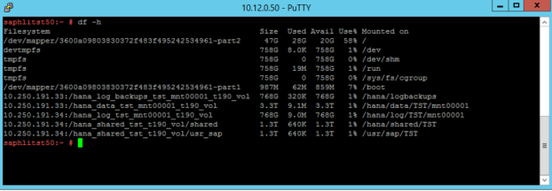


The storage controller and nodes in the Large Instance stamps are synchronized to NTP servers. With you synchronizing the SAP HANA on Azure (Large Instances) units and Azure VMs against an NTP server, there should be no significant time drift happening between the infrastructure and the compute units in Azure or Large Instance stamps.

In order to optimize SAP HANA to the storage used underneath, you should also set the following SAP HANA configuration parameters:

- max_parallel_io_requests 128
- async_read_submit on
- async_write_submit_active on
- async_write_submit_blocks all
 
For SAP HANA 1.0 versions up to SPS12, these parameters can be set during the installation of the SAP HANA database, as described in [SAP Note #2267798 - Configuration of the SAP HANA Database](https://launchpad.support.sap.com/#/notes/2267798)

You also can configure the parameters after the SAP HANA database installation by using the hdbparam framework. 

With SAP HANA 2.0, the hdbparam framework has been deprecated. As a result the parameters must be set using SQL commands. For details, see [SAP Note #2399079: Elimination of hdbparam in HANA 2](https://launchpad.support.sap.com/#/notes/2399079).

Refer [HLI supported scenarios](hana-supported-scenario.md) to learn storage layout for your architecture.

## Operating system

> [!IMPORTANT] 
> For Type II units only the SLES 12 SP2 OS version is supported at this point. 

Swap space of the delivered OS image is set to 2 GB according to the [SAP Support Note #1999997 - FAQ: SAP HANA Memory](https://launchpad.support.sap.com/#/notes/1999997/E). Any different setting desired needs to be set by you as a customer.

[SUSE Linux Enterprise Server 12 SP1 for SAP Applications](https://www.suse.com/products/sles-for-sap/hana) is the distribution of Linux installed for SAP HANA on Azure (Large Instances). This particular distribution provides SAP-specific capabilities &quot;out of the box&quot; (including pre-set parameters for running SAP on SLES effectively).

See [Resource Library/White Papers](https://www.suse.com/products/sles-for-sap/resource-library#white-papers) on the SUSE website and [SAP on SUSE](https://wiki.scn.sap.com/wiki/display/ATopics/SAP+on+SUSE) on the SAP Community Network (SCN) for several useful resources related to deploying SAP HANA on SLES (including the set-up of High Availability, security hardening specific to SAP operations, and more).

Additional and useful SAP on SUSE-related links:

- [SAP HANA on SUSE Linux Site](https://wiki.scn.sap.com/wiki/display/ATopics/SAP+on+SUSE)
- [Best Practice for SAP: Enqueue Replication – SAP NetWeaver on SUSE Linux Enterprise 12](https://www.suse.com/docrepcontent/container.jsp?containerId=9113).
- [ClamSAP – SLES Virus Protection for SAP](http://scn.sap.com/community/linux/blog/2014/04/14/clamsap--suse-linux-enterprise-server-integrates-virus-protection-for-sap) (including SLES 12 for SAP Applications).

SAP Support Notes applicable to implementing SAP HANA on SLES 12:

- [SAP Support Note #1944799 – SAP HANA Guidelines for SLES Operating System Installation](http://go.sap.com/documents/2016/05/e8705aae-717c-0010-82c7-eda71af511fa.html).
- [SAP Support Note #2205917 – SAP HANA DB Recommended OS Settings for SLES 12 for SAP Applications](https://launchpad.support.sap.com/#/notes/2205917/E).
- [SAP Support Note #1984787 – SUSE Linux Enterprise Server 12:  Installation Notes](https://launchpad.support.sap.com/#/notes/1984787).
- [SAP Support Note #171356 – SAP Software on Linux:  General Information](https://launchpad.support.sap.com/#/notes/1984787).
- [SAP Support Note #1391070 – Linux UUID Solutions](https://launchpad.support.sap.com/#/notes/1391070).

[Red Hat Enterprise Linux for SAP HANA](https://www.redhat.com/en/resources/red-hat-enterprise-linux-sap-hana) is another offer for running SAP HANA on HANA Large Instances. Releases of RHEL 6.7 and 7.2 are available. Please note in opposite to native Azure VMs where only RHEL 7.2 and more recent releases are supported, HANA Large Instances do support RHEL 6.7 as well. However we recommend using a RHEL 7.x release.

Additional and useful SAP on Red Hat related links:
- [SAP HANA on Red Hat Linux Site](https://wiki.scn.sap.com/wiki/display/ATopics/SAP+on+Red+Hat).

SAP Support Notes applicable to implementing SAP HANA on Red Hat:

- [SAP Support Note #2009879 - SAP HANA Guidelines for Red Hat Enterprise Linux (RHEL) Operating System](https://launchpad.support.sap.com/#/notes/2009879/E).
- [SAP Support Note #2292690 - SAP HANA DB: Recommended OS settings for RHEL 7](https://launchpad.support.sap.com/#/notes/2292690).
- [SAP Support Note #2247020 - SAP HANA DB: Recommended OS settings for RHEL 6.7](https://launchpad.support.sap.com/#/notes/2247020).
- [SAP Support Note #1391070 – Linux UUID Solutions](https://launchpad.support.sap.com/#/notes/1391070).
- [SAP Support Note #2228351 - Linux: SAP HANA Database SPS 11 revision 110 (or higher) on RHEL 6 or SLES 11](https://launchpad.support.sap.com/#/notes/2228351).
- [SAP Support Note #2397039 - FAQ: SAP on RHEL](https://launchpad.support.sap.com/#/notes/2397039).
- [SAP Support Note #1496410 - Red Hat Enterprise Linux 6.x: Installation and Upgrade](https://launchpad.support.sap.com/#/notes/1496410).
- [SAP Support Note #2002167 - Red Hat Enterprise Linux 7.x: Installation and Upgrade](https://launchpad.support.sap.com/#/notes/2002167).

## Time synchronization

SAP applications built on the SAP NetWeaver architecture are sensitive on time differences for the various components that comprise the SAP system. SAP ABAP short dumps with the error title of ZDATE\_LARGE\_TIME\_DIFF are likely familiar, as these short dumps appear when the system time of different servers or VMs is drifting too far apart.

For SAP HANA on Azure (Large Instances), time synchronization done in Azure doesn&#39;t apply to the compute units in the Large Instance stamps. This synchronization is not applicable for running SAP applications in native Azure VMs, as Azure ensures a system&#39;s time is properly synchronized. As a result, a separate time server must be set up that can be used by SAP application servers running on Azure VMs and the SAP HANA database instances running on HANA Large Instances. The storage infrastructure in Large Instance stamps is time synchronized with NTP servers.

## Setting up SMT server for SUSE Linux
SAP HANA Large Instances don't have direct connectivity to the Internet. Hence it is not a straightforward process to register such a unit with the OS provider and to download and apply patches. In the case of SUSE Linux, one solution could be to set up an SMT server in an Azure VM. Whereas the Azure VM needs to be hosted in an Azure VNet, which is connected to the HANA Large Instance. With such an SMT server, the HANA Large Instance unit could register and download patches. 

SUSE provides a larger guide on their [Subscription Management Tool for SLES 12 SP2](https://www.suse.com/documentation/sles-12/pdfdoc/book_smt/book_smt.pdf). 

As precondition for the installation of an SMT server that fulfills the task for HANA Large Instance, you would need:

- An Azure VNet that is connected to the HANA Large Instance ER circuit.
- A SUSE account that is associated with an organization. Whereas the organization would need to have some valid SUSE subscription.

### Installation of SMT server on Azure VM

In this step, you install the SMT server in an Azure VM. The first measure is to log in to the [SUSE Customer Center](https://scc.suse.com/)

As you are logged in, go to Organization--> Organization Credentials. In that section you should find the credentials that are necessary to set up the SMT server.

The third step is to install a SUSE Linux VM in the Azure VNet. To deploy the VM, take a SLES 12 SP2 gallery image of Azure. In the deployment process, don't define a DNS name and do not use static IP addresses as seen in this screen shot


The deployed VM was a smaller VM and got the internal IP address in the Azure VNet of 10.34.1.4. Name of the VM was smtserver. After the installation, the connectivity to the HANA Large instance unit(s) was checked. Dependent on how you organized name resolution you might need to configure resolution of the HANA Large Instance units in etc/hosts of the Azure VM. 
Add an additional disk to the VM that is going to be used to hold the patches. The boot disk itself could be too small. In the case demonstrated, the disk got mounted to /srv/www/htdocs as shown in the following screenshot. A 100 GB disk should suffice.


Log in to the HANA Large Instance unit(s), maintain /etc/hosts and check whether you can reach the Azure VM that is supposed to run the SMT server over the network.

After this check is done successfully, you need to log in to the Azure VM that should run the SMT server. If you are using putty to log in to the VM, you need to execute this sequence of commands in your bash window:

```
cd ~
echo "export NCURSES_NO_UTF8_ACS=1" >> .bashrc
```

After executing these commands, restart your bash to activate the settings. Then start YAST.

In YAST, go to Software Maintenance and search for smt. Select smt, which switches automatically to yast2-smt as shown below


Accept the selection for installation on the smtserver. Once installed, go to the SMT server configuration and enter the organizational credentials from the SUSE Customer Center you retrieved earlier. Also enter your Azure VM hostname as the SMT Server URL. In this demonstration, it was https://smtserver as displayed in the next graphics.

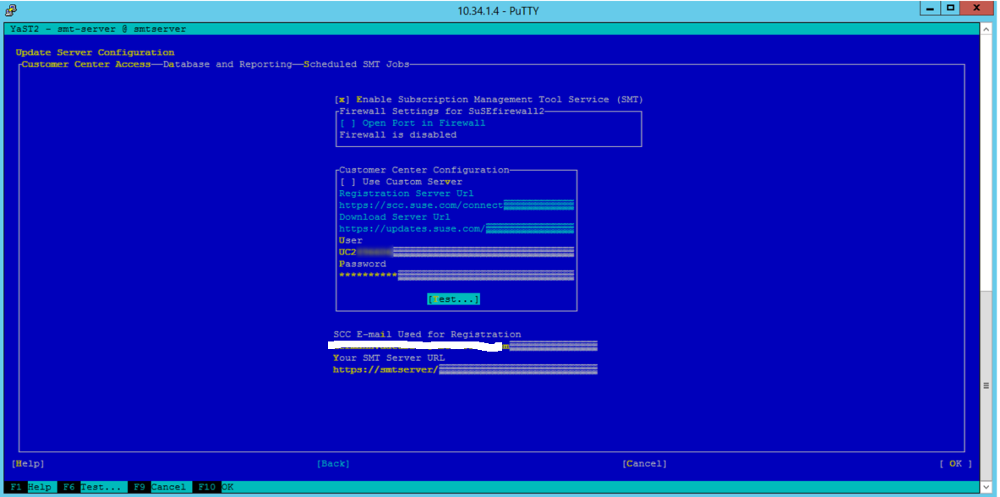

As next step, you need to test whether the connection to the SUSE Customer Center works. As you see in the following graphics, in the demonstration case, it did work.

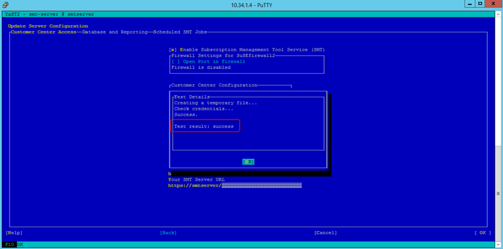

Once the SMT setup starts, you need to provide a database password. Since it is a new installation, you need to define that password as shown in the next graphics.


The next interaction you have is when a certificate gets created. Go through the dialog as shown next and the step should proceed.

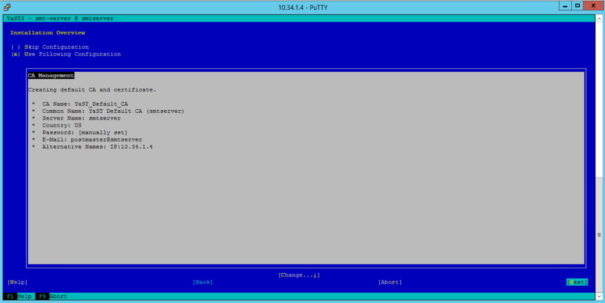

There might be some minutes spent in the step of 'Run synchronization check' at the end of the configuration. After the installation and configuration of the SMT server, you should find the directory repo under the mount point /srv/www/htdocs/ plus some sub-directories under repo. 

Restart the SMT server and its related services with these commands.

```
rcsmt restart
systemctl restart smt.service
systemctl restart apache2
```

### Download of packages onto SMT server

After all the services are restarted, select the appropriate packages in SMT Management using Yast. The package selection depends on the OS image of the HANA Large Instance  server and not on the SLES release or version of the VM running the SMT server. An example of the selection screen is shown below.


Once you are finished with the package selection, you need to start the initial copy of the select packages to the SMT server you set up. This copy is triggered in the shell using the command smt-mirror as shown below


As you see above, the packages should get copied into the directories created under the mount point /srv/www/htdocs. This process can take a while. Dependent on how many packages you select, it could take up to one hour or more.
As this process finishes, you need to move to the SMT client setup. 

### Set up the SMT client on HANA Large Instance units

The client(s) in this case are the HANA Large Instance units. The SMT server setup copied the script clientSetup4SMT.sh into the Azure VM. Copy that script over to the HANA Large Instance unit you want to connect to your SMT server. Start the script with the -h option and give it as parameter the name of your SMT server. In this example smtserver.

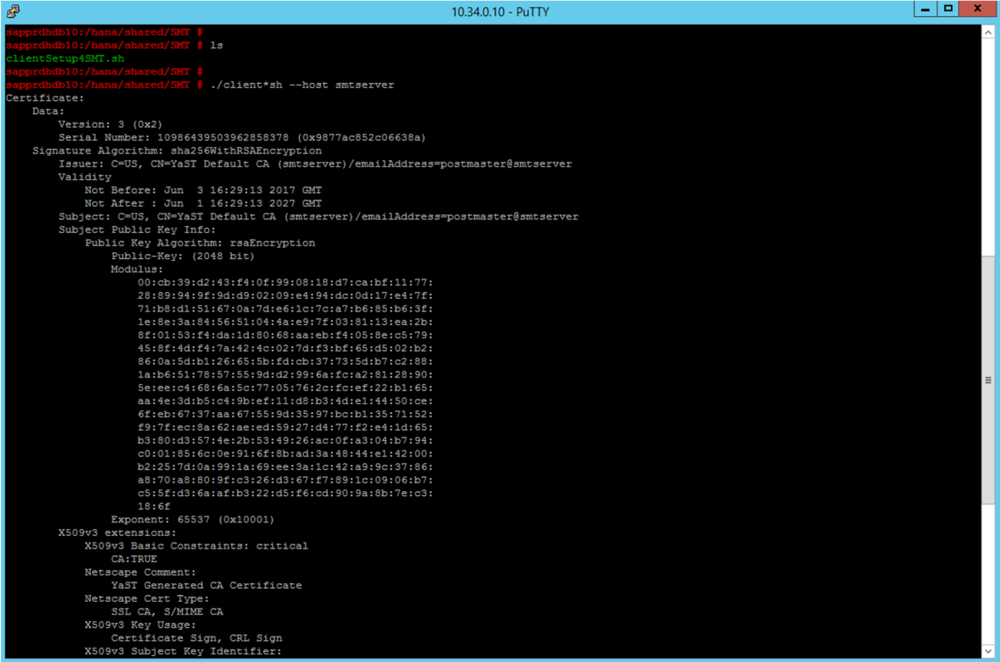

There might be a scenario where the load of the certificate from the server by the client succeeded, but the registration failed as shown below.

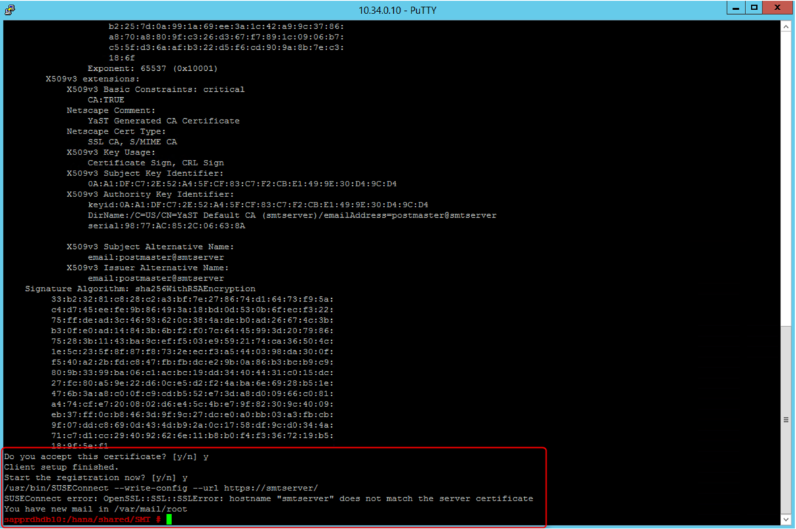

If the registration failed, read this [SUSE support document](https://www.suse.com/de-de/support/kb/doc/?id=7006024) and execute the steps described there.

> [!IMPORTANT] 
> As server name you need to provide the name of the VM, in this case smtserver, without the fully qualified domain name. Just the VM name works. 

After these steps have been executed, you need to execute the following command on the HANA Large Instance unit

```
SUSEConnect –cleanup
```

> [!Note] 
> In our tests we always had to wait a few minutes after that step. The immediate execution clientSetup4SMT.sh, after the corrective measures described in the SUSE article, ended with messages that the certificate would not be valid yet. Waiting for 5-10 minutes usually and executing clientSetup4SMT.sh ended in a successful client configuration.

If you ran into the issue that you needed to fix based on the steps of the SUSE article, you need to restart clientSetup4SMT.sh on the HANA Large Instance unit again. Now it should finish successfully as shown below.

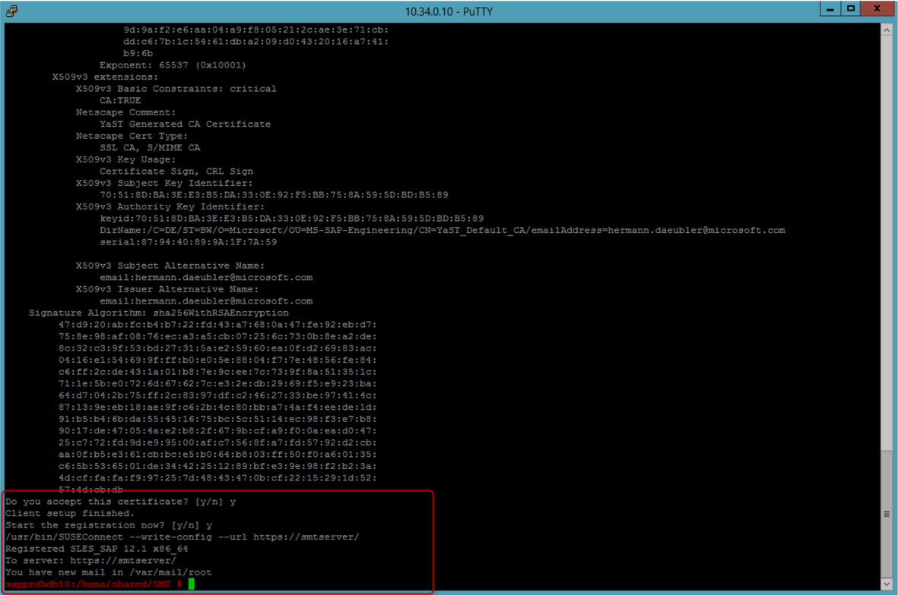

With this step, you configured the SMT client of the HANA Large Instance unit to connect against the SMT server you installed in the Azure VM. You now can take 'zypper up' or 'zypper in' to install OS patches to HANA Large Instances or install additional packages. It is understood that you only can get patches that you downloaded before on the SMT server.


## Example of an SAP HANA installation on HANA Large Instances
This section illustrates how to install SAP HANA on a HANA Large Instance unit. The start state we have look  like:

- You provided Microsoft all the data to deploy you an SAP HANA Large Instance.
- You received the SAP HANA Large Instance from Microsoft.
- You created an Azure VNet that is connected to your on-premises network.
- You connected the ExpressRotue circuit for HANA Large Instances to the same Azure VNet.
- You installed an Azure VM you use as a jump box for HANA Large Instances.
- You made sure that you can connect from the jump box to your HANA Large Instance unit and vice versa.
- You checked whether all the necessary packages and patches are installed.
- You read the SAP notes and documentations regarding HANA installation on the OS you are using and made sure that the HANA release of choice is supported on the OS release.

What is shown in the next sequences is the download of the HANA installation packages to the jump box VM, in this case running on a Windows OS, the copy of the packages to the HANA Large Instance unit and the sequence of the setup.

### Download of the SAP HANA installation bits
Since the HANA Large Instance units don't have direct connectivity to the internet, you can't directly download the installation packages from SAP to the HANA Large Instance VM. To overcome the missing direct internet connectivity, you need the jump box. You download the packages to the jump box VM.

In order to download the HANA installation packages, you need an SAP S-user or other user, which allows you to access the SAP Marketplace. Go through this sequence of screens after logging in:

Go to [SAP Service Marketplace](https://support.sap.com/en/index.html) > Click Download Software > Installations and Upgrade >By Alphabetical Index >Under H – SAP HANA Platform Edition > SAP HANA Platform Edition 2.0 > Installation > Download the following files


In the demonstration case, we downloaded SAP HANA 2.0 installation packages. On the Azure jump box VM, you expand the self-extracting archives into the directory as shown below.

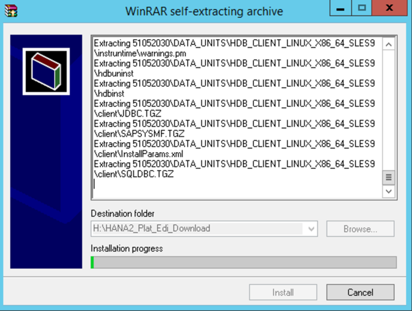

As the archives are extracted, copy the directory created by the extraction, in the case above 51052030, to the HANA Large instance unit into the /hana/shared volume into a directory you created.

> [!Important]
> Do Not copy the installation packages into the root or boot LUN since space is limited and needs to be used by other processes as well.


### Install SAP HANA on the HANA Large Instance unit
In order to install SAP HANA, you need to log in as user root. Only root has enough permissions to install SAP HANA.
The first thing you need to do is to set permissions on the directory you copied over into /hana/shared. The permissions need to set like

```
chmod –R 744 <Installation bits folder>
```

If you want to install SAP HANA using the graphical setup, the gtk2 package needs to be installed on the HANA Large Instances. Check whether it is installed with the command

```
rpm –qa | grep gtk2
```

In further steps, we are demonstrating the SAP HANA setup with the graphical user interface. As next step, go into the installation directory and navigate into the sub directory HDB_LCM_LINUX_X86_64. Start

```
./hdblcmgui 
```
out of that directory. Now you are getting guided through a sequence of screens where you need to provide the data for the installation. In the case demonstrated, we are installing the SAP HANA database server and the SAP HANA client components. Therefore our selection is 'SAP HANA Database' as shown below

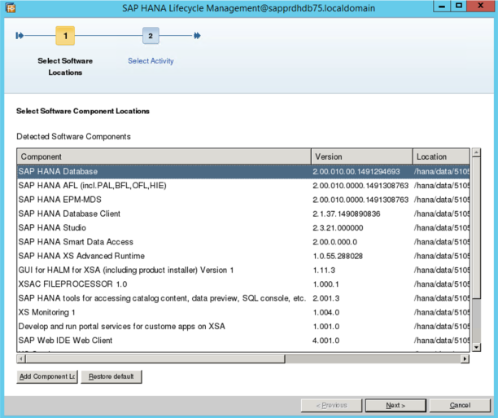

In the next screen, you choose the option 'Install New System'

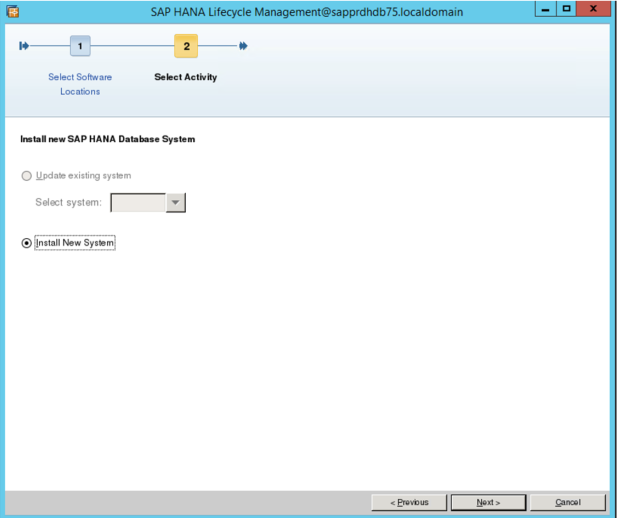

After this step, you need to select between several additional components that can be installed additionally to the SAP HANA database server.

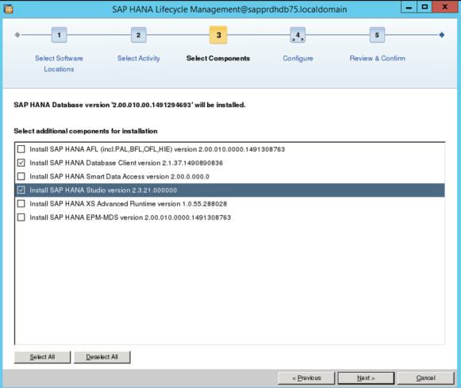

For the purpose of this documentation, we chose the SAP HANA Client and the SAP HANA Studio. We also installed a scale-up instance. hence in the next screen, you need to choose 'Single-Host System' 

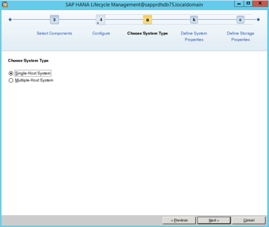

In the next screen, you need to provide some data

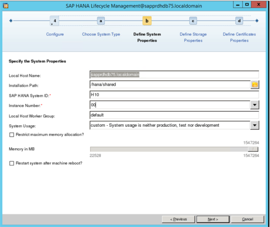

> [!Important]
> As HANA System ID (SID), you need to provide the same SID, as you provided Microsoft when you ordered the HANA Large Instance deployment. Choosing a different SID makes the installation fail due to access permission problems on the different volumes

As installation directory you use the /hana/shared directory. In the next step, you need to provide the locations for the HANA data files and the HANA log files


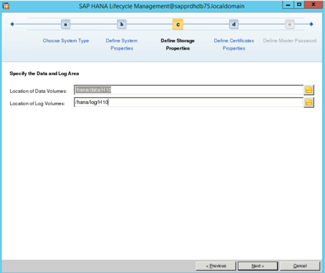

> [!Note]
> You should define as data and log files the volumes that came already with the mount points that contain the SID you chose in the screen selection before this screen. If the SID does mismatch with the one you typed in, in the screen before, go back and adjust the SID to the value you have on the mount points.

In the next step, review the host name and eventually correct it. 

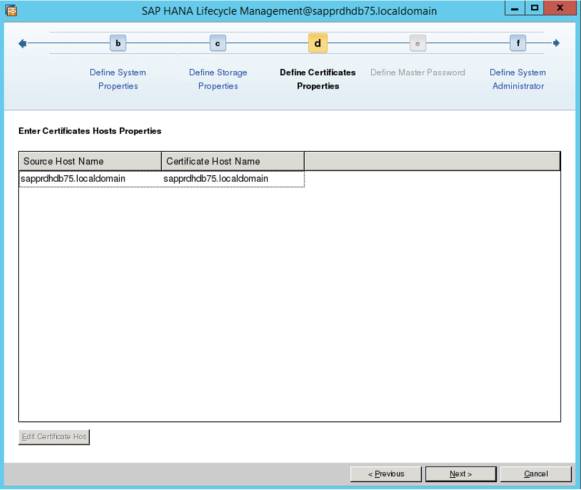

In the next step, you also need to retrieve data you gave to Microsoft when you ordered the HANA Large Instance deployment. 

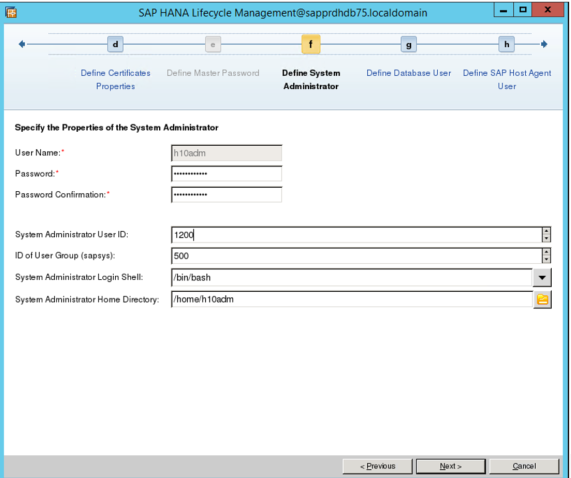

> [!Important]
> You need to provide the same System User ID and ID of User Group as you provided Microsoft as you order the unit deployment. If you fail to give the very same IDs, the installation of SAP HANA on the HANA Large Instance unit fails.

In the next two screens, which we are not showing in this documentation, you need to provide the password for the SYSTEM user of the SAP HANA database and the password for the sapadm user, which is used for the SAP Host Agent that gets installed as part of the SAP HANA database instance.

After defining the password, a confirmation screen is showing up. check all the data listed and continue with the installation. You reach a progress screen that documents the installation progress, like the one below

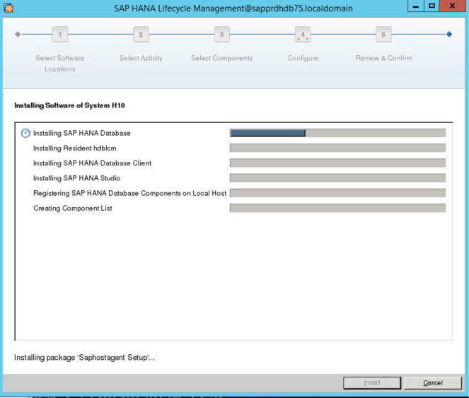

As the installation finishes, you should a picture like the following one


At this point, the SAP HANA instance should be up and running and ready for usage. You should be able to connect to it from SAP HANA Studio. Also make sure that you check for the latest patches of SAP HANA and apply those patches.


 


 


