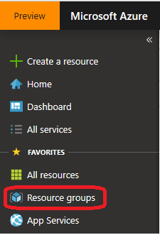
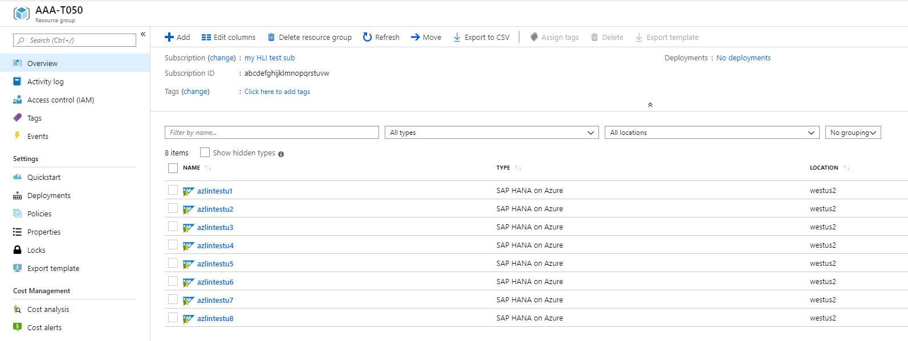
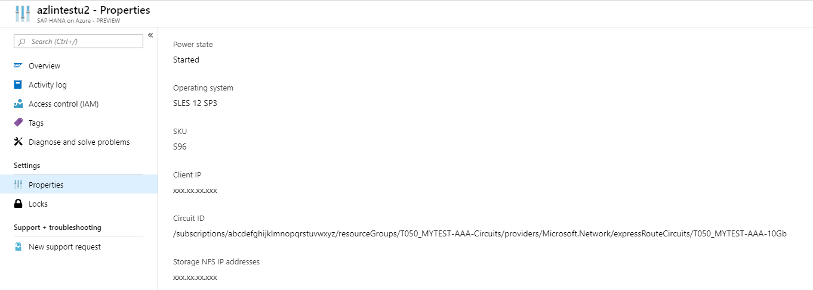
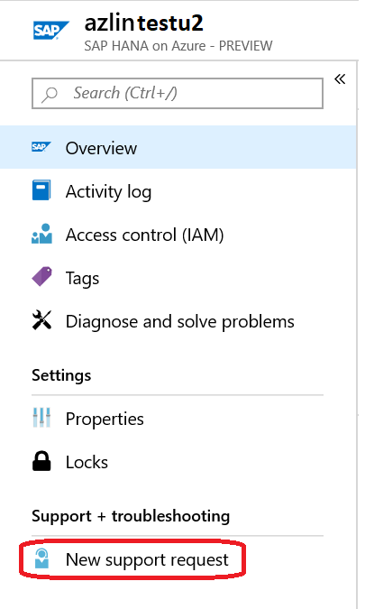
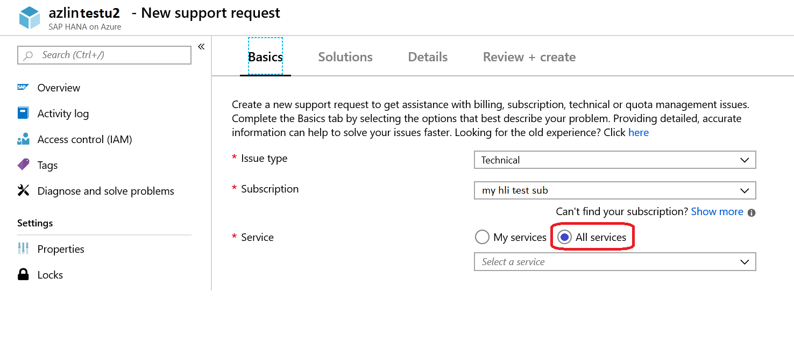
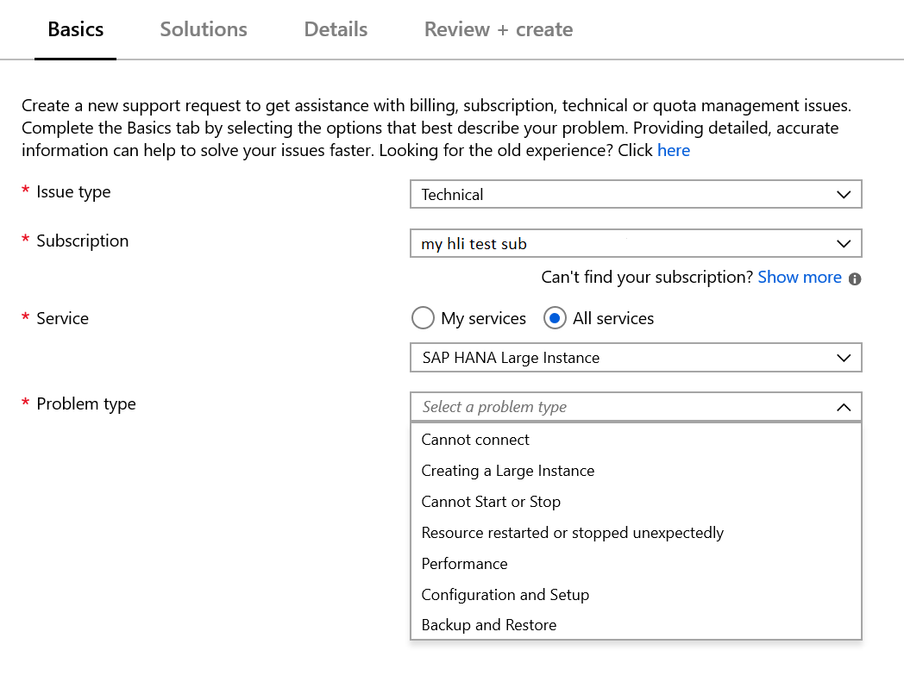
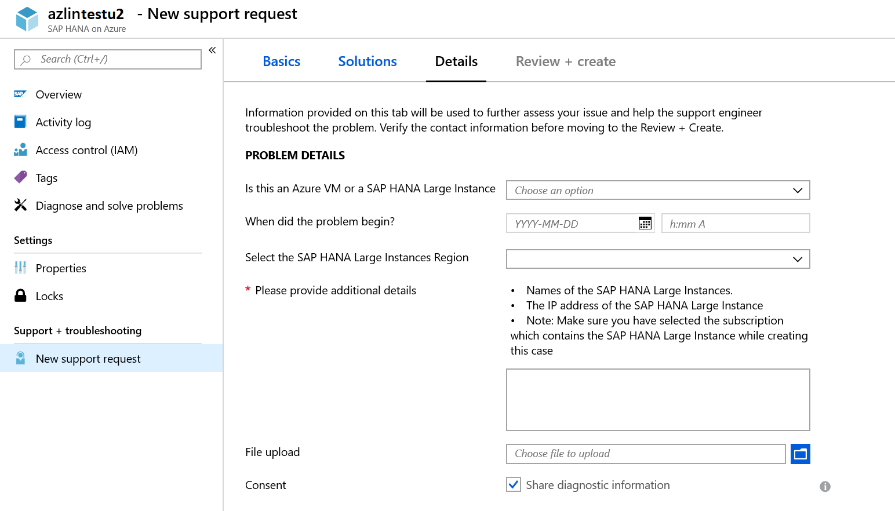

# Azure HANA Large Instances control through Azure portal
This document covers the way how [HANA Large Instances](https://docs.microsoft.com/azure/virtual-machines/workloads/sap/hana-overview-architecture) are presented in [Azure portal](https://portal.azure.com) and what activities can be conducted through Azure portal with HANA Large Instance units that are deployed for you. Visibility of HANA Large Instances in Azure portal is provided through an Azure resource provider for HANA Large Instances, which currently is in public preview

## Display of HANA Large Instance units in the Azure portal
When submitting an HANA Large Instance deployment request, you are asked to specify the Azure subscription that you are connecting to the HANA Large Instances as well. It is recommended to use the same subscription you are using to deploy the SAP application layer that works against the HANA Large Instance units.
As your first HANA Large Instances are getting deployed, a new [Azure resource group](https://docs.microsoft.com/azure/azure-resource-manager/manage-resources-portal) is created in the Azure subscription you submitted in the deployment request for your HANA Large Instance(s).  The new resource group will list all your HANA Large Instance units you have deployed in the specific subscription.

In order to find the new Azure resource group, you list the resource group in your subscription by navigating through the left navigation pane of the Azure portal

In the list of resource groups, you are getting listed, you might need to filter on the subscription you used to have HANA Large Instances deployed

After filtering to the correct subscription, you still may have a long list of resource groups. Look for one with a post-fix of **-Txxx** where "xxx" are three digits, like **-T050**. 

As you found the resource group, list the details of it. The list you received could look like:

All the units listed are representing a single HANA Large Instance unit that has been deployed in your subscription. In this case, you look at eight different HANA Large Instance units, which were deployed in your subscription.

## Look at attributes of single HLI Unit
In the list of the HANA Large Instance units, you can click on a single unit and get to the details of the single HANA Large Instance unit. 

In the overview screen, you are getting a presentation of the unit, which looks like:

Looking at the different attributes shown, those attributes look hardly different than Azure VM attributes. On the left hand side header, it shows the Resource group, Azure region, subscription name, and ID as well as some tags that you added. By default, the HANA Large Instance units have no tag assigned. On the right hand side of the header, the name of the unit is listed as assigned when the deployment was done. The operating system is shown as well as the IP address. As with VMs the HANA Large instance unit type with the number of CPU threads and memory is shown as well. More details on the different HANA Large Instance units, are shown here:

- [Available SKUs for HLI](https://docs.microsoft.com/azure/virtual-machines/workloads/sap/hana-available-skus)
- [SAP HANA (Large Instances) storage architecture](https://docs.microsoft.com/azure/virtual-machines/workloads/sap/hana-storage-architecture) 

An additional field in the right column of the header informs about the power state of the HANA Large instance unit.

> [!NOTE]
> The power state describes whether the hardware unit is powered on or off. It does not give information about the operating system being up and running. As you restart a HANA Large Instance unit, you will experience a small time where the state of the unit changes to **Starting** to move into the state of **Started**. Being in the state of **Started** means that the OS is starting up or that the OS has been started up completely. As a result, after a restart of the unit, you can't expect to immediately log into the unit as soon as the state switches to **Started**.
> 

## Check activities of a single HANA Large Instance unit 
Beyond giving an overview of the HANA Large Instance units, you can check activities of the particular unit. An activity log could look like:

One of the main activities recorded are restarts of a unit. The data listed includes the status of the activity, the time stamp the activity got triggered, the subscription ID out of which the activity got triggered and the Azure user who triggered the activity. 

Another activity that is getting recorded are changes to the unit in the Azure meta data. Besides the restart initiated, you can see the activity of **Write HANAInstances**. This type of activity performs no changes on the HANA Large Instance unit itself, but is documenting changes to the meta data of the unit in Azure. In the case listed, we added and deleted a tag (see next section).

## Add and delete an Azure tag to a HANA Large Instance unit
Another possibility you have is to add a [tag](https://docs.microsoft.com/azure/azure-resource-manager/resource-group-using-tags) to a HANA Large Instance unit. The way tags are getting assigned does not differ from assigning tags to VMs. As with VMs the tags exist in Azure meta data and, for HANA Large Instances, have the same restrictions as tags for VMs.

Deleting tags works the same way as with VMs. Both activities, applying and deleting a tag will be listed in the activity log of the particular HANA Large Instance unit.

## Check properties of a HANA Large Instance unit
The section **Properties** includes important information that you get when the instances are handed over to you. It is a section where you get all the information that you could require in support cases or which you need when setting up storage snapshot configuration. As such this section is a collection of data around your instance, the connectivity of the instance to Azure and the storage backend. The top of the section looks like:

The first few data items, you saw in the overview screen already. But an important portion of data is the ExpressRoute Circuit ID, which you get when you got the first deployed units handed over. In some support cases, you might get asked for that data. An important data entry is shown at the bottom of the screenshot. The data displayed is the IP address of the NFS storage head that isolates your storage to your **tenant** in the HANA Large Instance stack. This IP address is also needed when you edit the [configuration file for storage snapshot backups](https://docs.microsoft.com/azure/virtual-machines/workloads/sap/hana-backup-restore#set-up-storage-snapshots). 

As you scroll down in the property pane, you get additional data like a unique resource ID for your HANA Large Instance unit, or the subscription ID which was assigned to the deployment.

## Restart a HANA Large Instance unit through Azure portal
Initiating a restart of the Linux operating system, there were various situations where the OS could not finish a restart successfully. In order to force a restart, you needed to open a service request to have Microsoft operations perform a power restart of the HANA Large Instance unit. The functionality of a power restart of a HANA Large Instance unit is now integrated into the Azure portal. As you are in the overview part of the HANA Large Instance unit, you see the button for restart on top of the data section

As you are pressing the restart button, you are asked whether you really want to restart the unit. As you confirm by pressing the button "Yes", the unit will restart.

> [!NOTE]
> In the restart process, you will experience a small time where the state of the unit changes to **Starting** to move into the state of **Started**. Being in the state of **Started** means that the OS is starting up or that the OS has been started up completely. As a result, after a restart of the unit, you can't expect to immediately log into the unit as soon as the state switches to **Started**.

## Open a support request for HANA large Instances
Out of the Azure portal display of HANA Large Instance units, you can create support requests specifically for a HANA large Instance unit as well. 
As you follow the link **New support request** 

In order to get the service of SAP HANA Large Instances listed in the next screen, you might need to select 'All Services" as shown below

In the list of services, you can find the service **SAP HANA Large Instance**. As you choose that service, you can select specific problem types as shown:

Under each of the different problem types, you are offered a selection of problem subtypes you need to select to characterize your problem further. After selecting the subtype, you now can name the subject. Once you are done with the selection process, you can move to next step of the creation. In the **Solutions** section, you are pointed to documentation around HANA Large Instances, which might give a pointer to a solution of your problem. If you can't find a solution for your problem in the documentation suggested, you go to the next step. In the next step, you are going to be asked whether the issue is with VMs or with HANA Large Instance units. This helps to direct the support request to the correct specialists. 

As you answered the questions and provided additional details, you can go the next step in order to review the support request and the submit it.

## Next steps

- [How to monitor SAP HANA (large instances) on Azure](https://docs.microsoft.com/azure/virtual-machines/workloads/sap/troubleshooting-monitoring)
- [Monitoring and troubleshooting from HANA side](https://docs.microsoft.com/azure/virtual-machines/workloads/sap/hana-monitor-troubleshoot)

