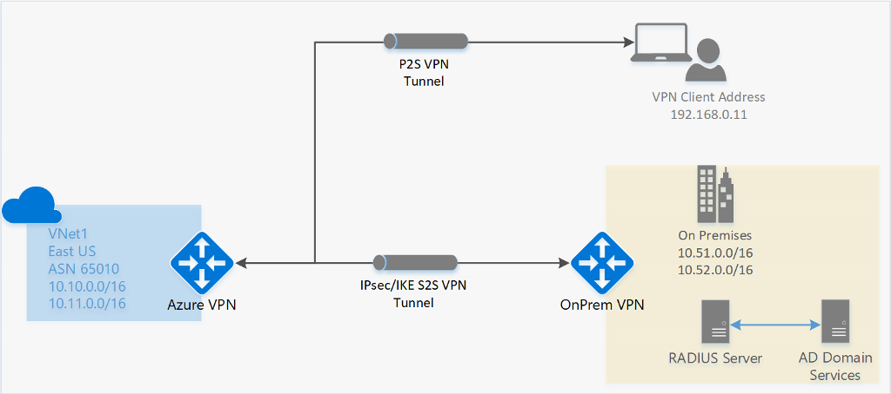

# About Point-to-Site VPN

A Point-to-Site (P2S) VPN gateway connection lets you create a secure connection to your virtual network from an individual client computer. A P2S connection is established by starting it from the client computer. This solution is useful for telecommuters who want to connect to Azure VNets from a remote location, such as from home or a conference. P2S VPN is also a useful solution to use instead of S2S VPN when you have only a few clients that need to connect to a VNet. This article applies to the Resource Manager deployment model.

## What protocol does P2S use?

Point-to-site VPN can use one of the following protocols:

* OpenVPN, an SSL/TLS based VPN protocol. An SSL VPN solution can penetrate firewalls, since most firewalls open TCP port 443, which SSL uses. OpenVPN can be used to connect from Android, iOS, Linux and Mac devices (OSX versions 10.11 and above).

* Secure Socket Tunneling Protocol (SSTP), a proprietary SSL-based VPN protocol. An SSL VPN solution can penetrate firewalls, since most firewalls open TCP port 443, which SSL uses. SSTP is only supported on Windows devices. Azure supports all versions of Windows that have SSTP (Windows 7 and later).

* IKEv2 VPN, a standards-based IPsec VPN solution. IKEv2 VPN can be used to connect from Mac devices (OSX versions 10.11 and above).

>[!NOTE]
>IKEv2 and OpenVPN for P2S are available for the Resource Manager deployment model only. They are not available for the classic deployment model.
>

## How are P2S VPN clients authenticated?

Before Azure accepts a P2S VPN connection, the user has to be authenticated first. There are two mechanisms that Azure offers to authenticate a connecting user.

### Authenticate using native Azure certificate authentication

When using the native Azure certificate authentication, a client certificate that is present on the device is used to authenticate the connecting user. Client certificates are generated from a trusted root certificate and then installed on each client computer. You can use a root certificate that was generated using an Enterprise solution, or you can generate a self-signed certificate.

The validation of the client certificate is performed by the VPN gateway and happens during establishment of the P2S VPN connection. The root certificate is required for the validation and must be uploaded to Azure.

### Authenticate using Active Directory (AD) Domain Server

AD Domain authentication allows users to connect to Azure using their organization domain credentials. It requires a RADIUS server that integrates with the AD server. Organizations can also leverage their existing RADIUS deployment.   
  
The RADIUS server could be deployed on-premises or in your Azure VNET. During authentication, the Azure VPN Gateway acts as a pass through and forwards authentication messages back and forth between the RADIUS server and the connecting device. So Gateway reachability to the RADIUS server is important. If the RADIUS server is present on-premises, then a VPN S2S connection from Azure to the on-premises site is required for reachability.  
  
The RADIUS server can also integrate with AD certificate services. This lets you use the RADIUS server and your enterprise certificate deployment for P2S certificate authentication as an alternative to the Azure certificate authentication. The advantage is that you don’t need to upload root certificates and revoked certificates to Azure.

A RADIUS server can also integrate with other external identity systems. This opens up plenty of authentication options for P2S VPN, including multi-factor options.

>[!NOTE]
>OpenVPN protocol is not supported with RADIUS authentication.
>

## What are the client configuration requirements?

>[!NOTE]
>For Windows clients, you must have administrator rights on the client device in order to initiate the VPN connection from the client device to Azure.
>

Users use the native VPN clients on Windows and Mac devices for P2S. Azure provides a VPN client configuration zip file that contains settings required by these native clients to connect to Azure.

* For Windows devices, the VPN client configuration consists of an installer package that users install on their devices.
* For Mac devices, it consists of the mobileconfig file that users install on their devices.

The zip file also provides the values of some of the important settings on the Azure side that you can use to create your own profile for these devices. Some of the values include the VPN gateway address, configured tunnel types, routes, and the root certificate for gateway validation.

>[!NOTE]
>[!INCLUDE [TLS version changes](../../includes/vpn-gateway-tls-change.md)]
>

## Which Gateway SKUs Support P2S VPN?

[!INCLUDE [p2s-skus](../../includes/vpn-gateway-table-point-to-site-skus-include.md)]

* Aggregate Throughput Benchmark is based on measurements of multiple tunnels aggregated through a single gateway. It is not a guaranteed throughput due to internet traffic conditions and your application behaviors.
* Pricing information can be found on the Pricing page 
* SLA (Service Level Agreement) information can be found on the SLA page.

>[!NOTE]
>The Basic SKU does not support IKEv2 or RADIUS authentication.
>

## How do I configure a P2S connection?

A P2S configuration requires quite a few specific steps. The following articles contain the steps to walk you through P2S configuration, and links to configure the VPN client devices:

* [Configure a P2S connection - RADIUS authentication](point-to-site-how-to-radius-ps.md)

* [Configure a P2S connection - Azure native certificate authentication](vpn-gateway-howto-point-to-site-rm-ps.md)

## FAQ for native Azure certificate authentication

[!INCLUDE [vpn-gateway-point-to-site-faq-include](../../includes/vpn-gateway-faq-p2s-azurecert-include.md)]

## FAQ for RADIUS authentication

[!INCLUDE [vpn-gateway-point-to-site-faq-include](../../includes/vpn-gateway-faq-p2s-radius-include.md)]

## Next Steps

* [Configure a P2S connection - RADIUS authentication](point-to-site-how-to-radius-ps.md)

* [Configure a P2S connection - Azure native certificate authentication](vpn-gateway-howto-point-to-site-rm-ps.md)
