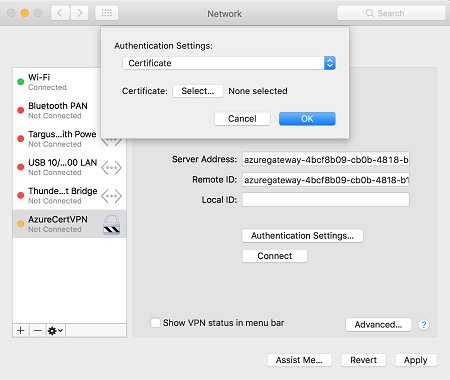
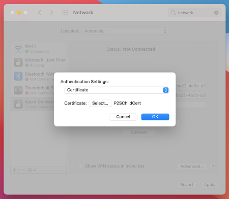

# Create and install VPN client configuration files for native Azure certificate authentication P2S configurations

VPN client configuration files are contained in a zip file. Configuration files provide the settings required for a native Windows or Mac IKEv2 VPN client to connect to a VNet over Point-to-Site connections that use native Azure certificate authentication.

### <a name="workflow"></a>P2S Workflow

  1. Set up the Azure VPN gateway for a P2S connection.
  2. Generate root certificate and client certificates. Upload the root certificate public key to Azure and install the client certificates on the client devices. The certificates are used for authenticating connecting users.
  3. Obtain the VPN client configuration for the authentication option of your choice, and use it to set up the VPN client on your Windows and Mac devices. This lets you connect to Azure VNets over a Point-to-Site connection.

>[!NOTE]
>Client configuration files are specific to the VPN configuration for the VNet. If there are any changes to the Point-to-Site VPN configuration after you generate the VPN client configuration files, such as the VPN protocol type or authentication type, be sure to generate new VPN client configuration files for your user devices.
>
>

## <a name="generate"></a>Generate VPN client configuration files

Before you begin, make sure that all connecting users have a valid certificate installed on the user's device. For more information about installing a client certificate, see [Install a client certificate](point-to-site-how-to-vpn-client-install-azure-cert.md).

1. When generating VPN client configuration files, the value for '-AuthenticationMethod' is 'EapTls'. Generate the VPN client configuration files using the following command:

  ```powershell
  New-AzureRmVpnClientConfiguration -ResourceGroupName "TestRG" -VirtualNetworkGatewayName "VNet1GW" -AuthenticationMethod "EapTls"
  ```
2. The previous command returns a link that you use to download the client configuration files. Copy and paste the link to a web browser to download the 'VpnClientConfiguration.zip' file. Unzip the file to view the following folders:

  * **WindowsAmd64** and **WindowsX86**, which contain the Windows 32-bit and 64-bit installer packages, respectively. The **WindowsAmd64** installer package is for all supported 64-bit Windows clients, not just Amd.
  * **Generic**, which contains general information used to create your own VPN client configuration. Ignore this folder. The Generic folder is provided only if IKEv2 or SSTP+IKEv2 was configured on the gateway. If only SSTP is configured, then the Generic folder is not present.

### To retrieve client configuration files

If you already generated client configuration files and you need to just retrieve them, you can use the 'Get-AzureRmVpnClientConfiguration' cmdlet. The 'Get-AzureRmVpnClientConfiguration' cmdlet returns a URL (link) from where you can download the VpnClientConfiguration.zip file. If you made any changes to your P2S VPN configuration, such as the VPN Protocol type or authentication type, the configuration doesn’t update automatically. You must instead run the 'New-AzureRmVpnClientConfiguration' cmdlet to recreate the configuration.

To retrieve previously generated client configuration files, use the following example:

```powershell
Get-AzureRmVpnClientConfiguration -ResourceGroupName "TestRG" -VirtualNetworkGatewayName "VNet1GW"
```
 
## <a name="installwin"></a>Install a Windows VPN client configuration package

You can use the same VPN client configuration package on each Windows client computer, as long as the version matches the architecture for the client. For the list of client operating systems that are supported, see the Point-to-Site section of the [VPN Gateway FAQ](vpn-gateway-vpn-faq.md#P2S).

Use the following steps to configure the native Windows VPN client for certificate authentication:

1. Select the VPN client configuration files that correspond to the architecture of the Windows computer. For a 64-bit processor architecture, choose the 'VpnClientSetupAmd64' installer package. For a 32-bit processor architecture, choose the 'VpnClientSetupX86' installer package. 
2. Double-click the package to install it. If you see a SmartScreen popup, click **More info**, then **Run anyway**.
3. On the client computer, navigate to **Network Settings** and click **VPN**. The VPN connection shows the name of the virtual network that it connects to. 

## <a name="installmac"></a>Install a Mac (OSX) VPN client configuration

A separate VPN client configuration must be created for every Mac device that connects to an Azure VNet. You can't reuse the same configuration files for multiple Mac devices. This is because for these devices, you must specify the user certificate in the VPN client configuration files. The **Generic** folder has all the information required to create a VPN client configuration. The Generic folder contains the following files:

* **VpnSettings.xml**, which contains important settings like server address and tunnel type. 
* **VpnServerRoot.cer**, which contains the root certificate required to validate the Azure VPN Gateway during P2S connection setup.

Use the following steps to configure the native VPN client on Mac for certificate authentication:

1. Import the **VpnServerRoot** root certificate to your Mac. This can be done by copying the file over to your Mac and double-clicking on it.  
Click **Add** to import.

  
2. Open the **Network** dialog under **Network Preferences** and click **'+'** to create a new VPN client connection profile for a P2S connection to the Azure VNet.

  The **Interface** value is 'VPN' and **VPN Type** value is 'IKEv2'. Specify a name for the profile in the **Service Name** field, then click **Create** to create the VPN client connection profile.

  
3. In the **Generic** folder, from the **VpnSettings.xml** file, copy the **VpnServer** tag value. Paste this value in the **Server Address** and **Remote ID** fields of the profile.

  
4. Click **Authentication Settings** and select **Certificate**. 

  
5. Click **Select…** to choose the certificate that you want to use for authentication.

  
6. **Choose An Identity** displays a list of certificates for you to choose from. Select the proper certificate, then click **Continue**.

  
7. In the **Local ID** field, specify the name of the certificate (from Step 5). In this example, it is "ikev2Client.com". Then, click **Apply** button to save the changes.

  
8. On the **Network** dialog, click **Apply** to save all changes. Then, click **Connect** to start the P2S connection to the Azure VNet.

## Next steps

Return to the article to [complete your P2S configuration](vpn-gateway-howto-point-to-site-rm-ps.md).