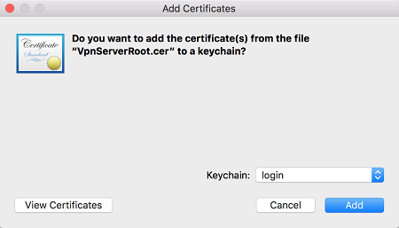
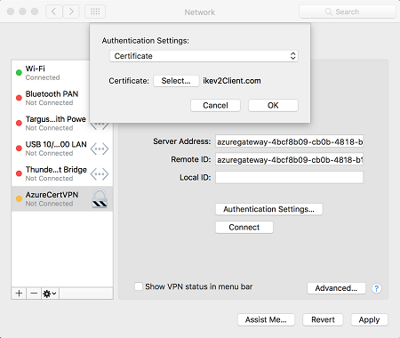
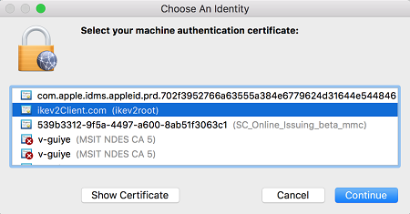
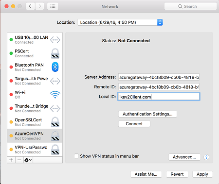

# Create and install VPN client configuration files for P2S RADIUS authentication

To connect to a virtual network over point-to-site (P2S), you need to configure the client device that you'll connect from. You can create P2S VPN connections from Windows, Mac OS X, and Linux client devices. 

When you're using RADIUS authentication, there are multiple authentication options: username/password authentication, certificate authentication, and other authentication types. The VPN client configuration is different for each type of authentication. To configure the VPN client, you use client configuration files that contain the required settings. This article helps you create and install the VPN client configuration for the RADIUS authentication type that you want to use.

>[!IMPORTANT]
>[!INCLUDE [TLS](../../includes/vpn-gateway-tls-change.md)]
>

The configuration workflow for P2S RADIUS authentication is as follows:

1. [Set up the Azure VPN gateway for P2S connectivity](point-to-site-how-to-radius-ps.md).
2. [Set up your RADIUS server for authentication](point-to-site-how-to-radius-ps.md#radius). 
3. **Obtain the VPN client configuration for the authentication option of your choice and use it to set up the VPN client** (this article).
4. [Complete your P2S configuration and connect](point-to-site-how-to-radius-ps.md).

>[!IMPORTANT]
>If there are any changes to the point-to-site VPN configuration after you generate the VPN client configuration profile, such as the VPN protocol type or authentication type, you must generate and install a new VPN client configuration on your users' devices.
>
>

To use the sections in this article, first decide which type of authentication you want to use: username/password, certificate, or other types of authentication. Each section has steps for Windows, Mac OS X, and Linux (limited steps available at this time).

## <a name="adeap"></a>Username/password authentication

You can configure username/password authentication to either use Active Directory or not use Active Directory. With either scenario, make sure that all connecting users have username/password credentials that can be authenticated through RADIUS.

When you configure username/password authentication, you can only create a configuration for the EAP-MSCHAPv2 username/password authentication protocol. In the commands, `-AuthenticationMethod` is `EapMSChapv2`.

### <a name="usernamefiles"></a> 1. Generate VPN client configuration files

Generate VPN client configuration files for use with username/password authentication. You can generate the VPN client configuration files by using the following command:

```powershell 
New-AzureRmVpnClientConfiguration -ResourceGroupName "TestRG" -Name "VNet1GW" -AuthenticationMethod "EapMSChapv2"
```
 
Running the command returns a link. Copy and paste the link to a web browser to download **VpnClientConfiguration.zip**. Unzip the file to view the following folders: 
 
* **WindowsAmd64** and **WindowsX86**: These folders contain the Windows 64-bit and 32-bit installer packages, respectively. 
* **Generic**: This folder contains general information that you use to create your own VPN client configuration. You don't need this folder for username/password authentication configurations.
* **Mac**: If you configured IKEv2 when you created the virtual network gateway, you see a folder named **Mac** that contains a **mobileconfig** file. You use this file to configure Mac clients.

If you already created client configuration files, you can retrieve them by using the `Get-AzureRmVpnClientConfiguration` cmdlet. But if you make any changes to your P2S VPN configuration, such as the VPN protocol type or authentication type, the configuration isn’t updated automatically. You must run the `New-AzureRmVpnClientConfiguration` cmdlet to create a new configuration download.

To retrieve previously generated client configuration files, use the following command:

```powershell
Get-AzureRmVpnClientConfiguration -ResourceGroupName "TestRG" -Name "VNet1GW"
```

### <a name="setupusername"></a> 2. Configure VPN clients

You can configure the following VPN clients:

* [Windows](#adwincli)
* [Mac (OS X)](#admaccli)
* [Linux using strongSwan](#adlinuxcli)
 
#### <a name="adwincli"></a>Windows VPN client setup

You can use the same VPN client configuration package on each Windows client computer, as long as the version matches the architecture for the client. For the list of client operating systems that are supported, see the [FAQ](vpn-gateway-vpn-faq.md#P2S).

Use the following steps to configure the native Windows VPN client for certificate authentication:

1. Select the VPN client configuration files that correspond to the architecture of the Windows computer. For a 64-bit processor architecture, choose the **VpnClientSetupAmd64** installer package. For a 32-bit processor architecture, choose the **VpnClientSetupX86** installer package. 
2. To install the package, double-click it. If you see a SmartScreen pop-up, select **More info** > **Run anyway**.
3. On the client computer, browse to **Network Settings** and select **VPN**. The VPN connection shows the name of the virtual network that it connects to. 

#### <a name="admaccli"></a>Mac (OS X) VPN client setup

1. Select the **VpnClientSetup mobileconfig** file and send it to each of the users. You can use email or another method.

2. Locate the **mobileconfig** file on the Mac.

   

3. Optional Step - If you want to specify a custom DNS, add the following lines to the **mobileconfig** file:
```xml
    <key>DNS</key>
    <dict>
      <key>ServerAddresses</key>
        <array>
            <string>10.0.0.132</string>
        <array>
      <key>SupplementalMatchDomains</key>
        <array>
            <string>TestDomain.com</string>
        </array>
    </dict> 
```
4. Double-click the profile to install it, and select **Continue**. The profile name is the same as the name of your virtual network.

   
5. Select **Continue** to trust the sender of the profile and proceed with the installation.

   
6. During profile installation, you have the option to specify the username and password for VPN authentication. It's not mandatory to enter this information. If you do, the information is saved and automatically used when you initiate a connection. Select **Install** to proceed.

   
7. Enter a username and password for the privileges that are required to install the profile on your computer. Select **OK**.

   
8. After the profile is installed, it's visible in the **Profiles** dialog box. You can also open this dialog box later from **System Preferences**.

   
9. To access the VPN connection, open the **Network** dialog box from **System Preferences**.

   
10. The VPN connection appears as **IkeV2-VPN**. You can change the name by updating the **mobileconfig** file.

   
11. Select **Authentication Settings**. Select **Username** in the list and enter your credentials. If you entered the credentials earlier, then **Username** is automatically chosen in the list and the username and password are prepopulated. Select **OK** to save the settings.

    
12. Back in the **Network** dialog box, select **Apply** to save the changes. To initiate the connection, select **Connect**.

#### <a name="adlinuxcli"></a>Linux VPN client setup through strongSwan

The following instructions were created through strongSwan 5.5.1 on Ubuntu 17.0.4. Actual screens might be different, depending on your version of Linux and strongSwan.

1. Open the **Terminal** to install **strongSwan** and its Network Manager by running the command in the example. If you receive an error that's related to `libcharon-extra-plugins`, replace it with `strongswan-plugin-eap-mschapv2`.

   ```Terminal
   sudo apt-get install strongswan libcharon-extra-plugins moreutils iptables-persistent network-manager-strongswan
   ```
2. Select the **Network Manager** icon (up-arrow/down-arrow), and select **Edit Connections**.

   
3. Select the **Add** button to create a new connection.

   
4. Select **IPsec/IKEv2 (strongswan)** from the drop-down menu, and then select **Create**. You can rename your connection in this step.

   
5. Open the **VpnSettings.xml** file from the **Generic** folder of the downloaded client configuration files. Find the tag called `VpnServer` and copy the name, beginning with `azuregateway` and ending with `.cloudapp.net`.

   
6. Paste this name into the **Address** field of your new VPN connection in the **Gateway** section. Next, select the folder icon at the end of the **Certificate** field, browse to the **Generic** folder, and select the **VpnServerRoot** file.
7. In the **Client** section of the connection, select **EAP** for **Authentication**, and enter your username and password. You might have to select the lock icon on the right to save this information. Then, select **Save**.

   
8. Select the **Network Manager** icon (up-arrow/down-arrow) and hover over **VPN Connections**. You see the VPN connection that you created. To initiate the connection, select it.

   

## <a name="certeap"></a>Certificate authentication
 
You can create VPN client configuration files for RADIUS certificate authentication that uses the EAP-TLS protocol. Typically, an enterprise-issued certificate is used to authenticate a user for VPN. Make sure that all connecting users have a certificate installed on their devices, and that your RADIUS server can validate the certificate.

>[!NOTE]
>[!INCLUDE [TLS](../../includes/vpn-gateway-tls-change.md)]
>

In the commands, `-AuthenticationMethod` is `EapTls`. During certificate authentication, the client validates the RADIUS server by validating its certificate. `-RadiusRootCert` is the .cer file that contains the root certificate that's used to validate the RADIUS server.

Each VPN client device requires an installed client certificate. Sometimes a Windows device has multiple client certificates. During authentication, this can result in a pop-up dialog box that lists all the certificates. The user must then choose the certificate to use. The correct certificate can be filtered out by specifying the root certificate that the client certificate should chain to. 

`-ClientRootCert` is the .cer file that contains the root certificate. It's an optional parameter. If the device that you want to connect from has only one client certificate, you don't have to specify this parameter.

### <a name="certfiles"></a>1. Generate VPN client configuration files

Generate VPN client configuration files for use with certificate authentication. You can generate the VPN client configuration files by using the following command:
 
```powershell
New-AzureRmVpnClientConfiguration -ResourceGroupName "TestRG" -Name "VNet1GW" -AuthenticationMethod "EapTls" -RadiusRootCert <full path name of .cer file containing the RADIUS root> -ClientRootCert <full path name of .cer file containing the client root> | fl
```

Running the command returns a link. Copy and paste the link to a web browser to download VpnClientConfiguration.zip. Unzip the file to view the following folders:

* **WindowsAmd64** and **WindowsX86**: These folders contain the Windows 64-bit and 32-bit installer packages, respectively. 
* **GenericDevice**: This folder contains general information that's used to create your own VPN client configuration.

If you already created client configuration files, you can retrieve them by using the `Get-AzureRmVpnClientConfiguration` cmdlet. But if you make any changes to your P2S VPN configuration, such as the VPN protocol type or authentication type, the configuration isn’t updated automatically. You must run the `New-AzureRmVpnClientConfiguration` cmdlet to create a new configuration download.

To retrieve previously generated client configuration files, use the following command:

```powershell
Get-AzureRmVpnClientConfiguration -ResourceGroupName "TestRG" -Name "VNet1GW" | fl
```
 
### <a name="setupusername"></a> 2. Configure VPN clients

You can configure the following VPN clients:

* [Windows](#certwincli)
* [Mac (OS X)](#certmaccli)
* Linux (supported, no article steps yet)

#### <a name="certwincli"></a>Windows VPN client setup

1. Select a configuration package and install it on the client device. For a 64-bit processor architecture, choose the **VpnClientSetupAmd64** installer package. For a 32-bit processor architecture, choose the **VpnClientSetupX86** installer package. If you see a SmartScreen pop-up, select **More info** > **Run anyway**. You can also save the package to install on other client computers.
2. Each client requires a client certificate for authentication. Install the client certificate. For information about client certificates, see [Client certificates for point-to-site](vpn-gateway-certificates-point-to-site.md). To install a certificate that was generated, see [Install a certificate on Windows clients](point-to-site-how-to-vpn-client-install-azure-cert.md).
3. On the client computer, browse to **Network Settings** and select **VPN**. The VPN connection shows the name of the virtual network that it connects to.

#### <a name="certmaccli"></a>Mac (OS X) VPN client setup

You must create a separate profile for every Mac device that connects to the Azure virtual network. This is because these devices require the user certificate for authentication to be specified in the profile. The **Generic** folder has all the information that's required to create a profile:

* **VpnSettings.xml** contains important settings such as server address and tunnel type.
* **VpnServerRoot.cer** contains the root certificate that's required to validate the VPN gateway during P2S connection setup.
* **RadiusServerRoot.cer** contains the root certificate that's required to validate the RADIUS server during authentication.

Use the following steps to configure the native VPN client on a Mac for certificate authentication:

1. Import the **VpnServerRoot** and **RadiusServerRoot** root certificates to your Mac. Copy each file to your Mac, double-click it, and then select **Add**.

   

   
2. Each client requires a client certificate for authentication. Install the client certificate on the client device.
3. Open the **Network** dialog box under **Network Preferences**. Select **+** to create a new VPN client connection profile for a P2S connection to the Azure virtual network.

   The **Interface** value is **VPN**, and the **VPN Type** value is **IKEv2**. Specify a name for the profile in the **Service Name** box, and then select **Create** to create the VPN client connection profile.

   
4. In the **Generic** folder, from the **VpnSettings.xml** file, copy the **VpnServer** tag value. Paste this value in the **Server Address** and **Remote ID** boxes of the profile. Leave the **Local ID** box blank.

   
5. Select **Authentication Settings**, and select **Certificate**. 

   
6. Click **Select** to choose the certificate that you want to use for authentication.

   
7. **Choose An Identity** displays a list of certificates for you to choose from. Select the proper certificate, and then select **Continue**.

   
8. In the **Local ID** box, specify the name of the certificate (from Step 6). In this example, it's **ikev2Client.com**. Then, select the **Apply** button to save the changes.

   
9. In the **Network** dialog box, select **Apply** to save all changes. Then, select **Connect** to start the P2S connection to the Azure virtual network.

## <a name="otherauth"></a>Working with other authentication types or protocols

To use a different authentication type (for example, OTP), or to use a different authentication protocol (such as PEAP-MSCHAPv2 instead of EAP-MSCHAPv2), you must create your own VPN client configuration profile. To create the profile, you need information such as the virtual network gateway IP address, tunnel type, and split-tunnel routes. You can get this information by using the following steps:

1. Use the `Get-AzureRmVpnClientConfiguration` cmdlet to generate the VPN client configuration for EapMSChapv2.

2. Unzip the VpnClientConfiguration.zip file and look for the **GenericDevice** folder. Ignore the folders that contain the Windows installers for 64-bit and 32-bit architectures.
 
3. The **GenericDevice** folder contains an XML file called **VpnSettings**. This file contains all the required information:

   * **VpnServer**: FQDN of the Azure VPN gateway. This is the address that the client connects to.
   * **VpnType**: Tunnel type that you use to connect.
   * **Routes**: Routes that you have to configure in your profile so that only traffic that's bound for the Azure virtual network is sent over the P2S tunnel.
   
   The **GenericDevice** folder also contains a .cer file called **VpnServerRoot**. This file contains the root certificate that's required to validate the Azure VPN gateway during P2S connection setup. Install the certificate on all devices that will connect to the Azure virtual network.

## Next steps

Return to the article to [complete your P2S configuration](point-to-site-how-to-radius-ps.md).

For P2S troubleshooting information, see [Troubleshooting Azure point-to-site connections](vpn-gateway-troubleshoot-vpn-point-to-site-connection-problems.md).
