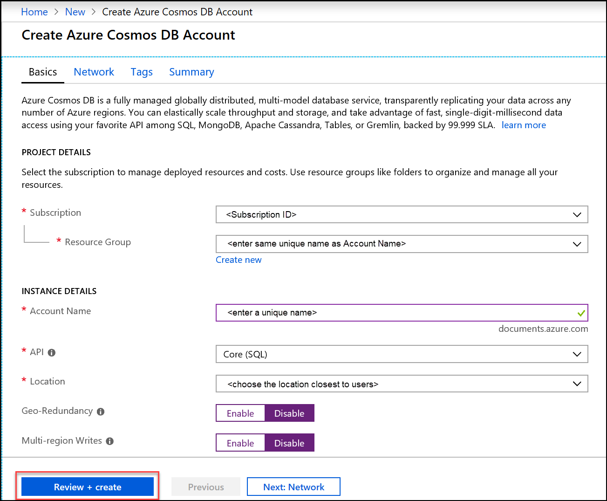
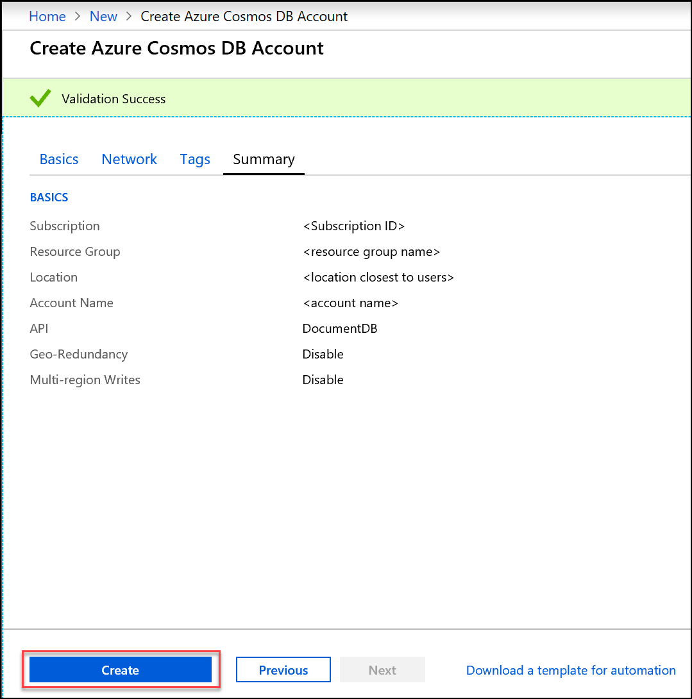
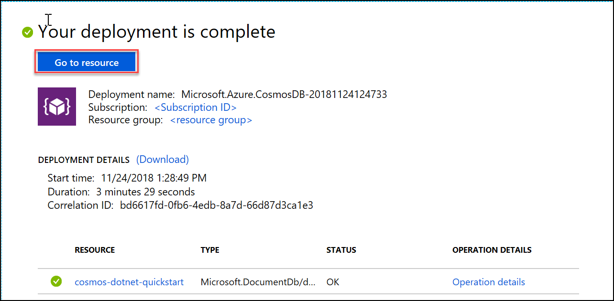

1. In a new browser window, sign in to the [Azure portal](https://portal.azure.com/).
2. Click **Create a resource** > **Databases** > **Azure Cosmos DB**.
   
   

3. In the **Create Azure Cosmos DB Account** page, enter the settings for the new Azure Cosmos DB account. 
 
    Setting|Value|Description
    ---|---|---
    Subscription|*Your subscription*|Select the Azure subscription that you want to use for this Azure Cosmos DB account. 
    Resource Group|Create new  *Enter a unique name*|Select **Create New**, then enter a new resource-group name for your account. For simplicity, you can use the same name as your Account Name. 
    Account Name|*Enter a unique name*|Enter a unique name to identify your Azure Cosmos DB account. Because *documents.azure.com* is appended to the ID that you provide to create your URI, use a unique ID.  The ID can only contain lowercase letters, numbers, and the hyphen (-) character, and it must contain 3 to 50 characters.
    API|Core (SQL)|The API determines the type of account to create. Azure Cosmos DB provides five APIs: SQL (document database), Gremlin (graph database), MongoDB (document database), Table API, and Cassandra API. Each API currently requires you to create a separate account.   Select **Core (SQL)** because in this article you will create a document database and query using SQL syntax.   [Learn more about the SQL API](../articles/cosmos-db/documentdb-introduction.md)|
    Location|*Select the region closest to your users*|Select a geographic location to host your Azure Cosmos DB account. Use the location that's closest to your users to give them the fastest access to the data.
    Enable geo-redundancy| Leave blank | This creates a replicated version of your database in a second (paired) region. Leave this blank.  
    Multi-region writes| Leave blank | This enables each of your database regions to be both a read and write region. Leave this blank.  

    Then click **Review + create**. You can skip the **Network** and **Tags** section. 

    

    Review the summary information and click **Create**. 

    

4. The account creation takes a few minutes. Wait for the portal to display the **Your deployment is complete** message and click **Go to resource**.     

    

5. The portal will now display the **Congratulations! Your Azure Cosmos DB account was created** page.

    

