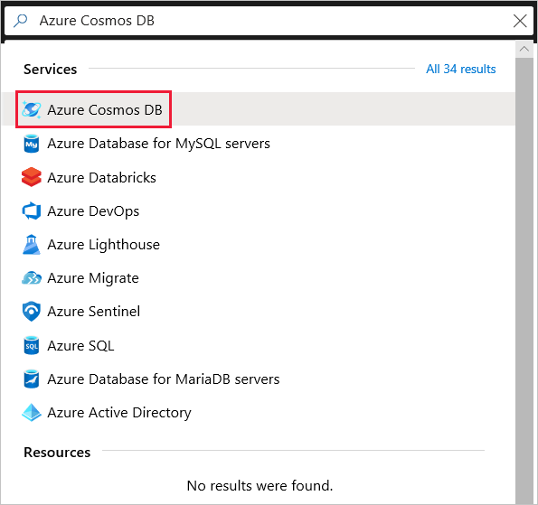

1. In a new browser window, sign in to the [Azure portal](https://portal.azure.com/).
2. Select **Create a resource** > **Databases** > **Azure Cosmos DB**.
   
   

3. On the **New account** page, enter the settings for the new Azure Cosmos DB account. 
 
    Setting|Value|Description
    ---|---|---
    ID|Enter a unique name|Enter a unique name to identify your Azure Cosmos DB account. Because *documents.azure.com* is appended to the ID that you provide to create your URI, use a unique ID.  The ID can use only lowercase letters, numbers, and the hyphen (-) character. It must be 3 to 50 characters in length.
    API|SQL|The API determines the type of account to create. Azure Cosmos DB provides five APIs: SQL for document databases, Gremlin for graph databases, MongoDB for document databases, Table API, and Cassandra API. Currently, you must create a separate account for each API.   Select **SQL** because in this article you create a document database and query by using SQL syntax.   [Learn more about the SQL API](../articles/cosmos-db/documentdb-introduction.md).|
    Subscription|Your subscription|Select the Azure subscription that you want to use for this Azure Cosmos DB account. 
    Resource Group|Create new  Then enter the same unique name as provided in ID|Select **Create new**. Then enter a new resource-group name for your account. For simplicity, use the same name as your ID. 
    Location|Select the region closest to your users|Select a geographic location to host your Azure Cosmos DB account. Use the location that's closest to your users to give them the fastest access to the data.
    Enable geo-redundancy| Leave blank | This option creates a replicated version of your database in a second (paired) region. Leave this check box blank. 

    Select **Create**.

    

4. The account creation takes a few minutes. Wait for the portal to display the **Congratulations! Your Azure Cosmos DB account was created** page.

    

