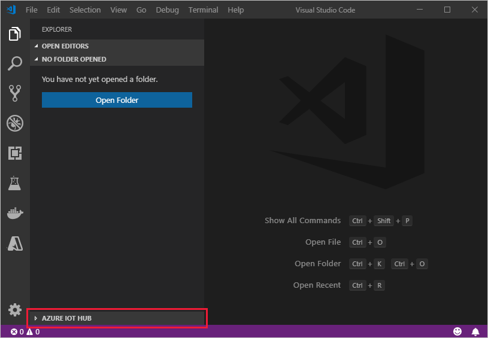
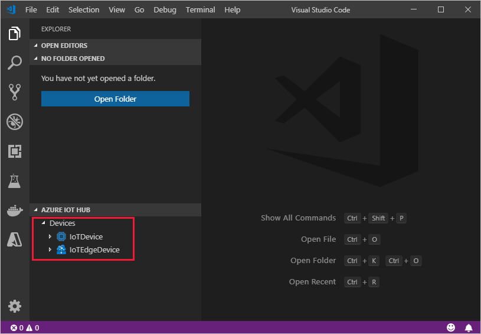

## Register your device

You can use the **Azure portal**, **Visual Studio Code**, or **Azure CLI** to register your device, depending on your preference.

# [Portal](#tab/azure-portal)

In your IoT hub in the Azure portal, IoT Edge devices are created and managed separately from IoT devices that are not edge enabled.

1. Sign in to the [Azure portal](https://portal.azure.com) and navigate to your IoT hub.

1. In the left pane, select **IoT Edge** from the menu, then select **Add an IoT Edge device**.

   

1. On the **Create a device** page, provide the following information:

   * Create a descriptive device ID. Make a note of this device ID, as you'll use it later.
   * Select **Symmetric key** as the authentication type.
   * Use the default settings to auto-generate authentication keys and connect the new device to your hub.

1. Select **Save**.

# [Visual Studio Code](#tab/visual-studio-code)

### Sign in to access your IoT hub

You can use the Azure IoT extensions for Visual Studio Code to perform operations with your IoT hub. For these operations to work, you need to sign in to your Azure account and select your hub.

1. In Visual Studio Code, open the **Explorer** view.
1. At the bottom of the Explorer, expand the **Azure IoT Hub** section.

   

1. Click on the **...** in the **Azure IoT Hub** section header. If you don't see the ellipsis, click on or hover over the header.
1. Choose **Select IoT Hub**.
1. If you aren't signed in to your Azure account, follow the prompts to do so.
1. Select your Azure subscription.
1. Select your IoT hub.

### Register a new device with Visual Studio Code

1. In the Visual Studio Code Explorer, expand the **Azure IoT Hub** section.
1. Click on the **...** in the **Azure IoT Hub** section header. If you don't see the ellipsis, click on or hover over the header.
1. Select **Create IoT Edge Device**.
1. In the text box that opens, give your device an ID.

In the output screen, you see the result of the command. The device info is printed, which includes the **deviceId** that you provided and the **connectionString** that you can use to connect your physical device to your IoT hub.

# [Azure CLI](#tab/azure-cli)

Use the [az iot hub device-identity create](/cli/azure/iot/hub/device-identity) command to create a new device identity in your IoT hub. For example:

   ```azurecli
   az iot hub device-identity create --device-id [device_id] --hub-name [hub_name] --edge-enabled
   ```

This command includes three parameters:

* `--device-id` or `-d`: Provide a descriptive name that's unique within your IoT hub.
* `--hub-name` or `-n`: Provide the name of your IoT hub.
* `--edge-enabled` or `--ee`: Declare that the device is an IoT Edge device.

   

---

Now that you have a device registered in IoT Hub, retrieve the information that you use to complete installation and provisioning of the IoT Edge runtime.

## View registered devices and retrieve provisioning information

Devices that use symmetric key authentication need their connection strings to complete installation and provisioning of the IoT Edge runtime.

# [Portal](#tab/azure-portal)

All the edge-enabled devices that connect to your IoT hub are listed on the **IoT Edge** page.


When you're ready to set up your device, you need the connection string that links your physical device with its identity in the IoT hub.

Devices that authenticate with symmetric keys have their connection strings available to copy in the portal.

1. From the **IoT Edge** page in the portal, click on the device ID from the list of IoT Edge devices.
2. Copy the value of either **Primary Connection String** or **Secondary Connection String**.

# [Visual Studio Code](#tab/visual-studio-code)

All the devices that connect to your IoT hub are listed in the **Azure IoT Hub** section of the Visual Studio Code Explorer. IoT Edge devices are distinguishable from non-Edge devices with a different icon, and the fact that the **$edgeAgent** and **$edgeHub** modules are deployed to each IoT Edge device.



When you're ready to set up your device, you need the connection string that links your physical device with its identity in the IoT hub.

1. Right-click on the ID of your device in the **Azure IoT Hub** section.
1. Select **Copy Device Connection String**.

   The connection string is copied to your clipboard.

You can also select **Get Device Info** from the right-click menu to see all the device info, including the connection string, in the output window.

# [Azure CLI](#tab/azure-cli)

Use the [az iot hub device-identity list](/cli/azure/iot/hub/device-identity) command to view all devices in your IoT hub. For example:

   ```azurecli
   az iot hub device-identity list --hub-name [hub_name]
   ```

Any device that is registered as an IoT Edge device will have the property **capabilities.iotEdge** set to **true**.

When you're ready to set up your device, you need the connection string that links your physical device with its identity in the IoT hub. Use the [az iot hub device-identity connection-string show](/cli/azure/iot/hub/device-identity/connection-string) command to return the connection string for a single device:

   ```azurecli
   az iot hub device-identity connection-string show --device-id [device_id] --hub-name [hub_name]
   ```

>[!TIP]
>The `connection-string show` command was introduced in version 0.9.8 of the Azure IoT extension, replacing the deprecated `show-connection-string` command. If you get an error running this command, make sure your extension version is updated to 0.9.8 or later. For more information and the latest updates, see [Microsoft Azure IoT extension for Azure CLI](https://github.com/Azure/azure-iot-cli-extension).

The value for the `device-id` parameter is case-sensitive.

When copying the connection string to use on a device, don't include the quotation marks around the connection string.

---
