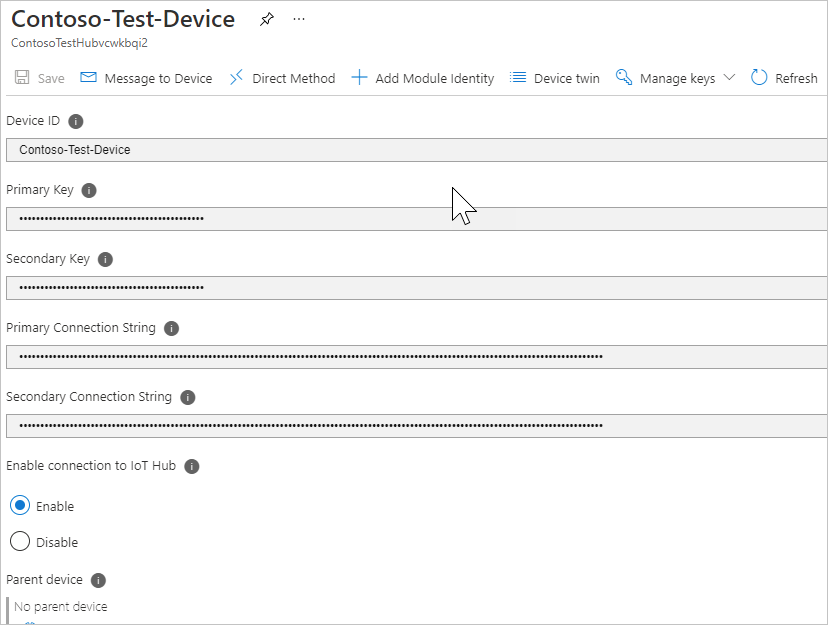

<!-- This is the instructions for creating a simulated device you can use for testing routing.-->

Next, create a device identity and save its key for later use. This device identity is used by the simulation application to send messages to the IoT hub. This capability is not available in PowerShell or when using an Azure Resource Manager template. The following steps tell you how to create the simulated device using the [Azure portal](https://portal.azure.com).

1. Open the [Azure portal](https://portal.azure.com) and log into your Azure account.

2. Click on **Resource groups** and select your resource group. This tutorial uses **ContosoResources**.

3. In the list of resources, click your IoT hub. This tutorial uses **ContosoTestHub**. Select **IoT Devices** from the Hub pane.

4. Click **+ Add**. On the Add Device pane, fill in the device ID. This tutorial uses **Contoso-Test-Device**. Leave the keys empty, and check **Auto Generate Keys**. Make sure **Connect device to IoT hub** is enabled. Click **Save**.

   

5. Now that it's been created, click on the device to see the generated keys. Click the Copy icon on the Primary key and save it somewhere such as Notepad for the testing phase of this tutorial.

   