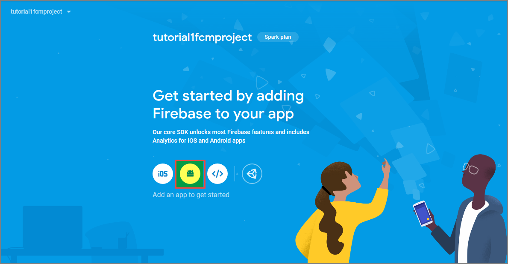
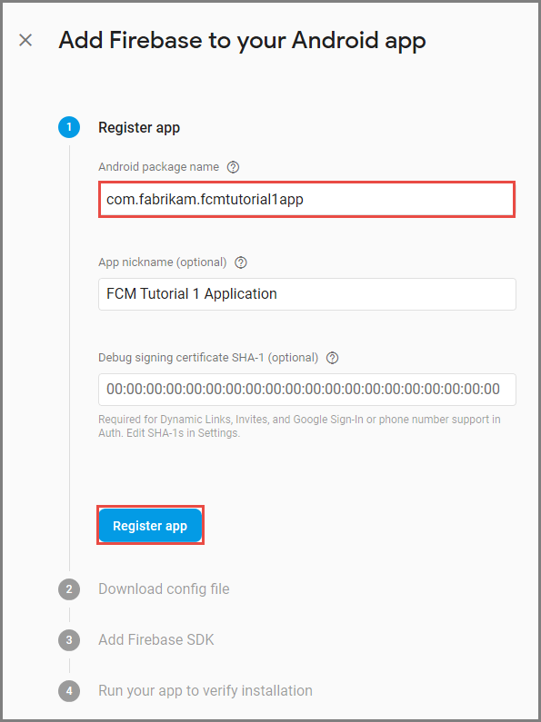
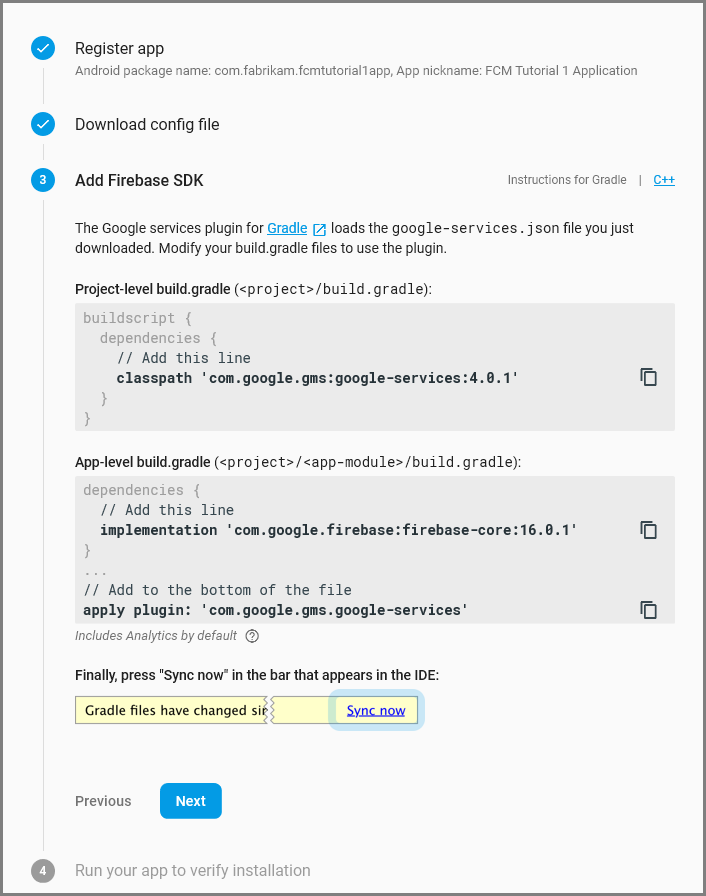
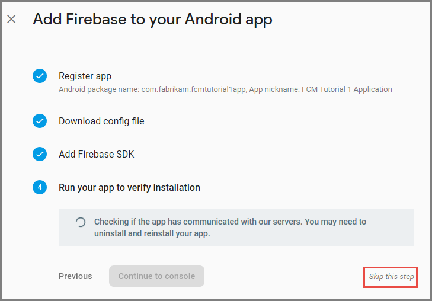

1. Sign in to the [Firebase console](https://console.firebase.google.com/). Create a new Firebase project if you don't already have one.
2. After you create your project, select **Add Firebase to your Android app**. 

    
3. On the **Add Firebase to your Android app** page, take the following steps: 
    1. For **Android package name**, copy the value of your **applicationId** in your application's build.gradle file. In this example, it's `com.fabrikam.fcmtutorial1app`. 

        
    2. Select **Register app**. 
4. Select **Download google-services.json**, save the file into the **app** folder of your project, and then select **Next**. 

    
5. Make the following **configuration changes** to your project in Android Studio. 
    1.  In your project-level build.gradle file (&lt;project&gt;/build.gradle), add the following statement to the **dependencies** section. 

        ```
        classpath 'com.google.gms:google-services:4.0.1'
        ```
    2. In your app-level build.gradle file (&lt;project&gt;/&lt;app-module&gt;/build.gradle), add the following statements to the **dependencies** section. 

        ```
        implementation 'com.google.firebase:firebase-core:16.0.8'
        implementation 'com.google.firebase:firebase-messaging:17.3.4'
        ```

    3. Add the following line to the end of the app-level build.gradle file after the dependencies section. 

        ```
        apply plugin: 'com.google.gms.google-services'
        ```        
    4. Select **Sync now** on the toolbar. 
 
        
6. Select **Next**. 
7. Select **Skip this step**. 

    
8. In the Firebase console, select the cog for your project. Then select **Project Settings**.

    
4. If you haven't downloaded the google-services.json file into the **app** folder of your Android Studio project, you can do so on this page. 
5. Switch to the **Cloud Messaging** tab at the top. 
6. Copy and save the **Server key** for later use. You use this value to configure your hub.
